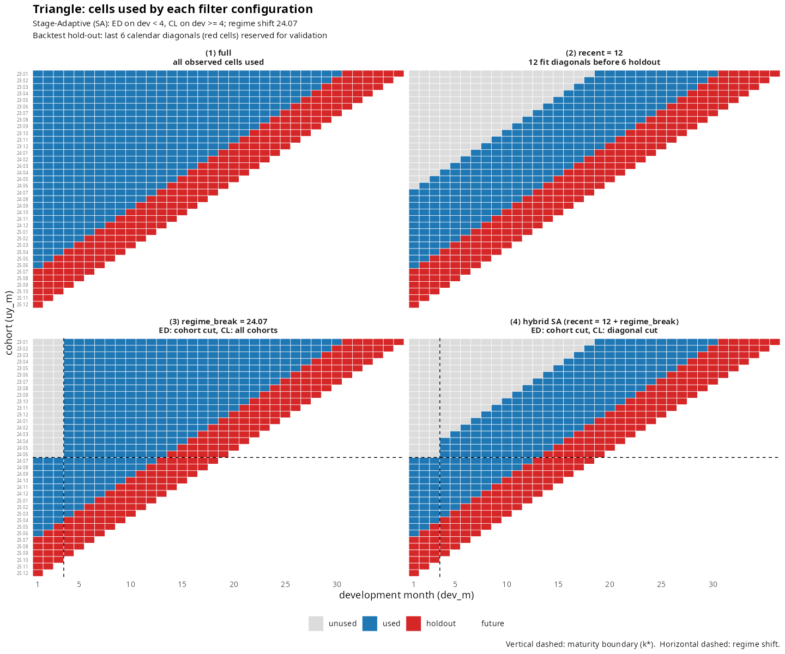

# lossratio 

> **장기 건강보험 손해율 분석·예측·모니터링** 도구. Maturity 기반 단계 적응형(stage-adaptive: ED → CL) 손해율 예측 + Regime change 탐지(인수 정책 변경 등 코호트 축 구조 변화) + backtest 검증을 한 워크플로로 묶는다.

<p align="center">



</p>

위 한 그림 — 패키지가 무엇을 하는지 한눈에:

-   **🟦 used** — 적합에 사용된 셀
-   **🟥 holdout** — `backtest` 검증용 대각셀
-   **⬜ unused** — `regime` / `recent` 필터로 제외된 영역
-   **수직 dash선** — `maturity` $k^*$ (ED → CL 전환 경계)
-   **수평 dash선** — `regime` $k^{**}$ (코호트 축 컷)

## 주요 기능

장기 건강보험은 *코호트 안에서 클레임과 보험료가 오랜 기간 지속적으로 발생하고* *신상품 출시·보험료 갱신·인수 정책 등 구조적 변화가 자주 일어난다*. 이 사실이 손해율 예측을 어렵게 만든다.

| 도전 과제                         | `lossratio` 의 응답                                                                          |
|-----------------------------------|----------------------------------------------------------------------------------------------|
| 초기 dev 의 ATA 인자가 너무 Noisy | **`fit_ratio(method = "sa")`** — maturity 이전엔 exposure-driven (ED), 이후엔 chain ladder (CL) |
| 인수 기준 변경 등 구조적 변화     | **`detect_regime()`** + `loss_regime` / `exposure_regime` 인자 — 변화 이전 코호트를 자동으로 분리 |
| "이 fit 이 얼마나 맞나?" 검증     | **`backtest()`** — 최근 N 대각선을 빼고 적합한 뒤 actual 과 비교                             |

세 component 가 **한 figure 에서 동시에** 작동하는 것을 위 그림이 보여준다.

## 설치

``` r
# pak (recommend)
pak::pak("seokhoonj/lossratio")

# or
remotes::install_github("seokhoonj/lossratio")
```

## Quick Start

``` r
library(lossratio)
data(experience)           # 번들 합성 데이터 (4 coverages)

# 1) Triangle 구축 — long-format 데이터 → 코호트 × dev 구조
exp_surgery <- experience[coverage == "surgery"]
tri <- as_triangle(
  exp_surgery,
  groups    = "coverage",
  cohort    = "uy_m",
  calendar  = "cy_m",
  loss      = "incr_loss",
  exposure  = "incr_exposure",
  cell_type = "incremental"   # default; "cumulative" 면 누적 입력
)
plot(tri)

# 2) 손해율 적합 (default: ED — exposure-driven baseline.
#    코호트-anchored projection 원할 시 method = "cl" 또는 "sa")
ratio <- fit_ratio(tri)
summary(ratio)
plot_triangle(ratio)

# 3) 환경변화 (regime shift) 자동 탐지 — 인수 정책 변경 시점
detect_regime(tri, by = "coverage", method = "e_divisive")

# 4) backtest — 최근 6 대각선을 빼고 fit + actual 비교
bt <- backtest(tri, holdout = 6L, target = "ratio")  # target = "ratio" / "loss" / "exposure"
plot(bt)
plot_triangle(bt)
```

## 핵심 API

| 함수                                  | 역할                                                     |
|---------------------------------------|----------------------------------------------------------|
| `as_triangle()`                    | long-format 데이터 → `Triangle` (코호트 × dev)           |
| `fit_ratio(method = "ed" / "cl" / "sa")` | 손해율 적합 — *통합 인터페이스* (loss + premium 합성)    |
| `fit_loss()` / `fit_exposure()`           | 역할별 디스패처 — 단일 측 (SE / CI 포함)                 |
| `fit_cl()` / `fit_ed()`               | 단일 stage (chain ladder / exposure-driven)              |
| `fit_ata()` / `fit_intensity()`       | link 단계 진단 — 곱셈형 / 덧셈형                         |
| `detect_maturity()`                   | ATA 인자가 수렴하는 dev 위치                             |
| `detect_regime()`                     | 코호트 축 구조적 변화 탐지                               |
| `detect_convergence()`                | 예측 손해율이 갱신을 멈추는 시점                         |
| `backtest()`                          | 대각선 hold-out 으로 fit 검증 (target = ratio/loss/exposure) |
| `plot()` / `plot_triangle()`          | S3 generic — 객체 클래스로 dispatch                      |

## 손해율 적합 방법

### 노출 기반(exposure-driven, ED) (default)

`fit_ratio(method = "ed")` (default) 또는 `fit_ed()`. 모든 손해
증분이 노출(위험보험료)을 분모로 사용:
$\Delta C^L = g_k \cdot C^P_k$. 무조건적 안전한 baseline --
성숙점 / regime 검출 의존 없음, 초기 dev 의 ATA 인자 변동에 강건.

*언제 사용*: baseline 으로. pooled intensity $g_k$ 는 코호트들이
단위 노출 당 손해 수준에서 대체로 동질적이라고 가정 -- 코호트-레벨
drift(약관 / 인수 정책 변경) 시 pooled 평균으로 편향, post-change
코호트를 over-project 가능. 명시적 필터는 `regime` 인자.

### 체인 래더(chain ladder, CL)

`fit_ratio(method = "cl")` 또는 `fit_cl()`. 고전 Mack (1993) 체인
래더 $C^L_{k+1} = f_k \cdot C^L_k$ + 해석적 표준오차. *코호트
자기 cum_loss 가 anchor* 역할이므로 *코호트-레벨 drift 가
자연스럽게 propagation* -- 명시적 regime 검출 불필요.

*언제 사용*: ATA 인자가 안정된 후. 특히 코호트-레벨 drift
시나리오에서 *코호트의 관측 경로가 자동 anchor*.

### 단계 적응형(stage-adaptive, SA)

`fit_ratio(method = "sa")`. 두 방법의 합성: 성숙점 이전은 ED,
이후는 CL. ED 의 초기 dev 안정성 + CL 의 후기 dev 코호트
anchoring 결합.

*언제 사용*: 장기-tail 포트폴리오 -- 초기 dev 의 변동성(ED phase) +
후기 dev 의 코호트-레벨 drift(CL phase) 둘 다 처리.

## 입력 형식

long-format `data.frame` / `data.table`. 컬럼명은 자유 — `as_triangle()`
인자로 어떤 이름이든 넘기면 함수가 표준화함.

| `as_triangle()` 인자    | 의미                                                  | 예시                             |
|-------------------------|-------------------------------------------------------|----------------------------------|
| `cohort`                | 코호트 시점 (장기 health 는 보통 인수 시점 UY) (Date) | `"uy_m"`, `"uy"`                 |
| `calendar` *또는* `dev` | 달력 시점 (Date) *또는* 경과 기간 (int)               | `"cy_m"` / `"dev_m"`             |
| `loss`                  | 기간별 *또는* 누적 손해                               | `"incr_loss"` / `"loss"`         |
| `exposure`              | 기간별 *또는* 누적 익스포저 (장기 health 는 위험보험료) | `"incr_exposure"` / `"exposure"` |
| `groups` *(선택)*       | 그룹 컬럼: 상품 / 담보 / 연령 / 성별 / 가입금액       | `"coverage"`                     |
| `cell_type` *(default)* | `loss` / `exposure` 값의 해석                         | `"incremental"` / `"cumulative"` |

해석을 정하는 두 인자:

- **`cell_type`** — `"incremental"` (default) 또는 `"cumulative"`. 일반적
  raw experience 는 incremental; 이미 누적 합산된 데이터라면
  `cell_type = "cumulative"` 로 넘기면 함수가 per-cohort diff 로
  incremental 도 derive.
- **`grain`** — `"auto"` (default, `cohort` 날짜로부터 자동 감지) 또는
  `"M"` / `"Q"` / `"H"` / `"Y"`. 월별 / 분기별 / 반기별 / 연간 집계로 bin.

`as_triangle()` 가 스키마 검증 + 날짜 coerce + (`calendar` / `dev`
중 하나만 줬을 때) 나머지 축 derive + grain bin + cumulative / incremental
컬럼 + `ratio` / `margin` / `profit` 까지 한 번에 생성.

## 시각화

``` r
plot(tri)                                                  # 코호트 궤적
plot_triangle(tri)                                         # cell heatmap
plot_triangle(ratio, view = "value", region = "proj")      # 예측 영역 손해율
plot_triangle(ratio, view = "usage")                       # 맨 위 이미지와 동일 모드
```

`plot_triangle()` 의 두 인자가 직교:

-   **`region`** — 어느 영역? `"proj"` / `"full"` / `"data"`
-   **`view`** — 무엇을 보여줄지? `"value"` (metric) / `"usage"` (cell status)

## 더 자세히

``` r
vignette("getting-started",        package = "lossratio")
vignette("regime-change-filter",   package = "lossratio")
vignette("backtest",               package = "lossratio")
vignette("triangle-link-and-maturity", package = "lossratio")
?fit_ratio
?detect_regime
```

또는 [패키지 사이트](https://seokhoonj.github.io/lossratio/ko/).

## Python sibling

Python 구현: [`lossratio-py`](https://github.com/seokhoonj/lossratio-py) — sklearn-style estimator (`lr.Ratio().fit(tri)`), polars 기반.

## 라이선스 / 저자

GPL (≥ 2). Seokhoon Joo ([seokhoonj\@gmail.com](mailto:seokhoonj@gmail.com){.email})
