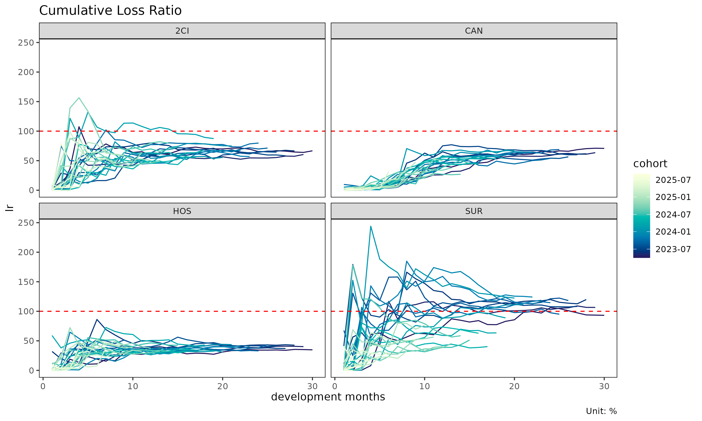
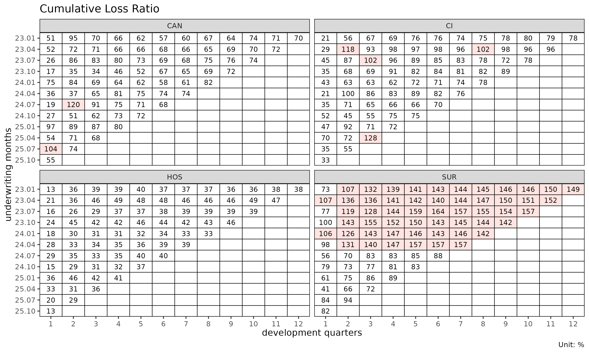

# Aggregation frameworks: Triangle, Calendar, Total

The same long-format experience data can be aggregated three ways
depending on the question being asked. `lossratio` exposes one builder
per framework. This vignette compares them.

## At a glance

| Builder | Output object | Dimension | When to use |
|----|----|----|----|
| [`as_triangle()`](https://seokhoonj.github.io/lossratio/reference/as_triangle.md) | `Triangle` | cohort × dev (2D) | SA, ED, CL projection |
| [`as_calendar()`](https://seokhoonj.github.io/lossratio/reference/as_calendar.md) | `Calendar` | calendar period (1D) | Calendar-year trend, diagonal effect |
| [`as_total()`](https://seokhoonj.github.io/lossratio/reference/as_total.md) | `Total` | portfolio total (per group) | High-level loss-ratio comparison |

Conceptually:

- `Triangle` preserves both the cohort axis (when policies were
  underwritten) and the development axis (how loss accrues over
  development time). This is the canonical chain-ladder data structure.
- `Calendar` collapses cohorts onto the diagonal — each row is one
  calendar period across all underwriting cohorts. Equivalent to the
  diagonal sum of the triangle.
- `Total` collapses both dimensions to one value per group. Useful for
  portfolio-level comparison (which product had the worst loss ratio
  over the window?).

## Triangle (cohort × dev)

``` r

library(lossratio)
data(experience)

tri <- as_triangle(
  experience,
  groups   = "coverage",
  cohort   = "uy_m",
  calendar = "cy_m",
  loss     = "loss_incr",
  premium  = "premium_incr"
)
head(tri)
#>    coverage n_cohorts     cohort   dev     loss loss_incr   premium
#>      <char>     <int>     <Date> <int>    <num>     <num>     <num>
#> 1:       CI        36 2023-01-01     1  1262380   1262380  27993106
#> 2:       CI        35 2023-01-01     2 12518143  11255763  57177037
#> 3:       CI        34 2023-01-01     3 23799452  11281309  86579003
#> 4:       CI        33 2023-01-01     4 57401839  33602387 113149543
#> 5:       CI        32 2023-01-01     5 64554461   7152622 140621429
#> 6:       CI        31 2023-01-01     6 74664986  10110525 167390789
#>    premium_incr        lr   lr_incr   margin margin_incr profit profit_incr
#>           <num>     <num>     <num>    <num>       <num> <fctr>      <fctr>
#> 1:     27993106 0.0450961 0.0450961 26730726    26730726    pos         pos
#> 2:     29183931 0.2189365 0.3856836 44658894    17928168    pos         pos
#> 3:     29401966 0.2748871 0.3836923 62779551    18120657    pos         pos
#> 4:     26570540 0.5073095 1.2646483 55747704    -7031847    pos         neg
#> 5:     27471886 0.4590656 0.2603615 76066968    20319264    pos         pos
#> 6:     26769360 0.4460519 0.3776902 92725803    16658835    pos         pos
#>    loss_share loss_incr_share premium_share premium_incr_share
#>         <num>           <num>         <num>              <num>
#> 1:  0.2745858      0.27458581     0.3811712          0.3811712
#> 2:  0.1681986      0.16119409     0.3803460          0.3795578
#> 3:  0.2132981      0.30364017     0.3873522          0.4017435
#> 4:  0.3016874      0.42701715     0.3795353          0.3561180
#> 5:  0.2007284      0.05446224     0.3776462          0.3700598
#> 6:  0.2065480      0.25346879     0.3774003          0.3761137
```

Each row is one (cohort, dev) cell with cumulative loss / risk premium.
Visualise as line plot or heatmap:

``` r

plot(tri)              # one trajectory per cohort, faceted by group
```



``` r


# With multiple group panels each panel's cells get too narrow to read,
# so use quarterly cohort and dev to bring each panel down to ~10 x 10
# cells. This fits the documentation's display size; in practice you
# can keep monthly resolution by enlarging the plot.
tri_q <- as_triangle(experience, groups = "coverage", cohort = "uy_m", calendar = "cy_m", loss = "loss_incr", premium = "premium_incr", grain = "Q")
plot_triangle(tri_q)   # cohort × dev heatmap of lr
```



Use `Triangle` as input to: -
[`as_link()`](https://seokhoonj.github.io/lossratio/reference/as_link.md)
— development factors (ATA / ED via `target` + optional `exposure`) -
[`fit_cl()`](https://seokhoonj.github.io/lossratio/reference/fit_cl.md),
[`fit_lr()`](https://seokhoonj.github.io/lossratio/reference/fit_lr.md)
— projection -
[`detect_regime()`](https://seokhoonj.github.io/lossratio/reference/detect_regime.md)
— structural change detection

## Calendar (calendar period only)

``` r

tri <- as_triangle(experience, groups = "coverage",
                   cohort = "uy_m", calendar = "cy_m",
                   loss = "loss_incr", premium = "premium_incr")
cal <- as_calendar(tri)
head(cal)
#>    coverage   calendar     t      loss loss_incr   premium premium_incr
#>      <char>     <Date> <int>     <num>     <num>     <num>        <num>
#> 1:      CAN 2023-01-01     1   1327186   1327186  36175141     36175141
#> 2:      CAN 2023-02-01     2  53881242  52554056  89468123     53292982
#> 3:      CAN 2023-03-01     3  86254932  32373690 169732522     80264399
#> 4:      CAN 2023-04-01     4 222577950 136323018 264457245     94724723
#> 5:      CAN 2023-05-01     5 358604651 136026701 373602999    109145754
#> 6:      CAN 2023-06-01     6 439679309  81074658 504742606    131139607
#>            lr    lr_incr   margin margin_incr profit profit_incr loss_share
#>         <num>      <num>    <num>       <num> <fctr>      <fctr>      <num>
#> 1: 0.03668779 0.03668779 34847955    34847955    pos         pos  0.2886821
#> 2: 0.60223955 0.98613465 35586881      738926    pos         pos  0.6063314
#> 3: 0.50818153 0.40333810 83477590    47890709    pos         pos  0.4890990
#> 4: 0.84164058 1.43914929 41879295   -41598295    pos         neg  0.5008249
#> 5: 0.95985485 1.24628486 14998348   -26880947    pos         neg  0.4596116
#> 6: 0.87109609 0.61823167 65063297    50064949    pos         pos  0.3994334
#>    loss_incr_share premium_share premium_incr_share
#>              <num>         <num>              <num>
#> 1:       0.2886821     0.4925828          0.4925828
#> 2:       0.6236615     0.4520297          0.4281056
#> 3:       0.3700256     0.4162566          0.3825138
#> 4:       0.5085391     0.3892024          0.3486040
#> 5:       0.4050687     0.3778725          0.3529756
#> 6:       0.2529446     0.3557249          0.3048260
```

Each row is one calendar period (per group). The `t` column is a
sequential index (1, 2, 3, …) within group — time-series convention. It
is **not** a development period (`cym - uym`); for that you want the
`Triangle` `dev` axis.

Calendar aggregation is mathematically the **diagonal sum** of the
triangle: cells with the same `cy_m` (regardless of `uy_m`/`dev_m`) are
combined.

Use cases: - Trend analysis (“loss ratio is rising over calendar
time”) - Calendar-year effect detection (e.g., regulatory shock, premium
on-leveling event) - Portfolio monitoring dashboards

``` r

plot(cal)                       # x axis: calendar (Date)
```


## Total (portfolio summary)

``` r

# Filter the triangle first (or the raw experience) for a date-bounded
# summary, then collapse to portfolio totals.
tri_bounded <- as_triangle(
  experience[uy_m >= as.Date("2023-04-01") &
             uy_m <= as.Date("2024-03-01")],
  groups = "coverage", cohort = "uy_m",
  development = "dev_m",
  loss = "loss_incr", premium = "premium_incr"
)
tot <- as_total(tri_bounded)
head(tot)
#>    coverage n_cohorts sales_start  sales_end        loss    premium        lr
#>      <char>     <int>      <Date>     <Date>       <num>      <num>     <num>
#> 1:       CI        12  2023-04-01 2024-03-01  8240143118 9760853703 0.8442031
#> 2:      CAN        12  2023-04-01 2024-03-01  2801401212 3710915725 0.7549083
#> 3:      HOS        12  2023-04-01 2024-03-01   158760703  377104088 0.4209997
#> 4:      SUR        12  2023-04-01 2024-03-01 13425719536 9003134239 1.4912273
#>     loss_share premium_share
#>          <num>         <num>
#> 1: 0.334611179    0.42713331
#> 2: 0.113757753    0.16238905
#> 3: 0.006446867    0.01650201
#> 4: 0.545184201    0.39397563
```

One row per group, summarising loss / risk premium / loss ratio over the
window. The `period_from` / `period_to` arguments restrict to a fixed
window so groups are comparable.

Use cases: - Compare overall loss ratio across coverages - Rank groups
by reserve / share of portfolio - Build executive summary tables

## Aggregation as data flow

                         experience (long, with demographics)
                                  │
             ┌────────────────────┼─────────────────────┐
             │                    │                     │
       as_triangle      as_calendar         as_total
       (cohort × dev)      (calendar series)     (portfolio total)
             │                    │                     │
             ▼                    ▼                     ▼
         Triangle             Calendar               Total
       (2D, projection)     (1D, trend)         (0D, comparison)

All three start from the same `experience` and aggregate demographic
dimensions away. Choose the framework based on the analytical question.

## Attribute schema

After aggregation, each object stores its source-column metadata as
attributes (used for plot labels and granularity-aware date formatting):

``` r

attr(tri, "cohort")     # "uy_m"
#> [1] "uy_m"
attr(tri, "dev")        # "dev_m"
#> [1] "dev_m"
attr(tri, "grain")      # "M"
#> [1] "M"

attr(cal, "calendar")   # "cy_m"
#> [1] "cy_m"
attr(cal, "grain")      # "M"
#> [1] "M"
```

Granularity (`"month"` / `"quarter"` / `"semi-annual"` / `"annual"`) is
derived on demand from the raw column name via
`lossratio:::.get_period_type()`, so no `_type` cache attributes are
stored.

The data columns themselves are standardised to `cohort` / `dev` /
`calendar`, so downstream code is granularity-agnostic.
