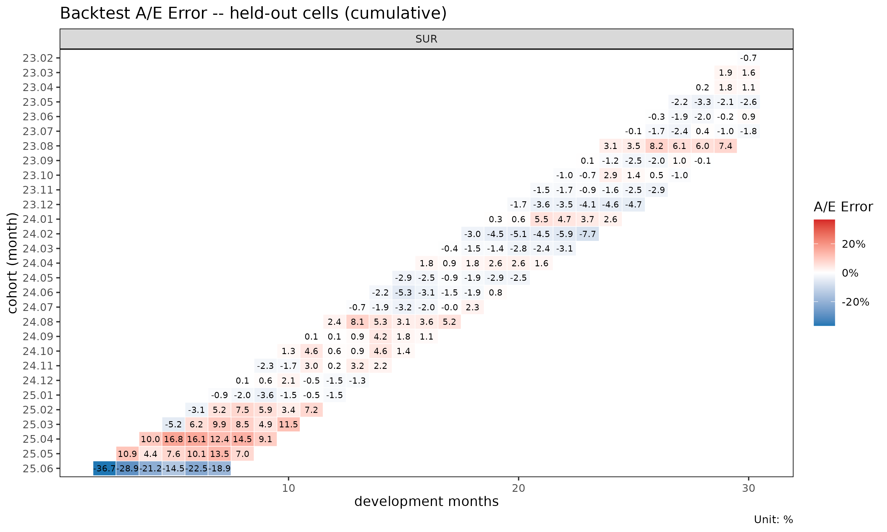

# Backtest: hold-out 대각선을 이용한 추정 검증

> 영어 원본 보기: [Backtesting projections against held-out
> diagonals](https://seokhoonj.github.io/lossratio/backtest.md)

## 1. 동기

준비금 산출과 추정(projection) 방법은 관측된 자료에 적합되지만, 실무적
가치는 과거 valuation 시점(평가 시점)에서 그 방법이 어떻게 작동했을지에
달려 있다.
[`backtest()`](https://seokhoonj.github.io/lossratio/reference/backtest.md)
는 triangle 에서 `holdout` 으로 지정한 만큼의 최근 대각선 (calendar
diagonal)을 마스킹한 뒤, 이전 부분에 모형을 재적합하고, 그 추정값을
마스킹된 셀의 실제값과 비교함으로써 이 질문에 답한다. 이는 경과 기간
단위 hold-out이 아니라 대각선 단위 hold-out인데, “*K* 개월 전 valuation
시점에서 모형은 무엇이라 말했을까?” 를 모사하기 때문이다. 셀 단위 지표는
A/E Error (`ae_err`) 이며, 표준 actuarial A/E 관용에 맞춰
$`\mathrm{ae\_err} = v_{\mathrm{actual}} / v_{\mathrm{pred}} - 1`$ 로
정의한다. 양수는 과소 추정 (실제가 기대보다 큼), 음수는 과대 추정을
의미한다.

## 2. 기본 사용법

``` r

library(lossratio)
data(experience)
tri_sur <- build_triangle(
  experience[coverage == "SUR"],
  groups   = "coverage",
  cohort   = "uy_m",
  calendar = "cy_m",
  loss     = "loss_incr",
  premium  = "premium_incr"
)

bt <- backtest(tri_sur, holdout = 6L)
print(bt)
#> <Backtest>
#>   fit_fn   : fit_lr
#>   target   : lr
#>   holdout  : 6 diagonals (159 cells)
#>   A/E Error: mean 0.21% / median -0.00%
```

기본 추정 대상은 누적 손해율 (`target = "lr"`) 이며, 손해 측 method 는
단계 적응형(stage-adaptive, SA, `loss_method = "sa"`) 이다. 반환되는
객체는 `"Backtest"` 리스트이며, 주요 슬롯은 다음과 같다.

- `ae_err` — 셀 단위 `data.table` (cohort, dev, actual, pred, ae_err,
  calendar_idx).
- `col_summary` — `dev` 별로 집계된 A/E Error.
- `diag_summary` — 대각선별로 집계된 A/E Error.
- `masked` — 적합에 사용된 triangle (최근 대각선이 제거됨).
- `fit` — 내부 적합 객체 (`LRFit`, `LossFit`, 또는 `PremiumFit`,
  `target` 에 따라 결정).

`summary(bt)` 는 호출 메타데이터와 함께 두 요약 표를 출력한다.

## 3. 마스킹 후 검증 범위

`holdout` 만큼의 최근 대각선을 마스킹하면 Triangle 의 우하단이 짧아진다.
chain ladder 는 마스킹된 데이터에 남아 있는 가장 큰 dev 까지만 추정값을
만들 수 있으므로, 그 범위를 넘어가는 셀 — 가장 오래된 코호트의 후기 dev
셀들 — 은 비교할 추정값이 아예 생성되지 않는다. 이런 셀은 자동으로
제외되어, `bt$ae_err` 에는 실제값과 추정값이 모두 존재하는 셀만 남는다.

실무적 함의: `holdout` 이 커질수록 가장 오래된 코호트의 후기 dev 영역이
가장 먼저 검증에서 빠진다. 이 영역은 chain ladder 가 외삽 (관측 범위
너머로의 추정) 에 의존하는 부분으로, 본래 검증이 가장 필요한 곳인데
오히려 가장 빨리 사라진다.

## 4. 출력 해석

**`col_summary` — 경과 기간별 체계적 편향.** 특정 dev 에서 A/E Error 의
부호가 일관되게 나타나면, 그 성숙도에서 모형과 자료 사이에 구조적
불일치가 있음을 시사한다. 초기 dev 의 양의 값은 보통 부풀려진 link
factor 를 반영하고, 후기 dev 의 값은 꼬리 미보정(miscalibration) 을
시사한다.

``` r

head(bt$col_summary, 8)
#>    coverage   dev     n     aeg_mean      aeg_med ae_err_mean  ae_err_med
#>      <char> <int> <int>        <num>        <num>       <num>       <num>
#> 1:      SUR     2     1 -0.287972089 -0.287972089 -0.36674934 -0.36674934
#> 2:      SUR     3     2 -0.105823621 -0.105823621 -0.09011956 -0.09011956
#> 3:      SUR     4     3 -0.043897002  0.021766603 -0.02300711  0.04378485
#> 4:      SUR     5     4 -0.011055827  0.005435137  0.01186457  0.01235174
#> 5:      SUR     6     5 -0.016011400  0.037090206  0.01349876  0.06211287
#> 6:      SUR     7     6  0.006639057  0.052051927  0.03540917  0.07574468
#> 7:      SUR     8     6  0.038755683  0.046849343  0.05916241  0.07259077
#> 8:      SUR     9     6  0.016598376  0.018133964  0.02445333  0.02775188
#>      ae_err_wt aeg_incr_mean aeg_incr_med ae_err_incr_mean ae_err_incr_med
#>          <num>         <num>        <num>            <num>           <num>
#> 1: -0.36674934   -0.57495418 -0.574954175      -0.42911219    -0.429112189
#> 2: -0.15446352   -0.03295105 -0.032951048       0.03104206     0.031042058
#> 3: -0.06566221    0.03896663 -0.060404427       0.07170889    -0.051312889
#> 4: -0.01626478    0.07049188  0.081146126       0.09271533     0.101566115
#> 5: -0.02203521   -0.04049602  0.091444980       0.04486252     0.130130156
#> 6:  0.00886328    0.12761981  0.080299453       0.16250805     0.136743653
#> 7:  0.05508567    0.02069969  0.007197477       0.01564729     0.008088929
#> 8:  0.02238914   -0.10613396 -0.136121764      -0.13147267    -0.163940480
#>    ae_err_incr_wt
#>             <num>
#> 1:    -0.42911219
#> 2:    -0.03788330
#> 3:     0.04819216
#> 4:     0.08262484
#> 5:    -0.04711615
#> 6:     0.14894131
#> 7:     0.02505782
#> 8:    -0.12387084
```

`ae_err_mean` 은 셀 단위 A/E Error 의 평균, `ae_err_med` 는 중앙값,
`ae_err_wt = sum(actual - proj) / sum(proj)` 는 노출 가중 pooled A/E
ratio 에서 1 을 뺀 값이다. 세 컬럼을 비교하면 소수의 큰 셀이 결과를
지배하는지 (`ae_err_wt` 가 `ae_err_med` 와 크게 다른 경우) 또는 편향이
균일한지 식별할 수 있다.

**`diag_summary` — 대각선 효과(calendar-year effect).** 그 외에는 편향이
없는 출력에서 단 하나의 대각선만 나쁘게 나타난다면, 정적 chain ladder 가
구조상 볼 수 없는 calendar 사건 (요율 변경, 보험금 처리 방식의 변화,
일회성 충격) 을 가리킨다.

``` r

bt$diag_summary
#>    coverage calendar_idx     n      aeg_mean       aeg_med  ae_err_mean
#>      <char>        <int> <int>         <num>         <num>        <num>
#> 1:      SUR           31    29 -0.0125686252 -0.0056732350 -0.011309410
#> 2:      SUR           32    28 -0.0104717812 -0.0114871218 -0.002794292
#> 3:      SUR           33    27  0.0004718616  0.0050471735  0.007666312
#> 4:      SUR           34    26  0.0012851467 -0.0002953897  0.008094503
#> 5:      SUR           35    25 -0.0006986581  0.0145835308  0.007408947
#> 6:      SUR           36    24 -0.0027175011  0.0105940082  0.005874139
#>      ae_err_med     ae_err_wt aeg_incr_mean aeg_incr_med ae_err_incr_mean
#>           <num>         <num>         <num>        <num>            <num>
#> 1: -0.003699313 -0.0107004533   -0.08350070  -0.07460811     -0.036347452
#> 2: -0.009588959 -0.0089044278   -0.07573837  -0.07440057     -0.003857981
#> 3:  0.006154835  0.0004012161    0.18105966   0.09849605      0.147072061
#> 4:  0.000421251  0.0010973317    0.01407124  -0.02312661      0.017058138
#> 5:  0.009455704 -0.0005997009   -0.03104560  -0.09210258     -0.008476082
#> 6:  0.009450279 -0.0023535415   -0.06224227  -0.09299902     -0.016968983
#>    ae_err_incr_med ae_err_incr_wt
#>              <num>          <num>
#> 1:     -0.06750071    -0.06558617
#> 2:     -0.07262916    -0.06014060
#> 3:      0.12954698     0.14477037
#> 4:     -0.02473897     0.01130928
#> 5:     -0.07819464    -0.02508022
#> 6:     -0.09358995    -0.05088339
```

대각선을 가로지르는 단조로운 표류 (위 SUR 예시처럼 `25, ..., 30` 으로
가면서 A/E Error 가 점점 더 양수가 되는 패턴) 는 보통 가장 최근 대각선의
실적이 이전 코호트의 link factor 가 함의하는 수준보다 더 높게 진행되고
있음 — 즉 정적 모형이 흡수하지 못한 regime shift 가 발생했음을 시사한다.

**`ae_err` — 셀 단위 이상치.** 특정 cohort × dev 셀을 진단하려면
`bt$ae_err` 를 직접 살펴본다.

``` r

head(bt$ae_err, 5)
#> Key: <coverage>
#>    coverage     cohort   dev value_actual value_proj          aeg       ae_err
#>      <char>     <Date> <int>        <num>      <num>        <num>        <num>
#> 1:      SUR 2023-02-01    30     1.474656   1.485094 -0.010438112 -0.007028587
#> 2:      SUR 2023-03-01    29     1.441826   1.414305  0.027520309  0.019458534
#> 3:      SUR 2023-03-01    30     1.441234   1.418776  0.022457560  0.015828823
#> 4:      SUR 2023-04-01    28     1.513021   1.510169  0.002851902  0.001888465
#> 5:      SUR 2023-04-01    29     1.531922   1.504873  0.027048593  0.017974003
#>    value_actual_incr value_proj_incr    aeg_incr ae_err_incr calendar_idx
#>                <num>           <num>       <num>       <num>        <int>
#> 1:          1.311699        1.616053 -0.30435387 -0.18833160           31
#> 2:          2.057141        1.271304  0.78583659  0.61813407           31
#> 3:          1.425549        1.543888 -0.11833820 -0.07664950           32
#> 4:          1.573801        1.498421  0.07537995  0.05030625           31
#> 5:          2.055572        1.352715  0.70285727  0.51959013           32
```

## 5. 플롯 데모

`"Backtest"` 에는 네 가지 플롯 뷰가 등록되어 있다.

``` r

plot(bt, type = "col")    # dev 별 A/E Error (점 + 0 기준 점선)
```


``` r

plot(bt, type = "diag")   # 대각선별 A/E Error
```


``` r

plot(bt, type = "cell")   # dev 위에 그려진 코호트별 A/E Error 궤적
```


``` r

plot_triangle(bt)         # hold-out 영역에 대한 발산형 팔레트 히트맵
```



`type = "col"` 은 경과 기간별 체계적 편향을 살피기에 적합하다.
`type = "diag"` 는 대각선 효과(calendar-year drift) 를 드러낸다.
`type = "cell"` 은 어느 코호트가 편향에 기여하는지를 노출한다.
[`plot_triangle()`](https://seokhoonj.github.io/lossratio/reference/plot_triangle.md)
은 셀 단위 A/E Error 값을 기저 적합의
[`plot_triangle()`](https://seokhoonj.github.io/lossratio/reference/plot_triangle.md)
과 동일한 삼각 배치 위에 올려놓으며, 빨간색이 과소 추정 (actual \> pred)
을 표시하는 빨강/파랑 발산형 팔레트를 사용한다.

## 6. hold-out 선택

`holdout` 은 다음 두 가지 상충 효과의 균형을 잡도록 선택한다.

- 너무 큰 경우: 마스킹된 triangle 이 가장 최근 경험을 잃게 되어, 가장
  오래된 코호트들은 후기 경과 기간에서 도달 가능 셀이 거의 또는 전혀
  없게 된다. 검증 집합이 불균등하게 줄어들며 초기 dev 쪽으로 편향된다.
- 너무 작은 경우: hold-out 영역이 얇은 평행사변형 밴드에 불과해, 체계적
  패턴을 드러내기에 충분한 셀을 포함하지 못할 수 있다.

월별 triangle 에서는 `holdout = 6L` (반년) 이 일반적이며, 24~30 개의
대각선 이력이 있는 triangle 에서는 더 강한 검증을 위해 `holdout = 12L`
(1년) 을 사용한다.

## 7. 추정 대상 선택

기본값인 `target = "lr"` (`loss_method = "sa"`) 은 손해율 관점의 진단을
직접 제공한다. `target` 과 method 인자를 바꾸면 다양한 변형을 백테스트할
수 있다.

> **`target` 에 대한 참고.** `target` 은 **스코어 컬럼(score column)**
> 으로, 셀 단위로 실제값과 추정값을 비교하는 대상 컬럼을 가리킨다.
> [`backtest()`](https://seokhoonj.github.io/lossratio/reference/backtest.md)
> 는 `target` 값에 따라 내부적으로 적절한 역할별 적합 함수 를 호출하고,
> 해당 적합 객체의 `$full` 에서 대응되는 추정 컬럼을 비교 대상으로
> 사용한다.

| `target` | 내부 적합 함수 | method 인자 | 비교 컬럼 |
|----|----|----|----|
| `"lr"` | [`fit_lr()`](https://seokhoonj.github.io/lossratio/reference/fit_lr.md) | `loss_method` | `lr_proj` |
| `"loss"` | [`fit_loss()`](https://seokhoonj.github.io/lossratio/reference/fit_loss.md) | `loss_method` | `loss_proj` |
| `"premium"` | [`fit_premium()`](https://seokhoonj.github.io/lossratio/reference/fit_premium.md) | `premium_method` | `premium_proj` |

``` r

bt_sa_lr    <- backtest(tri_sur, holdout = 6L)                       # default
bt_cl_loss  <- backtest(tri_sur, holdout = 6L,
                        target = "loss", loss_method = "cl")
bt_ed_lr    <- backtest(tri_sur, holdout = 6L, loss_method = "ed")
bt_cl_lr    <- backtest(tri_sur, holdout = 6L, loss_method = "cl")

print(bt_sa_lr)
#> <Backtest>
#>   fit_fn   : fit_lr
#>   target   : lr
#>   holdout  : 6 diagonals (159 cells)
#>   A/E Error: mean 0.21% / median -0.00%
```

`lr` 을 백테스팅하는 것이 보통 더 유익한 진단이 된다. 손해율은 단위가
없고 차원이 없어 규모가 크게 다른 코호트 간에도 일관되게 비교
가능하므로, `ae_err_mean` 과 `ae_err_med` 가 triangle 전체에서 일관된
의미를 가진다. 반면 `loss` 를 백테스팅하면 결과가 hold-out 대각선에서
가장 큰 코호트 쪽으로 가중된다.

`premium` 백테스트는 `target = "premium"` 으로 직접 수행한다.

## 8. 함께 보기

- [`vignette("chain-ladder-reserving")`](https://seokhoonj.github.io/lossratio/articles/chain-ladder-reserving.md)
  —
  [`fit_cl()`](https://seokhoonj.github.io/lossratio/reference/fit_cl.md)
  참고.
- [`vignette("projection")`](https://seokhoonj.github.io/lossratio/articles/projection.md)
  —
  [`fit_lr()`](https://seokhoonj.github.io/lossratio/reference/fit_lr.md)
  및 `"sa"`, `"ed"`, `"cl"` 방법.
- [`?backtest`](https://seokhoonj.github.io/lossratio/reference/backtest.md),
  [`?plot.Backtest`](https://seokhoonj.github.io/lossratio/reference/plot.Backtest.md),
  [`?plot_triangle.Backtest`](https://seokhoonj.github.io/lossratio/reference/plot_triangle.Backtest.md).
