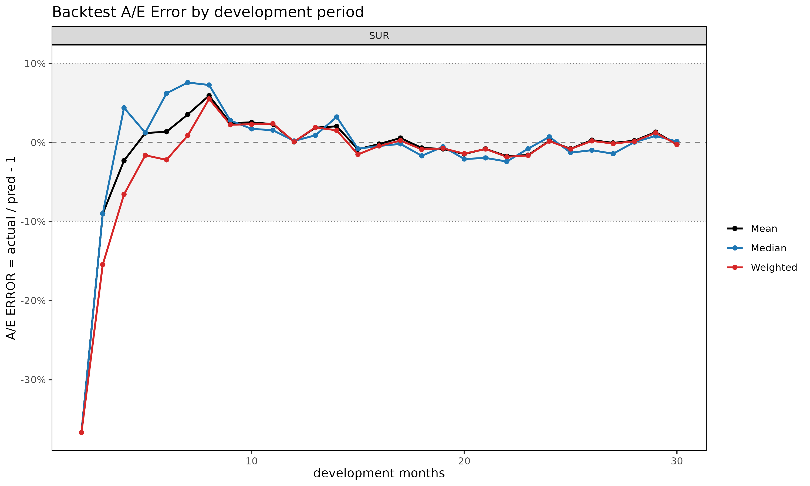
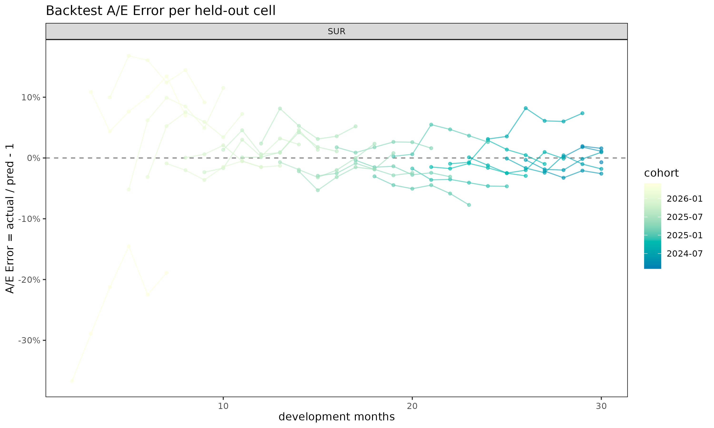

# Backtest: holding out the latest diagonals to validate projections

## Motivation

Reserving and projection methods are fitted on observed data, but their
practical value lies in how they would have performed at past valuation
dates.
[`backtest()`](https://seokhoonj.github.io/lossratio-r/reference/backtest.md)
answers that question by hiding the latest `holdout` calendar diagonals
from a triangle, refitting the model on the earlier portion, and
comparing its projection to the actuals that were withheld. This is
calendar-diagonal hold-out (rather than dev-period hold-out), because it
simulates “what would the model have said *K* months ago at the
valuation date?”. The cell-level metric (`ae_err`, “A/E Error”) follows
the standard actuarial A/E convention,
$`\mathrm{ae\_err} = v_{\mathrm{actual}} / v_{\mathrm{pred}} - 1`$,
where positive values flag under-projection (the model under-estimated;
actual exceeded expected) and negative values flag over-projection.

## Basic usage

``` r

library(lossratio)
data(experience)
tri_sur <- as_triangle(
  experience[coverage == "surgery"],
  groups   = "coverage",
  cohort   = "uy_m",
  calendar = "cy_m",
  loss     = "incr_loss",
  premium  = "incr_premium"
)

bt <- backtest(tri_sur, holdout = 6L)
print(bt)
#> <Backtest>
#>   dispatcher: fit_ratio
#>   target    : ratio
#>   holdout   : 6 diagonals (159 cells)
#>   A/E Error : mean -9.38% / median -4.39%
```

The returned object is a `"Backtest"` list with these key slots:

- `ae_err` — per-cell `data.table` (cohort, dev, actual, expected, aeg,
  ae_err + `_incr` siblings, cal_idx).
- `col_summary` — A/E Error aggregated by `dev`.
- `diag_summary` — A/E Error aggregated by calendar diagonal.
- `masked` — the triangle the fit was trained on (latest diagonals
  removed).
- `fit` — the fit object returned by the target-specific dispatcher
  (`fit_ratio` / `fit_loss` / `fit_premium`) chosen by `target=`.

`summary(bt)` prints the two summary tables alongside the call metadata.

## Validation coverage after masking

Masking the latest `holdout` diagonals shortens the triangle’s
lower-right edge. Chain ladder can only project as far as the largest
dev still observed in the masked data, so cells beyond that range — the
oldest cohorts at their latest dev — have no projection to compare
against. These unreachable cells are silently dropped, so `bt$ae_err`
contains only cells where both an actual and a finite projection exist.

Practical takeaway: as `holdout` grows, the validation set shrinks
fastest in the oldest cohorts’ late-dev region — exactly where chain
ladder relies on extrapolation (projection beyond the observed dev
range), so it is the area most in need of validation yet the first to
disappear.

## Output interpretation

**`col_summary` — systematic bias by development period.** A
consistently signed A/E Error at a given dev signals a structural
mismatch between the model and that maturity. Early-dev positive values
usually reflect inflated link factors; late-dev values flag tail
miscalibration.

``` r

head(bt$col_summary, 8)
#>    coverage   dev     n   aeg_mean    aeg_med ae_err_mean ae_err_med  ae_err_wt
#>      <char> <int> <int>      <num>      <num>       <num>      <num>      <num>
#> 1:  surgery     2     1 -0.2879721 -0.2879721  -0.3667493 -0.3667493 -0.3667493
#> 2:  surgery     3     2 -0.2108693 -0.2108693  -0.2609106 -0.2609106 -0.2668725
#> 3:  surgery     4     3 -0.1980716 -0.2262460  -0.2360836 -0.2278978 -0.2407573
#> 4:  surgery     5     4 -0.2070832 -0.1696142  -0.2373172 -0.2037644 -0.2364591
#> 5:  surgery     6     5 -0.2350791 -0.2220419  -0.2444979 -0.2435615 -0.2485779
#> 6:  surgery     7     6 -0.2261834 -0.2456246  -0.2251483 -0.2400164 -0.2303588
#> 7:  surgery     8     6 -0.2375787 -0.2195124  -0.2337115 -0.2298462 -0.2424551
#> 8:  surgery     9     6 -0.2210369 -0.1791352  -0.2188077 -0.1763073 -0.2257798
#>    incr_aeg_mean incr_aeg_med incr_ae_err_mean incr_ae_err_med incr_ae_err_wt
#>            <num>        <num>            <num>           <num>          <num>
#> 1:    -0.5749542   -0.5749542       -0.4291122      -0.4291122     -0.4291122
#> 2:    -0.3489404   -0.3489404       -0.2942675      -0.2942675     -0.2942675
#> 3:    -0.3738322   -0.3334336       -0.3060770      -0.2730004     -0.3060770
#> 4:    -0.4433586   -0.4866788       -0.3243281      -0.3560179     -0.3243281
#> 5:    -0.5667766   -0.5767098       -0.4089965      -0.4161644     -0.4089965
#> 6:    -0.4048255   -0.5050649       -0.2913899      -0.3635413     -0.2913899
#> 7:    -0.6238985   -0.6021573       -0.4242259      -0.4094427     -0.4242259
#> 8:    -0.7336689   -0.7388122       -0.4942706      -0.4977357     -0.4942706
```

`ae_err_mean` averages cell-level A/E Error, `ae_err_med` is the median,
and `ae_err_wt = sum(actual - proj) / sum(proj)` is the premium-weighted
pooled A/E ratio minus 1. Comparing the three columns flags whether a
few large cells dominate (`ae_err_wt` very different from `ae_err_med`)
or the bias is uniform.

**`diag_summary` — calendar-year effect.** A single bad diagonal in
otherwise unbiased output points at a calendar event (a rate change,
claim handling shift, or one-off shock) that a static fitter cannot see
by construction.

``` r

bt$diag_summary
#>    coverage cal_idx     n    aeg_mean     aeg_med ae_err_mean  ae_err_med
#>      <char>   <int> <int>       <num>       <num>       <num>       <num>
#> 1:  surgery      31    29 -0.04575359 -0.03198719 -0.05658328 -0.02153108
#> 2:  surgery      32    28 -0.07040314 -0.05170431 -0.07561194 -0.03549370
#> 3:  surgery      33    27 -0.08297822 -0.05675816 -0.08611363 -0.03865162
#> 4:  surgery      34    26 -0.10380725 -0.06595414 -0.10216462 -0.04456169
#> 5:  surgery      35    25 -0.12608316 -0.08752566 -0.11863390 -0.05863248
#> 6:  surgery      36    24 -0.14828046 -0.14817761 -0.13376449 -0.12050537
#>      ae_err_wt incr_aeg_mean incr_aeg_med incr_ae_err_mean incr_ae_err_med
#>          <num>         <num>        <num>            <num>           <num>
#> 1: -0.03788261   -0.30136185   -0.4459253      -0.19728502      -0.3160730
#> 2: -0.05696273   -0.31278712   -0.3376753      -0.20366014      -0.2455593
#> 3: -0.06588038   -0.07618026   -0.2335583      -0.04127158      -0.1580403
#> 4: -0.08133780   -0.26063771   -0.4114195      -0.16056535      -0.2755793
#> 5: -0.09770892   -0.31819948   -0.3999726      -0.21990402      -0.2615089
#> 6: -0.11404379   -0.36981575   -0.3068424      -0.23186701      -0.1978691
#>    incr_ae_err_wt
#>             <num>
#> 1:     -0.2021198
#> 2:     -0.2090259
#> 3:     -0.0505205
#> 4:     -0.1715931
#> 5:     -0.2086546
#> 6:     -0.2415822
```

A monotone drift across calendar diagonals (as in the surgery example
above, where A/E Error becomes increasingly positive across
`25, ..., 30`) typically indicates that actuals on the latest diagonals
are running above what the earlier-cohort link factors imply, i.e. a
regime shift the static model has not absorbed.

**`ae_err` — cell-level outliers.** For diagnosing specific cohort × dev
cells, inspect `bt$ae_err` directly:

``` r

head(bt$ae_err, 5)
#>    coverage     cohort   dev   actual expected         aeg       ae_err
#>      <char>     <Date> <int>    <num>    <num>       <num>        <num>
#> 1:  surgery 2023-02-01    30 1.474656 1.485769 -0.01111280 -0.007479494
#> 2:  surgery 2023-03-01    29 1.441826 1.416462  0.02536395  0.017906553
#> 3:  surgery 2023-03-01    30 1.441234 1.424023  0.01721096  0.012086155
#> 4:  surgery 2023-04-01    28 1.513021 1.508373  0.00464845  0.003081765
#> 5:  surgery 2023-04-01    29 1.531922 1.502555  0.02936662  0.019544454
#>    incr_actual incr_expected   incr_aeg incr_ae_err cal_idx
#>          <num>         <num>      <num>       <num>   <int>
#> 1:    1.311699      1.635607 -0.3239081 -0.19803535      31
#> 2:    2.057141      1.335414  0.7217266  0.54045140      31
#> 3:    1.425549      1.635607 -0.2100580 -0.12842811      32
#> 4:    1.573801      1.449050  0.1247511  0.08609165      31
#> 5:    2.055572      1.335414  0.7201577  0.53927654      32
```

## Plot demos

Four plot views are registered on `"Backtest"`:

``` r

plot(bt, type = "col")    # A/E Error by dev (point + dashed zero line)
```



``` r

plot(bt, type = "diag")   # A/E Error by calendar diagonal
```


``` r

plot(bt, type = "cell")   # per-cohort A/E Error trajectories over dev
```



``` r

plot_triangle(bt)         # diverging-color heatmap on the held-out wedge
```


`type = "col"` is the right place to look for systematic dev-period
bias; `type = "diag"` reveals calendar-year drift; `type = "cell"`
exposes which cohorts contribute the bias;
[`plot_triangle()`](https://seokhoonj.github.io/lossratio-r/reference/plot_triangle.md)
puts the cell-level A/E Error values on the same triangular layout as
[`plot_triangle()`](https://seokhoonj.github.io/lossratio-r/reference/plot_triangle.md)
for the underlying fit, with a red/blue diverging palette where red
marks under-projection (actual \> pred) and blue marks over-projection
(actual \< pred).

## Holdout selection

Choose `holdout` to balance two opposing effects:

- Too large: the masked triangle loses its latest experience, so the
  oldest cohorts have few or no reachable cells in their later dev
  periods. The validation set shrinks unevenly, biased toward early dev.
- Too small: the held-out wedge is just a thin diagonal band, which may
  not capture enough cells to reveal systematic patterns.

Typical choices are `holdout = 6L` (half-year) for monthly triangles, or
`holdout = 12L` (full year) for stronger validation when the triangle
has at least 24–30 diagonals of history.

## Choosing the projection target

The default is `target = "ratio"` with `loss_method = "ed"`. The loss
ratio is unitless and dimension-free across cohorts of very different
volume, so `ae_err_mean` and `ae_err_med` carry a consistent meaning
across the triangle.

> **A note on `target`.** `target` is the **score column** — the column
> on which actual vs. predicted are compared cell-by-cell. It selects
> which role-specific fitter
> [`backtest()`](https://seokhoonj.github.io/lossratio-r/reference/backtest.md)
> runs internally and which projection column on the fit’s `$full` table
> is compared against the held-out actuals:

| `target` | Internal fitter | Method arg | Compared column |
|----|----|----|----|
| `"ratio"` | [`fit_ratio()`](https://seokhoonj.github.io/lossratio-r/reference/fit_ratio.md) | `loss_method` | `ratio_proj` |
| `"loss"` | [`fit_loss()`](https://seokhoonj.github.io/lossratio-r/reference/fit_loss.md) | `loss_method` | `loss_proj` |
| `"premium"` | [`fit_premium()`](https://seokhoonj.github.io/lossratio-r/reference/fit_premium.md) | `premium_method` | `premium_proj` |

The `loss_method` argument selects the underlying loss / loss-ratio
projection strategy: `"ed"` (exposure-driven, the default) is the
unconditional safe baseline – no maturity or regime detection needed;
`"cl"` is the classical chain ladder, which lets the cohort’s own
cum_loss anchor cohort-level drift; `"sa"` (stage-adaptive) blends ED
before the maturity point with CL afterwards. The `premium_method`
argument selects the premium projection strategy when
`target = "premium"`.

``` r

bt_ed       <- backtest(tri_sur, holdout = 6L, loss_method = "ed")  # default
bt_cl       <- backtest(tri_sur, holdout = 6L, loss_method = "cl")
bt_sa       <- backtest(tri_sur, holdout = 6L, loss_method = "sa")

bt_loss     <- backtest(tri_sur, holdout = 6L,
                        target = "loss", loss_method = "cl")
bt_premium  <- backtest(tri_sur, holdout = 6L,
                        target = "premium", premium_method = "cl")

print(bt_ed)
#> <Backtest>
#>   dispatcher: fit_ratio
#>   target    : ratio
#>   holdout   : 6 diagonals (159 cells)
#>   A/E Error : mean -9.38% / median -4.39%
```

For monetary impact (loss or premium) backtesting, set `target = "loss"`
or `target = "premium"` to score the corresponding projection lane
directly.

## See also

- [`vignette("projection")`](https://seokhoonj.github.io/lossratio-r/articles/projection.md)
  —
  [`fit_cl()`](https://seokhoonj.github.io/lossratio-r/reference/fit_cl.md)
  reference.
- [`vignette("projection")`](https://seokhoonj.github.io/lossratio-r/articles/projection.md)
  —
  [`fit_ratio()`](https://seokhoonj.github.io/lossratio-r/reference/fit_ratio.md)
  and the `"sa"`, `"ed"`, `"cl"` methods.
- [`?backtest`](https://seokhoonj.github.io/lossratio-r/reference/backtest.md),
  [`?plot.Backtest`](https://seokhoonj.github.io/lossratio-r/reference/plot.Backtest.md),
  [`?plot_triangle.Backtest`](https://seokhoonj.github.io/lossratio-r/reference/plot_triangle.Backtest.md).
