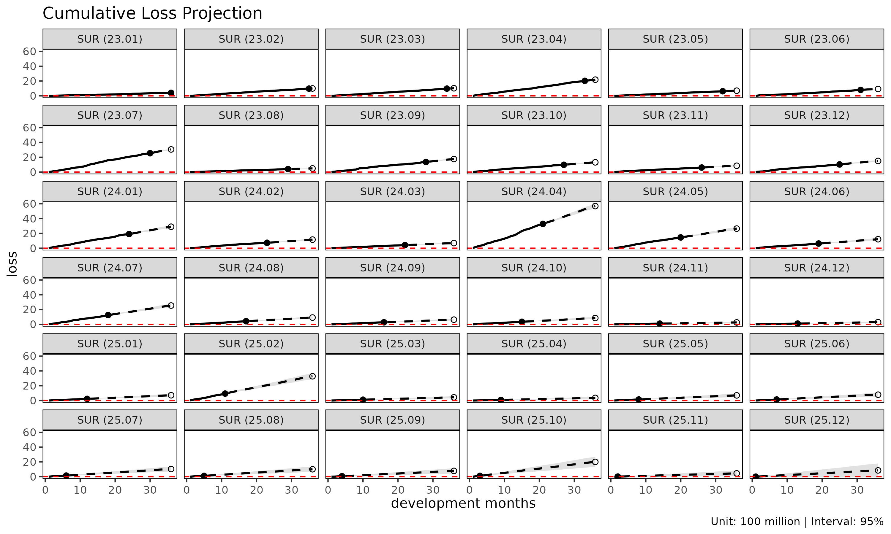
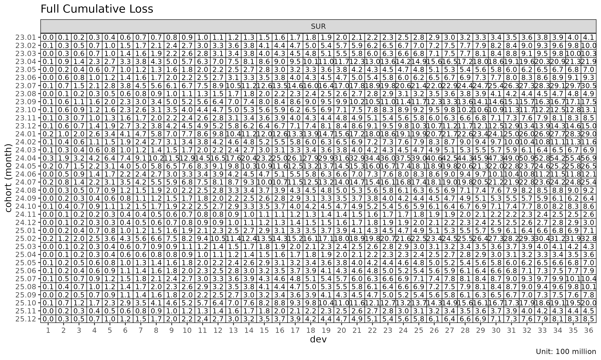
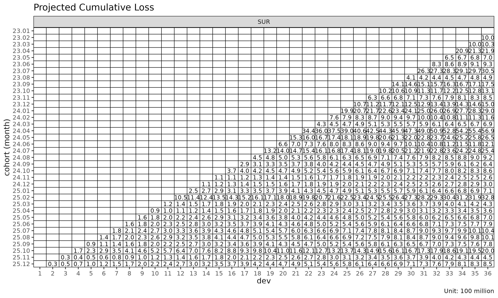

# (참고) Chain ladder reserving: 손해보험 준비금 산출

> **참고: 손해보험 (P&C) 준비금 맥락의 글.** 이 글은 *chain ladder
> 준비금 산출* — 보고기간 미종료 사고연도의 ultimate 지급/발생 손해 추정
> — 을 다룬다. 이는 손해보험(P&C, Property & Casualty) 의 전형적 use
> case 이다. lossratio 패키지의 메인 초점은 *장기 건강 보험* 손해율 추정
> (`fit_lr`) 이며, 준비금 framing 은 거기서는 직접 적용되지 않는다. 이
> 글은 P&C 배경에서 오는 사용자가 `fit_cl` 을 익숙한 Mack chain ladder
> workflow 와 매핑해 볼 수 있도록 하는 참고 자료로 둔다.
>
> 영어 원본: [Chain ladder reserving with
> fit_cl](https://seokhoonj.github.io/lossratio/chain-ladder-reserving.md)

[`fit_cl()`](https://seokhoonj.github.io/lossratio/reference/fit_cl.md)
은 단일 값 컬럼에 대한 전용 chain ladder 적합 함수이다. 손해와
익스포저를 동시에 추정해 손해율을 산출하는
[`fit_lr()`](https://seokhoonj.github.io/lossratio/reference/fit_lr.md)
과 달리,
[`fit_cl()`](https://seokhoonj.github.io/lossratio/reference/fit_cl.md)
은 하나의 누적 지표를 전방으로 추정하고 코호트별 Mack 방식 표준오차를
함께 계산한다.

## 1. 기본 사용법

이 문서는 간결성을 위해 `SUR` 그룹만 사용한다 — 모든 절차는 다중 그룹
입력에도 그대로 일반화된다.

``` r

library(lossratio)
data(experience)
exp <- as_experience(experience)
tri <- build_triangle(exp[coverage == "SUR"], group_var = coverage)

cl <- fit_cl(tri, loss_var = "loss", method = "mack")
print(cl)
#> <CLFit>
#> method      : mack 
#> loss_var   : loss 
#> weight_var  : none 
#> alpha       : 1 
#> sigma_method: min_last2 
#> recent      : all 
#> use_maturity: FALSE 
#> tail_factor : 1 
#> groups      : coverage 
#> periods     : 36
```

`loss_var` 은 추정 대상 누적 컬럼을 선택한다 — 준비금 산출에는 보통
`"loss"` (누적 손해), 익스포저 추정에는 `"premium"` (누적 위험보험료) 를
쓴다.

## 2. 방법: basic vs Mack

두 가지 추정 방법이 제공된다. 두 방법 모두 인접 dev 의 누적 손해 비
$`f_k = C^L_{k+1} / C^L_k`$ — **ATA 인자**(age-to-age factor) — 를
링크별로 선택한 뒤 누적 추정에 사용한다.

| `method`  | 계산 내용                           |
|-----------|-------------------------------------|
| `"basic"` | 점 추정만 (선택된 ATA 인자)         |
| `"mack"`  | 점 추정 + 인자 / 프로세스 / 모수 SE |

``` r

cl_basic <- fit_cl(tri, loss_var = "loss", method = "basic")
cl_mack  <- fit_cl(tri, loss_var = "loss", method = "mack")

names(cl_basic)
#>  [1] "call"          "data"          "method"        "group_var"    
#>  [5] "cohort_var"    "dev_var"       "loss_var"      "full"         
#>  [9] "pred"          "link"          "summary"       "factor"       
#> [13] "selected"      "maturity"      "alpha"         "sigma_method" 
#> [17] "weight_var"    "recent"        "use_maturity"  "maturity_args"
#> [21] "tail"          "tail_factor"

# Mack 은 $full 과 $summary 에 분산 추정값을 추가한다
head(cl_mack$summary)
#>    coverage     cohort     latest   loss_ult   reserve  proc_se param_se
#>      <char>     <Date>      <num>      <num>     <num>    <num>    <num>
#> 1:      SUR 2024-01-01  410248523  410248523         0        0        0
#> 2:      SUR 2024-02-01  976330446 1001441304  25110859  2531458  3955123
#> 3:      SUR 2024-03-01  978486044 1026151241  47665197  3814581  4714708
#> 4:      SUR 2024-04-01 2029909922 2186771224 156861302  6757376 10681348
#> 5:      SUR 2024-05-01  624219442  697669308  73449866  4363670  3505408
#> 6:      SUR 2024-06-01  802880717  931393933 128513217 17839243  8552360
#>          se          cv
#>       <num>       <num>
#> 1:        0 0.000000000
#> 2:  4695878 0.004689120
#> 3:  6064610 0.005910055
#> 4: 12639356 0.005779917
#> 5:  5597276 0.008022821
#> 6: 19783363 0.021240596
```

`method = "mack"` 으로 적합하면 추정 플롯의 신뢰 구간
(`show_interval = TRUE`) 을 사용할 수 있다.

``` r

plot(cl_mack, type = "projection", show_interval = TRUE)
```



## 3. Tail 인자

마지막 관측 경과 기간에서도 손해가 여전히 발달 중인 triangle 의 경우,
외삽한 tail 인자(tail factor) 로 ultimate 를 추정한다.

``` r

# 선택된 ATA 인자로부터 로그 선형 외삽
cl_tail <- fit_cl(tri, loss_var = "loss", method = "mack", tail = TRUE)

# 또는 명시적인 tail 인자 값 지정
cl_tail <- fit_cl(tri, loss_var = "loss", method = "mack", tail = 1.025)
```

외삽은 추정된 ATA 인자에 대해 $`\log(f_k - 1) \sim k`$ 회귀를 적합한 뒤,
외삽된 $`f_k`$ 의 누적 곱만큼 추정 범위를 연장한다. 기본값은 비활성
(`tail = FALSE`) 이다.

## 4. Maturity 필터링

선택된 ATA 인자가 변동성이 크다면, 추정을 성숙(mature) 영역으로 제한할
수 있다.

``` r

cl_mat <- fit_cl(
  tri,
  loss_var     = "loss",
  method        = "mack",
  maturity_args = list(max_cv = 0.10, max_rse = 0.05)
)

cl_mat$maturity
#> Key: <coverage>
#>    coverage ata_from ata_to ata_link     mean  median       wt         cv
#>      <char>    <int>  <int>   <char>    <num>   <num>    <num>      <num>
#> 1:      SUR        4      5      4-5 1.324091 1.33133 1.338896 0.06783671
#>           f       f_se        rse    sigma n_obs n_valid n_inf n_nan
#>       <num>      <num>      <num>    <num> <int>   <int> <int> <int>
#> 1: 1.338896 0.01808821 0.01350979 1105.053    32      32     0     0
#>    valid_ratio
#>          <num>
#> 1:           1
```

`maturity_args` 는
[`detect_maturity()`](https://seokhoonj.github.io/lossratio/reference/detect_maturity.md)
로 그대로 전달된다.

## 5. 분산 성분 (Mack)

`fit_cl(method = "mack")` 은 추정 분산을 다음과 같이 분해한다.

- `proc_se` — 프로세스 분산. $`\sigma^2_k`$ (경과 기간별 잔차 링크 분산)
  으로부터 도출.
- `param_se` — 모수 분산. 선택된 ATA 인자 $`\hat{f}_k`$ 의
  불확실성으로부터 도출.
- `se` — 총 표준오차,
  $`\sqrt{\mathrm{proc\_se}^2 + \mathrm{param\_se}^2}`$.
- `cv` — 변동계수, `se / value_proj`.

``` r

summary(cl_mack)
#>     coverage     cohort     latest   loss_ult    reserve   proc_se param_se
#>       <char>     <Date>      <num>      <num>      <num>     <num>    <num>
#>  1:      SUR 2024-01-01  410248523  410248523          0         0        0
#>  2:      SUR 2024-02-01  976330446 1001441304   25110859   2531458  3955123
#>  3:      SUR 2024-03-01  978486044 1026151241   47665197   3814581  4714708
#>  4:      SUR 2024-04-01 2029909922 2186771224  156861302   6757376 10681348
#>  5:      SUR 2024-05-01  624219442  697669308   73449866   4363670  3505408
#>  6:      SUR 2024-06-01  802880717  931393933  128513217  17839243  8552360
#>  7:      SUR 2024-07-01 2539141550 3050990158  511848609  35868594 30065540
#>  8:      SUR 2024-08-01  393678329  488218204   94539875  15565580  5005702
#>  9:      SUR 2024-09-01 1364052543 1751869309  387816766  37974812 20617469
#> 10:      SUR 2024-10-01  979266044 1311793844  332527800  38476284 16848121
#> 11:      SUR 2024-11-01  604685680  848103124  243417444  35705775 11815794
#> 12:      SUR 2024-12-01 1026345365 1497869026  471523662  51388393 21863585
#> 13:      SUR 2025-01-01 1912177598 2901492850  989315252  75652022 43699697
#> 14:      SUR 2025-02-01  733902485 1160045952  426143467  51706358 18164458
#> 15:      SUR 2025-03-01  415459872  686574146  271114274  41303604 10953686
#> 16:      SUR 2025-04-01 3286053525 5687484009 2401430484 122743326 92193953
#> 17:      SUR 2025-05-01 1451731151 2645801834 1194070683  93007572 44820097
#> 18:      SUR 2025-06-01  629668308 1209024555  579356246  65335432 20807951
#> 19:      SUR 2025-07-01 1250954692 2542927187 1291972495 103122195 45366891
#> 20:      SUR 2025-08-01  425346694  918120581  492773887  65309695 16748105
#> 21:      SUR 2025-09-01  278156543  635470027  357313485  56730542 11811345
#> 22:      SUR 2025-10-01  352070325  856446527  504376201  68083946 16155428
#> 23:      SUR 2025-11-01   99050502  260916098  161865596  41783536  5172148
#> 24:      SUR 2025-12-01  103194015  295637302  192443287  49613732  6201747
#> 25:      SUR 2026-01-01  227089023  710560088  483471065  83630550 15622535
#> 26:      SUR 2026-02-01  939163073 3276849148 2337686075 192408733 75019695
#> 27:      SUR 2026-03-01  112828843  434950050  322121207  72341864 10134999
#> 28:      SUR 2026-04-01   82472453  356301149  273828696  68971255  8554342
#> 29:      SUR 2026-05-01  141214851  697290588  556075737 119235587 19138513
#> 30:      SUR 2026-06-01  136406104  789468809  653062706 136625294 22795772
#> 31:      SUR 2026-07-01  149144024 1040451732  891307708 167035988 31397120
#> 32:      SUR 2026-08-01  116327076 1008356737  892029661 183650168 32943523
#> 33:      SUR 2026-09-01   67465470  783000254  715534784 179944507 27681868
#> 34:      SUR 2026-10-01  121626172 2001214853 1879588681 337099735 80042629
#> 35:      SUR 2026-11-01   15716444  449653411  433936967 194099313 21020897
#> 36:      SUR 2026-12-01    4825085  850839165  846014080 472740731 66059976
#>     coverage     cohort     latest   loss_ult    reserve   proc_se param_se
#>       <char>     <Date>      <num>      <num>      <num>     <num>    <num>
#>            se          cv
#>         <num>       <num>
#>  1:         0 0.000000000
#>  2:   4695878 0.004689120
#>  3:   6064610 0.005910055
#>  4:  12639356 0.005779917
#>  5:   5597276 0.008022821
#>  6:  19783363 0.021240596
#>  7:  46802699 0.015340167
#>  8:  16350668 0.033490492
#>  9:  43210721 0.024665493
#> 10:  42003377 0.032019800
#> 11:  37610044 0.044346074
#> 12:  55846068 0.037283679
#> 13:  87366423 0.030110852
#> 14:  54804152 0.047243087
#> 15:  42731382 0.062238553
#> 16: 153511071 0.026991033
#> 17: 103243641 0.039021683
#> 18:  68568866 0.056714205
#> 19: 112660294 0.044303390
#> 20:  67422958 0.073435843
#> 21:  57947064 0.091187722
#> 22:  69974434 0.081703215
#> 23:  42102435 0.161363884
#> 24:  49999841 0.169125616
#> 25:  85077215 0.119732612
#> 26: 206516525 0.063022897
#> 27:  73048364 0.167946558
#> 28:  69499718 0.195058921
#> 29: 120761781 0.173187167
#> 30: 138513964 0.175452104
#> 31: 169961173 0.163353252
#> 32: 186581510 0.185035220
#> 33: 182061285 0.232517530
#> 34: 346472299 0.173130985
#> 35: 195234274 0.434188352
#> 36: 477333970 0.561015512
#>            se          cv
#>         <num>       <num>
```

## 6. 준비금 플롯

`type = "reserve"` 는 코호트별 준비금을 (Mack 일 경우 선택적 오차 막대와
함께) 표시한다.

``` r

plot(cl_mack, type = "reserve", conf_level = 0.95)
```


## 7. Triangle 시각화

[`plot_triangle()`](https://seokhoonj.github.io/lossratio/reference/plot_triangle.md)
은 코호트 × dev 셀을 히트맵으로 표시하며, 관측된 셀과 추정된 셀을
구분한다.

``` r

plot_triangle(cl_mack, what = "full")    # 관측 + 추정
```



``` r

plot_triangle(cl_mack, what = "pred")    # 추정만
```



``` r

plot_triangle(cl_mack, what = "data")    # 관측만
```


`label_style = "cv"` 모드는 셀별 변동계수를 표시하며, 신뢰성이 낮은 셀을
식별하는 데 유용하다.

``` r

plot_triangle(cl_mack, label_style = "cv")
```


``` r

plot_triangle(cl_mack, label_style = "se")
```


``` r

plot_triangle(cl_mack, label_style = "ci")
```


## 8. Sigma 외삽 방법

Mack 분산은 모든 발달 링크에서 $`\sigma_k`$ 가 필요한데, 마지막
링크에서는 직접 추정이 불가능하다. `sigma_method` 가 외삽 방식을
결정한다.

| `sigma_method` | 동작 |
|----|----|
| `"min_last2"` | (default) 추정 가능한 마지막 두 $`\sigma`$ 의 최솟값 — 보수적 |
| `"locf"` | 마지막 관측값 carried forward |
| `"loglinear"` | 관측된 $`\sigma_k`$ 시퀀스에 대한 로그 선형 외삽 |

``` r

fit_cl(tri, loss_var = "loss", method = "mack", sigma_method = "loglinear")
#> <CLFit>
#> method      : mack 
#> loss_var   : loss 
#> weight_var  : none 
#> alpha       : 1 
#> sigma_method: loglinear 
#> recent      : all 
#> use_maturity: FALSE 
#> tail_factor : 1 
#> groups      : coverage 
#> periods     : 36
```

## 9. 함께 보기

- [`vignette("projection")`](https://seokhoonj.github.io/lossratio/articles/projection.md)
  —
  [`fit_lr()`](https://seokhoonj.github.io/lossratio/reference/fit_lr.md)
  을 사용해야 할 때.
- [`vignette("triangle-link-and-maturity")`](https://seokhoonj.github.io/lossratio/articles/triangle-link-and-maturity.md)
  — [`summary()`](https://rdrr.io/r/base/summary.html),
  [`detect_maturity()`](https://seokhoonj.github.io/lossratio/reference/detect_maturity.md),
  ata 진단 플롯.
- [`?fit_cl`](https://seokhoonj.github.io/lossratio/reference/fit_cl.md),
  [`?detect_maturity`](https://seokhoonj.github.io/lossratio/reference/detect_maturity.md),
  [`?fit_ata`](https://seokhoonj.github.io/lossratio/reference/fit_ata.md).
