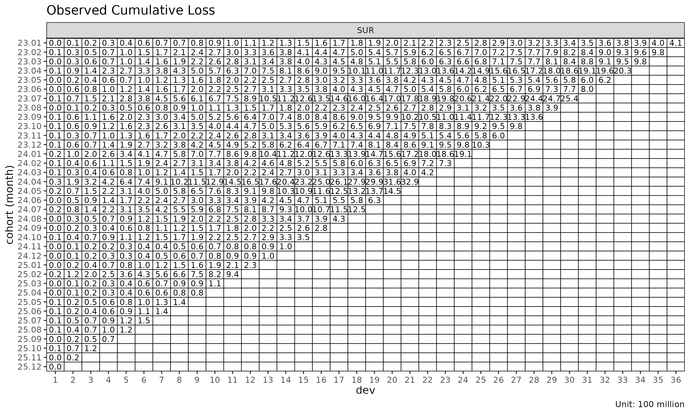
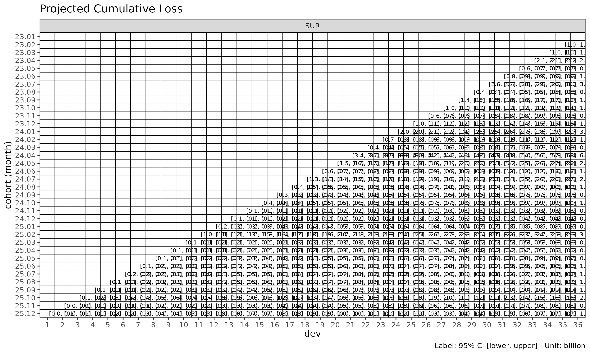

# (Reference) Chain ladder reserving

> **Reference: P&C reserving context.** This article covers chain ladder
> *reserving* — projecting ultimate paid / incurred loss for an open
> accident year — which is a Property & Casualty (P&C, 손해보험) use
> case. The lossratio package’s primary focus is long-term health
> insurance loss ratio projection (`fit_lr`), where the reserving
> framing applies only loosely. We include this article so practitioners
> coming from a P&C background see how `fit_cl` maps to the classical
> Mack chain ladder workflow they’re already familiar with.

[`fit_cl()`](https://seokhoonj.github.io/lossratio/reference/fit_cl.md)
is the dedicated chain ladder fit for a single value column. Unlike
[`fit_lr()`](https://seokhoonj.github.io/lossratio/reference/fit_lr.md)
(which projects loss / exposure jointly to get loss ratio),
[`fit_cl()`](https://seokhoonj.github.io/lossratio/reference/fit_cl.md)
projects one cumulative metric forward and computes Mack-style standard
errors per cohort.

## Basic usage

For brevity this vignette uses the `SUR` group only — every step
generalises to multi-group input.

``` r

library(lossratio)
data(experience)
tri <- build_triangle(experience[coverage == "SUR"], group_var = coverage)

cl <- fit_cl(tri, loss_var = "loss", method = "mack")
print(cl)
#> <CLFit>
#> method      : mack 
#> loss_var   : loss 
#> weight_var  : none 
#> alpha       : 1 
#> sigma_method: min_last2 
#> recent      : all 
#> use_maturity: FALSE 
#> tail_factor : 1 
#> groups      : coverage 
#> periods     : 36
```

`loss_var` selects the cumulative column to project — typically `"loss"`
(cumulative loss) for reserving, or `"premium"` (cumulative risk
premium) for exposure projection.

## Method: basic vs Mack

Two estimation methods are available:

| `method`  | What it computes                                    |
|-----------|-----------------------------------------------------|
| `"basic"` | Point projection only (selected age-to-age factors) |
| `"mack"`  | Point projection + factor / process / parameter SE  |

``` r

cl_basic <- fit_cl(tri, loss_var = "loss", method = "basic")
cl_mack  <- fit_cl(tri, loss_var = "loss", method = "mack")

names(cl_basic)
#>  [1] "call"          "data"          "method"        "group_var"    
#>  [5] "cohort_var"    "dev_var"       "loss_var"      "full"         
#>  [9] "pred"          "link"          "summary"       "factor"       
#> [13] "selected"      "maturity"      "alpha"         "sigma_method" 
#> [17] "weight_var"    "recent"        "use_maturity"  "maturity_args"
#> [21] "tail"          "tail_factor"

# Mack adds variance estimates to $full and $summary
head(cl_mack$summary)
#>    coverage     cohort     latest   loss_ult   reserve  proc_se param_se
#>      <char>     <Date>      <num>      <num>     <num>    <num>    <num>
#> 1:      SUR 2024-01-01  410248523  410248523         0        0        0
#> 2:      SUR 2024-02-01  976330446 1001441304  25110859  2531458  3955123
#> 3:      SUR 2024-03-01  978486044 1026151241  47665197  3814581  4714708
#> 4:      SUR 2024-04-01 2029909922 2186771224 156861302  6757376 10681348
#> 5:      SUR 2024-05-01  624219442  697669308  73449866  4363670  3505408
#> 6:      SUR 2024-06-01  802880717  931393933 128513217 17839243  8552360
#>          se          cv
#>       <num>       <num>
#> 1:        0 0.000000000
#> 2:  4695878 0.004689120
#> 3:  6064610 0.005910055
#> 4: 12639356 0.005779917
#> 5:  5597276 0.008022821
#> 6: 19783363 0.021240596
```

`method = "mack"` enables the projection plot’s confidence bands
(`show_interval = TRUE`):

``` r

plot(cl_mack, type = "projection", show_interval = TRUE)
```


## Tail factor

For triangles where the latest observed development period is still
developing, an extrapolated tail factor estimates ultimate:

``` r

# Log-linear extrapolation from the selected ATA factors
cl_tail <- fit_cl(tri, loss_var = "loss", method = "mack", tail = TRUE)

# Or supply a literal tail factor
cl_tail <- fit_cl(tri, loss_var = "loss", method = "mack", tail = 1.025)
```

The extrapolation fits $`\log(f_k - 1) \sim k`$ to projected factors and
extends the projection by the cumulative product of extrapolated $`f_k`$
values. Disabled by default (`tail = FALSE`).

## Maturity filtering

If selected ATA factors are volatile, restrict projection to the mature
region only:

``` r

cl_mat <- fit_cl(
  tri,
  loss_var     = "loss",
  method        = "mack",
  maturity_args = list(max_cv = 0.10, max_rse = 0.05)
)

cl_mat$maturity
#> Key: <coverage>
#>    coverage ata_from ata_to ata_link     mean  median       wt         cv
#>      <char>    <int>  <int>   <char>    <num>   <num>    <num>      <num>
#> 1:      SUR        4      5      4-5 1.324091 1.33133 1.338896 0.06783671
#>           f       f_se        rse    sigma n_obs n_valid n_inf n_nan
#>       <num>      <num>      <num>    <num> <int>   <int> <int> <int>
#> 1: 1.338896 0.01808821 0.01350979 1105.053    32      32     0     0
#>    valid_ratio
#>          <num>
#> 1:           1
```

`maturity_args` is forwarded to
[`detect_maturity()`](https://seokhoonj.github.io/lossratio/reference/detect_maturity.md).

## Variance components (Mack)

`fit_cl(method = "mack")` decomposes the projection variance into:

- `proc_se` — process variance, from $`\sigma^2_k`$ (residual link
  variance per development period).
- `param_se` — parameter variance, from the uncertainty of the selected
  age-to-age factors $`\hat{f}_k`$.
- `se` — total standard error,
  $`\sqrt{\mathrm{proc\_se}^2 + \mathrm{param\_se}^2}`$.
- `cv` — coefficient of variation, `se / value_proj`.

``` r

summary(cl_mack)
#>     coverage     cohort     latest   loss_ult    reserve   proc_se param_se
#>       <char>     <Date>      <num>      <num>      <num>     <num>    <num>
#>  1:      SUR 2024-01-01  410248523  410248523          0         0        0
#>  2:      SUR 2024-02-01  976330446 1001441304   25110859   2531458  3955123
#>  3:      SUR 2024-03-01  978486044 1026151241   47665197   3814581  4714708
#>  4:      SUR 2024-04-01 2029909922 2186771224  156861302   6757376 10681348
#>  5:      SUR 2024-05-01  624219442  697669308   73449866   4363670  3505408
#>  6:      SUR 2024-06-01  802880717  931393933  128513217  17839243  8552360
#>  7:      SUR 2024-07-01 2539141550 3050990158  511848609  35868594 30065540
#>  8:      SUR 2024-08-01  393678329  488218204   94539875  15565580  5005702
#>  9:      SUR 2024-09-01 1364052543 1751869309  387816766  37974812 20617469
#> 10:      SUR 2024-10-01  979266044 1311793844  332527800  38476284 16848121
#> 11:      SUR 2024-11-01  604685680  848103124  243417444  35705775 11815794
#> 12:      SUR 2024-12-01 1026345365 1497869026  471523662  51388393 21863585
#> 13:      SUR 2025-01-01 1912177598 2901492850  989315252  75652022 43699697
#> 14:      SUR 2025-02-01  733902485 1160045952  426143467  51706358 18164458
#> 15:      SUR 2025-03-01  415459872  686574146  271114274  41303604 10953686
#> 16:      SUR 2025-04-01 3286053525 5687484009 2401430484 122743326 92193953
#> 17:      SUR 2025-05-01 1451731151 2645801834 1194070683  93007572 44820097
#> 18:      SUR 2025-06-01  629668308 1209024555  579356246  65335432 20807951
#> 19:      SUR 2025-07-01 1250954692 2542927187 1291972495 103122195 45366891
#> 20:      SUR 2025-08-01  425346694  918120581  492773887  65309695 16748105
#> 21:      SUR 2025-09-01  278156543  635470027  357313485  56730542 11811345
#> 22:      SUR 2025-10-01  352070325  856446527  504376201  68083946 16155428
#> 23:      SUR 2025-11-01   99050502  260916098  161865596  41783536  5172148
#> 24:      SUR 2025-12-01  103194015  295637302  192443287  49613732  6201747
#> 25:      SUR 2026-01-01  227089023  710560088  483471065  83630550 15622535
#> 26:      SUR 2026-02-01  939163073 3276849148 2337686075 192408733 75019695
#> 27:      SUR 2026-03-01  112828843  434950050  322121207  72341864 10134999
#> 28:      SUR 2026-04-01   82472453  356301149  273828696  68971255  8554342
#> 29:      SUR 2026-05-01  141214851  697290588  556075737 119235587 19138513
#> 30:      SUR 2026-06-01  136406104  789468809  653062706 136625294 22795772
#> 31:      SUR 2026-07-01  149144024 1040451732  891307708 167035988 31397120
#> 32:      SUR 2026-08-01  116327076 1008356737  892029661 183650168 32943523
#> 33:      SUR 2026-09-01   67465470  783000254  715534784 179944507 27681868
#> 34:      SUR 2026-10-01  121626172 2001214853 1879588681 337099735 80042629
#> 35:      SUR 2026-11-01   15716444  449653411  433936967 194099313 21020897
#> 36:      SUR 2026-12-01    4825085  850839165  846014080 472740731 66059976
#>     coverage     cohort     latest   loss_ult    reserve   proc_se param_se
#>       <char>     <Date>      <num>      <num>      <num>     <num>    <num>
#>            se          cv
#>         <num>       <num>
#>  1:         0 0.000000000
#>  2:   4695878 0.004689120
#>  3:   6064610 0.005910055
#>  4:  12639356 0.005779917
#>  5:   5597276 0.008022821
#>  6:  19783363 0.021240596
#>  7:  46802699 0.015340167
#>  8:  16350668 0.033490492
#>  9:  43210721 0.024665493
#> 10:  42003377 0.032019800
#> 11:  37610044 0.044346074
#> 12:  55846068 0.037283679
#> 13:  87366423 0.030110852
#> 14:  54804152 0.047243087
#> 15:  42731382 0.062238553
#> 16: 153511071 0.026991033
#> 17: 103243641 0.039021683
#> 18:  68568866 0.056714205
#> 19: 112660294 0.044303390
#> 20:  67422958 0.073435843
#> 21:  57947064 0.091187722
#> 22:  69974434 0.081703215
#> 23:  42102435 0.161363884
#> 24:  49999841 0.169125616
#> 25:  85077215 0.119732612
#> 26: 206516525 0.063022897
#> 27:  73048364 0.167946558
#> 28:  69499718 0.195058921
#> 29: 120761781 0.173187167
#> 30: 138513964 0.175452104
#> 31: 169961173 0.163353252
#> 32: 186581510 0.185035220
#> 33: 182061285 0.232517530
#> 34: 346472299 0.173130985
#> 35: 195234274 0.434188352
#> 36: 477333970 0.561015512
#>            se          cv
#>         <num>       <num>
```

## Reserve plot

`type = "reserve"` shows reserve per cohort with optional error bars
(Mack only):

``` r

plot(cl_mack, type = "reserve", conf_level = 0.95)
```


## Triangle visualisation

[`plot_triangle()`](https://seokhoonj.github.io/lossratio/reference/plot_triangle.md)
displays the cohort × dev cells as a heatmap, distinguishing observed
cells from projected:

``` r

plot_triangle(cl_mack, what = "full")    # observed + projected
```


``` r

plot_triangle(cl_mack, what = "pred")    # projected only
```


``` r

plot_triangle(cl_mack, what = "data")    # observed only
```



The `label_style = "cv"` mode shows coefficient of variation per cell,
useful for spotting unreliable cells:

``` r

plot_triangle(cl_mack, label_style = "cv")
```


``` r

plot_triangle(cl_mack, label_style = "se")
```


``` r

plot_triangle(cl_mack, label_style = "ci")
```



## Sigma extrapolation methods

Mack variance requires $`\sigma_k`$ at all development links, including
the last where it cannot be estimated directly. `sigma_method` controls
the extrapolation:

| `sigma_method` | Behaviour |
|----|----|
| `"min_last2"` | (default) min of the last two estimable $`\sigma`$ values — conservative |
| `"locf"` | Last observation carried forward |
| `"loglinear"` | Log-linear extrapolation from the observed $`\sigma_k`$ sequence |

``` r

fit_cl(tri, loss_var = "loss", method = "mack", sigma_method = "loglinear")
#> <CLFit>
#> method      : mack 
#> loss_var   : loss 
#> weight_var  : none 
#> alpha       : 1 
#> sigma_method: loglinear 
#> recent      : all 
#> use_maturity: FALSE 
#> tail_factor : 1 
#> groups      : coverage 
#> periods     : 36
```

## See also

- [`vignette("projection")`](https://seokhoonj.github.io/lossratio/articles/projection.md)
  — when to use
  [`fit_lr()`](https://seokhoonj.github.io/lossratio/reference/fit_lr.md)
  instead.
- [`vignette("triangle-link-and-maturity")`](https://seokhoonj.github.io/lossratio/articles/triangle-link-and-maturity.md)
  — [`summary()`](https://rdrr.io/r/base/summary.html),
  [`detect_maturity()`](https://seokhoonj.github.io/lossratio/reference/detect_maturity.md),
  ata diagnostic plots.
- [`?fit_cl`](https://seokhoonj.github.io/lossratio/reference/fit_cl.md),
  [`?detect_maturity`](https://seokhoonj.github.io/lossratio/reference/detect_maturity.md),
  [`?fit_ata`](https://seokhoonj.github.io/lossratio/reference/fit_ata.md).
