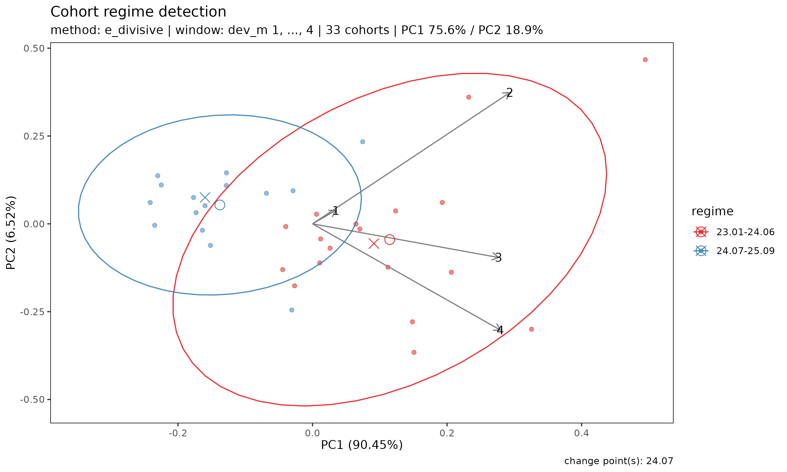

# 진단: 성숙점·수렴점·regime

## 1. 개요

적합 결과에서 예측 손해율을 읽기 전에, 그 입력 triangle 에 대해 던져야
할 질문이 세 가지 있다. lossratio 는 각각 자기 축 위에서 답하는 세 진단
도구를 제공한다.

| 도구 | 질문 | 결과 | 축 |
|----|----|----|----|
| [`detect_maturity()`](https://seokhoonj.github.io/lossratio-r/reference/detect_maturity.md) ($`k^*`$) | link factor 가 재현 가능해지는 시점? | dev 값 | 경과 기간 |
| [`detect_convergence()`](https://seokhoonj.github.io/lossratio-r/reference/detect_convergence.md) ($`k^{**}`$) | LR 추정이 갱신을 멈추는 시점? | dev 값 | 경과 기간 |
| [`detect_regime()`](https://seokhoonj.github.io/lossratio-r/reference/detect_regime.md) | 인수 코호트들이 동질적인가? | 코호트 그룹 | 인수 시기 |

P&C run-off 에서는 이 세 속성이 한 점에 모이는 경향이 있지만, 장기
건강보험에서는 각각 독립적으로 검증해야 한다. 이 문서는 의존 순서대로 —
성숙점, 그 위에 세워지는 수렴점, 그리고 regime — 를 다루고, 마지막으로
탐지된 regime 을 `fit_*` 의 데이터 필터로 되먹이는 방법까지 설명한다.

모든 예시는 번들 `experience` 데이터셋의 `surgery` 보장을 사용한다. 이
보장에는 합성 2024-04 regime change 가 심어져 있어 검출기가 잡아낼
명확한 신호가 존재한다.

``` r

library(lossratio)
data(experience)
tri_sur <- as_triangle(
  experience[coverage == "surgery"],
  groups   = "coverage",
  cohort   = "uy_m",
  calendar = "cy_m",
  loss     = "incr_loss",
  premium  = "incr_premium"
)
```

## 2. 성숙점 탐지

성숙점(maturity point) 은 **ATA 인자**(age-to-age factor) 가 chain
ladder 추정에 신뢰할 만큼 안정화되는 경과 기간 링크이다.
`fit_ratio(method = "sa")` 가 노출 기반(exposure-driven, ED) 영역에서
chain ladder(CL) 영역으로 전환할 때 내부적으로 사용한다.

[`detect_maturity()`](https://seokhoonj.github.io/lossratio-r/reference/detect_maturity.md)
는 `Triangle` 을 직접 입력으로 받는다 — 내부에서 단일 변수 `Link` 와 그
WLS 요약을 자동으로 빌드한다.

``` r

mat <- detect_maturity(
  tri_sur,
  loss            = "loss",
  max_cv          = 0.15,    # CV 가 이 값보다 작아야 함
  max_rse         = 0.05,    # RSE 가 이 값보다 작아야 함
  min_valid_ratio = 0.5,     # 해당 링크에서 유한 코호트가 50% 이상
  min_n_valid     = 3L,      # 유한 코호트가 최소 3개
  min_run         = 1L       # 연속 성숙 링크 최소 1개
)

print(mat)
#> Key: <coverage>
#>    coverage ata_from change ata_link     mean   median       wt        cv
#>      <char>    <num>  <num>   <char>    <num>    <num>    <num>     <num>
#> 1:  surgery        3      4      3-4 1.434507 1.400098 1.417706 0.1053282
#>           f       f_se        rse    sigma n_cohorts n_valid n_inf n_nan
#>       <num>      <num>      <num>    <num>     <num>   <num> <num> <num>
#> 1: 1.417706 0.02651852 0.01870522 1372.883        33      33     0     0
#>    valid_ratio
#>          <num>
#> 1:           1
```

그룹별로 모든 임계값을 만족하는 첫 경과 기간 링크 한 행이 출력되며, 해당
링크의 전체 통계가 같이 실린다. 임계값 인자들은 반환된 `Maturity` 객체의
attribute 로도 저장된다.

### 2.1 임계값의 의미

- `max_cv` — 해당 링크에서 관측된 ATA 인자의 변동계수(CV). `alpha` 와
  무관하게 상대 산포를 제한한다.
- `max_rse` — WLS 추정 인자 `f` 의 상대 표준오차. 잔차 산포가 아니라
  파라미터 불확실성을 포착한다.
- `min_valid_ratio` — 해당 링크에서 유한 ATA 를 갖는 코호트의 최소 비율.
  대부분이 0 / NA / Inf 인 링크를 막는다.
- `min_n_valid` — 해당 링크에서 유한 코호트의 최소 개수. 데이터가 얇은
  꼬리 영역의 절대 하한.
- `min_run` — *연속* 성숙 링크의 최소 개수. `min_run = 1L` (default)
  이면 조건을 만족하는 첫 링크가 채택되고, `2L` 이상으로 두면 지속적인
  안정성을 요구한다.

포트폴리오의 변동성 프로파일에 맞춰 조정한다. 임계값을 빡빡하게 (예:
`max_cv = 0.05`) 잡으면 성숙점이 뒤로 밀리고, 느슨하게 잡으면 앞으로
당겨진다. 링크 진단 플롯으로 보면 결과를 한눈에 읽기 쉽다 — CV 별 facet
으로 나뉘고, 수직선이 CV 가 `max_cv` 아래로 처음 떨어지는 성숙점을
표시한다.

``` r

plot(as_link(tri_sur, loss = "loss"), type = "cv")
```


### 2.2 적합 함수에서의 사용

[`detect_maturity()`](https://seokhoonj.github.io/lossratio-r/reference/detect_maturity.md)
는
[`fit_ata()`](https://seokhoonj.github.io/lossratio-r/reference/fit_ata.md),
[`fit_cl()`](https://seokhoonj.github.io/lossratio-r/reference/fit_cl.md),
`fit_ratio(method = "sa")` 내부에서도 `maturity` 인자를 통해 호출된다.
`maturity` 인자는 네 가지 형태를 받는다.

- `NULL` — 탐지 안 함 (워커 단독 호출의 default).
- 이미 산출된 `Maturity` 객체 —
  [`detect_maturity()`](https://seokhoonj.github.io/lossratio-r/reference/detect_maturity.md)
  결과, 또는 수동 override 용
  [`maturity_at()`](https://seokhoonj.github.io/lossratio-r/reference/maturity_at.md).
- `"auto"` — default 임계값으로 내부 탐지 (`fit_ratio(method = "sa")` 와
  [`fit_loss()`](https://seokhoonj.github.io/lossratio-r/reference/fit_loss.md)
  의 default).
- triangle 한 개를 인자로 받아 `Maturity` 를 반환하는 함수 — 보통 사용자
  임계값을 넘기는
  [`maturity_spec()`](https://seokhoonj.github.io/lossratio-r/reference/maturity_spec.md).

``` r

fit_ata(tri_sur, loss = "loss",
        maturity = maturity_spec(max_cv = 0.08, min_run = 2L))

fit_ratio(tri_sur, method = "sa",
          maturity = maturity_spec(max_cv = 0.08))
```

`fit_ratio(method = "sa")` 에서는 탐지된 성숙점이 ED (초기 dev) 에서 CL
(이후 dev) 로 전환되는 dev 를 결정한다.

## 3. 수렴점 탐지

성숙점은 *“어느 경과 기간부터 link factor $`f_k`$ 가 코호트 간에 재현
가능해지는가?”* 에 답한다. chain ladder 예측에는 필요하지만,
포트폴리오의 예측 손해율이 수렴했다고 선언하기에는 충분하지 않다 — 장기
건강보험에서 $`f_k \to 1`$ 과 $`g_k \to 0`$ 은 누적 분모가 자라면서
자동으로 발생하는 관성(inertia) 효과이지, 기저 경험이 실제로 수렴했다는
신호가 아니다. 그 위에 세운 단일 기준은 $`k`$ 가 커지기만 하면 자동으로
통과한다.

[`detect_convergence()`](https://seokhoonj.github.io/lossratio-r/reference/detect_convergence.md)
는 수렴점(convergence point) $`k^{**}`$ — 예측 포트폴리오 손해율이
안정하다고 *관찰되는* 첫 dev $`k \ge k^*`$ 를 검출한다. 어떤 의미의
“안정” 인지는 사용자가 `method =` 인자로 고른다. $`k^*`$ 와 자연스러운
짝이다.

- $`k^*`$
  ([`detect_maturity()`](https://seokhoonj.github.io/lossratio-r/reference/detect_maturity.md)
  산출): link factor $`f_k`$ 가 코호트 간에 재현 가능해지는 시점.
- $`k^{**}`$: 모형 출력 (예측 손해율) 이 새 데이터에도 거의 움직이지
  않는 시점.

장기 건강보험 portfolio 는 $`k^*`$ 를 일찍 지나도 $`k^{**}`$ 에 한참 못
미칠 수 있다.

### 3.1 네 가지 안정성 기준

수렴은 finite data 로 *asymptotic 으로* 측정 불가능하다 — 관측 가능한
최대 dev `dev_max` ($`K_{\max}`$) 까지에 한해 *관찰* 만 가능하다.
검출기는 후보 시점 시퀀스 `dev_cand` $`\in [k^*, K_{\max}-2]`$ 위에서
rolling
[`backtest()`](https://seokhoonj.github.io/lossratio-r/reference/backtest.md)
를 돌려 각 시점의 예측 손해율 경로 `ratio` 을 만들고, 그 경로 위에서 네
가지 안정성 지표를 평가한다. `method =` 가 어떤 지표가 `conv_k` 를
결정할지 선택한다. 네 지표 모두 항상 결과 객체에 반환되므로 사용자는
다른 기준도 동시에 확인 가능하다.

| Method | 지표 | 잡는 것 | 놓치는 것 |
|----|----|----|----|
| `"window"` | 다음 `window` 시점 동안 `ratio` 의 범위 (max - min) | 국소 안정 (zig-zag 없음) | window 당 `max_drift` 이하로 떨어지는 *느린 단조 drift* |
| `"tail"` (default) | `[k, K_{\max}]` 동안 `ratio` 의 범위 | 전역 안정. 단조 drift 잡음 | tail 길이 $`\ge 2`$ 필요. 가장 빠른 통과 시점이 `"window"` 보다 늦음 |
| `"slope"` | $`\|\hat\beta_k\|`$, `ratio ~ k` 의 `[k, K_{\max}]` 위 OLS 회귀 기울기 | 체계적 trend (방향성 있음) | 평균이 0 인 oscillation 통과시킴 |
| `"all"` | `"window"` + `"tail"` + `"slope"` 모두 통과 | 위 셋 다 잡음 | (가장 strict) |

모든 method 에서 추가로 코호트 간 분산 조건
`dispersion[i] < max_dispersion` 도 함께 요구한다 — dev $`k`$ 에서의
*증분* 손해율이 코호트 간에 일치해야 한다 (강건 $`\hat{D}_v`$ metric).
`dispersion` 안의 상수 $`1.4826 \approx 1 / \Phi^{-1}(0.75)`$ 은 표준
MAD$`\to\sigma`$ 보정이므로, $`\hat{D}_k`$ 는 증분 LR 의 강건 (이상치에
둔감한) 변동계수 로 읽힌다.

**왜 SE 정규화 기준을 안 쓰는가?**: 이전 버전은 원 논문 (Section 11) 의
$`R_k < c \cdot \hat{SE}^{\mathrm{param}}_k`$ 를 구현했다 (paper 는
$`v`$ 표기, 같은 축). 대규모 portfolio 에서 이 형태는 구조적으로
작동하지 않는다. $`\hat{SE}^{\mathrm{param}}`$ 은 $`1/\sqrt{n}`$ 으로
줄어드는 반면 $`R_k`$ 는 numerical noise floor (~$`10^{-3}`$ LR 단위) 가
있어, 비율 $`R_k / \hat{SE}^{\mathrm{param}}`$ 가 발산하고 기준이 절대
발동하지 않는다 — 육안으로 안정한 합성 데이터에서도. drift 기반 method
들은 SE 정규화를 데이터 사이즈 독립적인 절대 threshold 로 대체한다.

### 3.2 기호

표준 chain ladder 컨벤션: $`i`$ = 코호트 (origin period), $`k`$ = 경과
기간.
[`detect_maturity()`](https://seokhoonj.github.io/lossratio-r/reference/detect_maturity.md)
가 $`k^*`$,
[`detect_convergence()`](https://seokhoonj.github.io/lossratio-r/reference/detect_convergence.md)
가 $`k^{**}`$ 를 반환한다 — 둘 다 같은 $`k`$ 축 위에 있다.

| Code | Math | 의미 |
|----|----|----|
| `dev_max` | $`K_{\max}`$ | 관측 가능한 최대 dev (스칼라) |
| `dev_cand` | $`k \in [k^*, K_{\max}-2]`$ | 후보 dev 정수 벡터 |
| `ratio[i]` | $`LR_k`$ | dev = `dev_cand[i]` 에서의 portfolio LR 예측 |
| `revision[i]` | $`R_k = \|LR_k - LR_{k-1}\|`$ | 인접 step 갱신 (진단용) |
| `drift_window[i]` | $`[k, k+W-1]`$ 위 $`\max - \min`$ | 국소 윈도우 범위 |
| `drift_tail[i]` | $`[k, K_{\max}]`$ 위 $`\max - \min`$ | tail 범위 (전역 안정) |
| `slope[i]` | $`\hat\beta_k`$ | $`[k, K_{\max}]`$ 위 OLS 기울기 |
| `dispersion[i]` | $`\hat{D}_k`$ | 코호트 간 증분 LR 의 강건 분산 |
| `mat_k` | $`k^*`$ | 성숙점 (후보 하한) |
| `conv_k` | $`k^{**}`$ | 검출된 수렴점 |

### 3.3 기본 사용

``` r

res <- detect_convergence(tri_sur)
print(res)
```

모의 출력 (이 데이터에서는 수렴 미검출):

    #> <Convergence>
    #>   method     : tail
    #>   conv_k     : NA
    #>   mat_k      : 4
    #>   dev_max    : 30
    #>   candidates : 25
    #>   passes :
    #>     window :  0/25 (drift_window < 0.01  & dispersion < 0.15)
    #>     tail   :  0/25 (drift_tail   < 0.01  & dispersion < 0.15)  <- method
    #>     slope  :  0/25 (|slope|      < 0.001 & dispersion < 0.15)
    #>     all    :  0/25 (window AND tail AND slope)

`summary(res)` 는 후보 시점별 한 행 + 모든 metric / per-method pass flag
컬럼이 있는 `data.table` 을 반환한다.

``` r

head(summary(res), 6)
```

    #>      dev ratio   revision  drift_window  drift_tail   slope  dispersion
    #>    <int> <num>      <num>         <num>       <num>   <num>       <num>
    #> 1:     4 0.62          NA          0.07        0.07   0.001        0.47
    #> 2:     5 0.63        0.01          0.06        0.06   0.001        0.47
    #> ...
    #>    pass_window  pass_tail  pass_slope  pass
    #>          <lgl>      <lgl>       <lgl> <lgl>
    #> 1:       FALSE      FALSE       FALSE FALSE
    #> 2:       FALSE      FALSE       FALSE FALSE

`Convergence` 객체에는 추가로 threshold 파라미터 (`max_drift`,
`max_slope`, `max_dispersion`, `window`, `holdout_max`, `min_n_cohorts`)
와 메타데이터 속성 (`groups`, `target`, `dispatcher`) 이 포함된다.

### 3.4 작동 메커니즘: 다중 holdout refit

`dev_cand[i]` 마다 `holdout = dev_max - dev_cand[i]` 로
[`backtest()`](https://seokhoonj.github.io/lossratio-r/reference/backtest.md)
를 돌려 portfolio LR 을 추출한다. 같은 holdout 깊이는 캐싱되므로 인접
후보 간 재계산이 없다.

예시: `dev_max = 30`, `mat_k = 4`, `holdout_max = 13` 일 때 — 후보는
$`k \in \{4, 5, \dots, 28\}`$ (총 25개) 지만
`holdout = dev_max - k <= holdout_max` 인 $`k`$ 만 finite `ratio[i]`
값을 받고, 나머지는 `NA` 로 마스킹된다. `holdout_max` 기본값은
`max(window, floor((dev_max - mat_k) / 2))`. 키우면 더 이른 시점까지
진단 가능하지만 refit 자료가 줄어들어 신뢰도가 떨어진다.

### 3.5 시각화

``` r

plot(res)
```

dev 축을 공유하는 5개 패널:

1.  **`ratio`** — metric 들이 계산되는 LR 궤적.
2.  **`drift_window`** — 국소 윈도우 metric, 가로 점선 `max_drift`.
3.  **`drift_tail`** — tail metric, 동일 점선.
4.  **`|slope|`** — 가로 점선 `max_slope`.
5.  **`dispersion`** — 가로 점선 `max_dispersion`.

세로 점선 `mat_k`, 세로 실선 `conv_k` (검출됐을 때만). 각 metric
패널에서 빨간 점선 아래의 점이 그 절을 통과한 valuation. 부제목에 활성
`method` 표기. *어느 절이 binding 인지* 한눈에 보인다 — threshold 위에
머무는 패널이 그 method 의 수렴을 막는 절이다.

### 3.6 임계값 튜닝

| 인자 | default | 의미 |
|----|----|----|
| `method` | `"tail"` | `conv_k` 를 정의할 안정성 metric. |
| `max_drift` | `0.01` | `drift_window` / `drift_tail` 상한, LR 단위. 노이지하거나 long-tail 인 책은 `0.02`–`0.05` 정도로 키우는 것이 자연. |
| `max_slope` | `1e-3` | $`\|\hat\beta_k\|`$ 상한 (dev 당 LR 변화). |
| `max_dispersion` | `0.15` | 코호트 간 분산 상한. |
| `window` | `5L` | drift window 길이 $`W`$ — `"window"` method 가 스캔하는 연속 valuation 개수. `"tail"` / `"slope"` 에는 영향 없음. |
| `min_n_cohorts` | `5L` | 코호트 수가 이 값 미만이면 `dispersion` 은 `NA`. |

`max_drift` 를 sweep 해서 민감도 확인:

``` r

sapply(
  c(0.005, 0.01, 0.02, 0.05),
  function(d) detect_convergence(tri_sur, method = "tail", max_drift = d)$conv_k
)
```

`max_dispersion` 이 $`\approx 0.05`$ 이하로 떨어지는 경우는 단일 기간
claim 노이즈 때문에 실 portfolio 에서 보기 어렵고, $`0.20`$ 이상이면
코호트 간 진성 이질성을 의심해야 한다 — 이 경우 모형 적합 전에
[`detect_regime()`](https://seokhoonj.github.io/lossratio-r/reference/detect_regime.md)
으로 그룹을 분리하는 것이 권장된다.

### 3.7 Reserving 주의사항

**검출된 `conv_k` 는 `dev_max` 까지에서 *관찰된* 안정성이지, asymptotic
보장이 아니다.** `dev_max` 이후의 development 는 알 수 없다. `conv_k` 는
*“여기서부터는 우리가 관찰한 한 안정이다”* 라는 진단으로 사용하고,
*“이후에도 예측이 흔들리지 않을 것이다”* 라고 해석하지 말 것.

Reserving 응용 시:

- `method = "tail"` (default) 또는 `"all"` 권장. `"window"` 는 느린 단조
  drift 가 window 당 `max_drift` 이하로 내려가면 너무 일찍 수렴 선언 —
  정확히 reserve 에 해로운 silent-revision 패턴이다.
- evidence span `dev_max - conv_k` 도 같이 확인. `conv_k` 가 `dev_max`
  근처 (span $`< 5`$) 면 tail point 가 매우 적어 결정된 거라 실제로는
  약한 증거이며, 한 diagonal 만 추가돼도 unconverge 가능하다.
- 예측 손해율의 점추정과 표준오차는 `fit_ratio()$summary` 에서 직접
  읽는다.
  [`detect_convergence()`](https://seokhoonj.github.io/lossratio-r/reference/detect_convergence.md)
  는 진단 도구이지 추정기 자체가 아니다. reserve 의 점추정과 불확실성은
  fit 객체에서 나온다.

### 3.8 한계

[`detect_convergence()`](https://seokhoonj.github.io/lossratio-r/reference/detect_convergence.md)
는 반복적인
[`backtest()`](https://seokhoonj.github.io/lossratio-r/reference/backtest.md)
호출 위의 얇은 layer 이며 그 제약을 그대로 상속한다.

- **식별 가능성**: `conv_k` 는 `dev_max - mat_k >= window` (또는 tail /
  slope 의 경우 2) 일 때만 선언 가능하다. 관측 기간이 짧으면 모든 method
  가 `NA` 를 반환한다.
- **모형 조건부**: 예측 LR 은
  [`fit_ratio()`](https://seokhoonj.github.io/lossratio-r/reference/fit_ratio.md)
  로 산출된다.
  [`fit_ratio()`](https://seokhoonj.github.io/lossratio-r/reference/fit_ratio.md)
  이 내부적으로
  [`fit_loss()`](https://seokhoonj.github.io/lossratio-r/reference/fit_loss.md)
  (default `method = "ed"`) 와
  [`fit_premium()`](https://seokhoonj.github.io/lossratio-r/reference/fit_premium.md)
  을 합성하므로, 그 안의 선택 (loss method, regime 필터, maturity 인자)
  이 `conv_k` 로 흘러간다. `...` 으로 `loss_method =`, `loss_regime =`
  등 override 가능.
- **포트폴리오 집계**: portfolio LR 은 그룹별 ultimate 의 보험료 가중
  (`sum(loss_ult) / sum(premium_ult)`) 이다. 달력 연도 충격 (요율 개정,
  의료비 인플레) 은 모든 그룹을 동시에 움직일 수 있고, drift metric 들은
  이를 진짜 수렴과 구별하지 못한다.
- **다중 그룹 triangle**: 현재 구현은 `dispersion` 을 그룹 간 median
  으로 collapse 한다. 그룹이 다르게 움직이면 분리 실행을 권장한다.

## 4. regime 탐지

위 두 진단은 경과 기간 축 위에 있으며 코호트가 동질적이라고 가정한다.
포트폴리오에 요율 개정, 보장 구조 변경, 인수 가이드라인 개정 같은 사건이
발생하면 그 가정이 깨진다 — 특정 시점 이후의 인수 코호트가 이전 코호트와
다른 양상을 보인다. 이때 두 질문이 따라온다.

1.  최근 인수 코호트가 이전 코호트와 다른 양상을 보이는가?
2.  그렇다면 변화는 *언제* 일어났는가?

장기 보험에서 코호트 패턴이 깨지는 트리거는 보통 다음 4가지다.

1.  **급격한 보험료 조정** — 인상 또는 인하.
2.  **상품 보장 내용 변경** — 보장 항목·기간·면책 등의 구조 조정.
3.  **가입금액 한도 변경** — 1인당 최대 가입금액 상·하한 조정.
4.  **Underwriting 가이드라인 변경** — 인수 자격·고지 항목·할증 기준의
    개정.

`plot(tri_sur)` 의 시각적 점검만으로도 최근 코호트의 초기 손해율이
과거보다 낮아 보일 수 있지만, 코호트별로 관측 창의 길이가 다른 상황에서
궤적 다발을 눈대중으로 살피는 것은 구조적 변화의 위치를 짚어내는 신뢰할
만한 방법이 못 된다.

[`detect_regime()`](https://seokhoonj.github.io/lossratio-r/reference/detect_regime.md)
은 이 두 질문에 한 번의 호출로 답한다 — 인수 코호트를 **regime** (유사한
손해 추이를 공유하는 인수 코호트들의 묶음) 으로 그룹화하고, 그룹 사이의
변화 시점을 함께 보고한다. 각 인수 코호트를 특징 벡터 (경과 기간
`1, ..., K` 에 걸친 궤적) 로 다루고, 인수 시점 순으로 코호트를 정렬한
뒤, 그 다변량 시퀀스에 변화점 또는 클러스터링 방법을 적용한다.

``` r

r <- detect_regime(tri_sur, method = "e_divisive")
r
#> <Regime>
#>   method    : e_divisive
#>   loss      : ratio
#>   treatment : segment_bridged
#>   window (window) : dev_m 1-4
#>   cohorts    : 33 analysed (3 dropped)
#>   regimes    : 2
#>   changes    : 24.07
#>   PC1 / PC2  : 75.6% / 18.9%
```

`window` 인자는 코호트 특징 벡터를 정의하는 경과 기간 수를 조절한다.
최소 `window` 기간 이상 관측된 코호트만 분석되며, 창이 짧은 코호트는
제외된다. `window` 를 늘리면 궤적을 더 많이 담을 수 있지만 최근 코호트가
그만큼 더 빠진다. 기본값 `window = "auto"` 는 성숙 기반 sweep 으로
충분한 코호트를 유지하는 최대 window 를 자동 선택한다.

### 4.1 요약과 regime 별 멤버십

``` r

summary(r)
#> Cohort regime detection summary
#>   method    : e_divisive
#>   loss      : ratio
#>   treatment : segment_bridged
#>   window    : dev_m 1-4
#>   cohorts   : 33 analysed (3 dropped)
#> 
#> Regimes (2):
#>   1: 23.01-24.06 (18 cohorts)
#>   2: 24.07-25.09 (15 cohorts)
#> 
#> Changes: 24.07

r$labels
#>     coverage     cohort      regime regime_id
#>       <char>     <Date>      <fctr>     <int>
#>  1:  surgery 2023-01-01 23.01-24.06         1
#>  2:  surgery 2023-02-01 23.01-24.06         1
#>  3:  surgery 2023-03-01 23.01-24.06         1
#>  4:  surgery 2023-04-01 23.01-24.06         1
#>  5:  surgery 2023-05-01 23.01-24.06         1
#>  6:  surgery 2023-06-01 23.01-24.06         1
#>  7:  surgery 2023-07-01 23.01-24.06         1
#>  8:  surgery 2023-08-01 23.01-24.06         1
#>  9:  surgery 2023-09-01 23.01-24.06         1
#> 10:  surgery 2023-10-01 23.01-24.06         1
#> 11:  surgery 2023-11-01 23.01-24.06         1
#> 12:  surgery 2023-12-01 23.01-24.06         1
#> 13:  surgery 2024-01-01 23.01-24.06         1
#> 14:  surgery 2024-02-01 23.01-24.06         1
#> 15:  surgery 2024-03-01 23.01-24.06         1
#> 16:  surgery 2024-04-01 23.01-24.06         1
#> 17:  surgery 2024-05-01 23.01-24.06         1
#> 18:  surgery 2024-06-01 23.01-24.06         1
#> 19:  surgery 2024-07-01 24.07-25.09         2
#> 20:  surgery 2024-08-01 24.07-25.09         2
#> 21:  surgery 2024-09-01 24.07-25.09         2
#> 22:  surgery 2024-10-01 24.07-25.09         2
#> 23:  surgery 2024-11-01 24.07-25.09         2
#> 24:  surgery 2024-12-01 24.07-25.09         2
#> 25:  surgery 2025-01-01 24.07-25.09         2
#> 26:  surgery 2025-02-01 24.07-25.09         2
#> 27:  surgery 2025-03-01 24.07-25.09         2
#> 28:  surgery 2025-04-01 24.07-25.09         2
#> 29:  surgery 2025-05-01 24.07-25.09         2
#> 30:  surgery 2025-06-01 24.07-25.09         2
#> 31:  surgery 2025-07-01 24.07-25.09         2
#> 32:  surgery 2025-08-01 24.07-25.09         2
#> 33:  surgery 2025-09-01 24.07-25.09         2
#>     coverage     cohort      regime regime_id
#>       <char>     <Date>      <fctr>     <int>
```

### 4.2 시각화

`plot(r)` 은 코호트 궤적의 PCA(주성분분석) 산점도를 탐지된 regime 으로
색칠해 보여 준다. PCA 공간에서 regime 들이 잘 분리된다면 구조적 변화가
시각적으로 확인된 것이다.

``` r

plot(r)
```



화살표는 각 경과 기간 특징이 PC 축에 기여하는 적재량을 나타낸다 — regime
들이 *어떻게* 다른지 (예: 변화가 주로 초기 경과에 영향을 주는지, 후기
경과에 영향을 주는지) 읽어내는 데 유용하다.

### 4.3 loss 지표 선택

`loss` 인자는 변화점 알고리즘이 *어떤 신호 위에서* 작동할지 결정한다.
지표마다 검출하는 regime 종류가 다르고, 각자 고유한 false positive
모드가 있다. 의심되는 사건의 성격에 맞춰 지표를 고르고, 결과는 항상
도메인 지식과 대조해야 한다. 순서
`c("ratio", "loss_ata", "premium_ata", "loss_ed", "premium_ed", "loss", "premium")`
는 cleanest 에서 riskiest 까지이다.

| 감지하려는 시나리오 | 권장 `loss` | 주의사항 |
|----|----|----|
| 일반적 LR 예측 정확도 (default) | `"ratio"` | 차등 성장 (loss/premium 성장률 비대칭) 으로 인한 smooth drift 를 sharp break 로 오인할 수 있음. |
| Loss 발전 *속도* 변화 (CL `f`) | `"loss_ata"` *(진단용)* | dev=1 손실 + complete-row 요구 -\> sample 줄어듦; CV 가 낮아 작은 변동도 잡힘. |
| Premium 인식 *속도* 변화 | `"premium_ata"` *(진단용)* | `"loss_ata"` 와 같은 주의사항. |
| 보험료 단위당 loss *세기* 변화 (ED `g`) | `"loss_ed"` *(진단용)* | premium 으로 cross-normalize — 단독 해석이 까다로움. |
| `premium_ata` 와 동일 (API 대칭) | `"premium_ed"` *(alias)* | PCA 표준화 후 `premium_ata` 와 동일한 change. |
| Loss *level* 변화 (claims handling, 보장 변경) | `"loss"` | raw cumulative — book size 성장이 도미넌트, false positive 빈번. |
| Premium *level* 변화 (요율, 채널 변경) | `"premium"` | `"loss"` 와 같은 주의사항. |

참고:

- `"ratio"` 이 default 인 이유 — 손해율이 패키지의 예측 지표이고,
  비율이라 book size 성장에 자동 면역이다.
- `"loss"` / `"premium"` 은 raw cumulative 컬럼이라 갑작스러운 absolute
  level shift 의심 시 (예: 채널 종료로 보험료 거치액 급감) 유용하다.
  smooth book growth 는 false positive 가 빈번하므로 — 결과를 알려진
  언더라이팅·claims 사건 타임라인과 대조해야 한다.
- `"loss_ata"`, `"premium_ata"`, `"loss_ed"` 는 진단용 지표이다.
  Triangle 에 저장된 컬럼이 아니라 inline 으로 derive 된다. CL 의 `f` /
  ED 의 `g` 인자와 직접 대응하므로 여기서 검출된 change 는 모델의
  stationarity 가정 위반에 해당한다. 구조적 메커니즘으로 regime 을
  귀속시키고 싶을 때 사용한다.

``` r

# 여러 지표를 비교 — 어떤 change 가 일관되게 나오는지 확인
detect_regime(tri_sur, loss = "ratio")
detect_regime(tri_sur, loss = "loss")
detect_regime(tri_sur, loss = "loss_ata")
```

진짜 강한 regime shift 는 여러 지표에서 비슷한 change 를 보인다. 신호가
약하거나 book size 성장이 도미넌트일 때 지표 간 결과가 갈라진다 — 둘 다
유용한 진단 신호이다.

### 4.4 방법 선택

- **`"e_divisive"`** — 권장 기본값. 다변량, 비모수 알고리즘으로, 주어진
  유의수준에서 regime 의 개수를 자동으로 탐지하므로 사전에 `n_regimes`
  를 정할 필요가 없다.
- **`"hclust"`** — 표준화된 특징 행렬에 Ward 계층 클러스터링을 적용하고
  `n_regimes` 개 (default: `2`) 클러스터로 자른다. 시계열 순서를
  무시하므로 사후 검증용으로 적합하다. 시계열 기반 방법이 시점 `t` 에서
  변화점을 잡았을 때 `hclust` 가 동일한 두 그룹 (모든 사전-`t` 가 한
  클러스터, 모든 사후-`t` 가 다른 클러스터) 을 만들어 낸다면, 이 변화는
  방법론적 인공물이 아닌 구조적 변화이다.

실무에서는 두 방법이 모두 일치하는 경우 — 위 surgery 예시처럼
`"e_divisive"` 와 `"hclust"` 가 모두 `24.04` 를 regime 경계로 지목하는
경우 — 실제 인수/요율 변경의 강력한 증거가 된다.

### 4.5 regime 개수 강제하기

regime 개수를 고정해 비교하고 싶을 때 — 예를 들어 2-regime 가설과
3-regime 가설을 비교할 때 — `n_regimes` 를 넘긴다.

``` r

r2 <- detect_regime(tri_sur, method = "e_divisive", n_regimes = 3)
summary(r2)
#> Cohort regime detection summary
#>   method    : e_divisive
#>   loss      : ratio
#>   treatment : segment_bridged
#>   window    : dev_m 1-4
#>   cohorts   : 33 analysed (3 dropped)
#> 
#> Regimes (3):
#>   1: 23.01-24.06 (18 cohorts)
#>   2: 24.07-25.06 (12 cohorts)
#>   3: 25.07-25.09 (3 cohorts)
#> 
#> Changes: 24.07, 25.07
```

`"e_divisive"` 의 경우 `n_regimes` 는 요청값이다 (데이터가 허용하면
알고리즘이 그 수까지 regime 을 반환한다). `"hclust"` 의 경우에는 강제
컷이다.

### 4.6 다중 그룹 탐지

여러 그룹으로 구축한 `Triangle` 은 그대로
[`detect_regime()`](https://seokhoonj.github.io/lossratio-r/reference/detect_regime.md)
에 전달할 수 있다. 그룹별로 독립적으로 탐지가 수행되며 결과는 하나의
`Regime` 객체에 모인다.

``` r

tri_all <- as_triangle(
  experience,
  groups   = "coverage",
  cohort   = "uy_m",
  calendar = "cy_m",
  loss     = "incr_loss",
  premium  = "incr_premium"
)
r_all <- detect_regime(tri_all, by = "coverage", method = "e_divisive")
r_all$changes
#>    coverage     change regime_id pre_value post_value magnitude
#>      <char>     <Date>     <int>     <num>      <num>     <num>
#> 1:  surgery 2024-07-01         2 0.9065895  0.5479919 0.3585976
```

다중 그룹 모드에서 `r_all$changes` 는 그룹 컬럼과 `change` Date 컬럼을
가진 `data.table` 이고, `r_all$labels` 에도 그룹 컬럼이 추가된다.
`r_all$n_regimes` 는 그룹값을 이름으로 하는 정수 벡터이며,
`r_all$multi_group` 플래그가 단일 그룹 스칼라 형식과 구분해 준다. 특정
그룹의 코호트 수가 `window` 보다 적으면 그 그룹은 경고와 함께 skip 되고
나머지 그룹은 정상 진행된다. *모든* 그룹이 실패하면
[`detect_regime()`](https://seokhoonj.github.io/lossratio-r/reference/detect_regime.md)
은 오류를 발생시킨다. `plot(r_all)` 은 그룹별 패널 ggplot 객체의 named
list 를 반환한다.

## 5. regime 필터링

[`detect_regime()`](https://seokhoonj.github.io/lossratio-r/reference/detect_regime.md)
은
[`fit_ratio()`](https://seokhoonj.github.io/lossratio-r/reference/fit_ratio.md)
프레임워크의 수정이 아니라 전처리 진단이다. 그 출력은 두 가지로
활용된다.

1.  **층화 적합**: 명확히 구분되는 두 regime 이 탐지된 경우, 각 regime
    부분집합에 대해
    [`fit_ratio()`](https://seokhoonj.github.io/lossratio-r/reference/fit_ratio.md)
    을 따로 적합하면 풀링 적합보다 더 또렷한 수렴 영역의 손해율 추정값을
    얻는 경우가 많다.
2.  **적합 내 필터링**: `Regime` 을 `fit_*` 계열에 그대로 데이터 필터로
    전달해, factor 추정에서 change 이전 코호트를 drop 할 수 있다. 이
    절의 나머지는 이 경로를 다룬다.

### 5.1 왜 hybrid 필터인가

regime change 이후 chain ladder 가 전체 triangle 에 적합되면 오래된
코호트의 link factor 가 최근 코호트의 추정에 그대로 흘러들어가,
백테스트의 `diag_summary` 에서 대각선을 가로지르는 단조 표류 (drift) 로
드러난다. `recent = N` 인자가 이 표류를 일부 누르지만, 대각선 단위 컷은
두 축에 대칭이라 — 초기 dev 영역의 셀, 이미 ED 영역이 안정된 곳까지 같이
버린다. 자연스러운 해법은 비대칭적이다.

- 성숙점 이전 (ED 영역): 코호트 단위 수평 컷 — post-change 코호트만
  유지.
- 성숙점 이후 (CL 영역): 대각선 단위 컷 — 최근 `N` 개 대각선만 유지.

`loss_regime` (와 premium-side 짝 `premium_regime`) 인자가 이 split 을
구현한다.

### 5.2 두 축의 비대칭성

| 축                      | 변화 횟수         | 패키지 자료원           |
|-------------------------|-------------------|-------------------------|
| x (maturity, ED -\> CL) | 그룹당 정확히 1회 | `fit_ata$maturity`      |
| y (regime change)       | 그룹당 0~여러 번  | `detect_regime$changes` |

x 축은 모형 단계의 단일 switch 이며
[`detect_maturity()`](https://seokhoonj.github.io/lossratio-r/reference/detect_maturity.md)
가 한 점 ($`k^*`$) 을 반환한다. y 축은 외생적 사건이라 그룹 안에서 0
회일 수도, 여러 번일 수도 있다. `Regime` 객체가 다중 change 를 담고 있을
때 처리 방식은 `treatment` slot 으로 결정된다.

두 treatment 모두 트라이앵글을 *bridged* 발전 band 로 마스킹한다. 각
segment 의 자연 mini-triangle 벽 (`dev >= max_cal - seg_last + 1`) 을
다음 (더 최신) segment 의 first-cohort 중간 dev 에 고정된 대각선
*bridge* 로 넓힌다. bridge 가 segment 경계의 factor 공백을 메우므로 band
는 연속된 ATA 인자 열을 갖게 되어 **모든 코호트가 만기 발전 길이까지
예측된다** – 옛 코호트의 pre-regime 셀만으로는 결코 도달하지 못하는 신생
코호트까지 포함해서.

- `treatment = "segment_bridged"` (default): bridged band 전체를 하나로
  풀링해 단일 factor 를 추정. 모든 코호트가 dev `k` 에서 같은 `f_k` 를
  쓰며, 이는 band 안에서 그 dev 에 도달한 (가장 최신) 코호트들로부터
  나온다. 발전 패턴은 regime 간 공유로 보고, band 의 하한만 regime 을
  반영한다.
- `treatment = "segment_bridged_borrowed"`: segment 별로 factor 를
  추정하되 (초기 dev 의 factor 는 regime 별로 유지), 자기 segment 가
  도달하지 못하는 late-dev factor 는 도달한 다른 segment 에서 borrow.
  초기 발전 패턴이 regime 별로 실제 다르지만 long-tail 발전은 공유될 때
  사용한다.

`Regime` 만들 때 treatment 를 지정한다.

``` r

# 풀링된 bridged band (default)
regime_at(change = c("2022-01-01", "2024-04-01"))

# segment 별 factor + late-dev borrow
regime_at(change = c("2022-01-01", "2024-04-01"),
          treatment = "segment_bridged_borrowed")

detect_regime(tri_sur, treatment = "segment_bridged_borrowed")
```

### 5.3 API

[`fit_ratio()`](https://seokhoonj.github.io/lossratio-r/reference/fit_ratio.md)
은 role 별 두 인자 — `loss_regime` (loss-side 필터) 와 `premium_regime`
(premium-side 필터; default 는 `loss_regime` 와 동일) 을 받는다.
[`fit_loss()`](https://seokhoonj.github.io/lossratio-r/reference/fit_loss.md)
/
[`fit_premium()`](https://seokhoonj.github.io/lossratio-r/reference/fit_premium.md)
은 단일 `regime` 인자.
[`backtest()`](https://seokhoonj.github.io/lossratio-r/reference/backtest.md)
는 `fit_ratio` 와 동일하게 `loss_regime` / `premium_regime` 를 받는다.
워커 (`fit_ata`, `fit_ed`, `fit_cl`, `fit_intensity`) 도 동일한 단일
`regime` 인자를 노출한다. 모두 다음 네 입력 타입을 공유한다.

| 입력 | 동작 |
|----|----|
| `NULL` (default) | 필터링 없음 — 기존 동작과 동일 |
| `Regime` 객체 | [`detect_regime()`](https://seokhoonj.github.io/lossratio-r/reference/detect_regime.md) 또는 [`regime_at()`](https://seokhoonj.github.io/lossratio-r/reference/regime_at.md) 의 결과 |
| `"auto"` sentinel | 내부적으로 [`detect_regime()`](https://seokhoonj.github.io/lossratio-r/reference/detect_regime.md) 자동 호출 |
| `function(tri) -> Regime` | Triangle 을 받아 Regime 을 반환하는 closure |

raw `Date` / 문자열 / 벡터 입력은 더 이상 받지 않는다 —
[`regime_at()`](https://seokhoonj.github.io/lossratio-r/reference/regime_at.md)
로 명시적으로 감싸 change 날짜를 드러내야 한다.

``` r

# 수동 change 날짜 — regime_at() 으로 literal 날짜를 Regime 으로 감싼다
fit_ratio(tri_sur, method = "sa", recent = 18L,
          loss_regime = regime_at(change = "2024-07-01"))

# detect_regime() 의 Regime 객체 직접 전달
reg <- detect_regime(tri_sur)
fit_ratio(tri_sur, method = "sa", recent = 18L, loss_regime = reg)

# "auto" sentinel — detect_regime() 을 내부적으로 호출
fit_ratio(tri_sur, method = "sa", recent = 18L, loss_regime = "auto")

# closure — fit 이 보는 (필터링된) triangle 에 detect_regime 을 lazy 적용
fit_ratio(tri_sur, method = "sa", recent = 18L,
          loss_regime = function(tri) detect_regime(tri))
```

단순 모드 (`fit_ratio(method` 이 `{"ed","cl"}` 일 때) 에서는 change 이전
코호트를 일괄 제거한 단일 cohort cut 으로 동작한다.

### 5.4 SA mode 의 hybrid 동작

`fit_ratio(method = "sa")` + `loss_regime` + `recent` 조합에서만 두 축의
컷이 동시에 적용된다.

- dev $`\le k^*`$ — ED 영역: post-change 코호트만 사용 (cohort cut).
- dev $`> k^*`$ — CL 영역: 최근 `recent` 개 대각선만 사용 (calendar
  cut), `recent = NULL` 이면 전체 사용.

성숙점 $`k^*`$ 자체는 change 컷에 의해 영향을 받지 않도록 **2-pass
검출** 로 추정한다.

1.  1차 pass: 필터링 없는 raw triangle 으로
    [`detect_maturity()`](https://seokhoonj.github.io/lossratio-r/reference/detect_maturity.md)
    호출 -\> $`k^*`$ 추정. change 이전·이후 코호트 모두 ATA 패턴에
    기여하므로 $`k^*`$ 는 안정적이다.
2.  2차 pass: 1차에서 얻은 $`k^*`$ 를 고정한 채 hybrid 필터를 적용해 본
    적합 (`fit_ata`, `fit_ed`, projection) 을 수행한다.

각 필터 설정이 어떤 셀을 `fit_ratio` 에 공급하는지는
`plot_triangle(view = "usage")` 로 시각화할 수 있다.

``` r

plot_triangle(tri_sur, view = "usage", holdout = 6L)                         # full
plot_triangle(tri_sur, view = "usage", recent = 12L, holdout = 6L)           # recent
plot_triangle(tri_sur, view = "usage", regime = "2024-07-01", holdout = 6L)  # change
plot_triangle(tri_sur, view = "usage", recent = 12L,
              regime = "2024-07-01", holdout = 6L)                           # hybrid
```

hybrid 패널은 SA 모드가 적용하는 dev-축 split — ED 쪽은 cohort cut, CL
쪽은 calendar 대각선 cut 이 $`k^*`$ 에서 만나는 사다리꼴 합집합 — 을
그대로 시각화한다.

### 5.5 케이스 스터디 — surgery 그룹

내부 `experience` 데이터셋의 surgery 보장은 24.04 에 합성 regime change
가 삽입되어 있다. 동일 triangle 에 네 가지 변종으로 backtest 를 돌리고
결과를 비교한다.

``` r

reg <- detect_regime(tri_sur)

bt_full   <- backtest(tri_sur, holdout = 6L)
bt_recent <- backtest(tri_sur, holdout = 6L, recent = 18L)
bt_change <- backtest(tri_sur, holdout = 6L, loss_regime = reg)
bt_hybrid <- backtest(tri_sur, holdout = 6L, recent = 18L,
                      loss_regime = reg)
```

내부 분석 스크립트 (`dev/regime_backtest_hybrid.R`) 의 결과는 다음과
같다.

| 변종                          | drift (cal30 - cal25) | overall mean |
|-------------------------------|-----------------------|--------------|
| full                          | +4.50pp               | -1.25%       |
| recent = 18                   | +2.03pp               | -3.45%       |
| **loss_regime + recent = 18** | **-0.69pp**           | **+0.03%**   |

두 컬럼은 hold-out 대각선들에서 측정한 A/E Error = `actual / proj - 1`
(양수 = 과소 추정) 을 두 가지 관점으로 요약한 값이다.

- **drift (cal30 - cal25)**: 대각선별로 평균낸 A/E Error 의 (가장 최근 -
  가장 오래된) 차이. hold-out 기간 동안 예측 오차가 단조롭게 변하는지 —
  즉 정적 모형이 흡수하지 못한 regime change 의 시그니처 — 를 포착한다.
- **overall mean**: hold-out 셀 전체의 셀단위 A/E Error 평균 — 모형의
  방향성 편향.

drift 가 `full` 의 +4.50pp 에서 hybrid 의 -0.69pp 로 거의 0 에 수렴하고
overall mean 도 편향이 사라진다. hybrid 모드는 ED 영역 (dev $`\le k^*`$)
에서 cohort cut, CL 영역 (dev $`> k^*`$) 에서 calendar 대각선 cut 의 두
axis 컷을 $`k^*`$ 에서 이어붙여 적용한다.

### 5.6 다중 그룹 처리

[`detect_regime()`](https://seokhoonj.github.io/lossratio-r/reference/detect_regime.md)
은 적합 내 필터링에서 단일 그룹 triangle 을 전제한다. 여러 `coverage`
그룹이 있는 portfolio 에서는 그룹별로 별도 호출한다.

``` r

groups <- unique(experience$coverage)
fits <- lapply(groups, function(g) {
  tri_g <- as_triangle(
    experience[coverage == g],
    groups   = "coverage",
    cohort   = "uy_m",
    calendar = "cy_m",
    loss     = "incr_loss",
    premium  = "incr_premium"
  )
  reg_g <- detect_regime(tri_g)
  fit_ratio(tri_g, method = "sa", recent = 18L, loss_regime = reg_g)
})
names(fits) <- groups
```

향후
`loss_regime = list(surgery = regime_at(...), cancer = regime_at(...))`
같은 named list 입력을 지원할 수 있으나, 현재는 `NULL` / `Regime` /
`"auto"` / closure 네 형태만 동작한다.

### 5.7 필터링의 한계

post-change window 가 너무 짧으면 (`n_post` 가 작으면) ED 강도 $`g_k`$
나 link factor $`f_k`$ 가 noisy 해진다. 실용적 임계는 `n_post`
$`\gtrsim 6`$ 정도이며, 이보다 작으면 `loss_regime` 적용 없이 `recent`
만 사용하거나, 향후 도입 예정인 credibility weighting 으로 pre-change
코호트의 link factor 에 부분 가중을 부여하는 것을 권장한다.

또한 `loss_regime` / `premium_regime` 는 link factor 추정 단계에서만
작동하며, 추정이 끝난 뒤에는 모든 코호트가 같은 link factor 를 공유한다.
change 이전 코호트의 ultimate 추정도 post-change 데이터로 전이되므로,
사용자는 이 점을 인지하고 결과를 해석할 필요가 있다.

## 6. 권장 워크플로

세 진단 도구는 *코호트 동질성*, *link 재현성*, *level 수렴* 세 속성을
분리한다 — P&C run-off 에서는 한 점에 모이지만 장기 건강보험에서는 각각
독립적으로 검증해야 한다.

1.  [`detect_regime()`](https://seokhoonj.github.io/lossratio-r/reference/detect_regime.md)
    실행. 다중 regime 이 존재하면 그룹별로 분리해서 적합하거나, fit /
    backtest 호출에 `loss_regime =` / `regime =` 를 전달한다.
2.  각 동질 그룹에서
    [`detect_maturity()`](https://seokhoonj.github.io/lossratio-r/reference/detect_maturity.md)
    로 $`k^*`$ 산출.
3.  [`detect_convergence()`](https://seokhoonj.github.io/lossratio-r/reference/detect_convergence.md)
    로 $`k^{**} \ge k^*`$ 검출. 예측 손해율은 `fit_ratio()$summary` 에서
    읽고 위의 reserving 주의사항을 적용한다.

## 7. 함께 보기

- [`?detect_maturity`](https://seokhoonj.github.io/lossratio-r/reference/detect_maturity.md),
  [`?detect_convergence`](https://seokhoonj.github.io/lossratio-r/reference/detect_convergence.md),
  [`?detect_regime`](https://seokhoonj.github.io/lossratio-r/reference/detect_regime.md),
  [`?regime_at`](https://seokhoonj.github.io/lossratio-r/reference/regime_at.md),
  [`?maturity_spec`](https://seokhoonj.github.io/lossratio-r/reference/maturity_spec.md),
  [`?fit_ratio`](https://seokhoonj.github.io/lossratio-r/reference/fit_ratio.md),
  [`?backtest`](https://seokhoonj.github.io/lossratio-r/reference/backtest.md).
- [`vignette("backtest")`](https://seokhoonj.github.io/lossratio-r/articles/backtest.md)
  —
  [`detect_convergence()`](https://seokhoonj.github.io/lossratio-r/reference/detect_convergence.md)
  와 regime 필터 케이스 스터디가 그 위에 구축된 rolling holdout
  메커니즘.
- [`vignette("projection")`](https://seokhoonj.github.io/lossratio-r/articles/projection.md)
  —
  [`fit_ratio()`](https://seokhoonj.github.io/lossratio-r/reference/fit_ratio.md)
  과 `"sa"`, `"ed"`, `"cl"` 방법.
