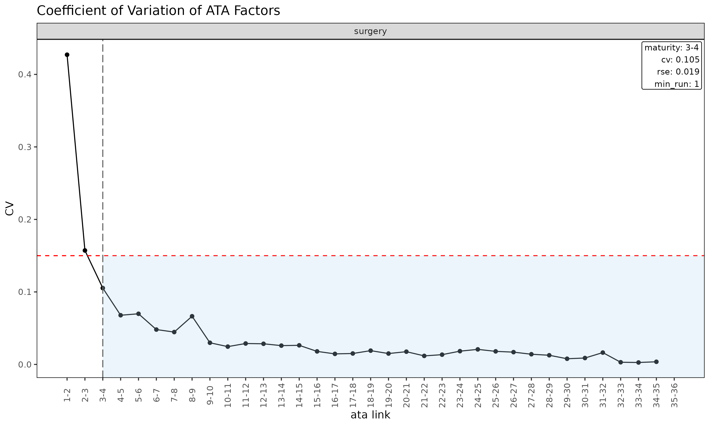

# Diagnostics: maturity, convergence, regime

## Overview

Before reading a projected loss ratio off a fit, it pays to ask three
questions about the triangle that feeds it. lossratio answers them with
three diagnostics, each on its own axis:

| Tool | Question | Result | Axis |
|----|----|----|----|
| [`detect_maturity()`](https://seokhoonj.github.io/lossratio/reference/detect_maturity.md) ($`k^*`$) | When are link factors reproducible? | a dev value | development period |
| [`detect_convergence()`](https://seokhoonj.github.io/lossratio/reference/detect_convergence.md) ($`k^{**}`$) | When does the LR estimate stop revising? | a dev value | development period |
| [`detect_regime()`](https://seokhoonj.github.io/lossratio/reference/detect_regime.md) | Are underwriting cohorts homogeneous? | cohort groups | underwriting period |

In P&C run-off these three properties tend to coincide; in long-duration
health insurance they must be verified independently. This vignette
walks them in dependency order — maturity, then convergence (which
builds on maturity), then regime — and closes with how a detected regime
is fed back into `fit_*` as a data filter.

All examples use the bundled `experience` dataset’s `surgery` coverage,
which carries a synthetic 2024-04 regime change so the detectors have a
clear signal to find.

``` r

library(lossratio)
data(experience)
tri_sur <- as_triangle(
  experience[coverage == "surgery"],
  groups   = "coverage",
  cohort   = "uy_m",
  calendar = "cy_m",
  loss     = "incr_loss",
  premium  = "incr_premium"
)
```

## Maturity detection

The **maturity point** is the development link beyond which age-to-age
factors are stable enough to trust for chain-ladder projection. It is
used internally by `fit_ratio(method = "sa")` to switch from the
exposure-driven (ED) region to the chain-ladder (CL) region.

[`detect_maturity()`](https://seokhoonj.github.io/lossratio/reference/detect_maturity.md)
takes a `Triangle` directly — the underlying single-variable `Link` and
its WLS summary are built internally:

``` r

mat <- detect_maturity(
  tri_sur,
  loss            = "loss",
  max_cv          = 0.15,    # CV must be below this
  max_rse         = 0.05,    # RSE must be below this
  min_valid_ratio = 0.5,     # at least 50% finite cohorts at the link
  min_n_valid     = 3L,      # at least 3 finite cohorts
  min_run         = 1L       # at least 1 consecutive mature link
)

print(mat)
#> Key: <coverage>
#>    coverage ata_from change ata_link     mean   median       wt        cv
#>      <char>    <num>  <num>   <char>    <num>    <num>    <num>     <num>
#> 1:  surgery        3      4      3-4 1.434507 1.400098 1.417706 0.1053282
#>           f       f_se        rse    sigma n_cohorts n_valid n_inf n_nan
#>       <num>      <num>      <num>    <num>     <num>   <num> <num> <num>
#> 1: 1.417706 0.02651852 0.01870522 1372.883        33      33     0     0
#>    valid_ratio
#>          <num>
#> 1:           1
```

The result is a row per group with the first development link satisfying
all thresholds, carrying that link’s full statistics. The threshold
arguments are also stored as attributes on the returned `Maturity`
object.

### Threshold semantics

- `max_cv` — coefficient of variation of the observed ATA factors at the
  link. Caps relative spread regardless of `alpha`.
- `max_rse` — relative standard error of the WLS-estimated factor `f`.
  Captures parameter uncertainty rather than residual spread.
- `min_valid_ratio` — minimum share of cohorts with a finite ATA at the
  link. Guards against links where most observations are zero / NA /
  Inf.
- `min_n_valid` — minimum count of finite cohorts at the link. An
  absolute floor for thin-data tails.
- `min_run` — minimum number of *consecutive* mature links. With
  `min_run = 1L` (default) the first qualifying link wins; setting it to
  `2L` or higher requires sustained stability.

Tune these to the portfolio’s volatility profile. Tight thresholds
(e.g. `max_cv = 0.05`) push maturity later; loose thresholds push it
earlier. The link diagnostic plot makes the result easy to read — each
CV gets its own panel and a vertical line marks the maturity point where
CV first drops below `max_cv`:

``` r

plot(as_link(tri_sur, loss = "loss"), type = "cv")
```



### Use in fitting

[`detect_maturity()`](https://seokhoonj.github.io/lossratio/reference/detect_maturity.md)
is also called internally by
[`fit_ata()`](https://seokhoonj.github.io/lossratio/reference/fit_ata.md),
[`fit_cl()`](https://seokhoonj.github.io/lossratio/reference/fit_cl.md),
and `fit_ratio(method = "sa")` via the `maturity` argument. It accepts
four forms:

- `NULL` — no detection (worker default for standalone calls).
- a pre-built `Maturity` object — from
  [`detect_maturity()`](https://seokhoonj.github.io/lossratio/reference/detect_maturity.md),
  or from
  [`maturity_at()`](https://seokhoonj.github.io/lossratio/reference/maturity_at.md)
  for a manual override.
- `"auto"` — internal
  [`detect_maturity()`](https://seokhoonj.github.io/lossratio/reference/detect_maturity.md)
  with defaults (the default for `fit_ratio(method = "sa")` and
  [`fit_loss()`](https://seokhoonj.github.io/lossratio/reference/fit_loss.md)).
- a function of one triangle returning a `Maturity` — typically
  [`maturity_spec()`](https://seokhoonj.github.io/lossratio/reference/maturity_spec.md),
  which forwards custom detection thresholds.

``` r

fit_ata(tri_sur, loss = "loss",
        maturity = maturity_spec(max_cv = 0.08, min_run = 2L))

fit_ratio(tri_sur, method = "sa",
          maturity = maturity_spec(max_cv = 0.08))
```

For `fit_ratio(method = "sa")` the detected maturity point determines
the dev at which the projection switches from ED (early dev) to CL
(later dev).

## Convergence detection

Maturity answers *“from which development period are link factors
$`f_k`$ reproducible across cohorts?”*. That is necessary for
chain-ladder projection but not sufficient for declaring a portfolio’s
projected loss ratio converged. In long-duration health insurance both
$`f_k \to 1`$ and $`g_k \to 0`$ arise mechanically as cumulative
denominators grow — independent of whether the underlying experience has
actually settled. A criterion built on those quantities passes
automatically with $`k`$, not because of true convergence (the *inertia*
failure mode).

[`detect_convergence()`](https://seokhoonj.github.io/lossratio/reference/detect_convergence.md)
detects the **convergence point** $`k^{**}`$ — the first dev
$`k \ge k^*`$ at which the projected portfolio loss ratio is *observed*
to be stable, in a sense the user picks via `method =`. It is the
natural counterpart to $`k^*`$:

- $`k^*`$
  ([`detect_maturity()`](https://seokhoonj.github.io/lossratio/reference/detect_maturity.md))
  marks where link factors $`f_k`$ become reproducible.
- $`k^{**}`$ marks where the projection itself stops moving with new
  data.

Long-duration health portfolios may cross $`k^*`$ early yet remain far
from $`k^{**}`$.

### The four stability methods

Convergence cannot be measured asymptotically from finite data, only
*observed up to* the maximum available dev `dev_max` ($`K_{\max}`$). The
detector runs a rolling
[`backtest()`](https://seokhoonj.github.io/lossratio/reference/backtest.md)
over a sequence of candidate dev points `dev_cand`
$`\in [k^*, K_{\max}-2]`$, builds the projected ultimate LR path `ratio`
at each one, then evaluates four stability metrics on that path. The
`method =` argument selects which metric defines `conv_k`; all four are
returned for inspection regardless of the choice.

| Method | Metric | Captures | Misses |
|----|----|----|----|
| `"window"` | range of `ratio` over the next `window` valuations | local stability (no zig-zag) | slow monotone drift below `max_drift` per window |
| `"tail"` (default) | range of `ratio` over `[k, K_{\max}]` | global stability up to `dev_max`; catches monotone drift | needs $`\ge 2`$ tail points; first-pass is conservative (later than `"window"`) |
| `"slope"` | $`\|\hat\beta_k\|`$, OLS slope of `ratio ~ k` on `[k, K_{\max}]` | systematic trend (signed direction) | oscillation that averages out to zero slope |
| `"all"` | intersection of `"window"` + `"tail"` + `"slope"` | every shape above | (strictest) |

Across all methods a cross-cohort dispersion clause
`dispersion[i] < max_dispersion` is required in addition — incremental
loss ratios at that dev must agree across cohorts (computed via the
robust $`\hat{D}_v`$ metric). The constant
$`1.4826 \approx 1 / \Phi^{-1}(0.75)`$ inside `dispersion` is the
standard MAD$`\to\sigma`$ correction, so $`\hat{D}_k`$ reads as a
robust, outlier-resistant coefficient of variation of incremental LR.

**Why not an SE-normalised criterion?** Earlier versions of this
detector implemented $`R_k < c \cdot \hat{SE}^{\mathrm{param}}_k`$ from
the original methodology paper (Section 11; the paper uses $`v`$ instead
of $`k`$, same axis). On large portfolios that form is structurally
broken: $`\hat{SE}^{\mathrm{param}}`$ shrinks as $`1/\sqrt{n}`$ while
$`R_k`$ has a numerical noise floor (~$`10^{-3}`$ LR units), so the
ratio diverges and the criterion never fires — even on synthetic data
that is *visibly stable*. The drift-based methods replace
SE-normalisation with a data-size-independent threshold.

### Notation

Standard chain-ladder convention: $`i`$ indexes cohort (origin period),
$`k`$ indexes development period.
[`detect_maturity()`](https://seokhoonj.github.io/lossratio/reference/detect_maturity.md)
returns $`k^*`$,
[`detect_convergence()`](https://seokhoonj.github.io/lossratio/reference/detect_convergence.md)
returns $`k^{**}`$ — both live on the same $`k`$ axis.

| Code | Math | Meaning |
|----|----|----|
| `dev_max` | $`K_{\max}`$ | Maximum observable dev (a scalar) |
| `dev_cand` | $`k \in [k^*, K_{\max}-2]`$ | Integer vector of candidate dev points |
| `ratio[i]` | $`LR_k`$ | Portfolio LR projection at dev = `dev_cand[i]` |
| `revision[i]` | $`R_k = \|LR_k - LR_{k-1}\|`$ | Adjacent-step revision (diagnostic only) |
| `drift_window[i]` | $`\max - \min`$ over $`[k, k+W-1]`$ | Local window range |
| `drift_tail[i]` | $`\max - \min`$ over $`[k, K_{\max}]`$ | Tail range (global stability) |
| `slope[i]` | $`\hat\beta_k`$ | OLS slope on $`[k, K_{\max}]`$ |
| `dispersion[i]` | $`\hat{D}_k`$ | Robust cross-cohort spread of incremental LR |
| `mat_k` | $`k^*`$ | Maturity point (lower bound on candidates) |
| `conv_k` | $`k^{**}`$ | The detected convergence point |

### Basic usage

``` r

res <- detect_convergence(tri_sur)
print(res)
```

Mock output (no convergence detected on this run-off):

    #> <Convergence>
    #>   method     : tail
    #>   conv_k     : NA
    #>   mat_k      : 4
    #>   dev_max    : 30
    #>   candidates : 25
    #>   passes :
    #>     window :  0/25 (drift_window < 0.01  & dispersion < 0.15)
    #>     tail   :  0/25 (drift_tail   < 0.01  & dispersion < 0.15)  <- method
    #>     slope  :  0/25 (|slope|      < 0.001 & dispersion < 0.15)
    #>     all    :  0/25 (window AND tail AND slope)

The summary `data.table` has one row per candidate dev with every metric
and per-method pass flag:

``` r

head(summary(res), 6)
```

    #>      dev ratio   revision  drift_window  drift_tail   slope  dispersion
    #>    <int> <num>      <num>         <num>       <num>   <num>       <num>
    #> 1:     4 0.62          NA          0.07        0.07   0.001        0.47
    #> 2:     5 0.63        0.01          0.06        0.06   0.001        0.47
    #> ...
    #>    pass_window  pass_tail  pass_slope  pass
    #>          <lgl>      <lgl>       <lgl> <lgl>
    #> 1:       FALSE      FALSE       FALSE FALSE
    #> 2:       FALSE      FALSE       FALSE FALSE

The `Convergence` object also reports the threshold parameters
(`max_drift`, `max_slope`, `max_dispersion`, `window`, `holdout_max`,
`min_n_cohorts`) and metadata attributes (`groups`, `target`,
`dispatcher`).

### How it works: rolling holdout refits

For each `dev_cand[i]`, the function backtests the LR projection with
`holdout = dev_max - dev_cand[i]` and extracts the portfolio LR. Calls
are cached per holdout depth so we don’t redo work between adjacent
candidates.

Example: with `dev_max = 30`, `mat_k = 4`, `holdout_max = 13` —
candidates are $`k \in \{4, 5, \dots, 28\}`$ (25 in total), but only
$`k`$ with `holdout = dev_max - k <= holdout_max` get a finite
`ratio[i]`. The rest are masked to `NA`. `holdout_max` defaults to
`max(window, floor((dev_max - mat_k) / 2))`. Raising it widens the
diagnostic window — at the cost of less data behind each refit and hence
noisier `ratio` near the lower edge.

### Plot

``` r

plot(res)
```

Five stacked panels share the dev axis:

1.  **`ratio`** — the LR trajectory the metrics are computed from.
2.  **`drift_window`** — the local-window metric, with horizontal guide
    at `max_drift`.
3.  **`drift_tail`** — the tail metric, same guide.
4.  **`|slope|`** — guide at `max_slope`.
5.  **`dispersion`** — guide at `max_dispersion`.

Vertical guides mark `mat_k` (dashed) and `conv_k` (solid, only when
non-`NA`). For each metric panel, points below the red dashed line pass
that clause. The subtitle records the active `method`. This is also a
quick way to see *which clause is binding*: any panel that hovers above
its threshold blocks convergence under that method.

### Threshold tuning

| Argument | Default | Meaning |
|----|----|----|
| `method` | `"tail"` | Which stability metric defines `conv_k`. |
| `max_drift` | `0.01` | Drift cap on `drift_window` / `drift_tail`, in LR units. Raise (e.g. `0.02`–`0.05`) for noisier or longer-tail books. |
| `max_slope` | `1e-3` | $`\|\hat\beta_k\|`$ cap (LR per dev). |
| `max_dispersion` | `0.15` | Cross-cohort dispersion cap. |
| `window` | `5L` | Drift window length $`W`$ — number of consecutive valuations the `"window"` method scans. Does *not* affect `"tail"` or `"slope"`. |
| `min_n_cohorts` | `5L` | Below this cohort count, `dispersion` is `NA`. |

Sweep `max_drift` to inspect sensitivity:

``` r

sapply(
  c(0.005, 0.01, 0.02, 0.05),
  function(d) detect_convergence(tri_sur, method = "tail", max_drift = d)$conv_k
)
```

`max_dispersion` below $`\approx 0.05`$ is difficult to attain in real
portfolios because of single-period claim noise; values above $`0.20`$
usually indicate genuine cohort heterogeneity that warrants
[`detect_regime()`](https://seokhoonj.github.io/lossratio/reference/detect_regime.md)
before further modelling.

### Reserving caveat

**The detected `conv_k` is stability *observed up to* `dev_max`, not an
asymptotic guarantee.** Future development past `dev_max` is unknown.
Treat `conv_k` as a diagnostic for “from here on, what we observe is
stable”, not as proof that the projection will not drift later.

For reserving applications:

- Prefer `method = "tail"` (default) or `"all"` over `"window"`.
  `"window"` will declare convergence prematurely on slow monotone
  drifts that fit under `max_drift` per window — exactly the
  silent-revision pattern that hurts reserves.
- Always weigh the **evidence span** `dev_max - conv_k`. A `conv_k` near
  `dev_max` (say, span $`< 5`$) was confirmed by very few tail points;
  the same data might unconverge with one more diagonal.
- Read the projected ultimate LR and its standard error from
  `fit_ratio()$summary` directly.
  [`detect_convergence()`](https://seokhoonj.github.io/lossratio/reference/detect_convergence.md)
  is a diagnostic, not an estimator; the reserve point estimate and
  uncertainty come from the fit object.

### Limitations

[`detect_convergence()`](https://seokhoonj.github.io/lossratio/reference/detect_convergence.md)
is a thin layer over repeated
[`backtest()`](https://seokhoonj.github.io/lossratio/reference/backtest.md)
calls and inherits their constraints:

- **Identifiability**: `conv_k` can be declared only when
  `dev_max - mat_k >= window` (or 2 for tail / slope). Short observation
  windows return `NA` for every method.
- **Model conditioning**: the projected LR is computed by
  [`fit_ratio()`](https://seokhoonj.github.io/lossratio/reference/fit_ratio.md),
  which internally composes
  [`fit_loss()`](https://seokhoonj.github.io/lossratio/reference/fit_loss.md)
  (default `method = "ed"`) and
  [`fit_premium()`](https://seokhoonj.github.io/lossratio/reference/fit_premium.md).
  Choices made inside that composition (loss method, regime filter,
  maturity argument) feed through to `conv_k`; pass `loss_method =`,
  `loss_regime =`, etc. through `...` to override.
- **Portfolio aggregation**: the portfolio LR aggregates per-group
  ultimates via premium weighting (`sum(loss_ult) / sum(premium_ult)`).
  Calendar-year shocks (regulatory changes, cost trend) can move every
  group together; the drift metrics will not separate that from genuine
  convergence.
- **Multi-group triangles**: `dispersion` is currently collapsed across
  groups by median. When groups behave differently, running each group
  separately is recommended.

## Regime detection

The two diagnostics above live on the development axis and assume the
cohorts are homogeneous. When a portfolio undergoes a rate revision,
coverage restructure, or underwriting overhaul, that assumption breaks:
recent underwriting cohorts behave differently from earlier ones. Two
questions follow:

1.  Are recent underwriting cohorts behaving differently from earlier
    cohorts?
2.  If so, *when* did the change happen?

In long-term insurance, cohort patterns most commonly break under one of
four triggers:

1.  **Drastic premium adjustment** — large up- or down-revision of
    rates.
2.  **Product coverage content change** — restructuring of benefits,
    exclusions, or term.
3.  **Sum insured limit change** — adjustment of per-policy maximum.
4.  **Underwriting guideline change** — eligibility, declarations, or
    loading rule revisions.

A visual inspection of `plot(tri_sur)` can suggest that recent cohorts
have lower early loss ratios than older ones, but eye-balling a bundle
of trajectories is an unreliable way to locate a structural shift —
especially when observation windows differ across cohorts.

[`detect_regime()`](https://seokhoonj.github.io/lossratio/reference/detect_regime.md)
answers both questions in one call — grouping underwriting cohorts into
**regimes** (groups of cohorts that share similar loss dynamics) and
reporting the break dates between groups. It treats each underwriting
cohort as a feature vector (its trajectory over the first `window`
development periods), orders cohorts by underwriting date, and applies a
change-point or clustering method to the resulting multivariate
sequence.

``` r

r <- detect_regime(tri_sur, method = "e_divisive")
r
#> <Regime>
#>   method    : e_divisive
#>   loss      : ratio
#>   treatment : latest_only
#>   window (window) : dev_m 1-4
#>   cohorts    : 33 analysed (3 dropped)
#>   regimes    : 2
#>   changes    : 24.07
#>   PC1 / PC2  : 75.6% / 18.9%
```

The `window` argument controls how many development periods define the
cohort feature vector. Only cohorts observed for at least `window`
periods are analysed; cohorts with shorter windows are dropped.
Increasing `window` captures more of the trajectory but drops more
recent cohorts. With the default `window = "auto"`, a maturity-aware
sweep picks the largest window that retains enough cohorts.

### Summary and per-regime membership

``` r

summary(r)
#> Cohort regime detection summary
#>   method    : e_divisive
#>   loss      : ratio
#>   treatment : latest_only
#>   window    : dev_m 1-4
#>   cohorts   : 33 analysed (3 dropped)
#> 
#> Regimes (2):
#>   1: 23.01-24.06 (18 cohorts)
#>   2: 24.07-25.09 (15 cohorts)
#> 
#> Changes: 24.07

r$labels
#>     coverage     cohort      regime regime_id
#>       <char>     <Date>      <fctr>     <int>
#>  1:  surgery 2023-01-01 23.01-24.06         1
#>  2:  surgery 2023-02-01 23.01-24.06         1
#>  3:  surgery 2023-03-01 23.01-24.06         1
#>  4:  surgery 2023-04-01 23.01-24.06         1
#>  5:  surgery 2023-05-01 23.01-24.06         1
#>  6:  surgery 2023-06-01 23.01-24.06         1
#>  7:  surgery 2023-07-01 23.01-24.06         1
#>  8:  surgery 2023-08-01 23.01-24.06         1
#>  9:  surgery 2023-09-01 23.01-24.06         1
#> 10:  surgery 2023-10-01 23.01-24.06         1
#> 11:  surgery 2023-11-01 23.01-24.06         1
#> 12:  surgery 2023-12-01 23.01-24.06         1
#> 13:  surgery 2024-01-01 23.01-24.06         1
#> 14:  surgery 2024-02-01 23.01-24.06         1
#> 15:  surgery 2024-03-01 23.01-24.06         1
#> 16:  surgery 2024-04-01 23.01-24.06         1
#> 17:  surgery 2024-05-01 23.01-24.06         1
#> 18:  surgery 2024-06-01 23.01-24.06         1
#> 19:  surgery 2024-07-01 24.07-25.09         2
#> 20:  surgery 2024-08-01 24.07-25.09         2
#> 21:  surgery 2024-09-01 24.07-25.09         2
#> 22:  surgery 2024-10-01 24.07-25.09         2
#> 23:  surgery 2024-11-01 24.07-25.09         2
#> 24:  surgery 2024-12-01 24.07-25.09         2
#> 25:  surgery 2025-01-01 24.07-25.09         2
#> 26:  surgery 2025-02-01 24.07-25.09         2
#> 27:  surgery 2025-03-01 24.07-25.09         2
#> 28:  surgery 2025-04-01 24.07-25.09         2
#> 29:  surgery 2025-05-01 24.07-25.09         2
#> 30:  surgery 2025-06-01 24.07-25.09         2
#> 31:  surgery 2025-07-01 24.07-25.09         2
#> 32:  surgery 2025-08-01 24.07-25.09         2
#> 33:  surgery 2025-09-01 24.07-25.09         2
#>     coverage     cohort      regime regime_id
#>       <char>     <Date>      <fctr>     <int>
```

### Visualisation

`plot(r)` produces a PCA scatter of cohort trajectories coloured by
detected regime. If the regimes are well-separated in PCA space, the
structural shift is visually confirmed:

``` r

plot(r)
```


Arrows indicate the loadings of each development-period feature on the
PC axes — useful for reading *how* the regimes differ (e.g. whether the
shift primarily affects early or late development).

### Choice of loss

The `loss` argument controls *which signal* the change-point algorithm
operates on. Different metrics surface different kinds of regime change,
and each has its own failure mode. Pick the metric that matches the
event you suspect — and always cross-check with domain knowledge. The
order
`c("ratio", "loss_ata", "premium_ata", "loss_ed", "premium_ed", "loss", "premium")`
runs from cleanest to riskiest.

| Scenario to detect | Recommended `loss` | Caveat |
|----|----|----|
| General LR projection accuracy (default) | `"ratio"` | Differential growth (loss vs premium scaling unevenly) can produce smooth drift mis-labelled as a sharp break. |
| Loss development *speed* change (CL `f`) | `"loss_ata"` *(diagnostic)* | Loses dev = 1 row + complete-row requirement -\> sample size shrinks; over-sensitive on low-CV factors. |
| Premium recognition *speed* change | `"premium_ata"` *(diagnostic)* | Same caveats as `"loss_ata"`. |
| Loss *intensity* per unit premium (ED `g`) | `"loss_ed"` *(diagnostic)* | Cross-normalised by premium; harder to interpret in isolation. |
| Same as `premium_ata` (API symmetry) | `"premium_ed"` *(alias)* | Equivalent to `premium_ata` after PCA standardization. |
| Loss *level* shift (claim handling, coverage) | `"loss"` | Raw cumulative — book-size growth dominates; false positives common. |
| Premium *level* shift (rate, channel) | `"premium"` | Same caveat as `"loss"`. |

Notes:

- `"ratio"` is the default because the loss ratio is the package’s
  projection metric and is naturally scale-invariant (immune to
  book-size growth).
- `"loss"` / `"premium"` use the raw cumulative columns and are most
  useful when the suspected event is a sudden *absolute level shift*
  (e.g. a channel termination dropping premium volume). Smooth book
  growth will frequently produce false positives — read every result
  alongside a known timeline of underwriting / claims-handling events.
- `"loss_ata"`, `"premium_ata"`, `"loss_ed"` are diagnostic metrics
  derived inline (not stored on the `Triangle`). They map directly to
  the CL `f`-factor / ED `g`-factor used during fitting, so a change
  detected here corresponds to a violation of the model’s stationarity
  assumption. Use them to attribute a regime change to a specific
  structural mechanism.

``` r

# Try several metrics and compare the changes they surface
detect_regime(tri_sur, loss = "ratio")
detect_regime(tri_sur, loss = "loss")
detect_regime(tri_sur, loss = "loss_ata")
```

The changes across metrics are usually similar for strong, real regime
shifts and diverge when the signal is weak or driven by book-size growth
— both useful diagnostics.

### Choice of method

- **`"e_divisive"`** — preferred default. Multivariate, non-parametric,
  auto-detects the number of regimes at a given significance level, so
  it requires no a priori choice of `n_regimes`.
- **`"hclust"`** — Ward hierarchical clustering on the scaled feature
  matrix, cut to `n_regimes` clusters (default `2`). Ignores
  chronological order and is best used as a sanity check: if the
  chronological method locates a change at time `t` and `hclust`
  produces the same two groups (all pre-`t` in one cluster, all post-`t`
  in the other), the shift is structural rather than an artefact of the
  method.

In practice, agreement across both methods — as in the surgery example
above, where `"e_divisive"` and `"hclust"` both locate `24.04` as the
regime boundary — is strong evidence of a real underwriting / rate
shift.

### Forcing the number of regimes

To compare a fixed number of regimes — for example, two-vs-three regime
hypotheses — pass `n_regimes`:

``` r

r2 <- detect_regime(tri_sur, method = "e_divisive", n_regimes = 3)
summary(r2)
#> Cohort regime detection summary
#>   method    : e_divisive
#>   loss      : ratio
#>   treatment : latest_only
#>   window    : dev_m 1-4
#>   cohorts   : 33 analysed (3 dropped)
#> 
#> Regimes (3):
#>   1: 23.01-24.06 (18 cohorts)
#>   2: 24.07-25.06 (12 cohorts)
#>   3: 25.07-25.09 (3 cohorts)
#> 
#> Changes: 24.07, 25.07
```

For `"e_divisive"`, `n_regimes` is a request (the algorithm will return
up to that many regimes if supported by the data). For `"hclust"`, it is
a hard cut.

### Multi-group detection

A `Triangle` built with multiple groups can be passed directly —
detection runs independently per group and results are gathered into a
single `Regime` object.

``` r

tri_all <- as_triangle(
  experience,
  groups   = "coverage",
  cohort   = "uy_m",
  calendar = "cy_m",
  loss     = "incr_loss",
  premium  = "incr_premium"
)
r_all <- detect_regime(tri_all, by = "coverage", method = "e_divisive")
r_all$changes
#>    coverage     change regime_id pre_value post_value magnitude
#>      <char>     <Date>     <int>     <num>      <num>     <num>
#> 1:  surgery 2024-07-01         2 0.9065895  0.5479919 0.3585976
```

In multi-group mode `r_all$changes` is a `data.table` with the group
column plus a `change` Date column; `r_all$labels` likewise gains the
group column; `r_all$n_regimes` is a named integer vector keyed by group
value. The `r_all$multi_group` flag distinguishes the layout from the
single-group scalar form. If a group has too few cohorts for the chosen
`window`, that group is skipped with a warning (others continue). If
*all* groups fail,
[`detect_regime()`](https://seokhoonj.github.io/lossratio/reference/detect_regime.md)
errors out. `plot(r_all)` returns a named list of per-group `ggplot`
panels.

## Regime filtering of fits

[`detect_regime()`](https://seokhoonj.github.io/lossratio/reference/detect_regime.md)
is a *preprocessing diagnostic*, not a modification of the
[`fit_ratio()`](https://seokhoonj.github.io/lossratio/reference/fit_ratio.md)
framework. Its output is used in two ways:

1.  **Stratified fitting**: if two clearly distinct regimes are
    detected, fitting
    [`fit_ratio()`](https://seokhoonj.github.io/lossratio/reference/fit_ratio.md)
    separately on each regime subset often yields sharper
    convergence-region LR estimates than a pooled fit.
2.  **In-fit filtering**: a `Regime` can be passed straight into the
    `fit_*` family as a data filter, dropping pre-change cohorts from
    factor estimation. The rest of this section covers that path.

### Why a hybrid filter

When chain ladder is fitted on the full triangle after a regime change,
old-cohort link factors leak into the new-cohort projections, which
shows up as a monotone drift across `diag_summary` in
[`backtest()`](https://seokhoonj.github.io/lossratio/reference/backtest.md).
The `recent = N` argument suppresses some of this drift, but a
calendar-diagonal cut is symmetric across both axes — it discards older
cohorts’ young-dev cells too, where the ED region was already stable.
The natural fix is asymmetric:

- **Pre-maturity (ED region):** horizontal cut — keep only post-change
  cohorts.
- **Post-maturity (CL region):** diagonal cut — keep only the recent `N`
  calendar diagonals.

`loss_regime` (and its premium-side sibling `premium_regime`) implements
that split.

### Two-axis asymmetry

| Axis                    | Number of changes      | Source                  |
|-------------------------|------------------------|-------------------------|
| x (maturity, ED -\> CL) | exactly one per group  | `fit_ata$maturity`      |
| y (regime change)       | zero or many per group | `detect_regime$changes` |

The maturity point $`k^*`$ is a single internal switch produced by
[`detect_maturity()`](https://seokhoonj.github.io/lossratio/reference/detect_maturity.md).
Regime changes are exogenous events — there can be none, one, or
several. When a `Regime` object carries multiple changes, the
`treatment` slot decides how downstream fits use them:

- `treatment = "latest_only"` (default): collapse to the most recent
  change and drop all pre-latest cohorts. A single pooled factor is
  estimated over the surviving (post-latest) cohorts. Stable when the
  post-change window has accumulated enough cohorts and earlier regimes
  are not informative for the current one.
- `treatment = "segment_wise"`: preserve every change. Each segment
  (consecutive cohorts between adjacent changes) gets its own factor
  estimate, and each cohort is projected with its own segment’s factor.
  Use this for multi-regime + long-tail data where the latest regime
  hasn’t yet observed late-dev development.

Pick the treatment when constructing the `Regime`:

``` r

# Latest-only (default — drop pre-latest cohorts)
regime_at(change = c("2022-01-01", "2024-04-01"))

# Segment-wise (each segment gets its own factor)
regime_at(change = c("2022-01-01", "2024-04-01"),
          treatment = "segment_wise")

detect_regime(tri_sur, treatment = "segment_wise")
```

### API

[`fit_ratio()`](https://seokhoonj.github.io/lossratio/reference/fit_ratio.md)
takes two role-specific regime arguments — `loss_regime` (loss-side
filter) and `premium_regime` (premium-side filter; defaults to
`loss_regime`).
[`fit_loss()`](https://seokhoonj.github.io/lossratio/reference/fit_loss.md)
/
[`fit_premium()`](https://seokhoonj.github.io/lossratio/reference/fit_premium.md)
take a single `regime` argument.
[`backtest()`](https://seokhoonj.github.io/lossratio/reference/backtest.md)
mirrors `fit_ratio` with `loss_regime` / `premium_regime`. The workers
(`fit_ata`, `fit_ed`, `fit_cl`, `fit_intensity`) expose the same single
`regime` argument. All accept the same four input types:

| Input | Behaviour |
|----|----|
| `NULL` (default) | no filtering — backwards compatible |
| `Regime` object | output of [`detect_regime()`](https://seokhoonj.github.io/lossratio/reference/detect_regime.md) or [`regime_at()`](https://seokhoonj.github.io/lossratio/reference/regime_at.md) |
| `"auto"` sentinel | calls [`detect_regime()`](https://seokhoonj.github.io/lossratio/reference/detect_regime.md) internally on the triangle |
| `function(tri) -> Regime` | closure that returns a `Regime` from a triangle |

Raw `Date` / character / vector input is no longer accepted — wrap it in
[`regime_at()`](https://seokhoonj.github.io/lossratio/reference/regime_at.md)
first to make the change explicit:

``` r

# Manual change date via regime_at() — wrap a literal date in a Regime
fit_ratio(tri_sur, method = "sa", recent = 18L,
          loss_regime = regime_at(change = "2024-07-01"))

# Regime object from detect_regime() directly
reg <- detect_regime(tri_sur)
fit_ratio(tri_sur, method = "sa", recent = 18L, loss_regime = reg)

# "auto" sentinel — detect_regime() is run internally
fit_ratio(tri_sur, method = "sa", recent = 18L, loss_regime = "auto")

# Closure — defers detection until the fit sees the (filtered) triangle
fit_ratio(tri_sur, method = "sa", recent = 18L,
          loss_regime = function(tri) detect_regime(tri))
```

In simple modes (`fit_ratio(method` in `{"ed","cl"}`) the same argument
acts as a plain cohort cut.

### SA-mode hybrid behaviour

The hybrid split activates only for `fit_ratio(method = "sa")` with both
`loss_regime` and `recent`:

- dev $`\le k^*`$ — ED region: post-change cohorts only.
- dev $`> k^*`$ — CL region: latest `recent` diagonals only (full
  triangle if `recent = NULL`).

The maturity point $`k^*`$ itself is found in a **two-pass** procedure:
first on the raw triangle (so noisy post-change windows do not
destabilise $`k^*`$), then the hybrid filter is applied to the actual
fit using the fixed $`k^*`$.

`plot_triangle(view = "usage")` visualises which cells each filter
configuration feeds to `fit_ratio`:

``` r

plot_triangle(tri_sur, view = "usage", holdout = 6L)                         # full
plot_triangle(tri_sur, view = "usage", recent = 12L, holdout = 6L)           # recent
plot_triangle(tri_sur, view = "usage", regime = "2024-07-01", holdout = 6L)  # change
plot_triangle(tri_sur, view = "usage", recent = 12L,
              regime = "2024-07-01", holdout = 6L)                           # hybrid
```

The hybrid panel shows the dev-axis split that SA mode applies: a cohort
cut on the ED side and a calendar diagonal cut on the CL side, joined at
$`k^*`$.

### Case study — surgery cohort

The bundled `experience` dataset embeds a synthetic 2024-04 regime
change in the surgery coverage. Backtests on the same triangle with four
variants:

``` r

reg <- detect_regime(tri_sur)

bt_full   <- backtest(tri_sur, holdout = 6L)
bt_recent <- backtest(tri_sur, holdout = 6L, recent = 18L)
bt_change <- backtest(tri_sur, holdout = 6L, loss_regime = reg)
bt_hybrid <- backtest(tri_sur, holdout = 6L, recent = 18L,
                      loss_regime = reg)
```

Reproduced from `dev/regime_backtest_hybrid.R`:

| Variant                       | drift (cal30 - cal25) | overall mean |
|-------------------------------|-----------------------|--------------|
| full                          | +4.50pp               | -1.25%       |
| recent = 18                   | +2.03pp               | -3.45%       |
| **loss_regime + recent = 18** | **-0.69pp**           | **+0.03%**   |

Two columns summarise the A/E Error = `actual / proj - 1` (positive =
under-projection) measured on the held-out diagonals:

- **drift (cal30 - cal25)**: A/E Error aggregated by calendar diagonal,
  then the (latest - earliest) difference. Captures whether the
  prediction error is monotonically changing across the hold-out window
  — the signature of a regime change the static model has not absorbed.
- **overall mean**: cell-level mean A/E Error across all held-out cells
  — the model’s directional bias.

Drift collapses from +4.50pp under `full` to -0.69pp under the hybrid
filter; the overall mean returns to ~0.

### Multi-group handling

[`detect_regime()`](https://seokhoonj.github.io/lossratio/reference/detect_regime.md)
assumes a single-group triangle for in-fit filtering. For a portfolio
with multiple `coverage` groups, call it per group:

``` r

fits <- lapply(unique(experience$coverage), function(g) {
  tri_g <- as_triangle(
    experience[coverage == g],
    groups   = "coverage",
    cohort   = "uy_m",
    calendar = "cy_m",
    loss     = "incr_loss",
    premium  = "incr_premium"
  )
  reg_g <- detect_regime(tri_g)
  fit_ratio(tri_g, method = "sa", recent = 18L, loss_regime = reg_g)
})
```

A future extension may accept
`loss_regime = list(surgery = regime_at(...), cancer = regime_at(...))`.
Today only `NULL` / `Regime` / `"auto"` / closure are supported.

### Filtering limitations

If the post-change window is too short (small `n_post`), the ED
intensity $`g_k`$ and link factors $`f_k`$ become noisy. A practical
threshold is `n_post` $`\gtrsim 6`$. Below that, prefer `recent` alone,
or wait for credibility-weighted blending of pre- and post-change
factors (planned).

Note also that `loss_regime` / `premium_regime` only filter the data
feeding link factor estimation. Once the factors are fixed, all cohorts
share them, so pre-change ultimates inherit the post-change dynamics.

## A defensible workflow

The three diagnostics separate *cohort homogeneity*, *link
reproducibility*, and *level convergence* — properties that coincide in
P&C run-off but must be verified independently in long-duration health
insurance:

1.  Run
    [`detect_regime()`](https://seokhoonj.github.io/lossratio/reference/detect_regime.md).
    If multiple regimes exist, fit each group separately, or pass
    `loss_regime =` / `regime =` into the fit / backtest call.
2.  For each homogeneous group, compute $`k^*`$ via
    [`detect_maturity()`](https://seokhoonj.github.io/lossratio/reference/detect_maturity.md).
3.  Run
    [`detect_convergence()`](https://seokhoonj.github.io/lossratio/reference/detect_convergence.md)
    to obtain $`k^{**} \ge k^*`$. Read the projected ultimate loss ratio
    from `fit_ratio()$summary` and apply the reserving caveat.

## See also

- [`?detect_maturity`](https://seokhoonj.github.io/lossratio/reference/detect_maturity.md),
  [`?detect_convergence`](https://seokhoonj.github.io/lossratio/reference/detect_convergence.md),
  [`?detect_regime`](https://seokhoonj.github.io/lossratio/reference/detect_regime.md),
  [`?regime_at`](https://seokhoonj.github.io/lossratio/reference/regime_at.md),
  [`?maturity_spec`](https://seokhoonj.github.io/lossratio/reference/maturity_spec.md),
  [`?fit_ratio`](https://seokhoonj.github.io/lossratio/reference/fit_ratio.md),
  [`?backtest`](https://seokhoonj.github.io/lossratio/reference/backtest.md).
- [`vignette("backtest")`](https://seokhoonj.github.io/lossratio/articles/backtest.md)
  — the rolling holdout machinery that
  [`detect_convergence()`](https://seokhoonj.github.io/lossratio/reference/detect_convergence.md)
  and the regime filter case study are built on.
- [`vignette("projection")`](https://seokhoonj.github.io/lossratio/articles/projection.md)
  —
  [`fit_ratio()`](https://seokhoonj.github.io/lossratio/reference/fit_ratio.md)
  and the `"sa"`, `"ed"`, `"cl"` methods.
