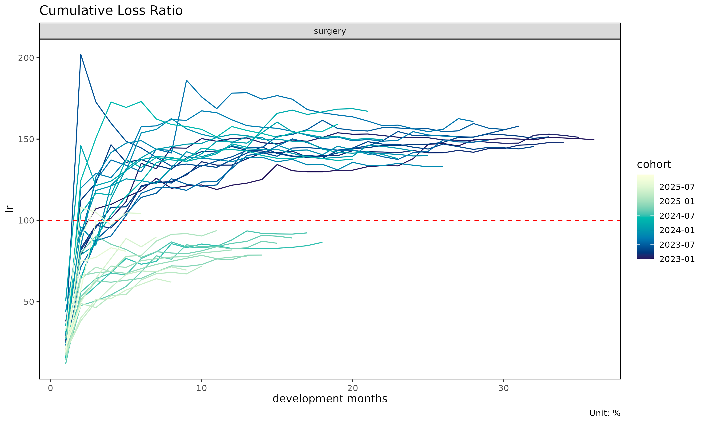

# Get started: lossratio 시작하기

> 영어 원본 보기: [Getting started with
> lossratio](https://seokhoonj.github.io/lossratio/getting-started.md)

이 문서는 `lossratio` 의 전체 파이프라인을 내장 합성 experience 데이터
위에서 따라간다. long-format raw 데이터에서 시작하여 적합된 손해율
추정까지 이어진다.

## 입력 형태

`lossratio` 는 long-format experience 데이터를 입력으로 사용한다 — 한
행은 (코호트 × 경과 기간 × 그룹) 셀 하나에 대응한다. 내장 데이터셋
`experience` 는 2,664 행 테이블로, 여러 집계 주기의 calendar /
underwriting 기간 컬럼, `coverage` 그룹 컬럼, 기간별 금액 컬럼
(`incr_loss`, `incr_exposure`) 을 포함한다.

``` r

library(lossratio)

data(experience)
str(experience)
#> Classes 'data.table' and 'data.frame':   2664 obs. of  15 variables:
#>  $ coverage     : chr  "ci" "ci" "ci" "ci" ...
#>  $ uy           : Date, format: "2023-01-01" "2023-01-01" ...
#>  $ uy_h         : Date, format: "2023-01-01" "2023-01-01" ...
#>  $ uy_q         : Date, format: "2023-01-01" "2023-01-01" ...
#>  $ uy_m         : Date, format: "2023-01-01" "2023-01-01" ...
#>  $ cy           : Date, format: "2023-01-01" "2023-01-01" ...
#>  $ cy_h         : Date, format: "2023-01-01" "2023-01-01" ...
#>  $ cy_q         : Date, format: "2023-01-01" "2023-01-01" ...
#>  $ cy_m         : Date, format: "2023-01-01" "2023-02-01" ...
#>  $ dev_y        : int  1 1 1 1 1 1 1 1 1 1 ...
#>  $ dev_h        : int  1 1 1 1 1 1 2 2 2 2 ...
#>  $ dev_q        : int  1 1 1 2 2 2 3 3 3 4 ...
#>  $ dev_m        : int  1 2 3 4 5 6 7 8 9 10 ...
#>  $ incr_loss    : num  1262380 11255763 11281309 33602387 7152622 ...
#>  $ incr_exposure: num  27993106 29183931 29401966 26570540 27471886 ...
#>  - attr(*, ".internal.selfref")=<pointer: (nil)>
```

## 1단계 — 코호트 × 경과 기간 구조 구축

``` r

tri <- as_triangle(
  experience[coverage == "surgery"],
  groups   = "coverage",
  cohort   = "uy_m",
  calendar = "cy_m",
  loss     = "incr_loss",
  exposure = "incr_exposure"
)
class(tri)
#> [1] "Triangle"   "data.table" "data.frame"
names(tri)
#>  [1] "coverage"            "n_cohorts"           "cohort"             
#>  [4] "dev"                 "loss"                "incr_loss"          
#>  [7] "exposure"            "incr_exposure"       "ratio"              
#> [10] "incr_ratio"          "margin"              "incr_margin"        
#> [13] "profit"              "incr_profit"         "loss_share"         
#> [16] "incr_loss_share"     "exposure_share"      "incr_exposure_share"
```

[`as_triangle()`](https://seokhoonj.github.io/lossratio/reference/as_triangle.md)
의 동작:

- 필수 컬럼 (`cy_m`, `uy_m`, `incr_loss`, `incr_exposure`) 의 존재를
  확인하고 expected type 으로 코어션한다,
- 인구통계 차원을 집계하여 제거한다 (여기서는 `age_band`, `gender`),
- 누적 컬럼 (`loss`, `exposure`) 을 추가한다,
- 파생 지표 (`margin`, `ratio`, `loss_share`, `exposure_share`) 를
  추가한다,
- 코호트 / 경과 기간 컬럼을 표준명 `cohort` 와 `dev` 로 rename 한다,
- 원본 컬럼명은 attribute (`cohort`, `dev`) 로 보존하여 이후 plot
  라벨에서 활용 가능하게 한다.

## 2단계 — 진단

``` r

plot(tri)              # 코호트별 ratio 궤적
```



``` r

plot_triangle(tri)     # ratio 셀의 heatmap
```


``` r

summary(tri)           # 경과 기간별 그룹 통계량
#> Key: <coverage, dev>
#>     coverage   dev n_cohorts ratio_mean ratio_median  ratio_wt incr_ratio_mean
#>       <char> <int>     <int>      <num>        <num>     <num>           <num>
#>  1:  surgery     1        36  0.2522898    0.2393582 0.2525932       0.2522898
#>  2:  surgery     2        35  0.8030639    0.7859128 0.7890646       1.3572087
#>  3:  surgery     3        34  0.9258662    0.8997912 0.9204360       1.1519240
#>  4:  surgery     4        33  0.9856772    0.9716558 0.9778502       1.1797269
#>  5:  surgery     5        32  1.0336648    1.0502252 1.0447602       1.2268717
#>  6:  surgery     6        31  1.0945723    1.1832332 1.0892484       1.3676102
#>  7:  surgery     7        30  1.1226602    1.2307968 1.1260090       1.2795209
#>  8:  surgery     8        29  1.1476579    1.2385036 1.1607484       1.2695757
#>  9:  surgery     9        28  1.1867831    1.2831350 1.1993421       1.3565716
#> 10:  surgery    10        27  1.2189764    1.3392377 1.2161749       1.3443230
#> 11:  surgery    11        26  1.2398508    1.3528781 1.2306363       1.2546351
#> 12:  surgery    12        25  1.2748031    1.3729018 1.2943160       1.5245126
#> 13:  surgery    13        24  1.3088959    1.4291378 1.3202706       1.4851972
#> 14:  surgery    14        23  1.3391485    1.4270947 1.3407729       1.4339388
#> 15:  surgery    15        22  1.3721398    1.4269041 1.3628824       1.5014265
#> 16:  surgery    16        21  1.3940933    1.4310343 1.3828890       1.3639729
#> 17:  surgery    17        20  1.4097869    1.4405611 1.3901633       1.2645684
#> 18:  surgery    18        19  1.4308462    1.4384627 1.4131833       1.3636669
#> 19:  surgery    19        18  1.4674058    1.4314176 1.4992667       1.5607399
#> 20:  surgery    20        17  1.4630633    1.4413678 1.4973696       1.5135877
#> 21:  surgery    21        16  1.4721202    1.4604722 1.5143362       1.5431636
#> 22:  surgery    22        15  1.4559264    1.4614643 1.4742311       1.3944927
#> 23:  surgery    23        14  1.4530162    1.4526203 1.4719093       1.4497984
#> 24:  surgery    24        13  1.4623530    1.4505400 1.4765376       1.5517800
#> 25:  surgery    25        12  1.4673860    1.4686413 1.4836300       1.5166770
#> 26:  surgery    26        11  1.4824851    1.4947915 1.4961973       1.6915615
#> 27:  surgery    27        10  1.5033314    1.5018660 1.5214048       1.6430325
#> 28:  surgery    28         9  1.5055939    1.4952451 1.5305297       1.6071526
#> 29:  surgery    29         8  1.4998251    1.4964613 1.5184059       1.6846552
#> 30:  surgery    30         7  1.5011849    1.5030635 1.5172585       1.5112226
#> 31:  surgery    31         6  1.4961175    1.4880367 1.5006586       1.6444377
#> 32:  surgery    32         5  1.4890487    1.4954533 1.4933984       1.7690619
#> 33:  surgery    33         4  1.5086788    1.5126330 1.5093436       1.8628827
#> 34:  surgery    34         3  1.5021688    1.5068628 1.5004958       1.3432240
#> 35:  surgery    35         2  1.5066599    1.5066599 1.5083770       1.2290223
#> 36:  surgery    36         1  1.4962059    1.4962059 1.4962059       1.2855791
#>     coverage   dev n_cohorts ratio_mean ratio_median  ratio_wt incr_ratio_mean
#>       <char> <int>     <int>      <num>        <num>     <num>           <num>
#>     incr_ratio_median incr_ratio_wt
#>                 <num>         <num>
#>  1:         0.2393582     0.2525932
#>  2:         1.2618216     1.3280769
#>  3:         1.1517980     1.1728982
#>  4:         1.1167740     1.1742272
#>  5:         1.2663383     1.3110155
#>  6:         1.2676379     1.2752751
#>  7:         1.1820596     1.3386507
#>  8:         1.2534497     1.3649817
#>  9:         1.2365352     1.3663756
#> 10:         1.2201009     1.2953679
#> 11:         1.2665782     1.2806481
#> 12:         1.4833182     1.5935069
#> 13:         1.3855136     1.4462040
#> 14:         1.3888344     1.5051091
#> 15:         1.3047737     1.5731446
#> 16:         1.3118128     1.3730719
#> 17:         1.2342326     1.2723713
#> 18:         1.2757634     1.4565681
#> 19:         1.4756463     1.5827383
#> 20:         1.4438045     1.5321948
#> 21:         1.5642856     1.5803810
#> 22:         1.3370493     1.4612516
#> 23:         1.3865805     1.4391562
#> 24:         1.4213562     1.4363201
#> 25:         1.4433495     1.4198077
#> 26:         1.5738705     1.5628175
#> 27:         1.4080903     1.8551455
#> 28:         1.4361840     1.7482784
#> 29:         1.8359202     1.5456207
#> 30:         1.3661139     1.4455959
#> 31:         1.4673015     1.5987246
#> 32:         1.5883761     1.6630214
#> 33:         1.8353115     1.8309606
#> 34:         1.3503129     1.3440389
#> 35:         1.2290223     1.1775157
#> 36:         1.2855791     1.2855791
#>     incr_ratio_median incr_ratio_wt
#>                 <num>         <num>
```

## 3단계 — 링크 단계 진단

링크(연속한 두 경과 기간) 단계 인자를 살피는 두 보완적 관점이다. 어느
경과 기간까지 정보가 안정화되는가를 진단하며, 이후 예측 단계의 입력이
된다.

``` r

# ATA 인자(age-to-age factor) — 곱셈형, chain ladder 의 입력
fit_ata(tri, loss = "loss")
#> <ATAFit>
#> alpha       : 1 
#> sigma_method: locf 
#> recent      : all 
#> regime      : none
#> use_maturity: FALSE 
#> groups      : coverage 
#> n_groups    : 1 
#> ata links   : 35

# 노출 기반(exposure-driven) 강도 인자 — 덧셈형, ED 의 입력
fit_intensity(tri, loss = "loss", exposure = "exposure")
#> <IntensityFit>
#> alpha       : 1 
#> sigma_method: locf 
#> recent      : all 
#> regime      : none
#> groups      : coverage 
#> n_groups    : 1 
#> ata links   : 35
```

[`fit_ata()`](https://seokhoonj.github.io/lossratio/reference/fit_ata.md)
는 링크별 ATA 인자 $`f_k`$ 를,
[`fit_intensity()`](https://seokhoonj.github.io/lossratio/reference/fit_intensity.md)
는 강도 인자 $`g_k = \Delta C^L_k / C^P_k`$ 를 반환한다. 두 출력 모두
*factor 레벨* 진단으로, 예측치 (`$full`) 는 갖지 않는다.

## 4단계 — 예측

예측 레벨 추정량은 세 가지로,
[`fit_cl()`](https://seokhoonj.github.io/lossratio/reference/fit_cl.md)
과
[`fit_ed()`](https://seokhoonj.github.io/lossratio/reference/fit_ed.md)
가 한 쌍의 sibling,
[`fit_ratio()`](https://seokhoonj.github.io/lossratio/reference/fit_ratio.md)
은 둘을 결합하는 통합 인터페이스이다.

``` r

# Chain ladder (곱셈형 예측)
cl <- fit_cl(tri, loss = "loss", method = "mack")
plot(cl, type = "projection")
```


``` r

summary(cl)
#>     coverage     cohort     latest   loss_ult    reserve loss_proc_se
#>       <char>     <Date>      <num>      <num>      <num>        <num>
#>  1:  surgery 2023-01-01  410248522  410248522          0            0
#>  2:  surgery 2023-02-01  976330445 1001441303   25110858      2751819
#>  3:  surgery 2023-03-01  978486045 1026151243   47665198      3967869
#>  4:  surgery 2023-04-01 2029909919 2186771221  156861302      6942937
#>  5:  surgery 2023-05-01  624219436  697669301   73449865      4455636
#>  6:  surgery 2023-06-01  802880717  931393934  128513217     17869565
#>  7:  surgery 2023-07-01 2539141549 3050990158  511848609     35918003
#>  8:  surgery 2023-08-01  393678329  488218204   94539875     15583801
#>  9:  surgery 2023-09-01 1364052542 1751869308  387816766     38001618
#> 10:  surgery 2023-10-01  979266043 1311793843  332527800     38496097
#> 11:  surgery 2023-11-01  604685679  848103123  243417444     35719579
#> 12:  surgery 2023-12-01 1026345366 1497869029  471523663     51405333
#> 13:  surgery 2024-01-01 1912177598 2901492851  989315253     75674312
#> 14:  surgery 2024-02-01  733902485 1160045952  426143467     51719398
#> 15:  surgery 2024-03-01  415459873  686574148  271114275     41313266
#> 16:  surgery 2024-04-01 3286053526 5687484014 2401430488    122770258
#> 17:  surgery 2024-05-01 1451731153 2645801838 1194070685     93024106
#> 18:  surgery 2024-06-01  629668308 1209024555  579356247     65346187
#> 19:  surgery 2024-07-01 1250954693 2542927190 1291972497    103136528
#> 20:  surgery 2024-08-01  425346694  918120582  492773888     65317866
#> 21:  surgery 2024-09-01  278156543  635470028  357313485     56737053
#> 22:  surgery 2024-10-01  352070323  856446521  504376198     68091257
#> 23:  surgery 2024-11-01   99050501  260916096  161865595     41787166
#> 24:  surgery 2024-12-01  103194013  295637296  192443283     49617195
#> 25:  surgery 2025-01-01  227089025  710560093  483471068     83635489
#> 26:  surgery 2025-02-01  939163074 3276849152 2337686078    192418633
#> 27:  surgery 2025-03-01  112828845  434950057  322121212     72345359
#> 28:  surgery 2025-04-01   82472453  356301148  273828695     68974257
#> 29:  surgery 2025-05-01  141214851  697290587  556075736    119238986
#> 30:  surgery 2025-06-01  136406102  789468799  653062697    136628652
#> 31:  surgery 2025-07-01  149144024 1040451732  891307708    167039609
#> 32:  surgery 2025-08-01  116327076 1008356733  892029657    183653360
#> 33:  surgery 2025-09-01   67465470  783000257  715534787    179947037
#> 34:  surgery 2025-10-01  121626173 2001214863 1879588690    337103186
#> 35:  surgery 2025-11-01   15716444  449653406  433936962    194100658
#> 36:  surgery 2025-12-01    4825085  850839118  846014033    472741759
#>     coverage     cohort     latest   loss_ult    reserve loss_proc_se
#>       <char>     <Date>      <num>      <num>      <num>        <num>
#>     loss_param_se loss_total_se loss_total_cv
#>             <num>         <num>         <num>
#>  1:             0             0   0.000000000
#>  2:       4299412       5104650   0.005097304
#>  3:       5021196       6399718   0.006236623
#>  4:      11297887      13260717   0.006064062
#>  5:       3696918       5789637   0.008298541
#>  6:       8694892      19872657   0.021336469
#>  7:      30501066      47121311   0.015444596
#>  8:       5072721      16388635   0.033568259
#>  9:      20827314      43334744   0.024736288
#> 10:      16992221      42079509   0.032077837
#> 11:      11901733      37650227   0.044393454
#> 12:      22008504      55918535   0.037332059
#> 13:      43971810      87522121   0.030164514
#> 14:      18269127      54851227   0.047283667
#> 15:      11014493      42756344   0.062274911
#> 16:      92689755     153830838   0.027047256
#> 17:      45040851     103354548   0.039063601
#> 18:      20907249      68609309   0.056747655
#> 19:      45568404     112754702   0.044340515
#> 20:      16819267      67448584   0.073463753
#> 21:      11859688      57963310   0.091213288
#> 22:      16219631      69996398   0.081728860
#> 23:       5190764      42108328   0.161386470
#> 24:       6221683      50005754   0.169145620
#> 25:      15668260      85090478   0.119751276
#> 26:      75222224     206599403   0.063048188
#> 27:      10161412      73055495   0.167962950
#> 28:       8575343      69505285   0.195074548
#> 29:      19174475     120770842   0.173200161
#> 30:      22834478     138523651   0.175464377
#> 31:      31445935     169973756   0.163365345
#> 32:      32987225     186592373   0.185045993
#> 33:      27713231     182068556   0.232526816
#> 34:      80113491     346492034   0.173140846
#> 35:      21034520     195237078   0.434194593
#> 36:      66075497     477337136   0.561019265
#>     loss_param_se loss_total_se loss_total_cv
#>             <num>         <num>         <num>

# Exposure-driven (덧셈형 예측)
ed <- fit_ed(tri, loss = "loss", exposure = "exposure")
summary(ed)
#> Key: <coverage>
#>     coverage ata_from ata_to ata_link    mean  median      wt      cv       g
#>       <char>    <num>  <num>   <fctr>   <num>   <num>   <num>   <num>   <num>
#>  1:  surgery        1      2      1-2 1.34661 1.21766 1.31614 0.47327 1.31614
#>  2:  surgery        2      3      2-3 0.58109 0.56432 0.58674 0.37381 0.58674
#>  3:  surgery        3      4      3-4 0.39105 0.36751 0.38178 0.43535 0.38178
#>  4:  surgery        4      5      4-5 0.31110 0.32321 0.33127 0.35969 0.33127
#>  5:  surgery        5      6      5-6 0.27543 0.25088 0.25518 0.43531 0.25518
#>  6:  surgery        6      7      6-7 0.21364 0.20479 0.22393 0.31371 0.22393
#>  7:  surgery        7      8      7-8 0.18072 0.18227 0.19476 0.36392 0.19476
#>  8:  surgery        8      9      8-9 0.16798 0.15484 0.16849 0.67814 0.16849
#>  9:  surgery        9     10     9-10 0.14955 0.13195 0.14572 0.33906 0.14572
#> 10:  surgery       10     11    10-11 0.12550 0.12095 0.12851 0.31241 0.12851
#> 11:  surgery       11     12    11-12 0.13833 0.12898 0.14581 0.39551 0.14581
#> 12:  surgery       12     13    12-13 0.12519 0.11356 0.12075 0.34186 0.12075
#> 13:  surgery       13     14    13-14 0.11144 0.10927 0.11631 0.35239 0.11631
#> 14:  surgery       14     15    14-15 0.10561 0.09421 0.11169 0.43662 0.11169
#> 15:  surgery       15     16    15-16 0.08954 0.08726 0.08964 0.34359 0.08964
#> 16:  surgery       16     17    16-17 0.08079 0.07993 0.08162 0.24700 0.08162
#> 17:  surgery       17     18    17-18 0.08109 0.07612 0.08725 0.28780 0.08725
#> 18:  surgery       18     19    18-19 0.08636 0.08620 0.08772 0.34300 0.08772
#> 19:  surgery       19     20    19-20 0.07944 0.07838 0.08008 0.25109 0.08008
#> 20:  surgery       20     21    20-21 0.07789 0.07935 0.08007 0.32197 0.08007
#> 21:  surgery       21     22    21-22 0.06746 0.06606 0.06982 0.26290 0.06982
#> 22:  surgery       22     23    22-23 0.06748 0.06394 0.06703 0.32299 0.06703
#> 23:  surgery       23     24    23-24 0.06644 0.05971 0.06165 0.39463 0.06165
#> 24:  surgery       24     25    24-25 0.06303 0.05711 0.05902 0.45911 0.05902
#> 25:  surgery       25     26    25-26 0.06696 0.06136 0.06056 0.39347 0.06056
#> 26:  surgery       26     27    26-27 0.06265 0.05387 0.07093 0.44081 0.07093
#> 27:  surgery       27     28    27-28 0.06010 0.05136 0.06550 0.36862 0.06550
#> 28:  surgery       28     29    28-29 0.06012 0.06544 0.05404 0.31348 0.05404
#> 29:  surgery       29     30    29-30 0.05275 0.04745 0.04877 0.23587 0.04877
#> 30:  surgery       30     31    30-31 0.05437 0.04834 0.05359 0.25583 0.05359
#> 31:  surgery       31     32    31-32 0.06003 0.05618 0.05643 0.41162 0.05643
#> 32:  surgery       32     33    32-33 0.05749 0.05671 0.05622 0.07265 0.05622
#> 33:  surgery       33     34    33-34 0.04049 0.03873 0.04100 0.08481 0.04100
#> 34:  surgery       34     35    34-35 0.03562 0.03562 0.03403 0.15183 0.03403
#> 35:  surgery       35     36    35-36 0.03864 0.03864 0.03864      NA 0.03864
#>     coverage ata_from ata_to ata_link    mean  median      wt      cv       g
#>       <char>    <num>  <num>   <fctr>   <num>   <num>   <num>   <num>   <num>
#>        g_se     rse      sigma n_cohorts n_valid n_inf n_nan valid_ratio
#>       <num>   <num>      <num>     <num>   <num> <num> <num>       <num>
#>  1: 0.09107 0.06919 2930.74379        35      35     0     0           1
#>  2: 0.03508 0.05979 1580.26206        34      34     0     0           1
#>  3: 0.02931 0.07677 1587.18687        33      33     0     0           1
#>  4: 0.02135 0.06444 1319.11056        32      32     0     0           1
#>  5: 0.02087 0.08178 1421.47805        31      31     0     0           1
#>  6: 0.01273 0.05686  937.78642        30      30     0     0           1
#>  7: 0.01141 0.05860  897.25756        29      29     0     0           1
#>  8: 0.02169 0.12870 1792.82291        28      28     0     0           1
#>  9: 0.00943 0.06471  819.85457        27      27     0     0           1
#> 10: 0.00676 0.05263  614.41506        26      26     0     0           1
#> 11: 0.01185 0.08130 1065.55644        25      25     0     0           1
#> 12: 0.00987 0.08170  911.69544        24      24     0     0           1
#> 13: 0.01111 0.09556 1061.51299        23      23     0     0           1
#> 14: 0.01140 0.10209 1123.12989        22      22     0     0           1
#> 15: 0.00630 0.07031  629.63157        21      21     0     0           1
#> 16: 0.00475 0.05825  483.04483        20      20     0     0           1
#> 17: 0.00628 0.07198  644.16296        19      19     0     0           1
#> 18: 0.00745 0.08497  734.39263        18      18     0     0           1
#> 19: 0.00438 0.05473  434.93473        17      17     0     0           1
#> 20: 0.00692 0.08645  667.93909        16      16     0     0           1
#> 21: 0.00444 0.06361  392.59516        15      15     0     0           1
#> 22: 0.00501 0.07472  445.50689        14      14     0     0           1
#> 23: 0.00644 0.10443  566.66986        13      13     0     0           1
#> 24: 0.00532 0.09006  436.45244        12      12     0     0           1
#> 25: 0.00638 0.10534  505.82971        11      11     0     0           1
#> 26: 0.00878 0.12380  684.49354        10      10     0     0           1
#> 27: 0.00834 0.12727  627.18471         9       9     0     0           1
#> 28: 0.00853 0.15779  604.48158         8       8     0     0           1
#> 29: 0.00428 0.08784  300.99607         7       7     0     0           1
#> 30: 0.00553 0.10315  325.88934         6       6     0     0           1
#> 31: 0.01155 0.20459  641.18962         5       5     0     0           1
#> 32: 0.00153 0.02721   80.36415         4       4     0     0           1
#> 33: 0.00211 0.05148   81.83368         3       3     0     0           1
#> 34: 0.00348 0.10217  103.52601         2       2     0     0           1
#> 35:      NA      NA         NA         1       1     0     0           1
#>        g_se     rse      sigma n_cohorts n_valid n_inf n_nan valid_ratio
#>       <num>   <num>      <num>     <num>   <num> <num> <num>       <num>
```

[`fit_ratio()`](https://seokhoonj.github.io/lossratio/reference/fit_ratio.md)
은 손해율 통합 인터페이스이다. default 는 `method = "ed"` (노출
기반(exposure-driven, ED) baseline) 으로, 성숙점이나 regime 검출에
의존하지 않는 안전한 baseline 이다. 코호트-anchored projection 이 필요할
때는 `method = "cl"` (체인 래더(chain ladder, CL)), 초기 변동과 후기
drift 가 모두 존재할 때는 `method = "sa"` (단계 적응형(stage-adaptive,
SA)) 로 전환한다. SA 는 성숙점(maturity point) 이전에는 노출 기반,
이후에는 체인 래더를 적용하는 합성이다.

``` r

ratio <- fit_ratio(tri)        # default: method = "ed"
plot(ratio, metric = "ratio")
```


``` r

summary(ratio)
#>     coverage     cohort     latest   loss_ult    reserve exposure_ult
#>       <char>     <Date>      <num>      <num>      <num>        <num>
#>  1:  surgery 2023-01-01  410248522  410248522          0    274192564
#>  2:  surgery 2023-02-01  976330445 1001304261   24973816    665667720
#>  3:  surgery 2023-03-01  978486045 1027365215   48879170    702047332
#>  4:  surgery 2023-04-01 2029909919 2186835972  156926053   1464399410
#>  5:  surgery 2023-05-01  624219436  700124202   75904766    483147255
#>  6:  surgery 2023-06-01  802880717  924502357  121621640    591568799
#>  7:  surgery 2023-07-01 2539141549 3028986426  489844877   1958263736
#>  8:  surgery 2023-08-01  393678329  488454953   94776624    327535560
#>  9:  surgery 2023-09-01 1364052542 1725804921  361752379   1091733892
#> 10:  surgery 2023-10-01  979266043 1308019740  328753697    864204933
#> 11:  surgery 2023-11-01  604685679  876716310  272030631    630311110
#> 12:  surgery 2023-12-01 1026345366 1527010394  500665028   1057060867
#> 13:  surgery 2024-01-01 1912177598 2942802614 1030625016   2009045340
#> 14:  surgery 2024-02-01  733902485 1193629493  459727008    832229795
#> 15:  surgery 2024-03-01  415459873  685046660  269586787    454345985
#> 16:  surgery 2024-04-01 3286053526 5424401591 2138348065   3372494516
#> 17:  surgery 2024-05-01 1451731153 2740753232 1289022079   1899849125
#> 18:  surgery 2024-06-01  629668308 1170293302  540624994    750125230
#> 19:  surgery 2024-07-01 1250954693 3461664518 2210709825   2891548085
#> 20:  surgery 2024-08-01  425346694 1212435170  787088476    976935246
#> 21:  surgery 2024-09-01  278156543  870725770  592569227    703906575
#> 22:  surgery 2024-10-01  352070323 1217843289  865772966    984833529
#> 23:  surgery 2024-11-01   99050501  398006955  298956454    324081360
#> 24:  surgery 2024-12-01  103194013  456590846  353396833    366444614
#> 25:  surgery 2025-01-01  227089025 1064623873  837534848    833732378
#> 26:  surgery 2025-02-01  939163074 4386331021 3447167947   3286151352
#> 27:  surgery 2025-03-01  112828845  727050149  614221304    566316398
#> 28:  surgery 2025-04-01   82472453  616924302  534451849    476819833
#> 29:  surgery 2025-05-01  141214851 1330756277 1189541426   1027051048
#> 30:  surgery 2025-06-01  136406102 1072907077  936500975    783037474
#> 31:  surgery 2025-07-01  149144024 1209357471 1060213447    859730812
#> 32:  surgery 2025-08-01  116327076 1432029264 1315702188   1037192185
#> 33:  surgery 2025-09-01   67465470  865239645  797774175    611257142
#> 34:  surgery 2025-10-01  121626173 1911124852 1789498679   1338462726
#> 35:  surgery 2025-11-01   15716444  828091909  812375465    593147593
#> 36:  surgery 2025-12-01    4825085 1442904476 1438079391   1022559927
#>     coverage     cohort     latest   loss_ult    reserve exposure_ult
#>       <char>     <Date>      <num>      <num>      <num>        <num>
#>     ratio_latest ratio_ult maturity_from loss_proc_se loss_param_se
#>            <num>     <num>         <num>        <num>         <num>
#>  1:    1.4962059  1.496206             3            0             0
#>  2:    1.5107824  1.504210             3      2934231       4309793
#>  3:    1.4771448  1.463385             3      3982661       5158162
#>  4:    1.5139132  1.493333             3      6546789      11609585
#>  5:    1.4543748  1.449091             3      4547580       3813039
#>  6:    1.5796369  1.562798             3     17628088       8903464
#>  7:    1.5597190  1.546771             3     35686361      31442590
#>  8:    1.4945957  1.491304             3     16152143       5121110
#>  9:    1.6079808  1.580793             3     37357117      20421919
#> 10:    1.5129472  1.513553             3     37573001      17215247
#> 11:    1.3298743  1.390926             3     35161608      12015326
#> 12:    1.3981081  1.444581             3     53162531      22167720
#> 13:    1.4274951  1.464777             3     76259904      44384184
#> 14:    1.3793745  1.434255             3     51529679      18632983
#> 15:    1.4969280  1.507764             3     41482939      11326747
#> 16:    1.6712898  1.608424             3    120195326      95592928
#> 17:    1.3770835  1.442616             3     88447102      46270702
#> 18:    1.5918247  1.560131             3     66834389      21472291
#> 19:    0.8658750  1.197167             3    104028932      46251465
#> 20:    0.9236050  1.241060             3     62896850      16977280
#> 21:    0.8920448  1.236991             3     56583751      11941938
#> 22:    0.8596968  1.236598             3     71133708      16328611
#> 23:    0.7871749  1.228108             3     41388948       5266012
#> 24:    0.7813438  1.246002             3     48660596       6215769
#> 25:    0.8188282  1.276937             3     82549103      15683804
#> 26:    0.9377837  1.334793             3    193613125      74852479
#> 27:    0.7193486  1.283823             3     71295313      10069046
#> 28:    0.6947510  1.293831             3     68826316       8438639
#> 29:    0.6203897  1.295706             3    116537796      18989499
#> 30:    0.8981587  1.370186             3    137078933      22543675
#> 31:    1.0440457  1.406670             3    166193829      31402939
#> 32:    0.8100543  1.380679             3    184425493      33103273
#> 33:    0.9985960  1.415508             3    180452022      27168526
#> 34:    1.0894657  1.427851             3    331672128      79057462
#> 35:    0.4765917  1.396098             3    190733674      20867271
#> 36:    0.1689836  1.411071             3    464027946      65288155
#>     ratio_latest ratio_ult maturity_from loss_proc_se loss_param_se
#>            <num>     <num>         <num>        <num>         <num>
#>     loss_total_se loss_total_cv    ratio_se    ratio_cv ratio_ci_lo ratio_ci_hi
#>             <num>         <num>       <num>       <num>       <num>       <num>
#>  1:             0   0.000000000 0.000000000 0.000000000   1.4962059    1.496206
#>  2:       5213830   0.005207039 0.007832482 0.005207039   1.4888589    1.519562
#>  3:       6516765   0.006343182 0.009282515 0.006343182   1.4451911    1.481578
#>  4:      13328275   0.006094776 0.009101530 0.006094776   1.4754943    1.511172
#>  5:       5934623   0.008476529 0.012283260 0.008476529   1.4250160    1.473165
#>  6:      19748953   0.021361712 0.033384034 0.021361712   1.4973662    1.628229
#>  7:      47562095   0.015702314 0.024287890 0.015702314   1.4991681    1.594375
#>  8:      16944542   0.034690081 0.051733442 0.034690081   1.3899079    1.592699
#>  9:      42574746   0.024669501 0.038997366 0.024669501   1.5043592    1.657226
#> 10:      41329107   0.031596700 0.047823272 0.031596700   1.4198208    1.607285
#> 11:      37157863   0.042382995 0.058951622 0.042382995   1.2753833    1.506469
#> 12:      57599154   0.037720211 0.054489912 0.037720211   1.3377831    1.551380
#> 13:      88235644   0.029983541 0.043919190 0.029983541   1.3786966    1.550857
#> 14:      54795036   0.045906235 0.065841233 0.045906235   1.3052083    1.563301
#> 15:      43001505   0.062771643 0.094644843 0.062771643   1.3222638    1.693265
#> 16:     153573839   0.028311665 0.045537165 0.028311665   1.5191729    1.697675
#> 17:      99819176   0.036420344 0.052540580 0.036420344   1.3396386    1.545594
#> 18:      70198966   0.059984079 0.093582996 0.059984079   1.3767113    1.743550
#> 19:     113847340   0.032888034 0.039372453 0.032888034   1.1199979    1.274335
#> 20:      65147845   0.053733055 0.066685940 0.053733055   1.1103579    1.371762
#> 21:      57830189   0.066416077 0.082156058 0.066416077   1.0759676    1.398013
#> 22:      72983751   0.059928689 0.074107704 0.059928689   1.0913497    1.381847
#> 23:      41722607   0.104828839 0.128741150 0.104828839   0.9757801    1.480436
#> 24:      49055982   0.107439697 0.133870114 0.107439697   0.9836217    1.508383
#> 25:      84025806   0.078925344 0.100782707 0.078925344   1.0794067    1.474468
#> 26:     207578746   0.047324004 0.063167737 0.047324004   1.2109863    1.458599
#> 27:      72002829   0.099034199 0.127142405 0.099034199   1.0346287    1.533018
#> 28:      69341707   0.112399053 0.145425384 0.112399053   1.0088025    1.578860
#> 29:     118074803   0.088727594 0.114964882 0.088727594   1.0703790    1.521033
#> 30:     138920305   0.129480276 0.177412077 0.129480276   1.0224648    1.717907
#> 31:     169134660   0.139854976 0.196729788 0.139854976   1.0210866    1.792253
#> 32:     187372862   0.130844297 0.180653947 0.130844297   1.0266036    1.734754
#> 33:     182485783   0.210907792 0.298541761 0.210907792   0.8303773    2.000640
#> 34:     340964049   0.178410138 0.254743029 0.178410138   0.9285635    1.927138
#> 35:     191871774   0.231703476 0.323480658 0.231703476   0.7620871    2.030108
#> 36:     468598419   0.324760527 0.458260104 0.324760527   0.5128975    2.309244
#>     loss_total_se loss_total_cv    ratio_se    ratio_cv ratio_ci_lo ratio_ci_hi
#>             <num>         <num>       <num>       <num>       <num>       <num>
```

## 5단계 — 구조 변화 진단

[`detect_regime()`](https://seokhoonj.github.io/lossratio/reference/detect_regime.md)
은 최근 코호트가 이전 코호트와 다르게 행동하는지 검사한다. 동질적
부분집합에 한하여 손해율 적합을 수행하기 위한 전처리 단계로 활용된다.

``` r

sub <- as_triangle(
  experience[coverage == "surgery"],
  groups   = "coverage",
  cohort   = "uy_m",
  calendar = "cy_m",
  loss     = "incr_loss",
  exposure = "incr_exposure"
)
detect_regime(sub, method = "e_divisive")
#> <Regime>
#>   method    : e_divisive
#>   loss      : ratio
#>   treatment : latest_only
#>   window (window) : dev_m 1-4
#>   cohorts    : 33 analysed (3 dropped)
#>   regimes    : 2
#>   changes    : 24.07
#>   PC1 / PC2  : 75.6% / 18.9%
```

상세 설명은
[`vignette("regime")`](https://seokhoonj.github.io/lossratio/articles/regime.md)
을 참고한다.

## 다음 단계

- [`vignette("aggregation-frameworks")`](https://seokhoonj.github.io/lossratio/articles/aggregation-frameworks.md)
  — `as_triangle`, `as_calendar`, `as_total` 의 사용 시점 비교.
- [`vignette("projection")`](https://seokhoonj.github.io/lossratio/articles/projection.md)
  —
  [`fit_ratio()`](https://seokhoonj.github.io/lossratio/reference/fit_ratio.md)
  에서 `"sa"` / `"ed"` / `"cl"` 중 선택 기준.
- [`vignette("chain-ladder-reserving")`](https://seokhoonj.github.io/lossratio/articles/chain-ladder-reserving.md)
  —
  [`fit_cl()`](https://seokhoonj.github.io/lossratio/reference/fit_cl.md)
  심층 해설 (Mack 분산, tail factor).
- [`vignette("triangle-link-and-maturity")`](https://seokhoonj.github.io/lossratio/articles/triangle-link-and-maturity.md)
  — [`summary()`](https://rdrr.io/r/base/summary.html),
  [`detect_maturity()`](https://seokhoonj.github.io/lossratio/reference/detect_maturity.md),
  triangle 형식의 시각화.
- [`vignette("regime")`](https://seokhoonj.github.io/lossratio/articles/regime.md)
  —
  [`detect_regime()`](https://seokhoonj.github.io/lossratio/reference/detect_regime.md)
  을 통한 코호트 간 구조 변화 진단.
- [`vignette("backtest")`](https://seokhoonj.github.io/lossratio/articles/backtest.md)
  — `fit_cl` 또는 `fit_ratio` 을 사용한 대각선 hold-out 검증.
