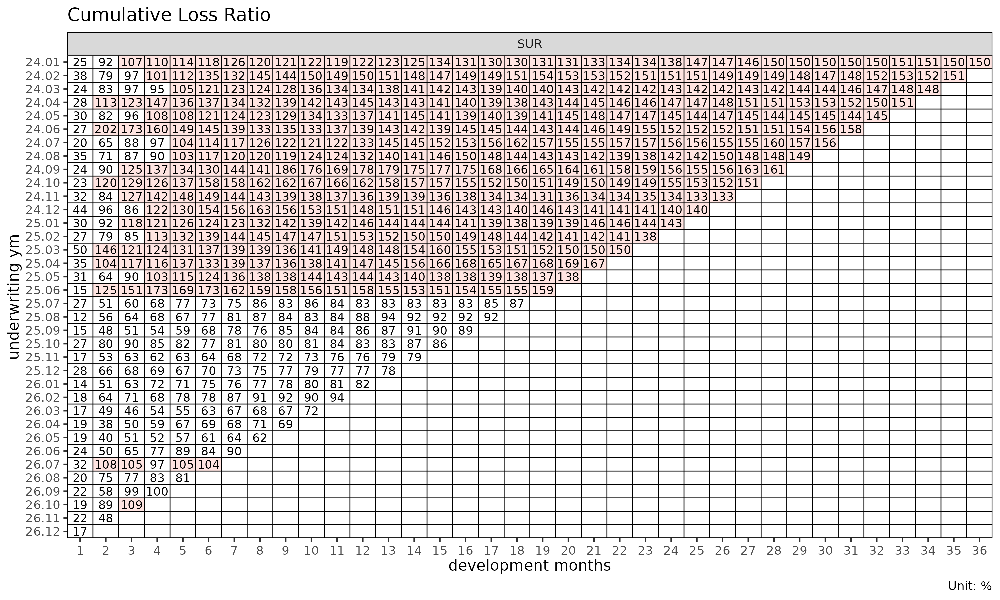
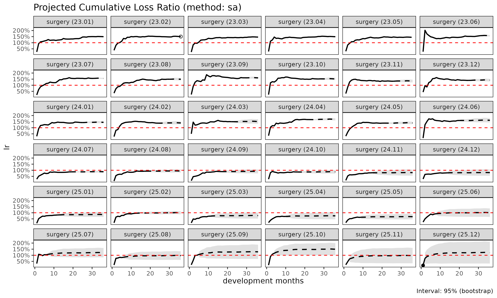

# lossratio 시작하기

> 영어 원본 보기: [Getting started with
> lossratio](https://seokhoonj.github.io/lossratio/getting-started.md)

이 문서는 `lossratio` 의 전체 파이프라인을 내장 합성 experience 데이터
위에서 따라간다. long-format raw 데이터에서 시작하여 적합된 손해율
추정까지 이어진다.

## 입력 형태

`lossratio` 는 long-format experience 데이터를 입력으로 사용한다 — 한
행은 (코호트 × 경과 기간 × 인구통계) 셀 하나에 대응한다. 내장 데이터셋
`experience` 는 33,480 행 테이블로, 여러 단위의 calendar / underwriting
기간 컬럼, 인구통계 차원 (`cv_nm`, `age_band`, `gender`), 금액 컬럼
(`loss`, `rp`) 을 포함한다.

``` r

library(lossratio)

data(experience)
str(experience)
#> Classes 'data.table' and 'data.frame':   33480 obs. of  17 variables:
#>  $ cy      : Date, format: "2023-01-01" "2023-01-01" ...
#>  $ cyh     : Date, format: "2023-01-01" "2023-01-01" ...
#>  $ cyq     : Date, format: "2023-04-01" "2023-04-01" ...
#>  $ cym     : Date, format: "2023-04-01" "2023-04-01" ...
#>  $ uy      : Date, format: "2023-01-01" "2023-01-01" ...
#>  $ uyh     : Date, format: "2023-01-01" "2023-01-01" ...
#>  $ uyq     : Date, format: "2023-04-01" "2023-04-01" ...
#>  $ uym     : Date, format: "2023-04-01" "2023-04-01" ...
#>  $ elap_y  : int  1 1 1 1 1 1 1 1 1 1 ...
#>  $ elap_h  : int  1 1 1 1 1 1 1 1 1 1 ...
#>  $ elap_q  : int  1 1 1 1 1 1 1 1 1 1 ...
#>  $ elap_m  : int  1 1 1 1 1 1 1 1 1 1 ...
#>  $ cv_nm   : chr  "SUR" "SUR" "SUR" "SUR" ...
#>  $ age_band: Ord.factor w/ 9 levels "30-34"<"35-39"<..: 1 1 2 2 3 3 4 4 5 5 ...
#>  $ gender  : Factor w/ 2 levels "M","F": 1 2 1 2 1 2 1 2 1 2 ...
#>  $ loss    : num  0 0 0 0 0 0 0 0 0 0 ...
#>  $ rp      : num  3555865 258448 255420 464313 92744 ...
#>  - attr(*, ".internal.selfref")=<pointer: (nil)>
```

## 1단계 — 검증 및 코어션

``` r

exp <- as_experience(experience)
class(exp)
#> [1] "Experience" "data.table" "data.frame"
```

[`as_experience()`](https://seokhoonj.github.io/lossratio/reference/as_experience.md)
는 필수 컬럼 (`cym`, `uym`, `loss`, `rp`) 의 존재를 확인하고, 날짜
컬럼을 코어션하며, 클래스를 부여한다. 변형 없이 검증만 필요하면
`check_experience(df)` 를 사용한다.

## 2단계 — 코호트 × 경과 기간 구조 구축

``` r

tri <- build_triangle(exp[cv_nm == "SUR"], group_var = cv_nm)
class(tri)
#> [1] "Triangle"   "data.table" "data.frame"
names(tri)
#>  [1] "cv_nm"      "n_obs"      "cohort"     "dev"        "loss"      
#>  [6] "rp"         "closs"      "crp"        "margin"     "cmargin"   
#> [11] "profit"     "cprofit"    "lr"         "clr"        "loss_prop" 
#> [16] "rp_prop"    "closs_prop" "crp_prop"
```

[`build_triangle()`](https://seokhoonj.github.io/lossratio/reference/build_triangle.md)
의 동작:

- 인구통계 차원을 집계하여 제거한다 (여기서는 `age_band`, `gender`),
- 누적 컬럼 (`closs`, `crp`) 을 추가한다,
- 파생 지표 (`margin`, `lr`, `clr`, 비율) 를 추가한다,
- 코호트 / 경과 기간 컬럼을 표준명 `cohort` 와 `dev` 로 rename 한다,
- 원본 컬럼명은 attribute (`cohort_var`, `dev_var`) 로 보존하여 이후
  plot 라벨에서 활용 가능하게 한다.

## 3단계 — 진단

``` r

plot(tri)              # 코호트별 clr 궤적
```


``` r

plot_triangle(tri)     # clr 셀의 heatmap
```



``` r

summary(tri)           # 경과 기간별 그룹 통계량
#> Key: <cv_nm, dev>
#>      cv_nm   dev n_obs   lr_mean lr_median      lr_wt  clr_mean clr_median
#>     <char> <int> <int>     <num>     <num>      <num>     <num>      <num>
#>  1:    SUR     1    30 0.0738546 0.0000000 0.07343113 0.0738546  0.0000000
#>  2:    SUR     2    29 0.5365888 0.0992849 0.54126362 0.3512535  0.1120447
#>  3:    SUR     3    28 0.6201189 0.2472070 0.56590118 0.4521326  0.2618096
#>  4:    SUR     4    27 0.8852657 0.6387164 0.92060611 0.6327242  0.4798531
#>  5:    SUR     5    26 0.5767556 0.4828899 0.59880663 0.6369307  0.5641166
#>  6:    SUR     6    25 0.9314593 0.5431397 0.95085711 0.7264308  0.6191132
#>  7:    SUR     7    24 0.8240033 0.6252286 0.77687370 0.7555932  0.7992795
#>  8:    SUR     8    23 1.1675190 0.7248212 1.27544718 0.8676101  0.7931337
#>  9:    SUR     9    22 0.7525589 0.6155797 0.80158895 0.8755390  0.7890790
#> 10:    SUR    10    21 0.8335086 0.6979443 0.76977519 0.8760001  0.7896553
#> 11:    SUR    11    20 0.9673902 0.8800705 1.00022912 0.8967165  0.8355443
#> 12:    SUR    12    19 0.8517931 0.6947156 0.85401463 0.9051208  0.8833728
#> 13:    SUR    13    18 1.0020059 0.8967964 0.98253067 0.9362016  0.9420986
#> 14:    SUR    14    17 1.0962361 1.0738800 1.16483245 0.9869708  1.0624927
#> 15:    SUR    15    16 0.7760479 0.8230115 0.80108577 0.9870392  1.0459131
#> 16:    SUR    16    15 0.8254441 0.6962883 0.85204193 0.9992647  1.0388452
#> 17:    SUR    17    14 0.9058332 0.8098679 0.90979966 1.0121916  1.0649114
#> 18:    SUR    18    13 1.0184650 1.0848554 1.00362430 1.0518881  1.0717561
#> 19:    SUR    19    12 1.1760267 1.0964987 1.16189899 1.0931503  1.1135768
#> 20:    SUR    20    11 1.0221131 1.0224721 1.00298630 1.1006314  1.1221288
#> 21:    SUR    21    10 1.2370057 1.1559477 1.24931320 1.1032718  1.1256455
#> 22:    SUR    22     9 1.1949424 1.1807304 1.17762170 1.1065793  1.1255582
#> 23:    SUR    23     8 1.2851680 1.3577496 1.31179285 1.1060777  1.1285479
#> 24:    SUR    24     7 1.0598906 0.8375035 1.13727404 1.1000157  1.0774681
#> 25:    SUR    25     6 0.9385597 0.9798018 0.95054947 1.0833124  1.0638356
#> 26:    SUR    26     5 0.8196121 0.9665387 0.85145986 1.0923577  1.0737966
#> 27:    SUR    27     4 1.0466054 1.0672777 1.03231128 1.0684910  1.0866012
#> 28:    SUR    28     3 0.9876176 0.5356686 1.20396265 1.0678995  1.0663302
#> 29:    SUR    29     2 0.9678421 0.9678421 0.96314465 1.0004101  1.0004101
#> 30:    SUR    30     1 0.8877097 0.8877097 0.88770973 0.9318395  0.9318395
#>      cv_nm   dev n_obs   lr_mean lr_median      lr_wt  clr_mean clr_median
#>     <char> <int> <int>     <num>     <num>      <num>     <num>      <num>
#>         clr_wt
#>          <num>
#>  1: 0.07343113
#>  2: 0.35150128
#>  3: 0.44744109
#>  4: 0.63467048
#>  5: 0.63999290
#>  6: 0.72781355
#>  7: 0.75210593
#>  8: 0.86554028
#>  9: 0.87613232
#> 10: 0.87381694
#> 11: 0.89806835
#> 12: 0.90531724
#> 13: 0.93753009
#> 14: 0.98899894
#> 15: 0.99133864
#> 16: 1.00482935
#> 17: 1.01782259
#> 18: 1.05697013
#> 19: 1.09700313
#> 20: 1.10409515
#> 21: 1.10555289
#> 22: 1.10949324
#> 23: 1.10906728
#> 24: 1.10067296
#> 25: 1.08291578
#> 26: 1.09382873
#> 27: 1.07050979
#> 28: 1.07487952
#> 29: 0.99818417
#> 30: 0.93183949
#>         clr_wt
#>          <num>
```

## 4단계 — 경과 기간 모형화

코호트 발달을 보는 두 가지 상호 보완적 관점.

``` r

# ATA 인자(age-to-age factor)
ata <- build_ata(tri, value_var = "closs")
fit_ata(ata)
#> <ATAFit>
#> alpha       : 1 
#> sigma_method: min_last2 
#> recent      : all 
#> regime_break: none 
#> use_maturity: FALSE 
#> groups      : cv_nm 
#> n_groups    : 1 
#> ata links   : 29

# 노출 기반(exposure-driven) 강도
ed <- build_ed(tri, loss_var = "closs", exposure_var = "crp")
fit_ed(ed)
#> <EDFit>
#> method      : basic 
#> loss_var    : closs 
#> exposure_var: crp 
#> alpha       : 1 
#> sigma_method: min_last2 
#> recent      : all 
#> regime_break: none 
#> groups      : cv_nm 
#> n_groups    : 1 
#> links       : 29
```

[`fit_ata()`](https://seokhoonj.github.io/lossratio/reference/fit_ata.md)
는 경과 기간 링크별로 선택된 ATA 인자를 반환한다.
[`fit_ed()`](https://seokhoonj.github.io/lossratio/reference/fit_ed.md)
는 강도 인자 $`g_k = \Delta C^L_k / C^P_k`$ 를 반환한다. 두 출력 모두
아래 추정 방법의 입력으로 사용된다.

## 5단계 — 추정

[`fit_cl()`](https://seokhoonj.github.io/lossratio/reference/fit_cl.md)
은 chain ladder 추정을 수행한다.

``` r

cl <- fit_cl(tri, value_var = "closs", method = "mack")
plot(cl, type = "projection")
```



``` r

summary(cl)
#>      cv_nm     cohort     latest   ultimate    reserve      proc_se    param_se
#>     <char>     <Date>      <num>      <num>      <num>        <num>       <num>
#>  1:    SUR 2023-04-01 2442597048 2442597048          0          0.0         0.0
#>  2:    SUR 2023-05-01 2423543638 2600462324  176918686     270023.8    278555.7
#>  3:    SUR 2023-06-01 3211045460 3634951626  423906166     461673.6    481436.4
#>  4:    SUR 2023-07-01 2552396709 3106052713  553656004  217960839.6 130390124.6
#>  5:    SUR 2023-08-01 2472997706 3159902325  686904619  235800277.9 139803599.9
#>  6:    SUR 2023-09-01 2014222417 2712676349  698453932  230925350.1 124174149.3
#>  7:    SUR 2023-10-01 2422172254 3464336723 1042164469  276909538.1 163800531.1
#>  8:    SUR 2023-11-01 2157147612 3350616805 1193469193  347646646.1 180286627.2
#>  9:    SUR 2023-12-01 2062030017 3510350121 1448320104  379204803.4 195291838.6
#> 10:    SUR 2024-01-01 1803809914 3316423447 1512613533  371903391.7 185291186.8
#> 11:    SUR 2024-02-01 1627213157 3293904272 1666691115  406210629.2 191768888.6
#> 12:    SUR 2024-03-01 1006624213 2212909862 1206285649  348109439.7 131371151.5
#> 13:    SUR 2024-04-01  707083237 1712964993 1005881756  316686848.8 103164315.5
#> 14:    SUR 2024-05-01  398857325 1069653556  670796231  262671178.8  65778222.8
#> 15:    SUR 2024-06-01  558855276 1654603718 1095748442  342800640.3 103939643.9
#> 16:    SUR 2024-07-01  423131371 1378042306  954910935  336548946.6  89486750.7
#> 17:    SUR 2024-08-01  457705980 1642689597 1184983617  387322897.0 109347246.8
#> 18:    SUR 2024-09-01  278007651 1166380310  888372659  360265104.1  81491440.0
#> 19:    SUR 2024-10-01  214811381 1027414214  812602833  358796880.9  74015042.1
#> 20:    SUR 2024-11-01  251273971 1400108561 1148834590  451728990.6 105050619.0
#> 21:    SUR 2024-12-01  322678179 2168358632 1845680453  619598522.3 171876903.1
#> 22:    SUR 2025-01-01  179253475 1403314539 1224061064  523388251.8 114399770.9
#> 23:    SUR 2025-02-01  100816665  954214626  853397961  497168458.4  84734261.7
#> 24:    SUR 2025-03-01  111279087 1488227953 1376948866  843027195.9 163376024.6
#> 25:    SUR 2025-04-01   55914454  958667529  902753075  751897091.4 113958278.9
#> 26:    SUR 2025-05-01   41578391 1041506115  999927724  978637599.4 147793339.1
#> 27:    SUR 2025-06-01   14997314  484991215  469993901  813441277.3  81273429.5
#> 28:    SUR 2025-07-01    6232031  436725855  430493824 5630776358.8 495928426.0
#> 29:    SUR 2025-08-01          0          0          0          0.0         0.0
#> 30:    SUR 2025-09-01          0          0          0          0.0         0.0
#>      cv_nm     cohort     latest   ultimate    reserve      proc_se    param_se
#>     <char>     <Date>      <num>      <num>      <num>        <num>       <num>
#>               se           cv
#>            <num>        <num>
#>  1:          0.0 0.000000e+00
#>  2:     387951.2 1.491855e-04
#>  3:     667025.8 1.835034e-04
#>  4:  253985259.7 8.177107e-02
#>  5:  274129198.7 8.675243e-02
#>  6:  262194082.1 9.665513e-02
#>  7:  321728932.9 9.286884e-02
#>  8:  391613915.1 1.168782e-01
#>  9:  426538609.2 1.215089e-01
#> 10:  415505663.8 1.252873e-01
#> 11:  449201938.9 1.363737e-01
#> 12:  372073328.0 1.681376e-01
#> 13:  333066714.3 1.944387e-01
#> 14:  270782057.7 2.531493e-01
#> 15:  358211848.8 2.164940e-01
#> 16:  348242834.9 2.527084e-01
#> 17:  402462230.4 2.450020e-01
#> 18:  369366755.4 3.166778e-01
#> 19:  366351509.1 3.565763e-01
#> 20:  463783045.7 3.312479e-01
#> 21:  642996110.9 2.965359e-01
#> 22:  535744873.7 3.817711e-01
#> 23:  504337556.8 5.285368e-01
#> 24:  858712162.8 5.770031e-01
#> 25:  760483875.8 7.932718e-01
#> 26:  989734521.0 9.502916e-01
#> 27:  817491334.5 1.685580e+00
#> 28: 5652573520.7 1.294307e+01
#> 29:          0.0           NA
#> 30:          0.0           NA
#>               se           cv
#>            <num>        <num>
```

[`fit_lr()`](https://seokhoonj.github.io/lossratio/reference/fit_lr.md)
은 손해율 추정을 수행한다. 기본값으로 사용되는 단계
적응형(stage-adaptive) 방식 (`method = "sa"`) 은 성숙점(maturity point)
이전에는 노출 기반 방식, 성숙점 이후에는 chain ladder 를 적용한다. 전환
지점은 ATA 인자에서 그룹별로 탐지된 성숙점이다.

``` r

lr <- fit_lr(tri, method = "sa")
plot(lr, type = "lr")
```


``` r

summary(lr)
#>      cv_nm     cohort     latest   ultimate    reserve exposure_ult  lr_latest
#>     <char>     <Date>      <num>      <num>      <num>        <num>      <num>
#>  1:    SUR 2023-04-01 2442597048 2442597048          0   2621263715 0.93183949
#>  2:    SUR 2023-05-01 2423543638 2600462324  176918686   2447179856 1.06560740
#>  3:    SUR 2023-06-01 3211045460 3634951626  423906166   3045660787 1.19909110
#>  4:    SUR 2023-07-01 2552396709 3106052713  553656004   2859002910 1.08237572
#>  5:    SUR 2023-08-01 2472997706 3159902325  686904619   2669412392 1.18159391
#>  6:    SUR 2023-09-01 2014222417 2712676349  698453932   2893769135 0.95080886
#>  7:    SUR 2023-10-01 2422172254 3464336723 1042164469   3094707504 1.14505029
#>  8:    SUR 2023-11-01 2157147612 3350616805 1193469193   2879458974 1.18696133
#>  9:    SUR 2023-12-01 2062030017 3510350121 1448320104   2843155654 1.24103978
#> 10:    SUR 2024-01-01 1803809914 3316423447 1512613533   2974323108 1.11558443
#> 11:    SUR 2024-02-01 1627213157 3293904272 1666691115   2661467254 1.22363541
#> 12:    SUR 2024-03-01 1006624213 2212909862 1206285649   2483209943 0.88837590
#> 13:    SUR 2024-04-01  707083237 1712964993 1005881756   2676093339 0.63405399
#> 14:    SUR 2024-05-01  398857325 1069653556  670796231   2650183003 0.40197017
#> 15:    SUR 2024-06-01  558855276 1654603718 1095748442   2653104690 0.62898298
#> 16:    SUR 2024-07-01  423131371 1378042306  954910935   2758730502 0.51295338
#> 17:    SUR 2024-08-01  457705980 1642689597 1184983617   2949332087 0.58596112
#> 18:    SUR 2024-09-01  278007651 1166380310  888372659   2628969714 0.45517867
#> 19:    SUR 2024-10-01  214811381 1027414214  812602833   2600171974 0.40289870
#> 20:    SUR 2024-11-01  251273971 1400108561 1148834590   2558267999 0.56379157
#> 21:    SUR 2024-12-01  322678179 2168358632 1845680453   2865484259 0.76337614
#> 22:    SUR 2025-01-01  179253475 1403314539 1224061064   2811568885 0.51475151
#> 23:    SUR 2025-02-01  100816665 1246593088 1145776423   3116396285 0.32204866
#> 24:    SUR 2025-03-01  111279087 1859420120 1748141033   2859035735 0.48317257
#> 25:    SUR 2025-04-01   55914454 1706798346 1650883892   2820900062 0.31249884
#> 26:    SUR 2025-05-01   41578391 2113613662 2072035271   3170694661 0.27248380
#> 27:    SUR 2025-06-01   14997314 1815491007 1800493693   2746665555 0.14942419
#> 28:    SUR 2025-07-01    6232031 2701876633 2695644602   3705336068 0.07318336
#> 29:    SUR 2025-08-01          0 2250325450 2250325450   2969197182 0.00000000
#> 30:    SUR 2025-09-01          0 2371913171 2371913171   2995415555 0.00000000
#>      cv_nm     cohort     latest   ultimate    reserve exposure_ult  lr_latest
#>     <char>     <Date>      <num>      <num>      <num>        <num>      <num>
#>        lr_ult maturity_from      proc_se    param_se           se           cv
#>         <num>         <num>        <num>       <num>        <num>        <num>
#>  1: 0.9318395             9          0.0         0.0          0.0 0.0000000000
#>  2: 1.0626364             9     270023.8    278555.7     387951.2 0.0001491855
#>  3: 1.1934854             9     461673.6    481436.4     667025.8 0.0001835034
#>  4: 1.0864112             9  217960839.6 130390124.6  253985259.7 0.0817710719
#>  5: 1.1837445             9  235800277.9 139803599.9  274129198.7 0.0867524279
#>  6: 0.9374198             9  230925350.1 124174149.3  262194082.1 0.0966551289
#>  7: 1.1194391             9  276909538.1 163800531.1  321728932.9 0.0928688400
#>  8: 1.1636272             9  347646646.1 180286627.2  391613915.1 0.1168781564
#>  9: 1.2346669             9  379204803.4 195291838.6  426538609.2 0.1215088508
#> 10: 1.1150179             9  371903391.7 185291186.8  415505663.8 0.1252872772
#> 11: 1.2376272             9  406210629.2 191768888.6  449201938.9 0.1363737078
#> 12: 0.8911489             9  348109439.7 131371151.5  372073328.0 0.1681375886
#> 13: 0.6400991             9  316686848.8 103164315.5  333066714.3 0.1944387163
#> 14: 0.4036150             9  262671178.8  65778222.8  270782057.7 0.2531493082
#> 15: 0.6236481             9  342800640.3 103939643.9  358211848.8 0.2164940432
#> 16: 0.4995205             9  336548946.6  89486750.7  348242834.9 0.2527083771
#> 17: 0.5569700             9  387322897.0 109347246.8  402462230.4 0.2450019962
#> 18: 0.4436644             9  360265104.1  81491440.0  369366755.4 0.3166778043
#> 19: 0.3951332             9  358796880.9  74015042.1  366351509.1 0.3565762514
#> 20: 0.5472877             9  451728990.6 105050619.0  463783045.7 0.3312479179
#> 21: 0.7567163             9  619598522.3 171876903.1  642996110.9 0.2965358689
#> 22: 0.4991215             9  523388251.8 114399770.9  535744873.7 0.3817710561
#> 23: 0.4000111             9  701160983.1 151966055.9  717440176.1 0.5755207396
#> 24: 0.6503662             9 1008915827.7 229980336.9 1034795681.6 0.5565152653
#> 25: 0.6050545             9 1022367650.8 226433230.3 1047142598.3 0.6135127800
#> 26: 0.6666090             9 1151829299.7 274237738.8 1184025790.7 0.5601902618
#> 27: 0.6609800             9 1079112766.9 238225282.2 1105095312.1 0.6087032698
#> 28: 0.7291853             9 1349660358.1 349060403.8 1394068236.4 0.5159629494
#> 29: 0.7578902             9 1225790727.8 285878838.0 1258685671.0 0.5593349490
#> 30: 0.7918478             9 1250626904.3 295553950.3 1285075792.0 0.5417887162
#>        lr_ult maturity_from      proc_se    param_se           se           cv
#>         <num>         <num>        <num>       <num>        <num>        <num>
#>            se_lr        cv_lr  ci_lower  ci_upper
#>            <num>        <num>     <num>     <num>
#>  1: 0.0000000000 0.0000000000 0.9318395 0.9318395
#>  2: 0.0001585299 0.0001491855 1.0623257 1.0629471
#>  3: 0.0002190086 0.0001835034 1.1930561 1.1939146
#>  4: 0.0888370064 0.0817710719 0.9122938 1.2605285
#>  5: 0.1026927123 0.0867524279 0.9824705 1.3850186
#>  6: 0.0906064271 0.0966551289 0.7598344 1.1150051
#>  7: 0.1039610149 0.0928688400 0.9156793 1.3231990
#>  8: 0.1360026028 0.1168781564 0.8970670 1.4301874
#>  9: 0.1500229537 0.1215088508 0.9406273 1.5287065
#> 10: 0.1396975543 0.1252872772 0.8412157 1.3888201
#> 11: 0.1687798105 0.1363737078 0.9068249 1.5684296
#> 12: 0.1498356307 0.1681375886 0.5974765 1.1848214
#> 13: 0.1244600513 0.1944387163 0.3961619 0.8840363
#> 14: 0.1021748526 0.2531493082 0.2033559 0.6038740
#> 15: 0.1350161002 0.2164940432 0.3590214 0.8882748
#> 16: 0.1262330027 0.2527083771 0.2521083 0.7469326
#> 17: 0.1364587705 0.2450019962 0.2895158 0.8244243
#> 18: 0.1404986727 0.3166778043 0.1682921 0.7190368
#> 19: 0.1408951072 0.3565762514 0.1189838 0.6712825
#> 20: 0.1812879049 0.3312479179 0.1919699 0.9026054
#> 21: 0.2243935241 0.2965358689 0.3169131 1.1965195
#> 22: 0.1905501503 0.3817710561 0.1256501 0.8725930
#> 23: 0.2302146808 0.5755207396 0.0000000 0.8512236
#> 24: 0.3619387016 0.5565152653 0.0000000 1.3597530
#> 25: 0.3712086835 0.6135127800 0.0000000 1.3326102
#> 26: 0.3734278817 0.5601902618 0.0000000 1.3985142
#> 27: 0.4023406891 0.6087032698 0.0000000 1.4495533
#> 28: 0.3762326036 0.5159629494 0.0000000 1.4665877
#> 29: 0.4239144772 0.5593349490 0.0000000 1.5887473
#> 30: 0.4290141947 0.5417887162 0.0000000 1.6327002
#>            se_lr        cv_lr  ci_lower  ci_upper
#>            <num>        <num>     <num>     <num>
```

## 6단계 — 구조 변화 진단

[`detect_cohort_regime()`](https://seokhoonj.github.io/lossratio/reference/detect_cohort_regime.md)
은 최근 코호트가 이전 코호트와 다르게 행동하는지 검사한다. 동질적
부분집합에 한하여 손해율 적합을 수행하기 위한 전처리 단계로 활용된다.

``` r

sub <- build_triangle(exp[cv_nm == "SUR"], group_var = cv_nm)
detect_cohort_regime(sub, K = 12, method = "ecp")
#> <CohortRegime>
#>   method      : ecp
#>   value_var   : clr
#>   window (K)  : elap_m 1, ..., 12
#>   cohorts     : 19 analysed (11 dropped)
#>   regimes     : 2
#>   breakpoints : 24.03
#>   PC1 / PC2   : 63.6% / 15.1%
```

상세 설명은
[`vignette("regime-detection")`](https://seokhoonj.github.io/lossratio/articles/regime-detection.md)
을 참고한다.

## 다음 단계

- [`vignette("aggregation-frameworks")`](https://seokhoonj.github.io/lossratio/articles/aggregation-frameworks.md)
  — `build_triangle`, `build_calendar`, `build_total` 의 사용 시점 비교.
- [`vignette("loss-ratio-methods")`](https://seokhoonj.github.io/lossratio/articles/loss-ratio-methods.md)
  —
  [`fit_lr()`](https://seokhoonj.github.io/lossratio/reference/fit_lr.md)
  에서 `"sa"` / `"ed"` / `"cl"` 중 선택 기준.
- [`vignette("chain-ladder")`](https://seokhoonj.github.io/lossratio/articles/chain-ladder.md)
  —
  [`fit_cl()`](https://seokhoonj.github.io/lossratio/reference/fit_cl.md)
  심층 해설 (Mack 분산, tail factor).
- [`vignette("triangle-diagnostics")`](https://seokhoonj.github.io/lossratio/articles/triangle-diagnostics.md)
  — [`summary()`](https://rdrr.io/r/base/summary.html),
  [`find_ata_maturity()`](https://seokhoonj.github.io/lossratio/reference/find_ata_maturity.md),
  triangle 형식의 시각화.
- [`vignette("regime-detection")`](https://seokhoonj.github.io/lossratio/articles/regime-detection.md)
  —
  [`detect_cohort_regime()`](https://seokhoonj.github.io/lossratio/reference/detect_cohort_regime.md)
  을 통한 코호트 간 구조 변화 진단.
- [`vignette("backtest")`](https://seokhoonj.github.io/lossratio/articles/backtest.md)
  — `fit_cl` 또는 `fit_lr` 을 사용한 대각선 홀드아웃(holdout) 검증.
