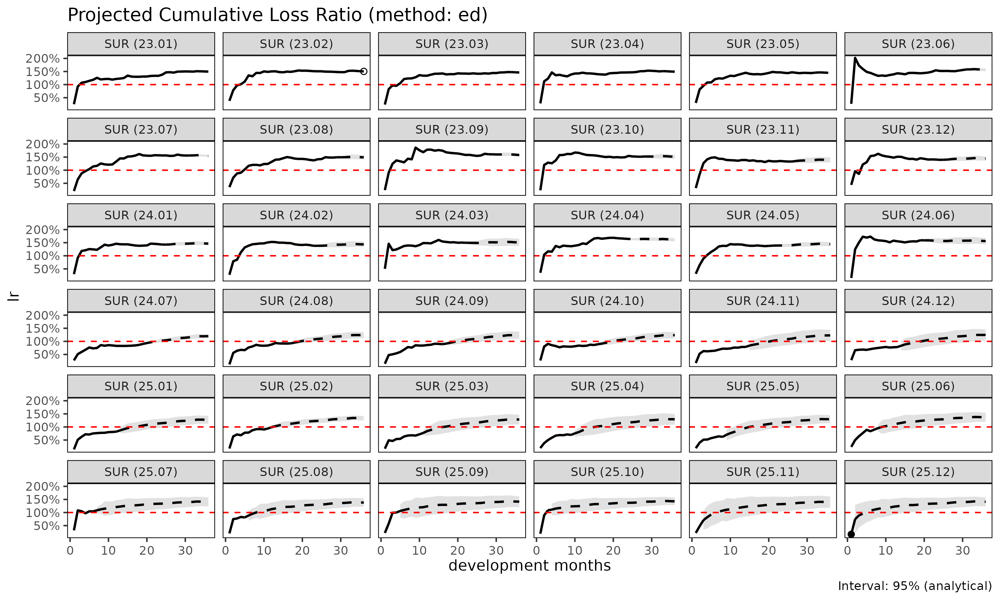

# Projection: 손해율 예측 (SA, ED, CL)

> 영어 원본 보기: [Loss-ratio projection methods: SA, ED,
> CL](https://seokhoonj.github.io/lossratio/loss-ratio-methods.md)

[`fit_lr()`](https://seokhoonj.github.io/lossratio/reference/fit_lr.md)
은 `Triangle` 객체로부터 코호트별 누적 손해율을 추정한다. 세 가지 방법이
제공되며, 본 문서는 각 방법의 장단점을 설명한다.

## 표기

코호트 $`i`$, dev $`k`$ 에 대하여:

- $`C^L_{i,k}`$ — 누적 손해액
- $`C^P_{i,k}`$ — 누적 위험보험료 (익스포저)
- $`f_k = C^L_{k+1} / C^L_k`$ — ATA 인자(age-to-age factor)
- $`g_k = \Delta C^L_k / C^P_k`$ — 노출 기반(exposure-driven, ED) 강도
- 성숙점(maturity point) $`m_g`$ — 그룹 $`g`$ 에서 $`f_k`$ 가 안정화되는
  dev (CV / RSE 임계값으로 탐지)

## 방법 1: 단계 적응형(stage-adaptive, SA) (`"sa"`, default)

기본 방법은 $`f_k`$ 가 초반에는 변동성이 크고 후반에는 안정적이라는
사실, 그리고 $`g_k`$ 는 그 반대로 움직인다는 사실을 활용한다. SA 는
성숙점에서 추정량을 전환한다:

``` math
\hat{C}^L_{i,k+1} \;=\;
\begin{cases}
\hat{C}^L_{i,k} + g_k \cdot C^P_{i,k} & k < m_g \quad \text{(성숙점 이전: ED)} \\
f_k \cdot \hat{C}^L_{i,k}              & k \ge m_g \quad \text{(성숙점 이후: CL)}
\end{cases}
```

특성:

- **성숙점 이전**: 손해 추정치가 익스포저에 비례한다. 초기 $`f_k`$ 가
  노이즈로 폭주하는 문제를 회피한다.
- **성숙점 이후**: 코호트 자체의 관측 수준을 보존한다. ED 방법이
  꼬리에서 모든 코호트를 평균으로 끌어당기는 문제를 회피한다.

사용 시점:

- 발달이 여러 해에 걸치는 long-tail 상품.
- 최근 코호트(미성숙 데이터)와 오래된 코호트(성숙 데이터)가 혼재하는
  경우.
- 성숙점 이전·이후의 구조적 차이가 있는 건강보험 코호트 (예: 면책기간
  전환).

``` r

library(lossratio)
data(experience)
exp <- as_experience(experience)
tri <- build_triangle(exp[coverage == "SUR"], group_var = coverage)

lr_sa <- fit_lr(tri, method = "sa")        # default
plot(lr_sa, type = "lr")
```


``` r

summary(lr_sa)
#>     coverage     cohort     latest   loss_ult    reserve premium_ult lr_latest
#>       <char>     <Date>      <num>      <num>      <num>       <num>     <num>
#>  1:      SUR 2024-01-01  410248523  410248523          0   274192568 1.4962058
#>  2:      SUR 2024-02-01  976330446 1001441304   25110859   665667724 1.5107824
#>  3:      SUR 2024-03-01  978486044 1026151241   47665197   702047332 1.4771448
#>  4:      SUR 2024-04-01 2029909922 2186771224  156861302  1464399411 1.5139132
#>  5:      SUR 2024-05-01  624219442  697669308   73449866   483147254 1.4543749
#>  6:      SUR 2024-06-01  802880717  931393933  128513217   591568800 1.5796369
#>  7:      SUR 2024-07-01 2539141550 3050990158  511848609  1958263736 1.5597190
#>  8:      SUR 2024-08-01  393678329  488218204   94539875   327535561 1.4945957
#>  9:      SUR 2024-09-01 1364052543 1751869309  387816766  1091733893 1.6079808
#> 10:      SUR 2024-10-01  979266044 1311793844  332527800   864204933 1.5129473
#> 11:      SUR 2024-11-01  604685680  848103124  243417444   630311112 1.3298743
#> 12:      SUR 2024-12-01 1026345365 1497869026  471523662  1057060864 1.3981081
#> 13:      SUR 2025-01-01 1912177598 2901492850  989315252  2009045338 1.4274951
#> 14:      SUR 2025-02-01  733902485 1160045952  426143467   832229794 1.3793745
#> 15:      SUR 2025-03-01  415459872  686574146  271114274   454345989 1.4969280
#> 16:      SUR 2025-04-01 3286053525 5687484009 2401430484  3372494517 1.6712898
#> 17:      SUR 2025-05-01 1451731151 2645801834 1194070683  1899849125 1.3770835
#> 18:      SUR 2025-06-01  629668308 1209024555  579356246   750125232 1.5918247
#> 19:      SUR 2025-07-01 1250954692 2542927187 1291972495  2891548083 0.8658750
#> 20:      SUR 2025-08-01  425346694  918120581  492773887   976935240 0.9236050
#> 21:      SUR 2025-09-01  278156543  635470027  357313485   703906577 0.8920448
#> 22:      SUR 2025-10-01  352070325  856446527  504376201   984833526 0.8596968
#> 23:      SUR 2025-11-01   99050502  260916098  161865596   324081361 0.7871749
#> 24:      SUR 2025-12-01  103194015  295637302  192443287   366444617 0.7813438
#> 25:      SUR 2026-01-01  227089023  710560088  483471065   833732379 0.8188282
#> 26:      SUR 2026-02-01  939163073 3276849148 2337686075  3286151359 0.9377837
#> 27:      SUR 2026-03-01  112828843  434950050  322121207   566316401 0.7193486
#> 28:      SUR 2026-04-01   82472453  356301149  273828696   476819836 0.6947510
#> 29:      SUR 2026-05-01  141214851  697290588  556075737  1027051058 0.6203897
#> 30:      SUR 2026-06-01  136406104  789468809  653062706   783037478 0.8981587
#> 31:      SUR 2026-07-01  149144024 1040451732  891307708   859730817 1.0440457
#> 32:      SUR 2026-08-01  116327076 1008356737  892029661  1037192179 0.8100543
#> 33:      SUR 2026-09-01   67465470  783000254  715534784   611257146 0.9985960
#> 34:      SUR 2026-10-01  121626172 2001214853 1879588681  1338462730 1.0894657
#> 35:      SUR 2026-11-01   15716444  576954666  561238222   593147597 0.4765917
#> 36:      SUR 2026-12-01    4825085 1246569317 1241744232  1022559933 0.1689836
#>     coverage     cohort     latest   loss_ult    reserve premium_ult lr_latest
#>       <char>     <Date>      <num>      <num>      <num>       <num>     <num>
#>        lr_ult maturity_from   proc_se param_se        se          cv
#>         <num>         <int>     <num>    <num>     <num>       <num>
#>  1: 1.4962058             3         0        0         0 0.000000000
#>  2: 1.5044162             3   2531458  3955123   4695878 0.004689120
#>  3: 1.4616554             3   3814581  4714708   6064610 0.005910055
#>  4: 1.4932888             3   6757376 10681348  12639356 0.005779917
#>  5: 1.4440097             3   4363670  3505408   5597276 0.008022821
#>  6: 1.5744474             3  17839243  8552360  19783363 0.021240596
#>  7: 1.5580078             3  35868594 30065540  46802699 0.015340167
#>  8: 1.4905808             3  15565580  5005702  16350668 0.033490492
#>  9: 1.6046670             3  37974812 20617469  43210721 0.024665493
#> 10: 1.5179199             3  38476284 16848121  42003377 0.032019800
#> 11: 1.3455310             3  35705775 11815794  37610044 0.044346074
#> 12: 1.4170130             3  51388393 21863585  55846068 0.037283679
#> 13: 1.4442147             3  75652022 43699697  87366423 0.030110852
#> 14: 1.3939010             3  51706358 18164458  54804152 0.047243087
#> 15: 1.5111262             3  41303604 10953686  42731382 0.062238553
#> 16: 1.6864324             3 122743326 92193953 153511071 0.026991033
#> 17: 1.3926379             3  93007572 44820097 103243641 0.039021683
#> 18: 1.6117636             3  65335432 20807951  68568866 0.056714205
#> 19: 0.8794345             3 103122195 45366891 112660294 0.044303390
#> 20: 0.9397968             3  65309695 16748105  67422958 0.073435843
#> 21: 0.9027761             3  56730542 11811345  57947064 0.091187722
#> 22: 0.8696358             3  68083946 16155428  69974434 0.081703215
#> 23: 0.8050944             3  41783536  5172148  42102435 0.161363884
#> 24: 0.8067721             3  49613732  6201747  49999841 0.169125616
#> 25: 0.8522640             3  83630550 15622535  85077215 0.119732612
#> 26: 0.9971693             3 192408733 75019695 206516525 0.063022897
#> 27: 0.7680336             3  72341864 10134999  73048364 0.167946558
#> 28: 0.7472448             3  68971255  8554342  69499718 0.195058921
#> 29: 0.6789249             3 119235587 19138513 120761781 0.173187167
#> 30: 1.0082133             3 136625294 22795772 138513964 0.175452104
#> 31: 1.2102064             3 167035988 31397120 169961173 0.163353252
#> 32: 0.9721986             3 183650168 32943523 186581510 0.185035220
#> 33: 1.2809670             3 179944507 27681868 182061285 0.232517530
#> 34: 1.4951592             3 337099735 80042629 346472299 0.173130985
#> 35: 0.9727000             3 234640499 29914321 236539702 0.409979702
#> 36: 1.2190672             3 419066540 73439928 425452921 0.341299048
#>        lr_ult maturity_from   proc_se param_se        se          cv
#>         <num>         <int>     <num>    <num>     <num>       <num>
#>           se_lr       cv_lr  ci_lower  ci_upper
#>           <num>       <num>     <num>     <num>
#>  1: 0.000000000 0.000000000 1.4962058 1.4962058
#>  2: 0.007054388 0.004689120 1.4905898 1.5182425
#>  3: 0.008638464 0.005910055 1.4447243 1.4785864
#>  4: 0.008631085 0.005779917 1.4763722 1.5102054
#>  5: 0.011585030 0.008022821 1.4213034 1.4667159
#>  6: 0.033442201 0.021240596 1.5089018 1.6399929
#>  7: 0.023900100 0.015340167 1.5111645 1.6048511
#>  8: 0.049920282 0.033490492 1.3927388 1.5884227
#>  9: 0.039579902 0.024665493 1.5270918 1.6822421
#> 10: 0.048603491 0.032019800 1.4226588 1.6131810
#> 11: 0.059669016 0.044346074 1.2285819 1.4624801
#> 12: 0.052831459 0.037283679 1.3134653 1.5205608
#> 13: 0.043486536 0.030110852 1.3589827 1.5294468
#> 14: 0.065852187 0.047243087 1.2648331 1.5229689
#> 15: 0.094050311 0.062238553 1.3267910 1.6954615
#> 16: 0.045518553 0.026991033 1.5972177 1.7756471
#> 17: 0.054343074 0.039021683 1.2861274 1.4991483
#> 18: 0.091409892 0.056714205 1.4326035 1.7909237
#> 19: 0.038961930 0.044303390 0.8030705 0.9557985
#> 20: 0.069014768 0.073435843 0.8045303 1.0750632
#> 21: 0.082322095 0.091187722 0.7414277 1.0641244
#> 22: 0.071052043 0.081703215 0.7303764 1.0088953
#> 23: 0.129913164 0.161363884 0.5504693 1.0597195
#> 24: 0.136445832 0.169125616 0.5393432 1.0742010
#> 25: 0.102043794 0.119732612 0.6522618 1.0522662
#> 26: 0.062844496 0.063022897 0.8739963 1.1203422
#> 27: 0.128988608 0.167946558 0.5152206 1.0208467
#> 28: 0.145756766 0.195058921 0.4615668 1.0329228
#> 29: 0.117581088 0.173187167 0.4484703 0.9093796
#> 30: 0.176893147 0.175452104 0.6615091 1.3549175
#> 31: 0.197691149 0.163353252 0.8227389 1.5976739
#> 32: 0.179890973 0.185035220 0.6196187 1.3247784
#> 33: 0.297847291 0.232517530 0.6971971 1.8647370
#> 34: 0.258858384 0.173130985 0.9878061 2.0025123
#> 35: 0.398787255 0.409979702 0.1910913 1.7543087
#> 36: 0.416066489 0.341299048 0.4035919 2.0345426
#>           se_lr       cv_lr  ci_lower  ci_upper
#>           <num>       <num>     <num>     <num>
```

## 방법 2: 노출 기반(exposure-driven, ED) (`"ed"`)

모든 미래 증분에 ED 를 적용한다:

``` math
\hat{C}^L_{i,k+1} = \hat{C}^L_{i,k} + g_k \cdot C^P_{i,k}
```

특성:

- 보험료 규모가 전체 발달 구간에서 신뢰할 만한 신호일 때 안정적이다.
- 코호트 고유의 수준 신호를 잃는다 — 관측 손해가 더 높은 코호트도 그룹
  단위 $`g_k`$ 로 수렴한다.

사용 시점:

- chain ladder 의 이점이 없는 short-tail 상품.
- 모든 link 에서 ATA 계수가 신뢰할 수 없는 희소 데이터.
- SA / CL 과 비교하여 확인 차 점검 용도.

``` r

lr_ed <- fit_lr(tri, method = "ed")
plot(lr_ed, type = "lr")
```



## 방법 3: 고전적 chain ladder (`"cl"`)

고전적 Mack (1993) 모형:

``` math
\hat{C}^L_{i,k+1} = f_k \cdot \hat{C}^L_{i,k}
```

특성:

- 표준적인 적립 실무. 손해 예측에 한해서는
  `fit_cl(tri, loss_var = "loss")` 과 동등하지만,
  [`fit_lr()`](https://seokhoonj.github.io/lossratio/reference/fit_lr.md)
  은 추가로 `premium` 에 대한 CL 로 익스포저를 전방 추정하고 delta
  method 로 손해율 불확실성을 계산한다.
- 초기 $`f_k`$ 에 노이즈가 있을 때 변동성이 크다 — 작은 분모가 link
  오차를 증폭한다.

사용 시점:

- ATA 계수가 전체 발달 구간에서 안정적인 성숙 포트폴리오.
- 규제 당국이 문서화 목적으로 고전적 Mack 형식을 요구하는 적립 작업.

``` r

lr_cl <- fit_lr(tri, method = "cl")
plot(lr_cl, type = "lr")
```


## 비교

``` r

lrs <- list(
  sa = fit_lr(tri, method = "sa"),
  ed = fit_lr(tri, method = "ed"),
  cl = fit_lr(tri, method = "cl")
)

# 코호트 단위 요약
summary(lrs$sa)$loss_ult
#>  [1]  410248523 1001441304 1026151241 2186771224  697669308  931393933
#>  [7] 3050990158  488218204 1751869309 1311793844  848103124 1497869026
#> [13] 2901492850 1160045952  686574146 5687484009 2645801834 1209024555
#> [19] 2542927187  918120581  635470027  856446527  260916098  295637302
#> [25]  710560088 3276849148  434950050  356301149  697290588  789468809
#> [31] 1040451732 1008356737  783000254 2001214853  576954666 1246569317
summary(lrs$ed)$loss_ult
#>  [1]  410248523 1001304262 1027365213 2186835973  700124208  924502356
#>  [7] 3028986424  488454953 1725804921 1308019739  876716311 1527010389
#> [13] 2942802609 1193629492  685046660 5424401584 2740753227 1170293303
#> [19] 3461664511 1212435164  870725770 1217843287  398006957  456590850
#> [25] 1064623871 4386331023  727050150  616924305 1330756287 1072907082
#> [31] 1209357476 1432029255  865239649 1911124853  828091914 1442904484
summary(lrs$cl)$loss_ult
#>  [1]  410248523 1001441304 1026151241 2186771224  697669308  931393933
#>  [7] 3050990158  488218204 1751869309 1311793844  848103124 1497869026
#> [13] 2901492850 1160045952  686574146 5687484009 2645801834 1209024555
#> [19] 2542927187  918120581  635470027  856446527  260916098  295637302
#> [25]  710560088 3276849148  434950050  356301149  697290588  789468809
#> [31] 1040451732 1008356737  783000254 2001214853  449653411  850839165
```

## 분산과 신뢰구간

[`fit_lr()`](https://seokhoonj.github.io/lossratio/reference/fit_lr.md)
은 delta method 로 해석적 표준오차를 산출한다. delta method 변형은 두
가지이다:

- `delta_method = "simple"` (default) — 익스포저를 고정으로 취급,
  $`\mathrm{SE}(L/E) \approx \mathrm{SE}(L)/E`$.
- `delta_method = "full"` — 익스포저 불확실성과 손해-익스포저 상관계수
  `rho` 를 반영한다:

``` math
\mathrm{Var}(L/E) \approx \frac{\mathrm{Var}(L)}{E^2}
  + \frac{L^2 \mathrm{Var}(E)}{E^4}
  - \frac{2 \rho L \mathrm{SE}(L) \mathrm{SE}(E)}{E^3}
```

부트스트랩 구간도 사용 가능하다:

``` r

lr_boot <- fit_lr(tri, method = "sa", bootstrap = TRUE, B = 1000, seed = 1)
summary(lr_boot)
#>     coverage     cohort     latest   loss_ult    reserve premium_ult lr_latest
#>       <char>     <Date>      <num>      <num>      <num>       <num>     <num>
#>  1:      SUR 2024-01-01  410248523  410248523          0   274192568 1.4962058
#>  2:      SUR 2024-02-01  976330446 1001441304   25110859   665667724 1.5107824
#>  3:      SUR 2024-03-01  978486044 1026151241   47665197   702047332 1.4771448
#>  4:      SUR 2024-04-01 2029909922 2186771224  156861302  1464399411 1.5139132
#>  5:      SUR 2024-05-01  624219442  697669308   73449866   483147254 1.4543749
#>  6:      SUR 2024-06-01  802880717  931393933  128513217   591568800 1.5796369
#>  7:      SUR 2024-07-01 2539141550 3050990158  511848609  1958263736 1.5597190
#>  8:      SUR 2024-08-01  393678329  488218204   94539875   327535561 1.4945957
#>  9:      SUR 2024-09-01 1364052543 1751869309  387816766  1091733893 1.6079808
#> 10:      SUR 2024-10-01  979266044 1311793844  332527800   864204933 1.5129473
#> 11:      SUR 2024-11-01  604685680  848103124  243417444   630311112 1.3298743
#> 12:      SUR 2024-12-01 1026345365 1497869026  471523662  1057060864 1.3981081
#> 13:      SUR 2025-01-01 1912177598 2901492850  989315252  2009045338 1.4274951
#> 14:      SUR 2025-02-01  733902485 1160045952  426143467   832229794 1.3793745
#> 15:      SUR 2025-03-01  415459872  686574146  271114274   454345989 1.4969280
#> 16:      SUR 2025-04-01 3286053525 5687484009 2401430484  3372494517 1.6712898
#> 17:      SUR 2025-05-01 1451731151 2645801834 1194070683  1899849125 1.3770835
#> 18:      SUR 2025-06-01  629668308 1209024555  579356246   750125232 1.5918247
#> 19:      SUR 2025-07-01 1250954692 2542927187 1291972495  2891548083 0.8658750
#> 20:      SUR 2025-08-01  425346694  918120581  492773887   976935240 0.9236050
#> 21:      SUR 2025-09-01  278156543  635470027  357313485   703906577 0.8920448
#> 22:      SUR 2025-10-01  352070325  856446527  504376201   984833526 0.8596968
#> 23:      SUR 2025-11-01   99050502  260916098  161865596   324081361 0.7871749
#> 24:      SUR 2025-12-01  103194015  295637302  192443287   366444617 0.7813438
#> 25:      SUR 2026-01-01  227089023  710560088  483471065   833732379 0.8188282
#> 26:      SUR 2026-02-01  939163073 3276849148 2337686075  3286151359 0.9377837
#> 27:      SUR 2026-03-01  112828843  434950050  322121207   566316401 0.7193486
#> 28:      SUR 2026-04-01   82472453  356301149  273828696   476819836 0.6947510
#> 29:      SUR 2026-05-01  141214851  697290588  556075737  1027051058 0.6203897
#> 30:      SUR 2026-06-01  136406104  789468809  653062706   783037478 0.8981587
#> 31:      SUR 2026-07-01  149144024 1040451732  891307708   859730817 1.0440457
#> 32:      SUR 2026-08-01  116327076 1008356737  892029661  1037192179 0.8100543
#> 33:      SUR 2026-09-01   67465470  783000254  715534784   611257146 0.9985960
#> 34:      SUR 2026-10-01  121626172 2001214853 1879588681  1338462730 1.0894657
#> 35:      SUR 2026-11-01   15716444  576954666  561238222   593147597 0.4765917
#> 36:      SUR 2026-12-01    4825085 1246569317 1241744232  1022559933 0.1689836
#>     coverage     cohort     latest   loss_ult    reserve premium_ult lr_latest
#>       <char>     <Date>      <num>      <num>      <num>       <num>     <num>
#>        lr_ult maturity_from   proc_se param_se        se          cv
#>         <num>         <int>     <num>    <num>     <num>       <num>
#>  1: 1.4962058             3         0        0         0 0.000000000
#>  2: 1.5044162             3   2531458  3955123   4695878 0.004689120
#>  3: 1.4616554             3   3814581  4714708   6064610 0.005910055
#>  4: 1.4932888             3   6757376 10681348  12639356 0.005779917
#>  5: 1.4440097             3   4363670  3505408   5597276 0.008022821
#>  6: 1.5744474             3  17839243  8552360  19783363 0.021240596
#>  7: 1.5580078             3  35868594 30065540  46802699 0.015340167
#>  8: 1.4905808             3  15565580  5005702  16350668 0.033490492
#>  9: 1.6046670             3  37974812 20617469  43210721 0.024665493
#> 10: 1.5179199             3  38476284 16848121  42003377 0.032019800
#> 11: 1.3455310             3  35705775 11815794  37610044 0.044346074
#> 12: 1.4170130             3  51388393 21863585  55846068 0.037283679
#> 13: 1.4442147             3  75652022 43699697  87366423 0.030110852
#> 14: 1.3939010             3  51706358 18164458  54804152 0.047243087
#> 15: 1.5111262             3  41303604 10953686  42731382 0.062238553
#> 16: 1.6864324             3 122743326 92193953 153511071 0.026991033
#> 17: 1.3926379             3  93007572 44820097 103243641 0.039021683
#> 18: 1.6117636             3  65335432 20807951  68568866 0.056714205
#> 19: 0.8794345             3 103122195 45366891 112660294 0.044303390
#> 20: 0.9397968             3  65309695 16748105  67422958 0.073435843
#> 21: 0.9027761             3  56730542 11811345  57947064 0.091187722
#> 22: 0.8696358             3  68083946 16155428  69974434 0.081703215
#> 23: 0.8050944             3  41783536  5172148  42102435 0.161363884
#> 24: 0.8067721             3  49613732  6201747  49999841 0.169125616
#> 25: 0.8522640             3  83630550 15622535  85077215 0.119732612
#> 26: 0.9971693             3 192408733 75019695 206516525 0.063022897
#> 27: 0.7680336             3  72341864 10134999  73048364 0.167946558
#> 28: 0.7472448             3  68971255  8554342  69499718 0.195058921
#> 29: 0.6789249             3 119235587 19138513 120761781 0.173187167
#> 30: 1.0082133             3 136625294 22795772 138513964 0.175452104
#> 31: 1.2102064             3 167035988 31397120 169961173 0.163353252
#> 32: 0.9721986             3 183650168 32943523 186581510 0.185035220
#> 33: 1.2809670             3 179944507 27681868 182061285 0.232517530
#> 34: 1.4951592             3 337099735 80042629 346472299 0.173130985
#> 35: 0.9727000             3 234640499 29914321 236539702 0.409979702
#> 36: 1.2190672             3 419066540 73439928 425452921 0.341299048
#>        lr_ult maturity_from   proc_se param_se        se          cv
#>         <num>         <int>     <num>    <num>     <num>       <num>
#>           se_lr       cv_lr  ci_lower  ci_upper
#>           <num>       <num>     <num>     <num>
#>  1: 0.000000000 0.000000000 1.4962058 1.4962058
#>  2: 0.007054388 0.004689120 1.4900410 1.5190444
#>  3: 0.008638464 0.005910055 1.4457832 1.4782062
#>  4: 0.008631085 0.005779917 1.4762239 1.5098755
#>  5: 0.011585030 0.008022821 1.4221754 1.4671923
#>  6: 0.033442201 0.021240596 1.5139488 1.6410146
#>  7: 0.023900100 0.015340167 1.5110127 1.6057587
#>  8: 0.049920282 0.033490492 1.3874240 1.5882889
#>  9: 0.039579902 0.024665493 1.5268819 1.6861677
#> 10: 0.048603491 0.032019800 1.4267519 1.6104759
#> 11: 0.059669016 0.044346074 1.2308650 1.4671918
#> 12: 0.052831459 0.037283679 1.3247259 1.5255438
#> 13: 0.043486536 0.030110852 1.3642183 1.5339304
#> 14: 0.065852187 0.047243087 1.2617745 1.5321123
#> 15: 0.094050311 0.062238553 1.3271930 1.6974832
#> 16: 0.045518553 0.026991033 1.5981950 1.7726907
#> 17: 0.054343074 0.039021683 1.2798190 1.5006138
#> 18: 0.091409892 0.056714205 1.4360511 1.7920311
#> 19: 0.038961930 0.044303390 0.8016198 0.9550761
#> 20: 0.069014768 0.073435843 0.8186016 1.0805163
#> 21: 0.082322095 0.091187722 0.7539222 1.0729461
#> 22: 0.071052043 0.081703215 0.7369534 1.0057693
#> 23: 0.129913164 0.161363884 0.5672476 1.0607556
#> 24: 0.136445832 0.169125616 0.5531803 1.0856623
#> 25: 0.102043794 0.119732612 0.6632957 1.0695072
#> 26: 0.062844496 0.063022897 0.8803902 1.1245324
#> 27: 0.128988608 0.167946558 0.5164493 1.0442661
#> 28: 0.145756766 0.195058921 0.4829398 1.0720023
#> 29: 0.117581088 0.173187167 0.4440307 0.9168333
#> 30: 0.176893147 0.175452104 0.6806617 1.3836505
#> 31: 0.197691149 0.163353252 0.8569689 1.6073496
#> 32: 0.179890973 0.185035220 0.6401359 1.3185058
#> 33: 0.297847291 0.232517530 0.7341140 1.9094453
#> 34: 0.258858384 0.173130985 1.0185289 2.0239721
#> 35: 0.398787255 0.409979702 0.2617644 1.8275699
#> 36: 0.416066489 0.341299048 0.5014549 2.1104290
#>           se_lr       cv_lr  ci_lower  ci_upper
#>           <num>       <num>     <num>     <num>
```

## 방법 선택

SA 는 성숙점 이전엔 ED, 이후엔 CL 로 자연 전환하는 결합이다. 따라서
일반적으로 `"sa"` 가 기본값이고, `"cl"` 과 `"ed"` 는 SA 의 한쪽 영역이
무의미해지는 특수 케이스일 때만 선택한다.

    기본은 "sa" — 성숙점 이전엔 ED, 이후엔 CL 로 자연 전환.

    특수 케이스로만 "cl" 또는 "ed":
      ├── 모든 코호트가 이미 성숙점 이후
      │     → "cl"  (ED 영역이 비어있어 SA = CL)
      └── 손해 전개가 전 기간 불안정하고 익스포저(rp) 가 더 신뢰할 만한 신호
            → "ed"  (CL 영역도 노출 기반이 적절)

실무: **`"sa"` 로 시작한다** (default). 이후 민감도 점검을 위해 `"cl"`
과 `"ed"` 를 함께 실행한다. 셋이 모두 일치하면 추정은 견고하다. 결과가
갈라지면 성숙점 탐지와 기저 ATA 계수를 점검한다.
