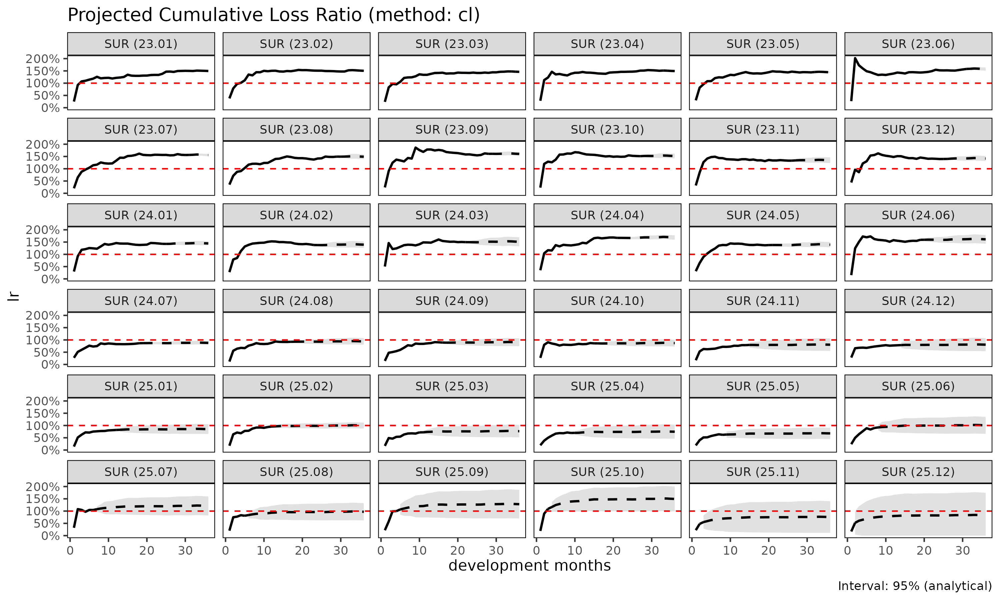

# Projection: SA, ED, CL methods

[`fit_lr()`](https://seokhoonj.github.io/lossratio/reference/fit_lr.md)
projects cumulative loss ratio per cohort from a `Triangle` object.
Three methods are available; this vignette explains the trade-offs.

## Notation

For cohort $`i`$ at dev $`k`$:

- $`C^L_{i,k}`$ — cumulative loss
- $`C^P_{i,k}`$ — cumulative risk premium (exposure)
- $`f_k = C^L_{k+1} / C^L_k`$ — age-to-age (chain ladder) factor
- $`g_k = \Delta C^L_k / C^P_k`$ — exposure-driven intensity
- maturity point $`m_g`$ — dev at which $`f_k`$ stabilises for group
  $`g`$ (detected from CV / RSE thresholds)

## Method 1: Stage-Adaptive (`"sa"`, default)

The default method exploits the fact that $`f_k`$ is volatile early and
stable late, while $`g_k`$ behaves the opposite way. SA switches
estimators at the maturity point:

``` math
\hat{C}^L_{i,k+1} \;=\;
\begin{cases}
\hat{C}^L_{i,k} + g_k \cdot C^P_{i,k} & k < m_g \quad \text{(ED before maturity)} \\
f_k \cdot \hat{C}^L_{i,k}              & k \ge m_g \quad \text{(CL after maturity)}
\end{cases}
```

Behaviour:

- **Before maturity**: anchors the loss estimate to premium volume.
  Avoids the volatile-link explosion that classical CL suffers when
  early $`f_k`$ are noisy.
- **After maturity**: preserves the cohort’s own observed level. Avoids
  the “all cohorts converge to the average” behaviour that pure ED
  suffers in the tail.

When to use:

- Long-tail products where development extends across many years.
- Recent cohorts (immature data) mixed with older cohorts (matured).
- Health insurance cohorts with structural pre-/post-maturity difference
  (e.g. waiting period transitions).

``` r

library(lossratio)
data(experience)
tri <- build_triangle(experience[coverage == "SUR"], group_var = coverage)

lr_sa <- fit_lr(tri, method = "sa")        # default
plot(lr_sa, type = "lr")
```


``` r

summary(lr_sa)
#>     coverage     cohort     latest   loss_ult    reserve premium_ult lr_latest
#>       <char>     <Date>      <num>      <num>      <num>       <num>     <num>
#>  1:      SUR 2023-01-01  410248523  410248523          0   274192568 1.4962058
#>  2:      SUR 2023-02-01  976330446 1001441304   25110859   665667724 1.5107824
#>  3:      SUR 2023-03-01  978486044 1026151241   47665197   702047332 1.4771448
#>  4:      SUR 2023-04-01 2029909922 2186771224  156861302  1464399411 1.5139132
#>  5:      SUR 2023-05-01  624219442  697669308   73449866   483147254 1.4543749
#>  6:      SUR 2023-06-01  802880717  931393933  128513217   591568800 1.5796369
#>  7:      SUR 2023-07-01 2539141550 3050990158  511848609  1958263736 1.5597190
#>  8:      SUR 2023-08-01  393678329  488218204   94539875   327535561 1.4945957
#>  9:      SUR 2023-09-01 1364052543 1751869309  387816766  1091733893 1.6079808
#> 10:      SUR 2023-10-01  979266044 1311793844  332527800   864204933 1.5129473
#> 11:      SUR 2023-11-01  604685680  848103124  243417444   630311112 1.3298743
#> 12:      SUR 2023-12-01 1026345365 1497869026  471523662  1057060864 1.3981081
#> 13:      SUR 2024-01-01 1912177598 2901492850  989315252  2009045338 1.4274951
#> 14:      SUR 2024-02-01  733902485 1160045952  426143467   832229794 1.3793745
#> 15:      SUR 2024-03-01  415459872  686574146  271114274   454345989 1.4969280
#> 16:      SUR 2024-04-01 3286053525 5687484009 2401430484  3372494517 1.6712898
#> 17:      SUR 2024-05-01 1451731151 2645801834 1194070683  1899849125 1.3770835
#> 18:      SUR 2024-06-01  629668308 1209024555  579356246   750125232 1.5918247
#> 19:      SUR 2024-07-01 1250954692 2542927187 1291972495  2891548083 0.8658750
#> 20:      SUR 2024-08-01  425346694  918120581  492773887   976935240 0.9236050
#> 21:      SUR 2024-09-01  278156543  635470027  357313485   703906577 0.8920448
#> 22:      SUR 2024-10-01  352070325  856446527  504376201   984833526 0.8596968
#> 23:      SUR 2024-11-01   99050502  260916098  161865596   324081361 0.7871749
#> 24:      SUR 2024-12-01  103194015  295637302  192443287   366444617 0.7813438
#> 25:      SUR 2025-01-01  227089023  710560088  483471065   833732379 0.8188282
#> 26:      SUR 2025-02-01  939163073 3276849148 2337686075  3286151359 0.9377837
#> 27:      SUR 2025-03-01  112828843  434950050  322121207   566316401 0.7193486
#> 28:      SUR 2025-04-01   82472453  356301149  273828696   476819836 0.6947510
#> 29:      SUR 2025-05-01  141214851  697290588  556075737  1027051058 0.6203897
#> 30:      SUR 2025-06-01  136406104  789468809  653062706   783037478 0.8981587
#> 31:      SUR 2025-07-01  149144024 1040451732  891307708   859730817 1.0440457
#> 32:      SUR 2025-08-01  116327076 1008356737  892029661  1037192179 0.8100543
#> 33:      SUR 2025-09-01   67465470  783000254  715534784   611257146 0.9985960
#> 34:      SUR 2025-10-01  121626172 2001214853 1879588681  1338462730 1.0894657
#> 35:      SUR 2025-11-01   15716444  576954666  561238222   593147597 0.4765917
#> 36:      SUR 2025-12-01    4825085 1246569317 1241744232  1022559933 0.1689836
#>     coverage     cohort     latest   loss_ult    reserve premium_ult lr_latest
#>       <char>     <Date>      <num>      <num>      <num>       <num>     <num>
#>        lr_ult maturity_from   proc_se param_se        se          cv
#>         <num>         <int>     <num>    <num>     <num>       <num>
#>  1: 1.4962058             3         0        0         0 0.000000000
#>  2: 1.5044162             3   2751818  4299411   5104649 0.005097302
#>  3: 1.4616554             3   3967868  5021194   6399717 0.006236621
#>  4: 1.4932888             3   6942936 11297884  13260714 0.006064061
#>  5: 1.4440097             3   4455635  3696917   5789636 0.008298539
#>  6: 1.5744474             3  17869565  8694892  19872657 0.021336468
#>  7: 1.5580078             3  35918003 30501064  47121310 0.015444596
#>  8: 1.4905808             3  15583801  5072721  16388635 0.033568259
#>  9: 1.6046670             3  38001618 20827314  43334743 0.024736288
#> 10: 1.5179199             3  38496097 16992220  42079509 0.032077837
#> 11: 1.3455310             3  35719580 11901733  37650227 0.044393454
#> 12: 1.4170130             3  51405333 22008504  55918535 0.037332059
#> 13: 1.4442147             3  75674312 43971809  87522120 0.030164514
#> 14: 1.3939010             3  51719398 18269126  54851227 0.047283667
#> 15: 1.5111262             3  41313265 11014492  42756344 0.062274911
#> 16: 1.6864324             3 122770257 92689753 153830837 0.027047256
#> 17: 1.3926379             3  93024106 45040850 103354547 0.039063601
#> 18: 1.6117636             3  65346187 20907249  68609309 0.056747655
#> 19: 0.8794345             3 103136527 45568403 112754701 0.044340515
#> 20: 0.9397968             3  65317866 16819267  67448583 0.073463753
#> 21: 0.9027761             3  56737053 11859688  57963310 0.091213288
#> 22: 0.8696358             3  68091257 16219630  69996398 0.081728860
#> 23: 0.8050944             3  41787166  5190764  42108328 0.161386469
#> 24: 0.8067721             3  49617196  6221683  50005754 0.169145618
#> 25: 0.8522640             3  83635489 15668259  85090477 0.119751276
#> 26: 0.9971693             3 192418633 75222223 206599402 0.063048188
#> 27: 0.7680336             3  72345359 10161412  73055494 0.167962951
#> 28: 0.7472448             3  68974257  8575343  69505285 0.195074548
#> 29: 0.6789249             3 119238986 19174475 120770842 0.173200161
#> 30: 1.0082133             3 136628653 22834478 138523652 0.175464376
#> 31: 1.2102064             3 167039609 31445935 169973756 0.163365345
#> 32: 0.9721986             3 183653360 32987225 186592373 0.185045992
#> 33: 1.2809670             3 179947036 27713231 182068556 0.232526816
#> 34: 1.4951592             3 337103186 80113491 346492034 0.173140847
#> 35: 0.9727000             3 234641929 29930084 236543114 0.409985616
#> 36: 1.2190672             3 419068269 73469903 425459799 0.341304566
#>        lr_ult maturity_from   proc_se param_se        se          cv
#>         <num>         <int>     <num>    <num>     <num>       <num>
#>           se_lr       cv_lr  ci_lower  ci_upper
#>           <num>       <num>     <num>     <num>
#>  1: 0.000000000 0.000000000 1.4962058 1.4962058
#>  2: 0.007668464 0.005097302 1.4893863 1.5194461
#>  3: 0.009115791 0.006236621 1.4437887 1.4795220
#>  4: 0.009055395 0.006064061 1.4755405 1.5110370
#>  5: 0.011983171 0.008298539 1.4205231 1.4674963
#>  6: 0.033593146 0.021336468 1.5086060 1.6402887
#>  7: 0.024062801 0.015444596 1.5108456 1.6051700
#>  8: 0.050036201 0.033568259 1.3925116 1.5886499
#>  9: 0.039693504 0.024736288 1.5268691 1.6824648
#> 10: 0.048691586 0.032077837 1.4224861 1.6133536
#> 11: 0.059732768 0.044393454 1.2284569 1.4626050
#> 12: 0.052900014 0.037332059 1.3133309 1.5206952
#> 13: 0.043564034 0.030164514 1.3588308 1.5295987
#> 14: 0.065908752 0.047283667 1.2647222 1.5230798
#> 15: 0.094105252 0.062274911 1.3266833 1.6955691
#> 16: 0.045613369 0.027047256 1.5970318 1.7758330
#> 17: 0.054401450 0.039063601 1.2860130 1.4992628
#> 18: 0.091463806 0.056747655 1.4324978 1.7910294
#> 19: 0.038994579 0.044340515 0.8030065 0.9558625
#> 20: 0.069040997 0.073463753 0.8044789 1.0751146
#> 21: 0.082345175 0.091213288 0.7413825 1.0641697
#> 22: 0.071074345 0.081728860 0.7303327 1.0089390
#> 23: 0.129931347 0.161386469 0.5504337 1.0597552
#> 24: 0.136461969 0.169145618 0.5393116 1.0742327
#> 25: 0.102059701 0.119751276 0.6522307 1.0522973
#> 26: 0.062869716 0.063048188 0.8739469 1.1203916
#> 27: 0.129001198 0.167962951 0.5151959 1.0208713
#> 28: 0.145768444 0.195074548 0.4615439 1.0329457
#> 29: 0.117589910 0.173200161 0.4484530 0.9093969
#> 30: 0.176905520 0.175464376 0.6614849 1.3549418
#> 31: 0.197705785 0.163365345 0.8227102 1.5977026
#> 32: 0.179901446 0.185045992 0.6195982 1.3247989
#> 33: 0.297859186 0.232526816 0.6971738 1.8647603
#> 34: 0.258873128 0.173140847 0.9877772 2.0025412
#> 35: 0.398793007 0.409985616 0.1910801 1.7543199
#> 36: 0.416073215 0.341304566 0.4035787 2.0345558
#>           se_lr       cv_lr  ci_lower  ci_upper
#>           <num>       <num>     <num>     <num>
```

## Method 2: Exposure-Driven (`"ed"`)

All future increments use ED:

``` math
\hat{C}^L_{i,k+1} = \hat{C}^L_{i,k} + g_k \cdot C^P_{i,k}
```

Behaviour:

- Stable when premium volume is informative across full development.
- Loses the cohort-specific level signal — cohorts with higher observed
  loss converge toward the group-level $`g_k`$.

When to use:

- Short-tail products where chain ladder offers no advantage.
- Sparse data where age-to-age factors are unreliable across all links.
- Comparing against SA / CL for sanity check.

``` r

lr_ed <- fit_lr(tri, method = "ed")
plot(lr_ed, type = "lr")
```


## Method 3: Classical Chain Ladder (`"cl"`)

Classical Mack (1993) model:

``` math
\hat{C}^L_{i,k+1} = f_k \cdot \hat{C}^L_{i,k}
```

Behaviour:

- Standard reserving practice. Equivalent to
  `fit_cl(tri, loss_var = "loss")` for the loss projection, but
  [`fit_lr()`](https://seokhoonj.github.io/lossratio/reference/fit_lr.md)
  additionally projects exposure forward via CL on `premium` and
  computes the loss-ratio uncertainty via the delta method.
- Volatile when early $`f_k`$ are noisy — small denominators amplify
  link errors.

When to use:

- Mature, stable portfolios where age-to-age factors are well-behaved
  across the full development.
- Reserving exercises where regulators expect the classical Mack form
  for documentation.

``` r

lr_cl <- fit_lr(tri, method = "cl")
plot(lr_cl, type = "lr")
```



## Comparison

``` r

lrs <- list(
  sa = fit_lr(tri, method = "sa"),
  ed = fit_lr(tri, method = "ed"),
  cl = fit_lr(tri, method = "cl")
)

# Cohort-level summary
summary(lrs$sa)$loss_ult
#>  [1]  410248523 1001441304 1026151241 2186771224  697669308  931393933
#>  [7] 3050990158  488218204 1751869309 1311793844  848103124 1497869026
#> [13] 2901492850 1160045952  686574146 5687484009 2645801834 1209024555
#> [19] 2542927187  918120581  635470027  856446527  260916098  295637302
#> [25]  710560088 3276849148  434950050  356301149  697290588  789468809
#> [31] 1040451732 1008356737  783000254 2001214853  576954666 1246569317
summary(lrs$ed)$loss_ult
#>  [1]  410248523 1001304262 1027365213 2186835973  700124208  924502356
#>  [7] 3028986424  488454953 1725804921 1308019739  876716311 1527010389
#> [13] 2942802609 1193629492  685046660 5424401584 2740753227 1170293303
#> [19] 3461664511 1212435164  870725770 1217843287  398006957  456590850
#> [25] 1064623871 4386331023  727050150  616924305 1330756287 1072907082
#> [31] 1209357476 1432029255  865239649 1911124853  828091914 1442904484
summary(lrs$cl)$loss_ult
#>  [1]  410248523 1001441304 1026151241 2186771224  697669308  931393933
#>  [7] 3050990158  488218204 1751869309 1311793844  848103124 1497869026
#> [13] 2901492850 1160045952  686574146 5687484009 2645801834 1209024555
#> [19] 2542927187  918120581  635470027  856446527  260916098  295637302
#> [25]  710560088 3276849148  434950050  356301149  697290588  789468809
#> [31] 1040451732 1008356737  783000254 2001214853  449653411  850839165
```

## Variance and confidence intervals

[`fit_lr()`](https://seokhoonj.github.io/lossratio/reference/fit_lr.md)
reports analytical standard errors via the delta method. Two delta
variants:

- `delta_method = "simple"` (default) — treats exposure as fixed,
  $`\mathrm{SE}(L/E) \approx \mathrm{SE}(L)/E`$.
- `delta_method = "full"` — accounts for exposure uncertainty and
  loss-exposure correlation `rho`:

``` math
\mathrm{Var}(L/E) \approx \frac{\mathrm{Var}(L)}{E^2}
  + \frac{L^2 \mathrm{Var}(E)}{E^4}
  - \frac{2 \rho L \mathrm{SE}(L) \mathrm{SE}(E)}{E^3}
```

Bootstrap intervals are also available:

``` r

lr_boot <- fit_lr(tri, method = "sa", bootstrap = TRUE, B = 1000, seed = 1)
summary(lr_boot)
#>     coverage     cohort     latest   loss_ult    reserve premium_ult lr_latest
#>       <char>     <Date>      <num>      <num>      <num>       <num>     <num>
#>  1:      SUR 2023-01-01  410248523  410248523          0   274192568 1.4962058
#>  2:      SUR 2023-02-01  976330446 1001441304   25110859   665667724 1.5107824
#>  3:      SUR 2023-03-01  978486044 1026151241   47665197   702047332 1.4771448
#>  4:      SUR 2023-04-01 2029909922 2186771224  156861302  1464399411 1.5139132
#>  5:      SUR 2023-05-01  624219442  697669308   73449866   483147254 1.4543749
#>  6:      SUR 2023-06-01  802880717  931393933  128513217   591568800 1.5796369
#>  7:      SUR 2023-07-01 2539141550 3050990158  511848609  1958263736 1.5597190
#>  8:      SUR 2023-08-01  393678329  488218204   94539875   327535561 1.4945957
#>  9:      SUR 2023-09-01 1364052543 1751869309  387816766  1091733893 1.6079808
#> 10:      SUR 2023-10-01  979266044 1311793844  332527800   864204933 1.5129473
#> 11:      SUR 2023-11-01  604685680  848103124  243417444   630311112 1.3298743
#> 12:      SUR 2023-12-01 1026345365 1497869026  471523662  1057060864 1.3981081
#> 13:      SUR 2024-01-01 1912177598 2901492850  989315252  2009045338 1.4274951
#> 14:      SUR 2024-02-01  733902485 1160045952  426143467   832229794 1.3793745
#> 15:      SUR 2024-03-01  415459872  686574146  271114274   454345989 1.4969280
#> 16:      SUR 2024-04-01 3286053525 5687484009 2401430484  3372494517 1.6712898
#> 17:      SUR 2024-05-01 1451731151 2645801834 1194070683  1899849125 1.3770835
#> 18:      SUR 2024-06-01  629668308 1209024555  579356246   750125232 1.5918247
#> 19:      SUR 2024-07-01 1250954692 2542927187 1291972495  2891548083 0.8658750
#> 20:      SUR 2024-08-01  425346694  918120581  492773887   976935240 0.9236050
#> 21:      SUR 2024-09-01  278156543  635470027  357313485   703906577 0.8920448
#> 22:      SUR 2024-10-01  352070325  856446527  504376201   984833526 0.8596968
#> 23:      SUR 2024-11-01   99050502  260916098  161865596   324081361 0.7871749
#> 24:      SUR 2024-12-01  103194015  295637302  192443287   366444617 0.7813438
#> 25:      SUR 2025-01-01  227089023  710560088  483471065   833732379 0.8188282
#> 26:      SUR 2025-02-01  939163073 3276849148 2337686075  3286151359 0.9377837
#> 27:      SUR 2025-03-01  112828843  434950050  322121207   566316401 0.7193486
#> 28:      SUR 2025-04-01   82472453  356301149  273828696   476819836 0.6947510
#> 29:      SUR 2025-05-01  141214851  697290588  556075737  1027051058 0.6203897
#> 30:      SUR 2025-06-01  136406104  789468809  653062706   783037478 0.8981587
#> 31:      SUR 2025-07-01  149144024 1040451732  891307708   859730817 1.0440457
#> 32:      SUR 2025-08-01  116327076 1008356737  892029661  1037192179 0.8100543
#> 33:      SUR 2025-09-01   67465470  783000254  715534784   611257146 0.9985960
#> 34:      SUR 2025-10-01  121626172 2001214853 1879588681  1338462730 1.0894657
#> 35:      SUR 2025-11-01   15716444  576954666  561238222   593147597 0.4765917
#> 36:      SUR 2025-12-01    4825085 1246569317 1241744232  1022559933 0.1689836
#>     coverage     cohort     latest   loss_ult    reserve premium_ult lr_latest
#>       <char>     <Date>      <num>      <num>      <num>       <num>     <num>
#>        lr_ult maturity_from   proc_se param_se        se          cv
#>         <num>         <int>     <num>    <num>     <num>       <num>
#>  1: 1.4962058             3         0        0         0 0.000000000
#>  2: 1.5044162             3   2751818  4299411   5104649 0.005097302
#>  3: 1.4616554             3   3967868  5021194   6399717 0.006236621
#>  4: 1.4932888             3   6942936 11297884  13260714 0.006064061
#>  5: 1.4440097             3   4455635  3696917   5789636 0.008298539
#>  6: 1.5744474             3  17869565  8694892  19872657 0.021336468
#>  7: 1.5580078             3  35918003 30501064  47121310 0.015444596
#>  8: 1.4905808             3  15583801  5072721  16388635 0.033568259
#>  9: 1.6046670             3  38001618 20827314  43334743 0.024736288
#> 10: 1.5179199             3  38496097 16992220  42079509 0.032077837
#> 11: 1.3455310             3  35719580 11901733  37650227 0.044393454
#> 12: 1.4170130             3  51405333 22008504  55918535 0.037332059
#> 13: 1.4442147             3  75674312 43971809  87522120 0.030164514
#> 14: 1.3939010             3  51719398 18269126  54851227 0.047283667
#> 15: 1.5111262             3  41313265 11014492  42756344 0.062274911
#> 16: 1.6864324             3 122770257 92689753 153830837 0.027047256
#> 17: 1.3926379             3  93024106 45040850 103354547 0.039063601
#> 18: 1.6117636             3  65346187 20907249  68609309 0.056747655
#> 19: 0.8794345             3 103136527 45568403 112754701 0.044340515
#> 20: 0.9397968             3  65317866 16819267  67448583 0.073463753
#> 21: 0.9027761             3  56737053 11859688  57963310 0.091213288
#> 22: 0.8696358             3  68091257 16219630  69996398 0.081728860
#> 23: 0.8050944             3  41787166  5190764  42108328 0.161386469
#> 24: 0.8067721             3  49617196  6221683  50005754 0.169145618
#> 25: 0.8522640             3  83635489 15668259  85090477 0.119751276
#> 26: 0.9971693             3 192418633 75222223 206599402 0.063048188
#> 27: 0.7680336             3  72345359 10161412  73055494 0.167962951
#> 28: 0.7472448             3  68974257  8575343  69505285 0.195074548
#> 29: 0.6789249             3 119238986 19174475 120770842 0.173200161
#> 30: 1.0082133             3 136628653 22834478 138523652 0.175464376
#> 31: 1.2102064             3 167039609 31445935 169973756 0.163365345
#> 32: 0.9721986             3 183653360 32987225 186592373 0.185045992
#> 33: 1.2809670             3 179947036 27713231 182068556 0.232526816
#> 34: 1.4951592             3 337103186 80113491 346492034 0.173140847
#> 35: 0.9727000             3 234641929 29930084 236543114 0.409985616
#> 36: 1.2190672             3 419068269 73469903 425459799 0.341304566
#>        lr_ult maturity_from   proc_se param_se        se          cv
#>         <num>         <int>     <num>    <num>     <num>       <num>
#>           se_lr       cv_lr  ci_lower  ci_upper
#>           <num>       <num>     <num>     <num>
#>  1: 0.000000000 0.000000000 1.4962058 1.4962058
#>  2: 0.007668464 0.005097302 1.4887896 1.5203178
#>  3: 0.009115791 0.006236621 1.4449714 1.4793563
#>  4: 0.009055395 0.006064061 1.4752318 1.5104668
#>  5: 0.011983171 0.008298539 1.4211283 1.4680876
#>  6: 0.033593146 0.021336468 1.5122420 1.6407445
#>  7: 0.024062801 0.015444596 1.5104357 1.6060288
#>  8: 0.050036201 0.033568259 1.3872312 1.5885577
#>  9: 0.039693504 0.024736288 1.5263954 1.6863306
#> 10: 0.048691586 0.032077837 1.4272200 1.6105048
#> 11: 0.059732768 0.044393454 1.2312754 1.4674829
#> 12: 0.052900014 0.037332059 1.3245734 1.5249188
#> 13: 0.043564034 0.030164514 1.3643972 1.5343339
#> 14: 0.065908752 0.047283667 1.2616860 1.5310589
#> 15: 0.094105252 0.062274911 1.3267307 1.6975798
#> 16: 0.045613369 0.027047256 1.5981733 1.7727664
#> 17: 0.054401450 0.039063601 1.2800364 1.5010296
#> 18: 0.091463806 0.056747655 1.4361971 1.7918853
#> 19: 0.038994579 0.044340515 0.8011376 0.9552794
#> 20: 0.069040997 0.073463753 0.8184727 1.0803018
#> 21: 0.082345175 0.091213288 0.7535059 1.0734511
#> 22: 0.071074345 0.081728860 0.7367565 1.0056127
#> 23: 0.129931347 0.161386469 0.5677436 1.0613094
#> 24: 0.136461969 0.169145618 0.5530875 1.0860776
#> 25: 0.102059701 0.119751276 0.6636710 1.0699770
#> 26: 0.062869716 0.063048188 0.8803428 1.1248597
#> 27: 0.129001198 0.167962951 0.5165557 1.0439910
#> 28: 0.145768444 0.195074548 0.4827827 1.0706333
#> 29: 0.117589910 0.173200161 0.4441350 0.9170690
#> 30: 0.176905520 0.175464376 0.6803110 1.3850387
#> 31: 0.197705785 0.163365345 0.8570810 1.6074408
#> 32: 0.179901446 0.185045992 0.6401857 1.3189460
#> 33: 0.297859186 0.232526816 0.7340961 1.9095767
#> 34: 0.258873128 0.173140847 1.0189036 2.0236865
#> 35: 0.398793007 0.409985616 0.2617334 1.8282474
#> 36: 0.416073215 0.341304566 0.5013006 2.1107808
#>           se_lr       cv_lr  ci_lower  ci_upper
#>           <num>       <num>     <num>     <num>
```

## Choosing a method

SA combines ED before the maturity point with CL after, so `"sa"` is the
natural default. `"cl"` and `"ed"` are special cases that apply only
when one of SA’s two regions becomes redundant.

    Default is "sa" — ED before maturity, CL after.

    Pick "cl" or "ed" only as special cases:
      ├── All cohorts are already past maturity
      │     → "cl"  (no ED region, so SA reduces to CL)
      └── Loss development is unstable across all dev and exposure (rp) is
          the more reliable signal
            → "ed"  (CL region is better served by exposure)

In practice: **start with `"sa"`** (the default), then run `"cl"` and
`"ed"` for sensitivity. If all three agree, the projection is robust. If
they diverge, inspect maturity detection and the underlying ATA factors.
