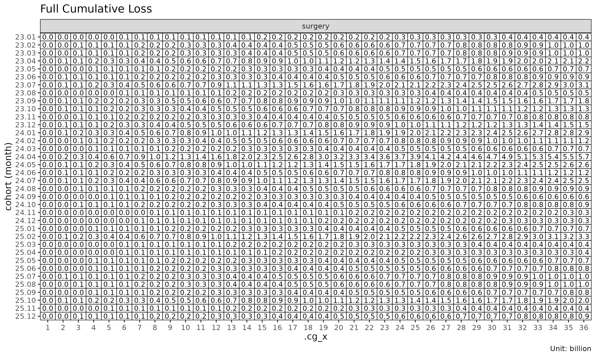
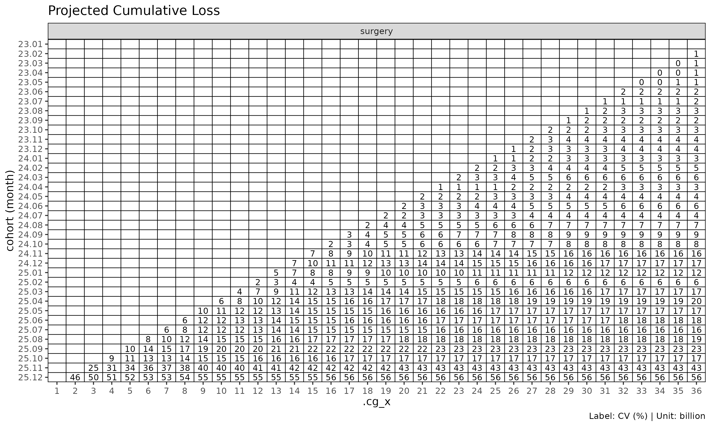

# Projection methods

> Korean version: [예측
> 방법론](https://seokhoonj.github.io/lossratio-r/articles/articles/projection-ko.md)

This is a deep-dive into the five projection methods in `lossratio` —
exposure-driven (ED), chain ladder (CL), stage-adaptive (SA),
Bornhuetter-Ferguson (BF), and Cape Cod (CC). The getting-started
tutorial shows *how* to call each fit; this document explains *why* each
method exists, what assumption it rests on, and when one is preferable
to another. The intended reader is a practitioner working on long-term
health insurance loss ratios.

## Why a dedicated projection toolkit

Loss ratio is a daily task in long-term health insurance: analysing
cohort-level patterns, projecting ultimate outcomes, and monitoring
realised experience against expectations. Existing reserving toolkits
mostly trace back to property and casualty (P&C) origins, where the
following long-term health characteristics are not directly captured:

- **Denominator effect and inertia** — Cumulative loss ratio’s
  denominator grows mechanically with development, dampening the signal
  of recent experience.
- **Recurrent claims** — Hospitalisation, surgery (grade 1-5), and
  outpatient coverage allow a single insured to file multiple claims;
  cumulative claim count can exceed insured count.
- **Risk premium decomposition** — In Korea, long-term insurance premium
  splits into risk premium + savings premium + loading premium. The
  actuarially meaningful denominator for loss ratio is the *risk
  premium* portion alone.
- **Levelled premium** — Non-renewable contracts charge a level premium
  computed at issue as the lifetime average. The *charged premium* is
  not premium; the *period risk premium* (morbidity rate x sum insured x
  persistency) must be constructed externally before being passed in.
- **Regime change** — Product redesigns, rate revisions, channel-mix
  shifts, and underwriting updates introduce *cohort-level* structural
  breaks in loss-ratio dynamics.

`lossratio` transplants core P&C reserving methodology — Mack (1993)
chain ladder, Bornhuetter-Ferguson (1972), Cape Cod (Stanard 1985),
Bühlmann-Straub (1970) credibility, and Sherman (1984) tail
extrapolation — and adapts each piece to the long-term health issues
above. The academic lineage is preserved; the goal is a tool that domain
practitioners can use immediately.

## Methodological lineage

The methodological roots of long-term loss-ratio estimation lie in the
following P&C reserving thread:

    1967  Bühlmann credibility           experience rating formalised
    1970  Bühlmann-Straub                premium-varying credibility
                                         (volume-weighted estimator)
    1972  Bornhuetter-Ferguson           prior + observed loss blending
    1984  Sherman                        chain ladder tail extrapolation
    1985  Stanard (Cape Cod)             reserving application of B-S
    1993  Mack                           distribution-free MSE for chain
                                         ladder

Two core ideas drive everything that follows:

- **Chain ladder (Mack 1993)** — Markov multiplicative recursion on
  cumulative loss $`C_k`$: $`C_{k+1} = f_k \cdot C_k`$ where
  $`f_k = \sum_i C_{i,k+1} / \sum_i C_{i,k}`$.
- **Cape Cod / Bühlmann-Straub** — Loss anchored to premium (volume).
  $`\widehat{ELR} = \sum_i L_i / \sum_i \pi_i`$ yields a single ratio
  that drives ultimate estimation.

Both apply *partially* to long-term health, but both have cracks:

| Domain issue | Chain ladder | Cape Cod |
|----|----|----|
| Denominator effect / inertia | Early-dev $`f_k`$ over-volatile (small $`C_k`$) | Cohort-level ELR variation ignored |
| Levelled premium | Loss-only avoids it (weak against incidence shifts) | Flat $`\pi`$ absorbs developing premium |
| Recurrent claims | Works (freq x sev decoupled) | Works (volume measure only) |
| Developing risk premium | Not relevant | *Single $`\pi`$* assumption breaks |
| Cohort-level regime change | Violates Mack’s no-calendar-year-effect | Cohort heterogeneity averaged out |

Chain ladder is weak early; Cape Cod cannot track developing premium.
Each paradigm is incomplete on its own — which is exactly why the
package offers five methods rather than one.

## The core framework: loss / premium / ratio

All estimation rests on three observable quantities:

| Quantity | Meaning | Triangle column |
|----|----|----|
| **loss** | Cumulative loss | `loss`, `incr_loss` |
| **premium** | Risk-bearing volume (risk premium for long-term health) | `premium`, `incr_premium` |
| **ratio** | Loss ratio (cumulative loss / cumulative premium) | `ratio`, `incr_ratio` |

All three are *stochastic observables developing over the cohort x dev
grid*. Premium is not a fixed underwriting volume; it is a developing
quantity driven by morbidity x sum insured x persistency — the *volume
measure* of Mack (1993), the *natural weight* of Bühlmann-Straub (1970).

For cohort $`i`$ at development period $`k`$ the projection methods use
this notation:

- $`C^L_{i,k}`$ — cumulative loss
- $`C^P_{i,k}`$ — cumulative risk premium (premium)
- $`f_k = C^L_{k+1} / C^L_k`$ — age-to-age (chain ladder) factor
- $`g_k = \Delta C^L_k / C^P_k`$ — exposure-driven intensity
- maturity point $`k^*`$ — the development period at which $`f_k`$
  stabilises for a group (detected from CV / RSE thresholds)

We use the `surgery` group throughout for brevity — every step
generalises to multi-group input.

``` r

library(lossratio)
data(experience)
tri <- as_triangle(
  experience[coverage == "surgery"],
  groups   = "coverage",
  cohort   = "uy_m",
  calendar = "cy_m",
  loss     = "incr_loss",
  premium  = "incr_premium"
)
```

## Direct estimation: ED, CL, SA

The three direct-estimation methods estimate factors from the data and
chain them forward. Their order — `ed` -\> `cl` -\> `sa` — mirrors the
methodological progression *primitive (ED) -\> classical (CL) -\>
composition (SA)*.

| Method | Point estimate | Variance helper | Domain character |
|----|----|----|----|
| `"ed"` (default) | $`\Delta L_{k+1} = g_k \cdot P_k`$ (additive) | `.ed_g_var` (B-S 1970) | Robust to early-dev ATA volatility |
| `"cl"` | $`L_{k+1} = f_k \cdot L_k`$ (multiplicative) | `.mack_f_var` (Mack 1993) | Natural after late-dev factor stabilisation |
| `"sa"` | ED before maturity $`k^*`$, CL after | Composition | Stage-adaptive composition of ED and CL |

### Exposure-driven (`"ed"`, default)

ED projects every future increment using premium (risk premium) as the
denominator:

``` math
\hat{C}^L_{i,k+1} = \hat{C}^L_{i,k} + g_k \cdot C^P_{i,k}
```

ED is the default because it is an *unconditional safe baseline*: no
maturity or regime detection is required, and the projection is robust
under early-dev age-to-age volatility. Because the small $`C_k`$ of
early dev never enters the denominator, ED does not inflate the estimate
the way an early $`f_k`$ can.

The trade-off is cohort homogeneity. The pooled intensity $`g_k`$
assumes cohorts are reasonably homogeneous in loss-per-premium level.
Under cohort-level drift the projection biases toward the pooled mean
and may over-project post-change cohorts — see the `regime` argument for
explicit filtering.

**When to use ED:** as a baseline where cohort homogeneity is plausible;
short-tail products where chain ladder offers no advantage; sparse data
where age-to-age factors are unreliable across all links.

``` r

ratio_ed <- fit_ratio(tri, method = "ed")        # default
plot(ratio_ed, metric = "ratio")
```


``` r

summary(ratio_ed)
#>     coverage     cohort     latest   loss_ult    reserve premium_ult
#>       <char>     <Date>      <num>      <num>      <num>       <num>
#>  1:  surgery 2023-01-01  410248522  410248522          0   274192564
#>  2:  surgery 2023-02-01  976330445 1001304261   24973816   665667720
#>  3:  surgery 2023-03-01  978486045 1027365215   48879170   702047332
#>  4:  surgery 2023-04-01 2029909919 2186835972  156926053  1464399410
#>  5:  surgery 2023-05-01  624219436  700124202   75904766   483147255
#>  6:  surgery 2023-06-01  802880717  924502357  121621640   591568799
#>  7:  surgery 2023-07-01 2539141549 3028986426  489844877  1958263736
#>  8:  surgery 2023-08-01  393678329  488454953   94776624   327535560
#>  9:  surgery 2023-09-01 1364052542 1725804921  361752379  1091733892
#> 10:  surgery 2023-10-01  979266043 1308019740  328753697   864204933
#> 11:  surgery 2023-11-01  604685679  876716310  272030631   630311110
#> 12:  surgery 2023-12-01 1026345366 1527010394  500665028  1057060867
#> 13:  surgery 2024-01-01 1912177598 2942802614 1030625016  2009045340
#> 14:  surgery 2024-02-01  733902485 1193629493  459727008   832229795
#> 15:  surgery 2024-03-01  415459873  685046660  269586787   454345985
#> 16:  surgery 2024-04-01 3286053526 5424401591 2138348065  3372494516
#> 17:  surgery 2024-05-01 1451731153 2740753232 1289022079  1899849125
#> 18:  surgery 2024-06-01  629668308 1170293302  540624994   750125230
#> 19:  surgery 2024-07-01 1250954693 3461664518 2210709825  2891548085
#> 20:  surgery 2024-08-01  425346694 1212435170  787088476   976935246
#> 21:  surgery 2024-09-01  278156543  870725770  592569227   703906575
#> 22:  surgery 2024-10-01  352070323 1217843289  865772966   984833529
#> 23:  surgery 2024-11-01   99050501  398006955  298956454   324081360
#> 24:  surgery 2024-12-01  103194013  456590846  353396833   366444614
#> 25:  surgery 2025-01-01  227089025 1064623873  837534848   833732378
#> 26:  surgery 2025-02-01  939163074 4386331021 3447167947  3286151352
#> 27:  surgery 2025-03-01  112828845  727050149  614221304   566316398
#> 28:  surgery 2025-04-01   82472453  616924302  534451849   476819833
#> 29:  surgery 2025-05-01  141214851 1330756277 1189541426  1027051048
#> 30:  surgery 2025-06-01  136406102 1072907077  936500975   783037474
#> 31:  surgery 2025-07-01  149144024 1209357471 1060213447   859730812
#> 32:  surgery 2025-08-01  116327076 1432029264 1315702188  1037192185
#> 33:  surgery 2025-09-01   67465470  865239645  797774175   611257142
#> 34:  surgery 2025-10-01  121626173 1911124852 1789498679  1338462726
#> 35:  surgery 2025-11-01   15716444  828091909  812375465   593147593
#> 36:  surgery 2025-12-01    4825085 1442904476 1438079391  1022559927
#>     coverage     cohort     latest   loss_ult    reserve premium_ult
#>       <char>     <Date>      <num>      <num>      <num>       <num>
#>     ratio_latest ratio_ult maturity_from loss_proc_se loss_param_se
#>            <num>     <num>         <num>        <num>         <num>
#>  1:    1.4962059  1.496206            NA            0             0
#>  2:    1.5107824  1.504210            NA      2934231       4309793
#>  3:    1.4771448  1.463385            NA      3982661       5158162
#>  4:    1.5139132  1.493333            NA      6546789      11609585
#>  5:    1.4543748  1.449091            NA      4547580       3813039
#>  6:    1.5796369  1.562798            NA     17628088       8903464
#>  7:    1.5597190  1.546771            NA     35686361      31442590
#>  8:    1.4945957  1.491304            NA     16152143       5121110
#>  9:    1.6079808  1.580793            NA     37357117      20421919
#> 10:    1.5129472  1.513553            NA     37573001      17215247
#> 11:    1.3298743  1.390926            NA     35161608      12015326
#> 12:    1.3981081  1.444581            NA     53162531      22167720
#> 13:    1.4274951  1.464777            NA     76259904      44384184
#> 14:    1.3793745  1.434255            NA     51529679      18632983
#> 15:    1.4969280  1.507764            NA     41482939      11326747
#> 16:    1.6712898  1.608424            NA    120195326      95592928
#> 17:    1.3770835  1.442616            NA     88447102      46270702
#> 18:    1.5918247  1.560131            NA     66834389      21472291
#> 19:    0.8658750  1.197167            NA    104028932      46251465
#> 20:    0.9236050  1.241060            NA     62896850      16977280
#> 21:    0.8920448  1.236991            NA     56583751      11941938
#> 22:    0.8596968  1.236598            NA     71133708      16328611
#> 23:    0.7871749  1.228108            NA     41388948       5266012
#> 24:    0.7813438  1.246002            NA     48660596       6215769
#> 25:    0.8188282  1.276937            NA     82549103      15683804
#> 26:    0.9377837  1.334793            NA    193613125      74852479
#> 27:    0.7193486  1.283823            NA     71295313      10069046
#> 28:    0.6947510  1.293831            NA     68826316       8438639
#> 29:    0.6203897  1.295706            NA    116537796      18989499
#> 30:    0.8981587  1.370186            NA    137078933      22543675
#> 31:    1.0440457  1.406670            NA    166193829      31402939
#> 32:    0.8100543  1.380679            NA    184425493      33103273
#> 33:    0.9985960  1.415508            NA    180452022      27168526
#> 34:    1.0894657  1.427851            NA    331672128      79057462
#> 35:    0.4765917  1.396098            NA    190733674      20867271
#> 36:    0.1689836  1.411071            NA    464027946      65288155
#>     ratio_latest ratio_ult maturity_from loss_proc_se loss_param_se
#>            <num>     <num>         <num>        <num>         <num>
#>     loss_total_se loss_total_cv    ratio_se    ratio_cv ratio_ci_lo ratio_ci_hi
#>             <num>         <num>       <num>       <num>       <num>       <num>
#>  1:             0   0.000000000 0.000000000 0.000000000   1.4962059    1.496206
#>  2:       5213830   0.005207039 0.007832482 0.005207039   1.4888589    1.519562
#>  3:       6516765   0.006343182 0.009282515 0.006343182   1.4451911    1.481578
#>  4:      13328275   0.006094776 0.009101530 0.006094776   1.4754943    1.511172
#>  5:       5934623   0.008476529 0.012283260 0.008476529   1.4250160    1.473165
#>  6:      19748953   0.021361712 0.033384034 0.021361712   1.4973662    1.628229
#>  7:      47562095   0.015702314 0.024287890 0.015702314   1.4991681    1.594375
#>  8:      16944542   0.034690081 0.051733442 0.034690081   1.3899079    1.592699
#>  9:      42574746   0.024669501 0.038997366 0.024669501   1.5043592    1.657226
#> 10:      41329107   0.031596700 0.047823272 0.031596700   1.4198208    1.607285
#> 11:      37157863   0.042382995 0.058951622 0.042382995   1.2753833    1.506469
#> 12:      57599154   0.037720211 0.054489912 0.037720211   1.3377831    1.551380
#> 13:      88235644   0.029983541 0.043919190 0.029983541   1.3786966    1.550857
#> 14:      54795036   0.045906235 0.065841233 0.045906235   1.3052083    1.563301
#> 15:      43001505   0.062771643 0.094644843 0.062771643   1.3222638    1.693265
#> 16:     153573839   0.028311665 0.045537165 0.028311665   1.5191729    1.697675
#> 17:      99819176   0.036420344 0.052540580 0.036420344   1.3396386    1.545594
#> 18:      70198966   0.059984079 0.093582996 0.059984079   1.3767113    1.743550
#> 19:     113847340   0.032888034 0.039372453 0.032888034   1.1199979    1.274335
#> 20:      65147845   0.053733055 0.066685940 0.053733055   1.1103579    1.371762
#> 21:      57830189   0.066416077 0.082156058 0.066416077   1.0759676    1.398013
#> 22:      72983751   0.059928689 0.074107704 0.059928689   1.0913497    1.381847
#> 23:      41722607   0.104828839 0.128741150 0.104828839   0.9757801    1.480436
#> 24:      49055982   0.107439697 0.133870114 0.107439697   0.9836217    1.508383
#> 25:      84025806   0.078925344 0.100782707 0.078925344   1.0794067    1.474468
#> 26:     207578746   0.047324004 0.063167737 0.047324004   1.2109863    1.458599
#> 27:      72002829   0.099034199 0.127142405 0.099034199   1.0346287    1.533018
#> 28:      69341707   0.112399053 0.145425384 0.112399053   1.0088025    1.578860
#> 29:     118074803   0.088727594 0.114964882 0.088727594   1.0703790    1.521033
#> 30:     138920305   0.129480276 0.177412077 0.129480276   1.0224648    1.717907
#> 31:     169134660   0.139854976 0.196729788 0.139854976   1.0210866    1.792253
#> 32:     187372862   0.130844297 0.180653947 0.130844297   1.0266036    1.734754
#> 33:     182485783   0.210907792 0.298541761 0.210907792   0.8303773    2.000640
#> 34:     340964049   0.178410138 0.254743029 0.178410138   0.9285635    1.927138
#> 35:     191871774   0.231703476 0.323480658 0.231703476   0.7620871    2.030108
#> 36:     468598419   0.324760527 0.458260104 0.324760527   0.5128975    2.309244
#>     loss_total_se loss_total_cv    ratio_se    ratio_cv ratio_ci_lo ratio_ci_hi
#>             <num>         <num>       <num>       <num>       <num>       <num>
```

### Classical chain ladder (`"cl"`)

CL is the classical Mack (1993) model:

``` math
\hat{C}^L_{i,k+1} = f_k \cdot \hat{C}^L_{i,k}
```

The cohort’s own cumulative loss acts as the anchor, so cohort-level
drift propagates naturally without explicit regime detection. The
trade-off is the mirror image of ED’s: CL is volatile when early $`f_k`$
are noisy, because small denominators amplify link errors.

Within
[`fit_ratio()`](https://seokhoonj.github.io/lossratio-r/reference/fit_ratio.md),
the CL method projects loss *and* premium forward — each via chain
ladder on its own column — and computes the loss-ratio uncertainty via
the delta method. The loss lane alone is equivalent to `fit_cl(tri)`.

**When to use CL:** once age-to-age factors stabilise; cohort-level
drift scenarios where the cohort’s observed trajectory should anchor the
projection; reserving exercises where regulators expect the classical
Mack form for documentation.

``` r

ratio_cl <- fit_ratio(tri, method = "cl")
plot(ratio_cl, metric = "ratio")
```


### Stage-adaptive (`"sa"`)

SA composes ED before the maturity point with CL after, exploiting the
fact that $`f_k`$ is volatile early and stable late, while $`g_k`$
behaves the opposite way:

``` math
\hat{C}^L_{i,k+1} \;=\;
\begin{cases}
\hat{C}^L_{i,k} + g_k \cdot C^P_{i,k} & k < k^* \quad \text{(ED before maturity)} \\
f_k \cdot \hat{C}^L_{i,k}              & k \ge k^* \quad \text{(CL after maturity)}
\end{cases}
```

- **Before maturity** SA anchors the loss estimate to premium volume,
  avoiding the volatile-link explosion that classical CL suffers when
  early $`f_k`$ are noisy.
- **After maturity** SA preserves the cohort’s own observed level,
  avoiding the “all cohorts converge to the average” behaviour that pure
  ED suffers in the tail.

**When to use SA:** long-tail portfolios where early dev is volatile (ED
phase) and cohort-level drift needs cohort-anchored projection in later
dev (CL phase); recent cohorts (immature data) mixed with older cohorts
(matured); health insurance cohorts with a structural pre-/post-maturity
difference (e.g. waiting-period transitions).

``` r

ratio_sa <- fit_ratio(tri, method = "sa")
plot(ratio_sa, metric = "ratio")
```


``` r

summary(ratio_sa)
#>     coverage     cohort     latest   loss_ult    reserve premium_ult
#>       <char>     <Date>      <num>      <num>      <num>       <num>
#>  1:  surgery 2023-01-01  410248522  410248522          0   274192564
#>  2:  surgery 2023-02-01  976330445 1001441303   25110858   665667720
#>  3:  surgery 2023-03-01  978486045 1026151243   47665198   702047332
#>  4:  surgery 2023-04-01 2029909919 2186771221  156861302  1464399410
#>  5:  surgery 2023-05-01  624219436  697669301   73449865   483147255
#>  6:  surgery 2023-06-01  802880717  931393934  128513217   591568799
#>  7:  surgery 2023-07-01 2539141549 3050990158  511848609  1958263736
#>  8:  surgery 2023-08-01  393678329  488218204   94539875   327535560
#>  9:  surgery 2023-09-01 1364052542 1751869308  387816766  1091733892
#> 10:  surgery 2023-10-01  979266043 1311793843  332527800   864204933
#> 11:  surgery 2023-11-01  604685679  848103123  243417444   630311110
#> 12:  surgery 2023-12-01 1026345366 1497869029  471523663  1057060867
#> 13:  surgery 2024-01-01 1912177598 2901492851  989315253  2009045340
#> 14:  surgery 2024-02-01  733902485 1160045952  426143467   832229795
#> 15:  surgery 2024-03-01  415459873  686574148  271114275   454345985
#> 16:  surgery 2024-04-01 3286053526 5687484014 2401430488  3372494516
#> 17:  surgery 2024-05-01 1451731153 2645801838 1194070685  1899849125
#> 18:  surgery 2024-06-01  629668308 1209024555  579356247   750125230
#> 19:  surgery 2024-07-01 1250954693 2542927190 1291972497  2891548085
#> 20:  surgery 2024-08-01  425346694  918120582  492773888   976935246
#> 21:  surgery 2024-09-01  278156543  635470028  357313485   703906575
#> 22:  surgery 2024-10-01  352070323  856446521  504376198   984833529
#> 23:  surgery 2024-11-01   99050501  260916096  161865595   324081360
#> 24:  surgery 2024-12-01  103194013  295637296  192443283   366444614
#> 25:  surgery 2025-01-01  227089025  710560093  483471068   833732378
#> 26:  surgery 2025-02-01  939163074 3276849152 2337686078  3286151352
#> 27:  surgery 2025-03-01  112828845  434950057  322121212   566316398
#> 28:  surgery 2025-04-01   82472453  356301148  273828695   476819833
#> 29:  surgery 2025-05-01  141214851  697290587  556075736  1027051048
#> 30:  surgery 2025-06-01  136406102  789468799  653062697   783037474
#> 31:  surgery 2025-07-01  149144024 1040451732  891307708   859730812
#> 32:  surgery 2025-08-01  116327076 1008356733  892029657  1037192185
#> 33:  surgery 2025-09-01   67465470  783000257  715534787   611257142
#> 34:  surgery 2025-10-01  121626173 2001214863 1879588690  1338462726
#> 35:  surgery 2025-11-01   15716444  576954661  561238217   593147593
#> 36:  surgery 2025-12-01    4825085 1246569307 1241744222  1022559927
#>     coverage     cohort     latest   loss_ult    reserve premium_ult
#>       <char>     <Date>      <num>      <num>      <num>       <num>
#>     ratio_latest ratio_ult maturity_from loss_proc_se loss_param_se
#>            <num>     <num>         <num>        <num>         <num>
#>  1:    1.4962059 1.4962059             4            0             0
#>  2:    1.5107824 1.5044162             4      2838052       4263874
#>  3:    1.4771448 1.4616554             4      3880367       4840717
#>  4:    1.5139132 1.4932888             4      7135821      10972855
#>  5:    1.4543748 1.4440097             4      4646457       3580792
#>  6:    1.5796369 1.5744474             4     17348955       8670204
#>  7:    1.5597190 1.5580078             4     38013946      29987964
#>  8:    1.4945957 1.4905808             4     16303418       4959278
#>  9:    1.6079808 1.6046670             4     37742856      20054538
#> 10:    1.5129472 1.5179199             4     39387794      16559819
#> 11:    1.3298743 1.3455310             4     34650050      11722778
#> 12:    1.3981081 1.4170130             4     51946833      22082843
#> 13:    1.4274951 1.4442147             4     73730102      44277226
#> 14:    1.3793745 1.3939010             4     51235927      18527296
#> 15:    1.4969280 1.5111263             4     41831046      11113922
#> 16:    1.6712898 1.6864324             4    118856877      94000634
#> 17:    1.3770835 1.3926379             4     90510561      45996854
#> 18:    1.5918247 1.6117636             4     66688102      21223812
#> 19:    0.8658750 0.8794345             4    104142855      46376952
#> 20:    0.9236050 0.9397968             4     62641056      17014220
#> 21:    0.8920448 0.9027761             4     56889317      11861881
#> 22:    0.8596968 0.8696358             4     67281634      16371282
#> 23:    0.7871749 0.8050944             4     43610819       5306326
#> 24:    0.7813438 0.8067721             4     49362868       6380942
#> 25:    0.8188282 0.8522640             4     81647027      16077360
#> 26:    0.9377837 0.9971693             4    184888599      76955907
#> 27:    0.7193486 0.7680337             4     73183198      10391123
#> 28:    0.6947510 0.7472448             4     68965019       8663440
#> 29:    0.6203897 0.6789250             4    117297078      19478869
#> 30:    0.8981587 1.0082133             4    134689808      23300101
#> 31:    1.0440457 1.2102064             4    164702068      31947996
#> 32:    0.8100543 0.9721985             4    174053848      34060502
#> 33:    0.9985960 1.2809670             4    180505913      28824273
#> 34:    1.0894657 1.4951592             4    341752123      82043614
#> 35:    0.4765917 0.9727000             4    198381074      21884900
#> 36:    0.1689836 1.2190672             4    480416590      66092613
#>     ratio_latest ratio_ult maturity_from loss_proc_se loss_param_se
#>            <num>     <num>         <num>        <num>         <num>
#>     loss_total_se loss_total_cv    ratio_se    ratio_cv ratio_ci_lo ratio_ci_hi
#>             <num>         <num>       <num>       <num>       <num>       <num>
#>  1:             0   0.000000000 0.000000000 0.000000000   1.4962059   1.4962059
#>  2:       5122027   0.005114655 0.007694570 0.005114655   1.4893351   1.5194973
#>  3:       6204014   0.006045906 0.008837031 0.006045906   1.4443351   1.4789756
#>  4:      13089060   0.005985564 0.008938176 0.005985564   1.4757703   1.5108073
#>  5:       5866144   0.008408201 0.012141523 0.008408201   1.4202127   1.4678066
#>  6:      19394810   0.020823424 0.032785384 0.020823424   1.5101892   1.6387055
#>  7:      48418365   0.015869722 0.024725150 0.015869722   1.5095474   1.6064682
#>  8:      17041006   0.034904487 0.052027956 0.034904487   1.3886078   1.5925537
#>  9:      42740001   0.024396798 0.039148735 0.024396798   1.5279369   1.6813971
#> 10:      42727344   0.032571691 0.049441217 0.032571691   1.4210169   1.6148229
#> 11:      36579359   0.043130792 0.058033816 0.043130792   1.2317868   1.4592752
#> 12:      56445774   0.037684052 0.053398793 0.037684052   1.3123533   1.5216727
#> 13:      86003492   0.029641118 0.042808139 0.029641118   1.3603123   1.5281171
#> 14:      54482850   0.046966114 0.065466113 0.046966114   1.2655898   1.5222122
#> 15:      43282278   0.063040938 0.095262817 0.063040938   1.3244146   1.6978379
#> 16:     151535726   0.026643719 0.044932831 0.026643719   1.5983657   1.7744991
#> 17:     101527692   0.038373128 0.053439871 0.038373128   1.2878976   1.4973781
#> 18:      69983949   0.057884638 0.093296354 0.057884638   1.4289061   1.7946211
#> 19:     114002439   0.044831185 0.039426091 0.044831185   0.8021608   0.9567082
#> 20:      64910597   0.070699425 0.066443091 0.070699425   0.8095707   1.0700228
#> 21:      58112809   0.091448544 0.082557560 0.091448544   0.7409662   1.0645859
#> 22:      69244762   0.080851239 0.070311134 0.080851239   0.7318285   1.0074431
#> 23:      43932455   0.168377712 0.135559957 0.168377712   0.5394018   1.0707871
#> 24:      49773579   0.168360283 0.135828381 0.168360283   0.5405534   1.0729908
#> 25:      83214894   0.117111691 0.099810079 0.117111691   0.6566398   1.0478882
#> 26:     200264839   0.061115062 0.060942062 0.061115062   0.8777250   1.1166135
#> 27:      73917223   0.169944163 0.130522838 0.169944163   0.5122136   1.0238537
#> 28:      69507043   0.195079480 0.145772130 0.195079480   0.4615367   1.0329529
#> 29:     118903452   0.170522095 0.115771706 0.170522095   0.4520166   0.9058333
#> 30:     136690304   0.173142123 0.174564192 0.173142123   0.6660738   1.3503528
#> 31:     167772005   0.161249196 0.195144809 0.161249196   0.8277296   1.5926832
#> 32:     177355179   0.175885353 0.170995484 0.175885353   0.6370536   1.3073435
#> 33:     182792843   0.233451830 0.299044102 0.233451830   0.6948514   1.8670827
#> 34:     351462186   0.175624413 0.262586457 0.175624413   0.9804992   2.0098192
#> 35:     199584567   0.345927644 0.336483818 0.345927644   0.3132038   1.6321962
#> 36:     484941577   0.389020951 0.474242696 0.389020951   0.2895686   2.1485658
#>     loss_total_se loss_total_cv    ratio_se    ratio_cv ratio_ci_lo ratio_ci_hi
#>             <num>         <num>       <num>       <num>       <num>       <num>
```

### Comparing ED, CL, SA

``` r

ratios <- list(
  ed = fit_ratio(tri, method = "ed"),
  cl = fit_ratio(tri, method = "cl"),
  sa = fit_ratio(tri, method = "sa")
)

# Cohort-level ultimate-loss summary
summary(ratios$ed)$loss_ult
#>  [1]  410248522 1001304261 1027365215 2186835972  700124202  924502357
#>  [7] 3028986426  488454953 1725804921 1308019740  876716310 1527010394
#> [13] 2942802614 1193629493  685046660 5424401591 2740753232 1170293302
#> [19] 3461664518 1212435170  870725770 1217843289  398006955  456590846
#> [25] 1064623873 4386331021  727050149  616924302 1330756277 1072907077
#> [31] 1209357471 1432029264  865239645 1911124852  828091909 1442904476
summary(ratios$cl)$loss_ult
#>  [1]  410248522 1001441303 1026151243 2186771221  697669301  931393934
#>  [7] 3050990158  488218204 1751869308 1311793843  848103123 1497869029
#> [13] 2901492851 1160045952  686574148 5687484014 2645801838 1209024555
#> [19] 2542927190  918120582  635470028  856446521  260916096  295637296
#> [25]  710560093 3276849152  434950057  356301148  697290587  789468799
#> [31] 1040451732 1008356733  783000257 2001214863         NA         NA
summary(ratios$sa)$loss_ult
#>  [1]  410248522 1001441303 1026151243 2186771221  697669301  931393934
#>  [7] 3050990158  488218204 1751869308 1311793843  848103123 1497869029
#> [13] 2901492851 1160045952  686574148 5687484014 2645801838 1209024555
#> [19] 2542927190  918120582  635470028  856446521  260916096  295637296
#> [25]  710560093 3276849152  434950057  356301148  697290587  789468799
#> [31] 1040451732 1008356733  783000257 2001214863  576954661 1246569307
```

| Method | Mechanism | When to use |
|----|----|----|
| ED | pooled $`g_k`$ x cohort premium | default baseline; assumes cohort homogeneity |
| CL | pooled $`f_k`$ x cohort cum_loss | cohort-level drift; cohort-anchored |
| SA | ED early + CL late | long-tail with both volatile early dev and cohort-level late drift |

## Prior-anchored estimation: BF and CC

ED, CL, and SA all estimate factors *from the data*. When the observed
triangle is thin — immature cohorts, or cohorts right after a rate
change — that estimate can be unstable. The prior-anchored family blends
an expected loss ratio (ELR) with whatever loss has already emerged:

``` math
\text{Ult} = L_{\text{latest}}
  + \left(1 - \tfrac{1}{\text{LDF}}\right) \cdot \pi \cdot \text{ELR}
```

The two methods differ only in *where the ELR comes from*.

| Method | ELR source | Domain use case |
|----|----|----|
| `"bf"` | External (user supplied via `prior`) | Immature and post-rate-change cohorts — anchor on an external prior when observed data is thin (Bornhuetter-Ferguson 1972) |
| `"cc"` | Derived from data (payout-weighted $`\sum L / \sum \pi \cdot \text{payout}`$) | Cohort-cohesive estimation — when pricing/industry suggests a natural single ELR target (Stanard 1985, Cape Cod) |

### Bornhuetter-Ferguson (`"bf"`)

BF takes the ELR as an external input. The emerged loss
$`L_{\text{latest}}`$ is kept as-is, and only the *unemerged* portion
$`(1 - 1/\text{LDF})`$ is filled in from the prior. As a cohort matures
the data term dominates and the prior fades — BF degrades gracefully
toward a chain-ladder answer.

``` r

fit_bf(tri, prior = 0.7)
#> <BFFit>
#> method        : bf 
#> loss          : loss 
#> premium       : premium 
#> alpha         : 1 
#> sigma_method  : locf 
#> recent        : all 
#> regime        : none
#> groups        : coverage 
#> cohorts (n)   : 36 
#> prior         : scalar elr = 0.7 
#> ci_type       : analytical
```

The `prior` argument also accepts a per-group `data.frame`, optionally
carrying an `elr_se` column to treat the prior as a *distribution*
rather than a fixed point.

### Cape Cod (`"cc"`)

CC has the same blending form as BF but estimates the ELR *from the data
itself* — a payout-weighted pooled ratio across cohorts. It is the
natural choice when pricing or industry context suggests a single
coherent ELR target and no external prior is on hand.

``` r

fit_cc(tri)
#> <CCFit>
#> method        : cc 
#> loss          : loss 
#> premium       : premium 
#> alpha         : 1 
#> sigma_method  : locf 
#> recent        : all 
#> regime        : none
#> groups        : coverage 
#> cohorts (n)   : 36 
#> pooled ELR    :
#>   surgery : 1.3558
#> ci_type       : analytical
```

### Three aggregation axes

ED, CC, and BF differ in how they aggregate the loss-per-premium signal:

- **ED** — per-link $`g_k`$: dev-granular, cohort-uniform per link.
- **CC** — cohort-level single ELR: cohort-uniform, dev-aggregated.
- **BF** — external prior: bypasses data estimation altogether.

Together the five methods reconstruct the P&C reserving trinity for
long-term health, and the three aggregation axes each serve a distinct
use case.

## Chain ladder as a reserving worker

[`fit_cl()`](https://seokhoonj.github.io/lossratio-r/reference/fit_cl.md)
is the dedicated chain ladder fit for a single value column. Unlike
[`fit_ratio()`](https://seokhoonj.github.io/lossratio-r/reference/fit_ratio.md)
— which projects loss and premium jointly to get loss ratio —
[`fit_cl()`](https://seokhoonj.github.io/lossratio-r/reference/fit_cl.md)
projects one cumulative metric forward and computes Mack-style standard
errors per cohort. This is the classical P&C *reserving* use case:
projecting ultimate paid / incurred loss for an open accident year.
Practitioners with a P&C background will recognise the Mack workflow
directly.

``` r

cl <- fit_cl(tri)
print(cl)
#> <CLFit>
#> method      : mack 
#> loss        : loss 
#> weight      : none 
#> alpha       : 1 
#> sigma_method: locf 
#> recent      : all 
#> regime      : none
#> use_maturity: FALSE 
#> tail_factor : 1 
#> groups      : coverage 
#> periods     : 36
```

[`fit_cl()`](https://seokhoonj.github.io/lossratio-r/reference/fit_cl.md)
summarises adjacent development links by age-to-age factors
$`f_k = C^L_{k+1} / C^L_k`$, selected per link and then chained to
project each cohort forward to ultimate. On top of the point projection,
Mack’s formulae decompose the prediction variance into process and
parameter components:

- `loss_proc_se` — process variance, from $`\sigma^2_k`$ (residual link
  variance per development period).
- `loss_param_se` — parameter variance, from the uncertainty of the
  selected age-to-age factors $`\hat{f}_k`$.
- `loss_total_se` — total standard error,
  $`\sqrt{\text{loss\_proc\_se}^2 + \text{loss\_param\_se}^2}`$.
- `loss_total_cv` — coefficient of variation,
  `loss_total_se / loss_proj`.

``` r

summary(cl)
#>     coverage     cohort     latest   loss_ult    reserve loss_proc_se
#>       <char>     <Date>      <num>      <num>      <num>        <num>
#>  1:  surgery 2023-01-01  410248522  410248522          0            0
#>  2:  surgery 2023-02-01  976330445 1001441303   25110858      2751819
#>  3:  surgery 2023-03-01  978486045 1026151243   47665198      3967869
#>  4:  surgery 2023-04-01 2029909919 2186771221  156861302      6942937
#>  5:  surgery 2023-05-01  624219436  697669301   73449865      4455636
#>  6:  surgery 2023-06-01  802880717  931393934  128513217     17869565
#>  7:  surgery 2023-07-01 2539141549 3050990158  511848609     35918003
#>  8:  surgery 2023-08-01  393678329  488218204   94539875     15583801
#>  9:  surgery 2023-09-01 1364052542 1751869308  387816766     38001618
#> 10:  surgery 2023-10-01  979266043 1311793843  332527800     38496097
#> 11:  surgery 2023-11-01  604685679  848103123  243417444     35719579
#> 12:  surgery 2023-12-01 1026345366 1497869029  471523663     51405333
#> 13:  surgery 2024-01-01 1912177598 2901492851  989315253     75674312
#> 14:  surgery 2024-02-01  733902485 1160045952  426143467     51719398
#> 15:  surgery 2024-03-01  415459873  686574148  271114275     41313266
#> 16:  surgery 2024-04-01 3286053526 5687484014 2401430488    122770258
#> 17:  surgery 2024-05-01 1451731153 2645801838 1194070685     93024106
#> 18:  surgery 2024-06-01  629668308 1209024555  579356247     65346187
#> 19:  surgery 2024-07-01 1250954693 2542927190 1291972497    103136528
#> 20:  surgery 2024-08-01  425346694  918120582  492773888     65317866
#> 21:  surgery 2024-09-01  278156543  635470028  357313485     56737053
#> 22:  surgery 2024-10-01  352070323  856446521  504376198     68091257
#> 23:  surgery 2024-11-01   99050501  260916096  161865595     41787166
#> 24:  surgery 2024-12-01  103194013  295637296  192443283     49617195
#> 25:  surgery 2025-01-01  227089025  710560093  483471068     83635489
#> 26:  surgery 2025-02-01  939163074 3276849152 2337686078    192418633
#> 27:  surgery 2025-03-01  112828845  434950057  322121212     72345359
#> 28:  surgery 2025-04-01   82472453  356301148  273828695     68974257
#> 29:  surgery 2025-05-01  141214851  697290587  556075736    119238986
#> 30:  surgery 2025-06-01  136406102  789468799  653062697    136628652
#> 31:  surgery 2025-07-01  149144024 1040451732  891307708    167039609
#> 32:  surgery 2025-08-01  116327076 1008356733  892029657    183653360
#> 33:  surgery 2025-09-01   67465470  783000257  715534787    179947037
#> 34:  surgery 2025-10-01  121626173 2001214863 1879588690    337103186
#> 35:  surgery 2025-11-01   15716444  449653406  433936962    194100658
#> 36:  surgery 2025-12-01    4825085  850839118  846014033    472741759
#>     coverage     cohort     latest   loss_ult    reserve loss_proc_se
#>       <char>     <Date>      <num>      <num>      <num>        <num>
#>     loss_param_se loss_total_se loss_total_cv
#>             <num>         <num>         <num>
#>  1:             0             0   0.000000000
#>  2:       4299412       5104650   0.005097304
#>  3:       5021196       6399718   0.006236623
#>  4:      11297887      13260717   0.006064062
#>  5:       3696918       5789637   0.008298541
#>  6:       8694892      19872657   0.021336469
#>  7:      30501066      47121311   0.015444596
#>  8:       5072721      16388635   0.033568259
#>  9:      20827314      43334744   0.024736288
#> 10:      16992221      42079509   0.032077837
#> 11:      11901733      37650227   0.044393454
#> 12:      22008504      55918535   0.037332059
#> 13:      43971810      87522121   0.030164514
#> 14:      18269127      54851227   0.047283667
#> 15:      11014493      42756344   0.062274911
#> 16:      92689755     153830838   0.027047256
#> 17:      45040851     103354548   0.039063601
#> 18:      20907249      68609309   0.056747655
#> 19:      45568404     112754702   0.044340515
#> 20:      16819267      67448584   0.073463753
#> 21:      11859688      57963310   0.091213288
#> 22:      16219631      69996398   0.081728860
#> 23:       5190764      42108328   0.161386470
#> 24:       6221683      50005754   0.169145620
#> 25:      15668260      85090478   0.119751276
#> 26:      75222224     206599403   0.063048188
#> 27:      10161412      73055495   0.167962950
#> 28:       8575343      69505285   0.195074548
#> 29:      19174475     120770842   0.173200161
#> 30:      22834478     138523651   0.175464377
#> 31:      31445935     169973756   0.163365345
#> 32:      32987225     186592373   0.185045993
#> 33:      27713231     182068556   0.232526816
#> 34:      80113491     346492034   0.173140846
#> 35:      21034520     195237078   0.434194593
#> 36:      66075497     477337136   0.561019265
#>     loss_param_se loss_total_se loss_total_cv
#>             <num>         <num>         <num>
plot(cl, type = "projection", show_interval = TRUE)
```


``` r

plot(cl, type = "reserve", conf_level = 0.95)
```


[`plot_triangle()`](https://seokhoonj.github.io/lossratio-r/reference/plot_triangle.md)
displays the cohort x dev cells as a heatmap, distinguishing observed
cells from projected, with `label_style` showing per-cell CV / SE / CI:

``` r

plot_triangle(cl, region = "full")        # observed + projected
```



``` r

plot_triangle(cl, label_style = "cv")     # per-cell coefficient of variation
```



### Tail factor

For triangles where the latest observed development period is still
developing, an extrapolated tail factor estimates ultimate. The
extrapolation fits $`\log(f_k - 1) \sim k`$ — a Sherman (1984)
log-linear tail — to the selected ATA factors and extends the projection
by the cumulative product of extrapolated $`f_k`$ values. Disabled by
default (`tail = FALSE`).

``` r

fit_cl(tri, tail = TRUE)         # log-linear extrapolation
#> <CLFit>
#> method      : mack 
#> loss        : loss 
#> weight      : none 
#> alpha       : 1 
#> sigma_method: locf 
#> recent      : all 
#> regime      : none
#> use_maturity: FALSE 
#> tail_factor : 1.188138 
#> groups      : coverage 
#> periods     : 36
fit_cl(tri, tail = 1.025)        # or a literal tail factor
#> <CLFit>
#> method      : mack 
#> loss        : loss 
#> weight      : none 
#> alpha       : 1 
#> sigma_method: locf 
#> recent      : all 
#> regime      : none
#> use_maturity: FALSE 
#> tail_factor : 1.025 
#> groups      : coverage 
#> periods     : 36
```

### Sigma extrapolation methods

Mack variance requires $`\sigma_k`$ at all development links, including
the last where it cannot be estimated directly. `sigma_method` controls
the extrapolation:

| `sigma_method` | Behaviour |
|----|----|
| `"locf"` | (default) last observation carried forward |
| `"min_last2"` | min of the last two estimable $`\sigma`$ values — conservative |
| `"loglinear"` | log-linear extrapolation from the observed $`\sigma_k`$ sequence |
| `"mack"` | Mack (1993) Appendix B tail estimator — closed-form for the last link only; LOCF with warning beyond that |
| `"none"` | no extrapolation; $`\sigma`$ stays `NA` (variance treated as zero downstream) |

``` r

fit_cl(tri, sigma_method = "loglinear")
#> <CLFit>
#> method      : mack 
#> loss        : loss 
#> weight      : none 
#> alpha       : 1 
#> sigma_method: loglinear 
#> recent      : all 
#> regime      : none
#> use_maturity: FALSE 
#> tail_factor : 1 
#> groups      : coverage 
#> periods     : 36
```

## Variance and confidence intervals

[`fit_ratio()`](https://seokhoonj.github.io/lossratio-r/reference/fit_ratio.md)
reports analytical standard errors for `L/P`. Two variants control how
premium uncertainty enters:

- `se_method = "fixed"` (default) — premium treated as fixed,
  $`\text{SE}(L/P) \approx \text{SE}(L)/P`$. Strictly the delta method
  with `Var(P) = 0` and `Cov(L,P) = 0`.
- `se_method = "delta"` — full delta method including premium
  uncertainty and loss-premium correlation `rho`:

``` math
\mathrm{Var}(L/P) \approx \frac{\mathrm{Var}(L)}{P^2}
  + \frac{L^2 \mathrm{Var}(P)}{P^4}
  - \frac{2 \rho L \mathrm{SE}(L) \mathrm{SE}(P)}{P^3}
```

There are two complementary paths to SE estimation:

- **Analytical** —
  [`.mack_f_var()`](https://seokhoonj.github.io/lossratio-r/reference/dot-mack_f_var.md)
  (Mack 1993) and
  [`.ed_g_var()`](https://seokhoonj.github.io/lossratio-r/reference/dot-ed_g_var.md)
  (B-S 1970) provide closed-form per-link variance, distribution-free.
- **Bootstrap** — a residual paradigm (`cell` / `link` / `parametric`)
  drives forward simulation, capturing distributional shape. Residual
  choice determines both the process variance scale and the forward-sim
  model (paradigm matching).

A large divergence between the two paths is a model-misspecification
signal; routinely computing both serves as a sanity check.

``` r

ratio_boot <- fit_ratio(tri, method = "ed", bootstrap = TRUE,
                        B = 1000, seed = 1)
summary(ratio_boot)
#>     coverage     cohort     latest   loss_ult    reserve premium_ult
#>       <char>     <Date>      <num>      <num>      <num>       <num>
#>  1:  surgery 2023-01-01  410248522  410248522          0   274192564
#>  2:  surgery 2023-02-01  976330445 1001304261   24973816   665667720
#>  3:  surgery 2023-03-01  978486045 1027365215   48879170   702047332
#>  4:  surgery 2023-04-01 2029909919 2186835972  156926053  1464399410
#>  5:  surgery 2023-05-01  624219436  700124202   75904766   483147255
#>  6:  surgery 2023-06-01  802880717  924502357  121621640   591568799
#>  7:  surgery 2023-07-01 2539141549 3028986426  489844877  1958263736
#>  8:  surgery 2023-08-01  393678329  488454953   94776624   327535560
#>  9:  surgery 2023-09-01 1364052542 1725804921  361752379  1091733892
#> 10:  surgery 2023-10-01  979266043 1308019740  328753697   864204933
#> 11:  surgery 2023-11-01  604685679  876716310  272030631   630311110
#> 12:  surgery 2023-12-01 1026345366 1527010394  500665028  1057060867
#> 13:  surgery 2024-01-01 1912177598 2942802614 1030625016  2009045340
#> 14:  surgery 2024-02-01  733902485 1193629493  459727008   832229795
#> 15:  surgery 2024-03-01  415459873  685046660  269586787   454345985
#> 16:  surgery 2024-04-01 3286053526 5424401591 2138348065  3372494516
#> 17:  surgery 2024-05-01 1451731153 2740753232 1289022079  1899849125
#> 18:  surgery 2024-06-01  629668308 1170293302  540624994   750125230
#> 19:  surgery 2024-07-01 1250954693 3461664518 2210709825  2891548085
#> 20:  surgery 2024-08-01  425346694 1212435170  787088476   976935246
#> 21:  surgery 2024-09-01  278156543  870725770  592569227   703906575
#> 22:  surgery 2024-10-01  352070323 1217843289  865772966   984833529
#> 23:  surgery 2024-11-01   99050501  398006955  298956454   324081360
#> 24:  surgery 2024-12-01  103194013  456590846  353396833   366444614
#> 25:  surgery 2025-01-01  227089025 1064623873  837534848   833732378
#> 26:  surgery 2025-02-01  939163074 4386331021 3447167947  3286151352
#> 27:  surgery 2025-03-01  112828845  727050149  614221304   566316398
#> 28:  surgery 2025-04-01   82472453  616924302  534451849   476819833
#> 29:  surgery 2025-05-01  141214851 1330756277 1189541426  1027051048
#> 30:  surgery 2025-06-01  136406102 1072907077  936500975   783037474
#> 31:  surgery 2025-07-01  149144024 1209357471 1060213447   859730812
#> 32:  surgery 2025-08-01  116327076 1432029264 1315702188  1037192185
#> 33:  surgery 2025-09-01   67465470  865239645  797774175   611257142
#> 34:  surgery 2025-10-01  121626173 1911124852 1789498679  1338462726
#> 35:  surgery 2025-11-01   15716444  828091909  812375465   593147593
#> 36:  surgery 2025-12-01    4825085 1442904476 1438079391  1022559927
#>     coverage     cohort     latest   loss_ult    reserve premium_ult
#>       <char>     <Date>      <num>      <num>      <num>       <num>
#>     ratio_latest ratio_ult maturity_from loss_proc_se loss_param_se
#>            <num>     <num>         <num>        <num>         <num>
#>  1:    1.4962059  1.496206            NA            0             0
#>  2:    1.5107824  1.504210            NA      2727872       4252490
#>  3:    1.4771448  1.463385            NA      3857656       4937453
#>  4:    1.5139132  1.493333            NA      6464023      11046456
#>  5:    1.4543748  1.449091            NA      4414172       3642331
#>  6:    1.5796369  1.562798            NA     18256950       8719253
#>  7:    1.5597190  1.546771            NA     36356039      30599176
#>  8:    1.4945957  1.491304            NA     15446049       5099721
#>  9:    1.6079808  1.580793            NA     37907786      20976255
#> 10:    1.5129472  1.513553            NA     39296776      17261695
#> 11:    1.3298743  1.390926            NA     35909652      12014126
#> 12:    1.3981081  1.444581            NA     51167052      22190005
#> 13:    1.4274951  1.464777            NA     73031711      44428929
#> 14:    1.3793745  1.434255            NA     52947591      18568184
#> 15:    1.4969280  1.507764            NA     41658227      11179304
#> 16:    1.6712898  1.608424            NA    125695833      92684211
#> 17:    1.3770835  1.442616            NA     97706383      44982439
#> 18:    1.5918247  1.560131            NA     65035795      20970332
#> 19:    0.8658750  1.197167            NA    106858449      45060454
#> 20:    0.9236050  1.241060            NA     66935131      16625328
#> 21:    0.8920448  1.236991            NA     55505776      11742732
#> 22:    0.8596968  1.236598            NA     67082777      15817555
#> 23:    0.7871749  1.228108            NA     39061897       5053759
#> 24:    0.7813438  1.246002            NA     49219392       6010050
#> 25:    0.8188282  1.276937            NA     84168707      15344194
#> 26:    0.9377837  1.334793            NA    180111087      73529151
#> 27:    0.7193486  1.283823            NA     72550954       9888792
#> 28:    0.6947510  1.293831            NA     66584376       8314150
#> 29:    0.6203897  1.295706            NA    117591452      18442708
#> 30:    0.8981587  1.370186            NA    137403273      22106226
#> 31:    1.0440457  1.406670            NA    171955351      30424127
#> 32:    0.8100543  1.380679            NA    193891884      31690043
#> 33:    0.9985960  1.415508            NA    184974432      26734919
#> 34:    1.0894657  1.427851            NA    322907580      79529875
#> 35:    0.4765917  1.396098            NA    189748454      20768911
#> 36:    0.1689836  1.411071            NA    457843613      67190912
#>     ratio_latest ratio_ult maturity_from loss_proc_se loss_param_se
#>            <num>     <num>         <num>        <num>         <num>
#>     loss_total_se loss_total_cv    ratio_se    ratio_cv ratio_ci_lo ratio_ci_hi
#>             <num>         <num>       <num>       <num>       <num>       <num>
#>  1:             0   0.000000000 0.000000000 0.000000000   1.4962059    1.496206
#>  2:       5052223   0.005045642 0.007589706 0.005045642   1.4893348    1.519086
#>  3:       6265776   0.006098879 0.008925005 0.006098879   1.4458919    1.480877
#>  4:      12798742   0.005852630 0.008739925 0.005852630   1.4762031    1.510463
#>  5:       5722892   0.008174109 0.011845026 0.008174109   1.4258749    1.472307
#>  6:      20232192   0.021884414 0.034200911 0.021884414   1.4957651    1.629830
#>  7:      47519166   0.015688141 0.024265968 0.015688141   1.4992110    1.594332
#>  8:      16266148   0.033301224 0.049662235 0.033301224   1.3939674    1.588640
#>  9:      43324399   0.025103880 0.039684029 0.025103880   1.5030134    1.658572
#> 10:      42920889   0.032813640 0.049665174 0.032813640   1.4162108    1.610895
#> 11:      37866111   0.043190836 0.060075271 0.043190836   1.2731809    1.508672
#> 12:      55771530   0.036523346 0.052760944 0.036523346   1.3411718    1.547991
#> 13:      85484271   0.029048591 0.042549697 0.029048591   1.3813807    1.548172
#> 14:      56109044   0.047007086 0.067420134 0.047007086   1.3021137    1.566396
#> 15:      43132177   0.062962393 0.094932449 0.062962393   1.3217001    1.693828
#> 16:     156172357   0.028790707 0.046307668 0.028790707   1.5176628    1.699186
#> 17:     107563735   0.039246049 0.056616988 0.039246049   1.3316490    1.553584
#> 18:      68333077   0.058389702 0.091095559 0.058389702   1.3815866    1.738675
#> 19:     115970568   0.033501389 0.040106740 0.033501389   1.1185587    1.275774
#> 20:      68968930   0.056884633 0.070597238 0.056884633   1.1026919    1.379428
#> 21:      56734319   0.065157506 0.080599218 0.065157506   1.0790190    1.394962
#> 22:      68922376   0.056593797 0.069983783 0.056593797   1.0994324    1.373764
#> 23:      39387464   0.098961748 0.121535728 0.098961748   0.9899025    1.466314
#> 24:      49584970   0.108598257 0.135313682 0.108598257   0.9807924    1.511212
#> 25:      85555920   0.080362579 0.102617966 0.080362579   1.0758097    1.478065
#> 26:     194541871   0.044351844 0.059200521 0.044351844   1.2187619    1.450824
#> 27:      73221781   0.100710771 0.129294827 0.100710771   1.0304100    1.537236
#> 28:      67101447   0.108767716 0.140727047 0.108767716   1.0180111    1.569651
#> 29:     119028917   0.089444566 0.115893867 0.089444566   1.0685583    1.522854
#> 30:     139170200   0.129713191 0.177731213 0.129713191   1.0218393    1.718533
#> 31:     174626087   0.144395756 0.203117167 0.144395756   1.0085676    1.804772
#> 32:     196464555   0.137193115 0.189419626 0.137193115   1.0094232    1.751934
#> 33:     186896485   0.216005457 0.305757549 0.216005457   0.8162347    2.014782
#> 34:     332557223   0.174011249 0.248462072 0.174011249   0.9408739    1.914827
#> 35:     190881700   0.230507868 0.321811473 0.230507868   0.7653587    2.026836
#> 36:     462747656   0.320705676 0.452538422 0.320705676   0.5241118    2.298030
#>     loss_total_se loss_total_cv    ratio_se    ratio_cv ratio_ci_lo ratio_ci_hi
#>             <num>         <num>       <num>       <num>       <num>       <num>
```

## Maturity input for SA

For `method = "sa"` the maturity point $`k^*`$ determines where the
projection switches from ED to CL. By default
[`fit_ratio()`](https://seokhoonj.github.io/lossratio-r/reference/fit_ratio.md)
/
[`fit_loss()`](https://seokhoonj.github.io/lossratio-r/reference/fit_loss.md)
use `maturity = "auto"`, which calls
[`detect_maturity()`](https://seokhoonj.github.io/lossratio-r/reference/detect_maturity.md)
internally with default thresholds. Other forms:

- `maturity = NULL` — disable detection (only meaningful for non-SA
  methods or for
  [`fit_ata()`](https://seokhoonj.github.io/lossratio-r/reference/fit_ata.md)
  standalone).
- `maturity = maturity_spec(max_cv = 0.05, min_run = 2L)` — a lazy spec
  forwarding custom thresholds to
  [`detect_maturity()`](https://seokhoonj.github.io/lossratio-r/reference/detect_maturity.md)
  at fit time (leakage-safe for
  [`backtest()`](https://seokhoonj.github.io/lossratio-r/reference/backtest.md)).
- `maturity = detect_maturity(tri, ...)` — a pre-built `Maturity`
  object, fixed across refits.
- `maturity = maturity_at(coverage = "surgery", change = 4)` — a manual
  per-group override (e.g. a company-standard $`k^*`$).

The same lazy-spec / pre-built / manual pattern applies to
[`fit_cl()`](https://seokhoonj.github.io/lossratio-r/reference/fit_cl.md),
where maturity filtering restricts the projection to the mature region
when the selected ATA factors are volatile.

## Choosing a method

ED is the default because it is the *unconditional safe baseline*: no
maturity or regime detection is required, and it is conservative under
early-dev volatility. The other methods are warranted when ED’s
homogeneity assumption is unrealistic, or when an external anchor is
preferable to factors estimated from a thin triangle.

    Default is "ed" -- pooled g_k x cohort premium, no maturity dependency.

    Move to another method when ED's assumptions become limiting:
      |-- Cohort-level drift (regime change, underwriting / coverage shift)
      |     -> "cl"  (cohort's own cum_loss anchors the drift)
      |-- Long-tail portfolio with BOTH volatile early dev AND cohort drift
      |     -> "sa"  (ED before maturity, CL after)
      |-- All cohorts already past maturity, no early-dev volatility
      |     -> "cl"  (no ED region needed)
      |-- Immature / post-rate-change cohorts, an external ELR is on hand
      |     -> "bf"  (blend the external prior with emerged loss)
      |-- A single coherent ELR target, no external prior available
            -> "cc"  (data-pooled ELR, same blending form as BF)

In practice: **start with `"ed"`** (the default), then run `"cl"` and
`"sa"` for sensitivity. If all three agree, the projection is robust. If
they diverge, inspect maturity detection, regime filters, and the
underlying ATA factors. Reach for `"bf"` / `"cc"` when the cohort is too
immature for any data-only method to be trustworthy.

## See also

- [`vignette("getting-started")`](https://seokhoonj.github.io/lossratio-r/articles/getting-started.md)
  — package quick-start guide.
- [`vignette("diagnostics")`](https://seokhoonj.github.io/lossratio-r/articles/diagnostics.md)
  — regime detection and filtering.
- [`vignette("backtest")`](https://seokhoonj.github.io/lossratio-r/articles/backtest.md)
  — calendar-diagonal hold-out validation.
- [`vignette("diagnostics")`](https://seokhoonj.github.io/lossratio-r/articles/diagnostics.md)
  — projected loss-ratio convergence diagnostic.
- [`vignette("getting-started")`](https://seokhoonj.github.io/lossratio-r/articles/getting-started.md)
  — Triangle / Link / Maturity data flow.

## References

- Bornhuetter, R. L. and Ferguson, R. E. (1972). The actuary and IBNR.
  *Proceedings of the Casualty Actuarial Society*, 59, 181-195.
- Bühlmann, H. (1967). Experience rating and credibility. *ASTIN
  Bulletin*, 4(3), 199-207.
- Bühlmann, H. and Straub, E. (1970). Glaubwürdigkeit für Schadensätze.
  *Bulletin of the Swiss Association of Actuaries*, 70, 111-133.
- Clark, D. R. (2003). LDF curve-fitting and stochastic reserving: A
  maximum likelihood approach. *CAS Forum*, Fall 2003.
- Mack, T. (1993). Distribution-free calculation of the standard error
  of chain ladder reserve estimates. *ASTIN Bulletin*, 23(2), 213-225.
- Sherman, R. E. (1984). Extrapolating, smoothing, and interpolating
  development factors. *Proceedings of the Casualty Actuarial Society*,
  71, 122-155.
- Stanard, J. N. (1985). A simulation test of prediction errors of loss
  reserve estimation techniques. *Proceedings of the Casualty Actuarial
  Society*, 72, 124-153.
