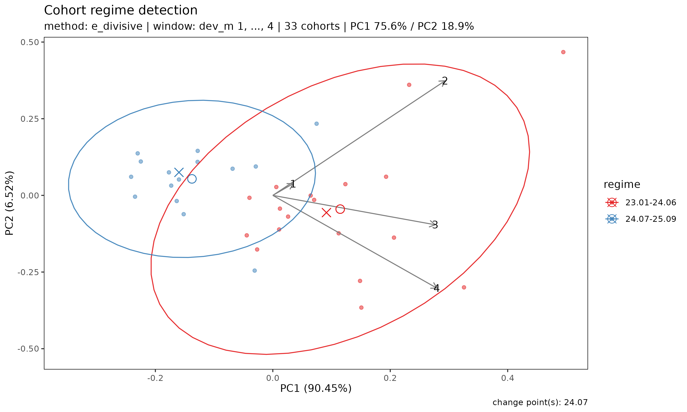

# Regime: 인수 코호트 간 구조적 변화 탐지

> 영어 원본 보기: [Detecting regime shifts across underwriting
> cohorts](https://seokhoonj.github.io/lossratio/regime-detection.md)

## 1. 동기

장기 건강보험 코호트 포트폴리오를 분석할 때 실무자가 자주 던지는 질문은
두 가지이다.

1.  최근 인수 코호트가 이전 코호트와 다른 양상을 보이는가?
2.  그렇다면 변화는 *언제* 일어났는가?

장기 보험에서 코호트 패턴이 깨지는 트리거는 보통 다음 4가지다.

1.  **급격한 보험료 조정** — 인상 또는 인하
2.  **상품 보장 내용 변경** — 보장 항목·기간·면책 등의 구조 조정
3.  **가입금액 한도 변경** — 1인당 최대 가입금액 상·하한 조정
4.  **Underwriting 가이드라인 변경** — 인수 자격·고지 항목·할증 기준의
    개정

번들로 제공되는 `experience` 데이터셋의 surgery 종목에는 위 트리거 중
하나가 2024-04 시점에 발생했다고 가정한 합성 break 가 심어져 있다.
따라서 아래 시연에서
[`detect_regime()`](https://seokhoonj.github.io/lossratio/reference/detect_regime.md)
이 잡아낼 명확한 변화점이 존재한다.

`plot(tri_sur)` 의 시각적 점검만으로도 최근 코호트의 초기 손해율이
과거보다 낮아 보일 수 있지만, 코호트별로 관측 창의 길이가 다른 상황에서
궤적 다발을 눈대중으로 살피는 것은 구조적 변화의 위치를 짚어내는 신뢰할
만한 방법이 못 된다.

[`detect_regime()`](https://seokhoonj.github.io/lossratio/reference/detect_regime.md)
은 이 두 질문에 한 번의 호출로 답한다 — 인수 코호트를 **regime** (유사한
손해 추이를 공유하는 인수 코호트들의 묶음) 으로 그룹화하고, 그룹 사이의
break 시점을 함께 보고한다. 각 인수 코호트를 특징 벡터 (경과 기간
`1, ..., K` 에 걸친 궤적) 로 다루고, 인수 시점 순으로 코호트를 정렬한
뒤, 그 다변량 시퀀스에 변화점 또는 클러스터링 방법을 적용한다.

## 2. 데이터와 설정

``` r

library(lossratio)

data(experience)
tri_sur <- as_triangle(
  experience[coverage == "surgery"],
  groups   = "coverage",
  cohort   = "uy_m",
  calendar = "cy_m",
  loss     = "incr_loss",
  prem     = "incr_prem"
)
```

## 3. regime 탐지

기본 방법은 `"e_divisive"` 로, 데이터로부터 regime 의 개수까지 결정하는
비모수 다변량 변화점 알고리즘이다.

``` r

r <- detect_regime(tri_sur, method = "e_divisive")
r
#> <Regime>
#>   method    : e_divisive
#>   target    : lr
#>   treatment : latest_only
#>   window (window) : dev_m 1-4
#>   cohorts    : 33 analysed (3 dropped)
#>   regimes    : 2
#>   changes    : 24.07
#>   PC1 / PC2  : 75.6% / 18.9%
```

`window` 인자는 코호트 특징 벡터를 정의하는 경과 기간 수를 조절한다.
최소 `window` 기간 이상 관측된 코호트만 분석되며, 창이 짧은 코호트는
제외된다. `window` 를 늘리면 궤적을 더 많이 담을 수 있지만 최근 코호트가
그만큼 더 빠진다. 기본값 `window = "auto"` 는 성숙 기반 sweep 으로
충분한 코호트를 유지하는 최대 window 를 자동 선택한다.

## 4. 요약과 regime 별 멤버십

``` r

summary(r)
#> Cohort regime detection summary
#>   method    : e_divisive
#>   target    : lr
#>   treatment : latest_only
#>   window    : dev_m 1-4
#>   cohorts   : 33 analysed (3 dropped)
#> 
#> Regimes (2):
#>   1: 23.01-24.06 (18 cohorts)
#>   2: 24.07-25.09 (15 cohorts)
#> 
#> Changes: 24.07

r$labels
#>     coverage     cohort      regime regime_id
#>       <char>     <Date>      <fctr>     <int>
#>  1:  surgery 2023-01-01 23.01-24.06         1
#>  2:  surgery 2023-02-01 23.01-24.06         1
#>  3:  surgery 2023-03-01 23.01-24.06         1
#>  4:  surgery 2023-04-01 23.01-24.06         1
#>  5:  surgery 2023-05-01 23.01-24.06         1
#>  6:  surgery 2023-06-01 23.01-24.06         1
#>  7:  surgery 2023-07-01 23.01-24.06         1
#>  8:  surgery 2023-08-01 23.01-24.06         1
#>  9:  surgery 2023-09-01 23.01-24.06         1
#> 10:  surgery 2023-10-01 23.01-24.06         1
#> 11:  surgery 2023-11-01 23.01-24.06         1
#> 12:  surgery 2023-12-01 23.01-24.06         1
#> 13:  surgery 2024-01-01 23.01-24.06         1
#> 14:  surgery 2024-02-01 23.01-24.06         1
#> 15:  surgery 2024-03-01 23.01-24.06         1
#> 16:  surgery 2024-04-01 23.01-24.06         1
#> 17:  surgery 2024-05-01 23.01-24.06         1
#> 18:  surgery 2024-06-01 23.01-24.06         1
#> 19:  surgery 2024-07-01 24.07-25.09         2
#> 20:  surgery 2024-08-01 24.07-25.09         2
#> 21:  surgery 2024-09-01 24.07-25.09         2
#> 22:  surgery 2024-10-01 24.07-25.09         2
#> 23:  surgery 2024-11-01 24.07-25.09         2
#> 24:  surgery 2024-12-01 24.07-25.09         2
#> 25:  surgery 2025-01-01 24.07-25.09         2
#> 26:  surgery 2025-02-01 24.07-25.09         2
#> 27:  surgery 2025-03-01 24.07-25.09         2
#> 28:  surgery 2025-04-01 24.07-25.09         2
#> 29:  surgery 2025-05-01 24.07-25.09         2
#> 30:  surgery 2025-06-01 24.07-25.09         2
#> 31:  surgery 2025-07-01 24.07-25.09         2
#> 32:  surgery 2025-08-01 24.07-25.09         2
#> 33:  surgery 2025-09-01 24.07-25.09         2
#>     coverage     cohort      regime regime_id
#>       <char>     <Date>      <fctr>     <int>
```

## 5. 시각화

`plot(r)` 은 코호트 궤적의 PCA(주성분분석) 산점도를 탐지된 regime 으로
색칠해 보여 준다. PCA 공간에서 regime 들이 잘 분리된다면 구조적 변화가
시각적으로 확인된 것이다.

``` r

plot(r)
```



화살표는 각 경과 기간 특징이 PC 축에 기여하는 적재량을 나타낸다 — regime
들이 *어떻게* 다른지 (예: 변화가 주로 초기 경과에 영향을 주는지, 후기
경과에 영향을 주는지) 읽어내는 데 유용하다.

## 6. target 선택

`target` 인자는 변화점 알고리즘이 *어떤 신호 위에서* 작동할지 결정한다.
target 마다 검출하는 regime 종류가 다르고, 각자 고유한 *false positive
모드* 가 있다. 의심되는 사건의 성격에 맞춰 target 을 고르고, 결과는 항상
도메인 지식과 대조해야 한다.

순서:
`c("lr", "loss_ata", "premium_ata", "loss_ed", "premium_ed", "loss", "premium")`
— cleanest 에서 riskiest 까지.

| 감지하려는 시나리오 | 권장 `target` | 주의사항 |
|----|----|----|
| 일반적 LR 예측 정확도 (default) | `"lr"` | 차등 성장 (loss/premium 성장률 비대칭) 으로 인한 *smooth drift* 를 sharp break |
|  |  | 로 오인할 수 있음. |
| Loss 발전 *속도* 변화 (CL `f`) | `"loss_ata"` *(진단용)* | dev=1 손실 + complete-row 요구 → sample 줄어듦; CV 가 낮아 작은 변동도 잡힘. |
| Premium 인식 *속도* 변화 | `"premium_ata"` *(진단용)* | `"loss_ata"` 와 같은 주의사항. |
| 노출 단위당 loss *세기* 변화 (ED `g`) | `"loss_ed"` *(진단용)* | premium 으로 cross-normalize — 단독 해석이 까다로움. |
| `premium_ata` 와 동일 (API 대칭) | `"premium_ed"` *(alias)* | PCA 표준화 후 `premium_ata` 와 동일한 change — alias. |
| Loss *level* 변화 (claims handling, 보장 변경) | `"loss"` | raw cumulative — book size 성장이 도미넌트, false positive 빈번. |
| Premium *level* 변화 (요율, 채널 변경) | `"premium"` | `"loss"` 와 같은 주의사항. |

참고:

- `"lr"` 이 default 인 이유 — 손해율이 패키지의 *예측 target* 이고,
  비율이라 *book size 성장에 자동 면역*.
- `"loss"` / `"premium"` 은 raw cumulative 컬럼이라 *갑작스러운 absolute
  level shift* 의심 시 (예: 채널 종료로 보험료 거치액 급감) 유용. smooth
  book growth 는 false positive 빈번 — 결과를 *알려진 언더라이팅·claims
  사건 타임라인* 과 대조 필수.
- `"loss_ata"`, `"premium_ata"`, `"loss_ed"` 는 *진단용* target.
  Triangle 에 저장된 컬럼이 아니라 inline 으로 derive 된다. CL 의 `f` /
  ED 의 `g` 인자와 직접 대응하므로 여기서 검출된 change 는 모델의
  stationarity 가정 위반에 해당. *구조적 메커니즘* 으로 regime 을
  귀속시키고 싶을 때 사용.

``` r

# 여러 target 을 비교 — 어떤 change 가 일관되게 나오는지 확인
detect_regime(tri_sur, target = "lr")
detect_regime(tri_sur, target = "loss")
detect_regime(tri_sur, target = "loss_ata")
```

진짜 강한 regime shift 는 여러 target 에서 비슷한 change 를 보인다.
신호가 약하거나 book size 성장이 도미넌트일 때 target 간 결과가 갈라진다
— 둘 다 유용한 진단 신호.

## 7. 방법 선택

- **`"e_divisive"`** — 권장 기본값. 다변량, 비모수 알고리즘으로, 주어진
  유의수준에서 regime 의 개수를 자동으로 탐지한다. 다른 방법보다 다소
  느리지만 사전에 `n_regimes` 를 정할 필요가 없다.

- **`"pelt"`** — 첫 주성분에 적용되는 빠른 일변량 변화점 탐지. 여러
  변화점을 반환할 수 있으며, 궤적 변동이 한 축에 의해 주도될 때 유용하다
  ([`print()`](https://rdrr.io/r/base/print.html) 출력의 `PC1 %` 를 확인
  — 70% 초과면 PELT 가 신뢰할 만하고, 그보다 훨씬 낮으면 `"e_divisive"`
  가 낫다).

- **`"hclust"`** — 표준화된 특징 행렬에 Ward 계층 클러스터링을 적용하고
  `n_regimes` 개 (default: `2`) 클러스터로 자른다. 시계열 순서를
  무시하므로 사후 검증용으로 적합하다. 시계열 기반 방법이 시점 `t` 에서
  변화점을 잡았을 때 `hclust` 가 동일한 두 그룹 (모든 사전-`t` 가 한
  클러스터, 모든 사후-`t` 가 다른 클러스터) 을 만들어 낸다면, 이 변화는
  방법론적 인공물이 아닌 구조적 변화이다.

실무에서는 세 방법이 모두 일치하는 경우 — 위 surgery 예시처럼
`"e_divisive"`, `"pelt"`, `"hclust"` 가 모두 `24.04` 를 regime 경계로
지목하는 경우 — 실제 인수/요율 변경의 강력한 증거가 된다.

## 8. regime 개수 강제하기

regime 개수를 고정해 비교하고 싶을 때 — 예를 들어 2-regime 가설과
3-regime 가설을 비교할 때 — `n_regimes` 를 넘긴다.

``` r

r2 <- detect_regime(tri_sur, method = "e_divisive", n_regimes = 3)
summary(r2)
#> Cohort regime detection summary
#>   method    : e_divisive
#>   target    : lr
#>   treatment : latest_only
#>   window    : dev_m 1-4
#>   cohorts   : 33 analysed (3 dropped)
#> 
#> Regimes (3):
#>   1: 23.01-24.06 (18 cohorts)
#>   2: 24.07-25.06 (12 cohorts)
#>   3: 25.07-25.09 (3 cohorts)
#> 
#> Changes: 24.07, 25.07
```

`"e_divisive"` 와 `"pelt"` 의 경우 `n_regimes` 는 요청값이다 (데이터가
허용하면 알고리즘이 그 수까지 regime 을 반환한다). `"hclust"` 의
경우에는 강제 컷이다.

## 9. 다중 그룹 탐지

여러 그룹으로 구축한 `Triangle` 은 그대로
[`detect_regime()`](https://seokhoonj.github.io/lossratio/reference/detect_regime.md)
에 전달할 수 있다. 그룹별로 독립적으로 탐지가 수행되며 결과는 하나의
`Regime` 객체에 모인다.

``` r

tri_all <- as_triangle(
  experience,
  groups   = "coverage",
  cohort   = "uy_m",
  calendar = "cy_m",
  loss     = "incr_loss",
  prem     = "incr_prem"
)
r_all   <- detect_regime(tri_all, by = "coverage", method = "e_divisive")
r_all$changes
#>    coverage     change regime_id pre_value post_value magnitude
#>      <char>     <Date>     <int>     <num>      <num>     <num>
#> 1:  surgery 2024-07-01         2 0.9065895  0.5479919 0.3585976
```

다중 그룹 모드에서 `r_all$changes` 는 그룹 컬럼과 `change` Date 컬럼을
가진 `data.table` 이고, `r_all$labels` 에도 그룹 컬럼이 추가된다.
`r_all$n_regimes` 는 그룹값을 이름으로 하는 정수 벡터이며,
`r_all$multi_group` 플래그가 단일 그룹 스칼라 형식과 구분해준다.

특정 그룹의 코호트 수가 `window` 보다 적으면 그 그룹은 경고와 함께 skip
되고 나머지 그룹은 정상 진행된다. *모든* 그룹이 실패하면
[`detect_regime()`](https://seokhoonj.github.io/lossratio/reference/detect_regime.md)
은 오류를 발생시킨다.

`plot(r_all)` 은 그룹별 패널 ggplot 객체의 named list 를 반환한다
(그룹값을 key 로).

## 10. `fit_lr()` 과의 관계

[`detect_regime()`](https://seokhoonj.github.io/lossratio/reference/detect_regime.md)
은
[`fit_lr()`](https://seokhoonj.github.io/lossratio/reference/fit_lr.md)
프레임워크의 수정이 아니라 *전처리 진단* 이다. 그 출력은 두 가지로
활용된다.

1.  **층화 적합**: 명확히 구분되는 두 regime 이 탐지된 경우, 각 regime
    부분집합에 대해
    [`fit_lr()`](https://seokhoonj.github.io/lossratio/reference/fit_lr.md)
    을 따로 적합하면 풀링 적합보다 더 또렷한 수렴 영역의 손해율 추정값을
    얻는 경우가 많다.

2.  **요율 변경 문서화**: 탐지된 변화점은 동반 논문의 *Limitations*
    절에서 설명한 전처리 권고 (보험료 on-leveling 또는 익스포저 분해
    $`V = C^P / r`$) 의 데이터 기반 기준점이 된다.
