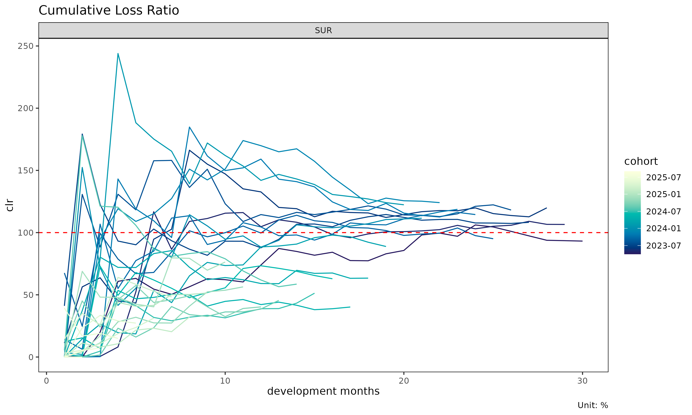
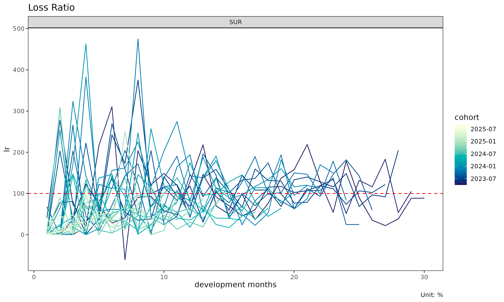
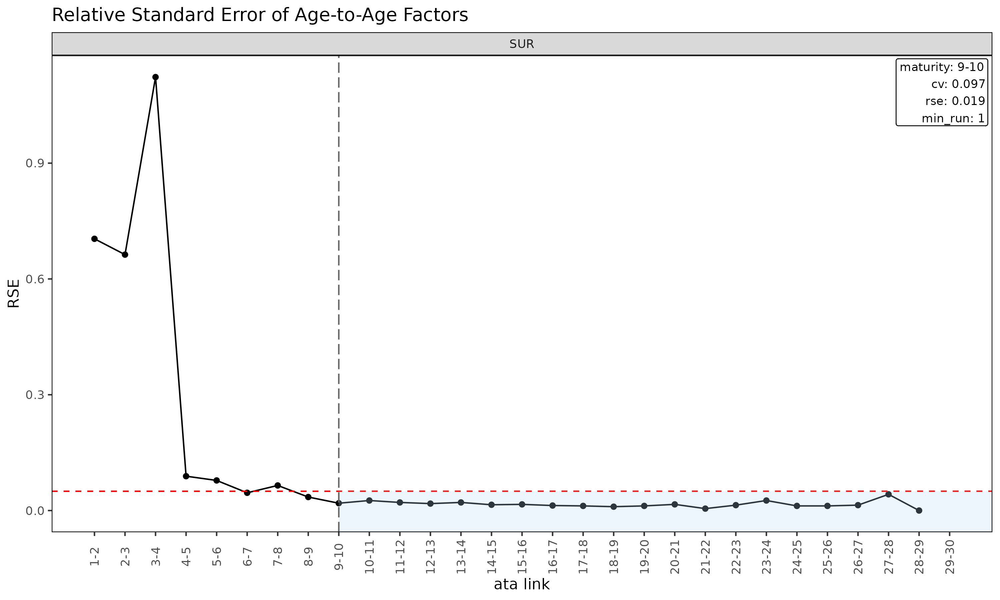
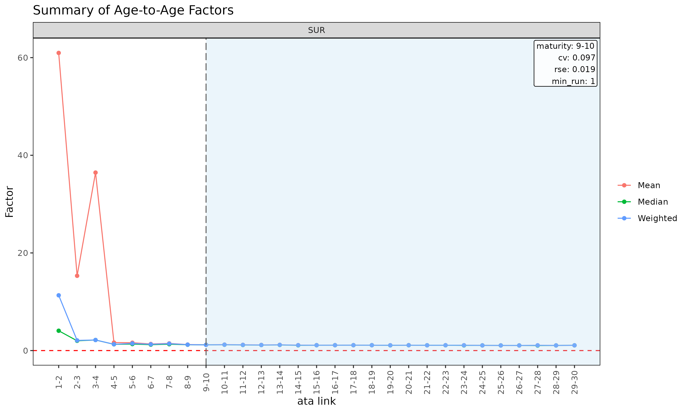
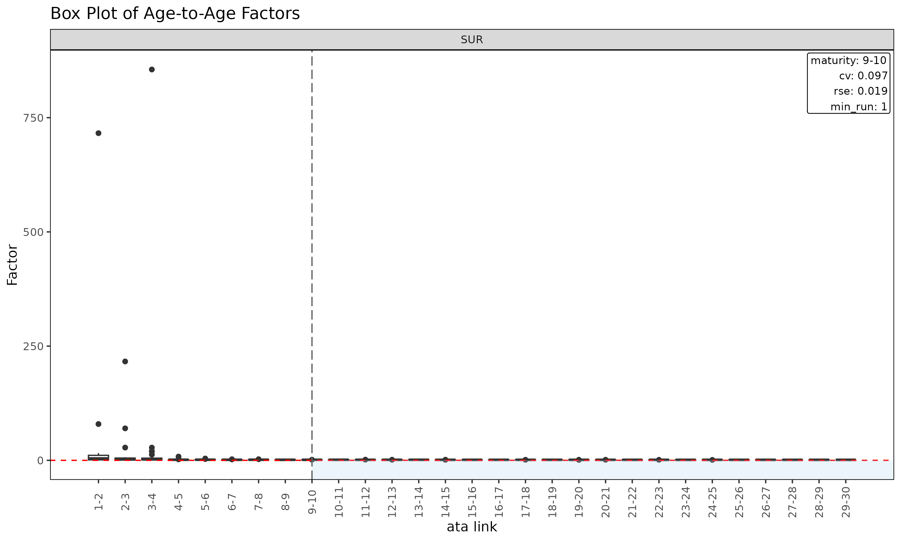
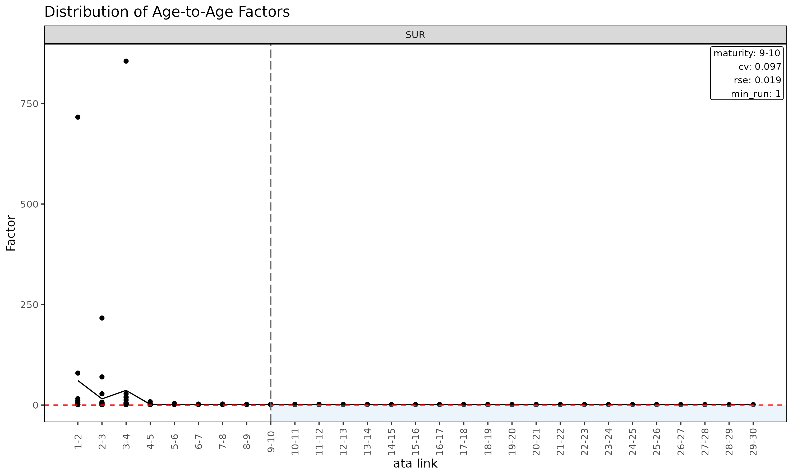
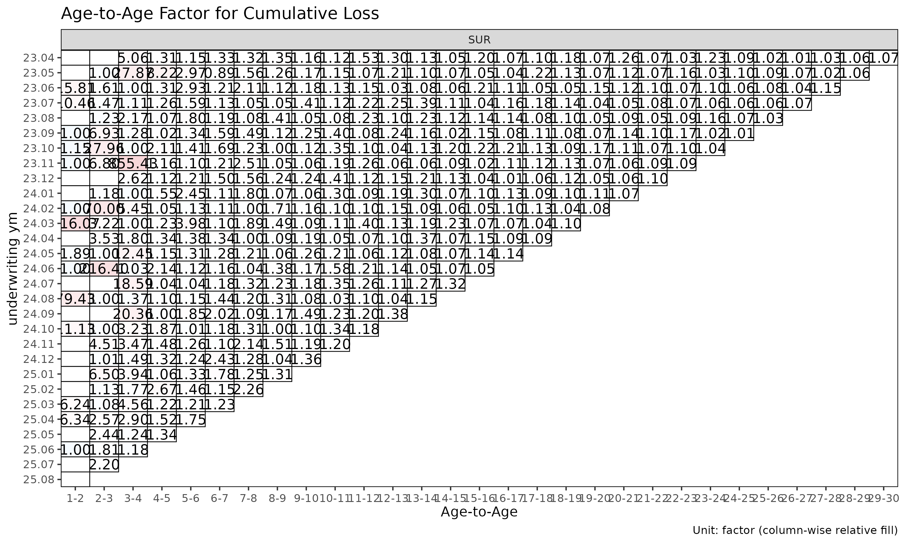
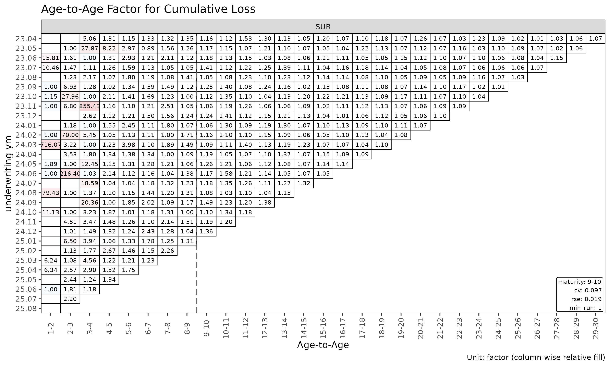
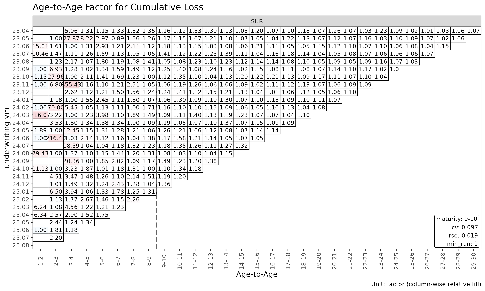
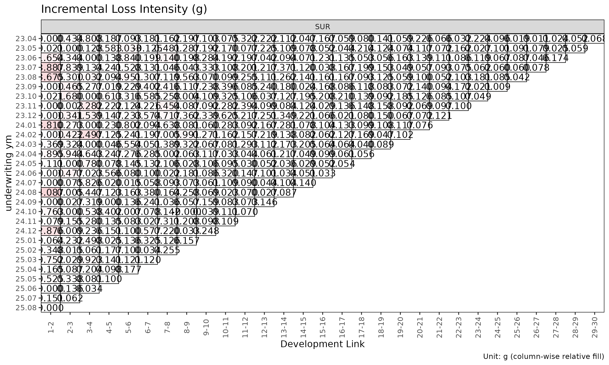

# Triangle and ata diagnostics

Before fitting a chain ladder or loss-ratio model, it pays to inspect
the underlying triangle. This vignette covers the diagnostic tools in
`lossratio` for understanding cohort behaviour, age-to-age factor
stability, and maturity detection.

## Triangle-level diagnostics

For brevity this vignette uses the `SUR` group only — every step
generalises to multi-group input.

``` r

library(lossratio)
data(experience)
exp <- as_experience(experience)[cv_nm == "SUR"]
tri <- build_triangle(exp, group_var = cv_nm)
```

### Cohort trajectories

``` r

plot(tri)                              # raw clr trajectories per cohort
```



``` r

plot(tri, value_var = "lr")            # incremental loss ratio instead of clr
```



``` r

plot(tri, summary = TRUE)              # raw + overlay (mean / median / weighted)
```


The `summary = TRUE` overlay computes mean, median, and weighted clr at
each dev and overlays them on the cohort lines. Useful for spotting
cohorts that deviate from the central tendency.

### Cell heatmap

``` r

plot_triangle(tri)                            # clr in each cell
```


``` r

plot_triangle(tri, value_var = "lr")          # incremental loss ratio
```


``` r


# detail labels (ratio + loss/rp amounts) are 2-line — use quarterly cells
tri_q <- build_triangle(exp, group_var = cv_nm,
                        cohort_var = "uyq", dev_var = "elap_q")
plot_triangle(tri_q, label_style = "detail")  # ratio + (loss / rp) amounts
```


### Group statistics by dev

``` r

sm <- summary(tri)
head(sm)
#> Key: <cv_nm, dev>
#>     cv_nm   dev n_obs   lr_mean  lr_median      lr_wt  clr_mean clr_median
#>    <char> <int> <int>     <num>      <num>      <num>     <num>      <num>
#> 1:    SUR     1    30 0.0738546 0.00000000 0.07343113 0.0738546  0.0000000
#> 2:    SUR     2    29 0.5365888 0.09928479 0.54126364 0.3512535  0.1120446
#> 3:    SUR     3    28 0.6201189 0.24720698 0.56590121 0.4521326  0.2618097
#> 4:    SUR     4    27 0.8852658 0.63871641 0.92060613 0.6327243  0.4798531
#> 5:    SUR     5    26 0.5767557 0.48288984 0.59880667 0.6369308  0.5641166
#> 6:    SUR     6    25 0.9314593 0.54313974 0.95085712 0.7264308  0.6191132
#>        clr_wt
#>         <num>
#> 1: 0.07343113
#> 2: 0.35150130
#> 3: 0.44744111
#> 4: 0.63467050
#> 5: 0.63999293
#> 6: 0.72781357
```

Returns a `TriangleSummary` object with mean / median / weighted loss
ratios per (group, dev) cell.

## Age-to-age factor diagnostics

``` r

ata <- build_ata(tri, value_var = "closs")
sm  <- summary(ata, alpha = 1)
head(sm)
#> Key: <cv_nm>
#>     cv_nm ata_from ata_to ata_link   mean median     wt    cv     f  f_se   rse
#>    <char>    <num>  <num>   <fctr>  <num>  <num>  <num> <num> <num> <num> <num>
#> 1:    SUR        1      2      1-2 60.962  4.062 11.320 3.111 6.768 4.767 0.704
#> 2:    SUR        2      3      2-3 15.316  2.005  2.083 2.955 1.939 1.284 0.663
#> 3:    SUR        3      4      3-4 36.459  2.167  2.167 4.493 2.167 2.434 1.123
#> 4:    SUR        4      5      4-5  1.641  1.282  1.291 0.854 1.291 0.115 0.089
#> 5:    SUR        5      6      5-6  1.607  1.334  1.461 0.455 1.461 0.113 0.078
#> 6:    SUR        6      7      6-7  1.348  1.208  1.282 0.256 1.282 0.058 0.046
#>        sigma n_obs n_valid n_inf n_nan valid_ratio
#>        <num> <num>   <num> <num> <num>       <num>
#> 1: 27971.882    29      14     0     0       0.483
#> 2: 25358.311    28      24     0     0       0.857
#> 3: 69089.940    27      27     0     0       1.000
#> 4:  4787.737    26      26     0     0       1.000
#> 5:  5301.573    25      25     0     0       1.000
#> 6:  3279.239    24      24     0     0       1.000
```

The [`summary()`](https://rdrr.io/r/base/summary.html) method on an
`ATA` object computes per-link statistics that drive maturity detection:

- `mean`, `median`, `wt` — descriptive averages of observed ata factors
  at each link (excluding cohorts where the link is not observed).
- `cv` — coefficient of variation of the observed factors (relative
  spread, alpha-independent).
- `f` — WLS-estimated factor (volume-weighted by `value_from^alpha`).
- `f_se`, `rse` — WLS standard error and relative standard error.
- `sigma` — Mack residual sigma per link.
- `n_obs`, `n_valid`, `n_inf`, `n_nan`, `valid_ratio` — observation
  counts and the share of finite ata factors per link.

### Diagnostic plots for `ATA`

``` r

plot(ata, type = "cv")            # CV vs ata link with maturity overlay
```


``` r

plot(ata, type = "rse")           # RSE vs ata link
```



``` r

plot(ata, type = "summary")       # mean / median / wt overlay per link
```



``` r

plot(ata, type = "box")           # boxplot of observed ata per link
```



``` r

plot(ata, type = "point")         # scatter of observed ata per link
```



### Triangle of ata factors

``` r

plot_triangle(ata)                                # heatmap of observed factors
```



``` r

plot_triangle(ata, label_style = "detail")        # factor + (loss / rp) amounts
```



``` r

plot_triangle(ata, show_maturity = TRUE)          # overlay maturity line
```



The heatmap colours each cell by `log(ata / median(ata))` within its
link, so column-wise colour distinguishes cohorts that deviate from the
link’s median.

## Maturity detection

The maturity point is the development link beyond which age-to-age
factors are stable enough to trust for chain-ladder projection. Used
internally by `fit_lr(method = "sa")` to switch from ED to CL.

[`find_ata_maturity()`](https://seokhoonj.github.io/lossratio/reference/find_ata_maturity.md)
operates on a summary of an `ATA` object — first build the descriptive /
WLS summary via [`summary()`](https://rdrr.io/r/base/summary.html), then
probe it for the first mature link:

``` r

sm  <- summary(ata, alpha = 1)
mat <- find_ata_maturity(
  sm,
  cv_threshold    = 0.10,    # CV must be below this
  rse_threshold   = 0.05,    # RSE must be below this
  min_valid_ratio = 0.5,     # at least 50% finite cohorts at the link
  min_n_valid     = 3L,      # at least 3 finite cohorts
  min_run         = 1L       # at least 1 consecutive mature link
)

print(mat)
#> Key: <cv_nm>
#>     cv_nm ata_from ata_to ata_link  mean median    wt    cv     f  f_se   rse
#>    <char>    <num>  <num>   <char> <num>  <num> <num> <num> <num> <num> <num>
#> 1:    SUR        9     10     9-10 1.188  1.172 1.165 0.097 1.165 0.022 0.019
#>       sigma n_obs n_valid n_inf n_nan valid_ratio
#>       <num> <num>   <num> <num> <num>       <num>
#> 1: 1774.277    21      21     0     0           1
```

A row per group with the first development link satisfying all
thresholds, carrying the link’s full statistics. The threshold arguments
are also stored as attributes on the returned object.
[`find_ata_maturity()`](https://seokhoonj.github.io/lossratio/reference/find_ata_maturity.md)
is also called internally by
[`fit_ata()`](https://seokhoonj.github.io/lossratio/reference/fit_ata.md)
and
[`fit_cl()`](https://seokhoonj.github.io/lossratio/reference/fit_cl.md)
when `maturity_args` is supplied (the `alpha` of the internal
[`summary()`](https://rdrr.io/r/base/summary.html) step is taken from
those callers).

Tune the thresholds to your portfolio’s volatility profile. Tight
thresholds (e.g. `cv_threshold = 0.05`) push maturity later; loose
thresholds push it earlier.

## ED diagnostics

``` r

ed <- build_ed(tri, loss_var = "closs", exposure_var = "crp")
sm <- summary(ed, alpha = 1)
head(sm)
#> Key: <cv_nm>
#>     cv_nm ata_from ata_to ata_link    mean  median      wt      cv       g
#>    <char>    <num>  <num>   <fctr>   <num>   <num>   <num>   <num>   <num>
#> 1:    SUR        1      2      1-2 0.83638 0.11124 0.78549 1.64664 0.78549
#> 2:    SUR        2      3      2-3 0.42921 0.19355 0.39517 1.28530 0.39517
#> 3:    SUR        3      4      3-4 0.57740 0.28022 0.54349 1.36754 0.54349
#> 4:    SUR        4      5      4-5 0.18873 0.13962 0.18976 0.90510 0.18976
#> 5:    SUR        5      6      5-6 0.29944 0.16294 0.30277 1.01004 0.30277
#> 6:    SUR        6      7      6-7 0.21583 0.18880 0.20988 0.85987 0.20988
#>       g_se     rse    sigma n_obs n_valid n_inf n_nan valid_ratio
#>      <num>   <num>    <num> <num>   <num> <num> <num>       <num>
#> 1: 0.24877 0.31671 5291.085    29      29     0     0           1
#> 2: 0.09984 0.25264 3263.750    28      28     0     0           1
#> 3: 0.14933 0.27477 6210.872    27      27     0     0           1
#> 4: 0.03343 0.17615 1720.934    26      26     0     0           1
#> 5: 0.06037 0.19939 3487.836    25      25     0     0           1
#> 6: 0.03771 0.17970 2450.547    24      24     0     0           1

plot(ed, type = "summary")
```


``` r

plot(ed, type = "box")
```


``` r

plot_triangle(ed)
```



The [`summary()`](https://rdrr.io/r/base/summary.html) method on an `ED`
object is the ED-side analogue of
[`summary()`](https://rdrr.io/r/base/summary.html) on an `ATA` object,
computing per-link statistics for the intensity
$`g_k = \Delta C^L_k / C^P_k`$.

## Validation before building

If gaps in the development sequence are suspected, inspect them before
[`build_triangle()`](https://seokhoonj.github.io/lossratio/reference/build_triangle.md):

``` r

gaps <- validate_triangle(exp, group_var = cv_nm,
                          cohort_var = "uym", dev_var = "elap_m")
head(gaps)
#> Empty data.table (0 rows and 5 cols): cv_nm,uym,n_observed,n_expected,missing
```

Returns a `TriangleValidation` object with one row per cohort that has
non-consecutive development periods. An empty result means the triangle
is clean.

If gaps exist, options:

- Fix the data source (preferred).
- Drop offending cohorts.
- Pass `fill_gaps = TRUE` to
  [`build_triangle()`](https://seokhoonj.github.io/lossratio/reference/build_triangle.md)
  to zero-fill missing cells (use with care — inflates `n_obs`).

## Recent-diagonal subset

When older cohorts are no longer representative (rate change, reserving
regime shift), restrict estimation to the recent calendar diagonals:

``` r

fit_ata(ata, alpha = 1, recent = 12)        # last 12 calendar diagonals
#> <ATAFit>
#> alpha       : 1 
#> sigma_method: min_last2 
#> recent      : 12 
#> use_maturity: FALSE 
#> groups      : cv_nm 
#> n_groups    : 1 
#> ata links   : 29
fit_cl(tri, value_var = "closs", recent = 12)
#> <CLFit>
#> method      : basic 
#> value_var   : closs 
#> weight_var  : none 
#> alpha       : 1 
#> recent      : 12 
#> use_maturity: FALSE 
#> tail_factor : 1 
#> groups      : cv_nm 
#> periods     : 30
fit_lr(tri, recent = 12)
#> <LRFit>
#> method        : sa 
#> loss_var      : closs 
#> exposure_var  : crp 
#> loss_alpha    : 1 
#> exposure_alpha: 1 
#> delta_method  : simple 
#> conf_level    : 0.95 
#> ci_type       : analytical  
#> sigma_method  : min_last2 
#> recent        : 12 
#> maturity[SUR] : 18
#> groups        : cv_nm 
#> periods       : 30
```

`recent = K` keeps only rows whose calendar position
(`rank(cohort) + dev - 1`) is among the latest `K` per group.

## Workflow checklist

Before fitting:

1.  [`validate_triangle()`](https://seokhoonj.github.io/lossratio/reference/validate_triangle.md)
    — schema and gap check.
2.  [`build_triangle()`](https://seokhoonj.github.io/lossratio/reference/build_triangle.md)
    — canonical shape with derived columns.
3.  `plot(tri)` / `plot_triangle(tri)` — visual inspection.
4.  `summary(tri)` — group-level central tendency.
5.  [`build_ata()`](https://seokhoonj.github.io/lossratio/reference/build_ata.md) +
    `plot(ata, type = "cv")` — link stability.
6.  [`find_ata_maturity()`](https://seokhoonj.github.io/lossratio/reference/find_ata_maturity.md)
    — verify maturity detection produces a sensible point per group.
7.  [`detect_cohort_regime()`](https://seokhoonj.github.io/lossratio/reference/detect_cohort_regime.md)
    (optional) — structural change diagnosis.

Then fit
[`fit_lr()`](https://seokhoonj.github.io/lossratio/reference/fit_lr.md)
/
[`fit_cl()`](https://seokhoonj.github.io/lossratio/reference/fit_cl.md)
with confidence in the input data.

## See also

- [`vignette("getting-started")`](https://seokhoonj.github.io/lossratio/articles/getting-started.md)
  — full pipeline overview.
- [`vignette("regime-detection")`](https://seokhoonj.github.io/lossratio/articles/regime-detection.md)
  —
  [`detect_cohort_regime()`](https://seokhoonj.github.io/lossratio/reference/detect_cohort_regime.md)
  deep dive.
- [`vignette("loss-ratio-methods")`](https://seokhoonj.github.io/lossratio/articles/loss-ratio-methods.md)
  — projection method choice.
