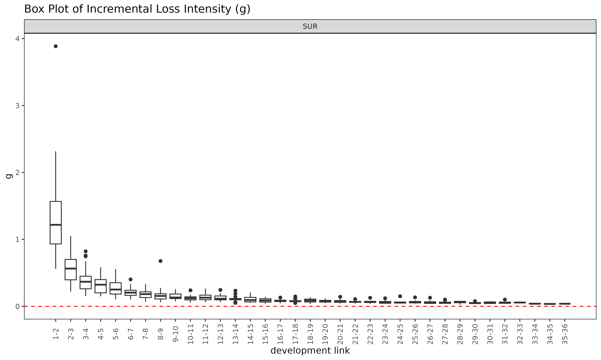
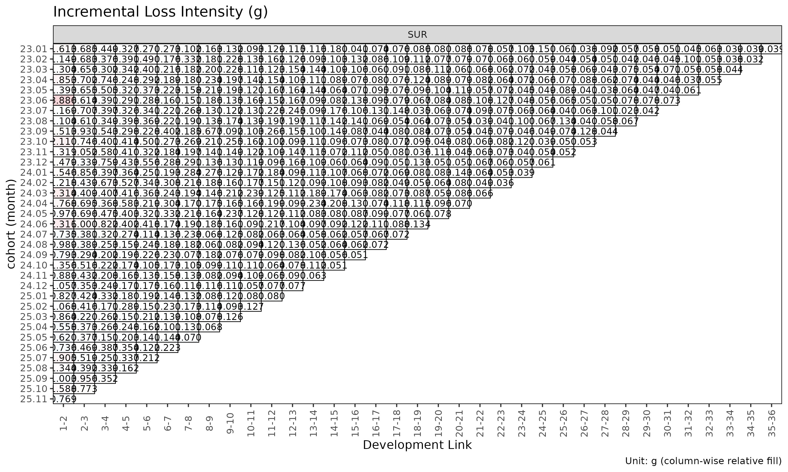
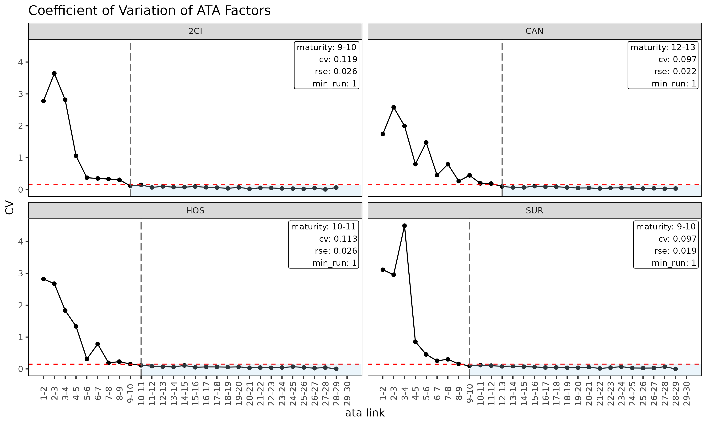

# Triangle, Link and Maturity: 데이터 구조와 factor 진단

> 영어 원본 보기: [Triangle, Link and Maturity: data structures and
> factor
> diagnostics](https://seokhoonj.github.io/lossratio/triangle-link-and-maturity.md)

chain ladder 또는 손해율 모형을 적합하기 전에 기반이 되는 triangle 과
그로부터 파생된 단계 연결 테이블(link table) 을 살펴보는 것이
효율적이다. 이 문서는 `Triangle` 과 `Link` 데이터 구조, 진단 플롯,
그리고 ATA 인자가 chain ladder 추정에 신뢰할 만큼 안정화되는 dev 시점을
식별하는
[`detect_maturity()`](https://seokhoonj.github.io/lossratio/reference/detect_maturity.md)
까지 다룬다.

## 1. Triangle 진단

이 문서는 간결성을 위해 `SUR` 그룹만 사용한다 — 모든 절차는 다중 그룹
입력에도 그대로 일반화된다.

``` r

library(lossratio)
data(experience)
exp <- experience[coverage == "SUR"]
tri <- as_triangle(
  exp,
  groups   = "coverage",
  cohort   = "uy_m",
  calendar = "cy_m",
  loss     = "loss_incr",
  premium  = "premium_incr"
)
```

### 코호트 궤적

``` r

plot(tri)                              # 코호트별 누적 손해율 궤적
```


``` r

plot(tri, metric = "lr_incr")       # 누적 대신 증분 손해율
```


``` r

plot(tri, summary = TRUE)              # 코호트 선 + overlay (평균 / 중앙값 / 가중)
```


`summary = TRUE` overlay 는 각 dev 에서 평균, 중앙값, 가중 lr 을 계산해
코호트 선 위에 겹쳐 그린다. 중심 경향에서 벗어나는 코호트를 포착하는 데
유용하다.

### 셀 히트맵

``` r

plot_triangle(tri, metric = "lr")          # 누적 lr
```


``` r

plot_triangle(tri, metric = "lr_incr")     # 증분 lr
```


``` r


# detail 라벨은 두 줄이라 monthly 셀에서는 겹침 — quarterly 로 다시 빌드
tri_q <- as_triangle(exp, groups = "coverage", cohort = "uy_m", calendar = "cy_m", loss = "loss_incr", premium = "premium_incr", grain = "Q")
plot_triangle(tri_q, label_style = "detail")  # 비율 + (loss / premium)
```


### dev 별 그룹 통계

``` r

sm <- summary(tri)
head(sm)
#> Key: <coverage, dev>
#>    coverage   dev n_cohorts   lr_mean lr_median     lr_wt lr_incr_mean
#>      <char> <int>     <int>     <num>     <num>     <num>        <num>
#> 1:      SUR     1        36 0.2522898 0.2393582 0.2525932    0.2522898
#> 2:      SUR     2        35 0.8030639 0.7859128 0.7890646    1.3572087
#> 3:      SUR     3        34 0.9258662 0.8997912 0.9204360    1.1519240
#> 4:      SUR     4        33 0.9856772 0.9716558 0.9778502    1.1797269
#> 5:      SUR     5        32 1.0336648 1.0502252 1.0447602    1.2268717
#> 6:      SUR     6        31 1.0945723 1.1832332 1.0892484    1.3676102
#>    lr_incr_median lr_incr_wt
#>             <num>      <num>
#> 1:      0.2393582  0.2525932
#> 2:      1.2618216  1.3280769
#> 3:      1.1517980  1.1728982
#> 4:      1.1167740  1.1742272
#> 5:      1.2663383  1.3110155
#> 6:      1.2676379  1.2752751
```

(group, dev) 셀별 평균 / 중앙값 / 가중 손해율을 담은 `TriangleSummary`
객체를 반환한다.

## 2. Link / factor 진단

`Link` 객체는 triangle 으로부터 빌드된 단계 연결 테이블(link table)
이다. 단일 변수 모드에서는 관측된 **ATA 인자**(age-to-age factor) 를
담고, `exposure` 를 지정하면 ED 강도 $`g_k = \Delta C^L_k / C^P_k`$ 를
담는다.

``` r

ata <- as_link(tri, target = "loss")
sm  <- summary(ata, model = "ata", alpha = 1)
head(sm)
#> Key: <coverage>
#>    coverage ata_from ata_to ata_link  mean median    wt    cv     f  f_se   rse
#>      <char>    <num>  <num>   <fctr> <num>  <num> <num> <num> <num> <num> <num>
#> 1:      SUR        1      2      1-2 6.595  6.089 6.163 0.427 6.163 0.382 0.062
#> 2:      SUR        2      3      2-3 1.765  1.768 1.739 0.157 1.739 0.042 0.024
#> 3:      SUR        3      4      3-4 1.435  1.400 1.418 0.105 1.418 0.027 0.019
#> 4:      SUR        4      5      4-5 1.324  1.331 1.339 0.068 1.339 0.018 0.014
#> 5:      SUR        5      6      5-6 1.267  1.246 1.243 0.070 1.243 0.016 0.013
#> 6:      SUR        6      7      6-7 1.204  1.194 1.205 0.048 1.205 0.011 0.009
#>       sigma n_cohorts n_valid n_inf n_nan valid_ratio
#>       <num>     <num>   <num> <num> <num>       <num>
#> 1: 6207.618        35      35     0     0           1
#> 2: 1689.250        34      34     0     0           1
#> 3: 1372.883        33      33     0     0           1
#> 4: 1105.053        32      32     0     0           1
#> 5: 1086.826        31      31     0     0           1
#> 6:  812.770        30      30     0     0           1
```

`Link` 객체 (단일 변수 모드) 의
[`summary()`](https://rdrr.io/r/base/summary.html) 메소드는 성숙점
탐지를 구동하는 링크별 통계를 계산한다.

- `mean`, `median`, `wt` — 각 링크에서 관측된 ATA 인자의 기술 평균 (해당
  링크가 관측되지 않은 코호트는 제외).
- `cv` — 관측 인자의 변동계수 (상대 산포, alpha 와 무관).
- `f` — WLS 로 추정된 인자 (`loss_from^alpha` 로 볼륨 가중).
- `f_se`, `rse` — WLS 표준오차 및 상대 표준오차.
- `sigma` — 링크별 Mack 잔차 sigma.
- `n_cohorts`, `n_valid`, `n_inf`, `n_nan`, `valid_ratio` — 관측 수와
  링크별 유한 ATA 인자의 비율.

### Link 진단 플롯

``` r

plot(ata, type = "cv")            # ata 링크별 CV (성숙점 overlay 포함)
```


``` r

plot(ata, type = "rse")           # ata 링크별 RSE
```


``` r

plot(ata, type = "summary")       # 링크별 mean / median / wt overlay
```


``` r

plot(ata, type = "box")           # 링크별 관측 ata 의 boxplot
```


``` r

plot(ata, type = "point")         # 링크별 관측 ata 의 산점도
```


### ATA 인자의 Triangle

``` r

plot_triangle(ata, label_size = 2.5)              # 관측 인자 히트맵
```


``` r

plot_triangle(ata, label_size = 2.5, show_maturity = TRUE)  # 성숙점 라인 overlay
```


``` r


# detail 라벨은 두 줄이라 monthly 셀에서는 겹침 — quarterly Link 로 다시 빌드
ata_q <- as_link(tri_q, target = "loss")
plot_triangle(ata_q, label_style = "detail")      # 인자 + (loss / premium)
```


이 히트맵은 각 셀을 자기 링크 내에서 `log(ata / median(ata))` 로
색칠하므로, 열 방향 색상은 해당 링크의 중앙값에서 벗어나는 코호트를
구분해 준다.

### ED 진단

``` r

ed <- as_link(tri, target = "loss", exposure = "premium")
sm <- summary(ed, model = "ed", alpha = 1)
head(sm)
#> Key: <coverage>
#>    coverage ata_from ata_to ata_link    mean  median      wt      cv       g
#>      <char>    <num>  <num>   <fctr>   <num>   <num>   <num>   <num>   <num>
#> 1:      SUR        1      2      1-2 1.34661 1.21766 1.31614 0.47327 1.31614
#> 2:      SUR        2      3      2-3 0.58109 0.56432 0.58674 0.37381 0.58674
#> 3:      SUR        3      4      3-4 0.39105 0.36751 0.38178 0.43535 0.38178
#> 4:      SUR        4      5      4-5 0.31110 0.32321 0.33127 0.35969 0.33127
#> 5:      SUR        5      6      5-6 0.27543 0.25088 0.25518 0.43531 0.25518
#> 6:      SUR        6      7      6-7 0.21364 0.20479 0.22393 0.31371 0.22393
#>       g_se     rse     sigma n_cohorts n_valid n_inf n_nan valid_ratio
#>      <num>   <num>     <num>     <num>   <num> <num> <num>       <num>
#> 1: 0.09107 0.06919 2930.7438        35      35     0     0           1
#> 2: 0.03508 0.05979 1580.2621        34      34     0     0           1
#> 3: 0.02931 0.07677 1587.1869        33      33     0     0           1
#> 4: 0.02135 0.06444 1319.1106        32      32     0     0           1
#> 5: 0.02087 0.08178 1421.4780        31      31     0     0           1
#> 6: 0.01273 0.05686  937.7864        30      30     0     0           1

plot(ed, type = "summary")
```


``` r

plot(ed, type = "box")
```



``` r

plot_triangle(ed)                                  # ED triangle (default size)
```



`summary(link, model = "ed")` 는 단일 변수
[`summary()`](https://rdrr.io/r/base/summary.html) 에 대응하는 ED 측
분석으로, 강도 $`g_k = \Delta C^L_k / C^P_k`$ 에 대해 링크별 통계를
계산한다.

## 3. 성숙점 탐지

성숙점(maturity point) 은 **ATA 인자**(age-to-age factor) 가 chain
ladder 추정에 신뢰할 만큼 안정화되는 경과 기간 링크이다.
`fit_lr(method = "sa")` 가 ED 에서 CL 로 전환할 때 내부적으로 사용한다.

### 탐지

[`detect_maturity()`](https://seokhoonj.github.io/lossratio/reference/detect_maturity.md)
는 `Triangle` 을 직접 입력으로 받는다 — 내부에서 단일 변수 `Link` 와 그
WLS 요약을 자동으로 빌드한다.

``` r

mat <- detect_maturity(
  tri,
  target          = "loss",
  max_cv          = 0.15,    # CV 가 이 값보다 작아야 함
  max_rse         = 0.05,    # RSE 가 이 값보다 작아야 함
  min_valid_ratio = 0.5,     # 해당 링크에서 유한 코호트가 50% 이상
  min_n_valid     = 3L,      # 유한 코호트가 최소 3개
  min_run         = 1L       # 연속 성숙 링크 최소 1개
)

print(mat)
#> Key: <coverage>
#>    coverage ata_from change ata_link     mean   median       wt        cv
#>      <char>    <num>  <num>   <char>    <num>    <num>    <num>     <num>
#> 1:      SUR        3      4      3-4 1.434507 1.400098 1.417706 0.1053282
#>           f       f_se        rse    sigma n_cohorts n_valid n_inf n_nan
#>       <num>      <num>      <num>    <num>     <num>   <num> <num> <num>
#> 1: 1.417706 0.02651852 0.01870522 1372.883        33      33     0     0
#>    valid_ratio
#>          <num>
#> 1:           1
```

그룹별로 모든 임계값을 만족하는 첫 경과 기간 링크 한 행이 출력되며, 해당
링크의 전체 통계가 같이 실린다. 임계값 인자들은 반환된 `Maturity` 객체의
attribute 로도 저장된다.

### 임계값의 의미

- `max_cv` — 해당 링크에서 관측된 ATA 인자의 변동계수. `alpha` 와
  무관하게 상대 산포를 제한한다.
- `max_rse` — WLS 추정 인자 `f` 의 상대 표준오차. 잔차 산포가 아니라
  파라미터 불확실성을 포착한다.
- `min_valid_ratio` — 해당 링크에서 유한 ATA 를 갖는 코호트의 최소 비율.
  대부분이 0 / NA / Inf 인 링크를 막는다.
- `min_n_valid` — 해당 링크에서 유한 코호트의 최소 개수. 데이터가 얇은
  꼬리 영역의 절대 하한.
- `min_run` — *연속* 성숙 링크의 최소 개수. `min_run = 1L` (default)
  이면 조건을 만족하는 첫 링크가 채택되고, `2L` 이상으로 두면 지속적인
  안정성을 요구한다.

포트폴리오의 변동성 프로파일에 맞춰 조정한다. 임계값을 빡빡하게 (예:
`max_cv = 0.05`) 잡으면 성숙점이 뒤로 밀리고, 느슨하게 잡으면 앞으로
당겨진다.

### 적합 함수에서의 사용

[`detect_maturity()`](https://seokhoonj.github.io/lossratio/reference/detect_maturity.md)
는
[`fit_ata()`](https://seokhoonj.github.io/lossratio/reference/fit_ata.md)
와
[`fit_cl()`](https://seokhoonj.github.io/lossratio/reference/fit_cl.md)
내부에서도 `maturity` 인자를 통해 호출된다. 사용자 임계값을 넘기려면
[`maturity_spec()`](https://seokhoonj.github.io/lossratio/reference/maturity_spec.md)
으로 감싸 전달하고, default 값으로 자동 탐지하려면 `"auto"` 를 쓴다
(`fit_lr(method = "sa")` /
[`fit_loss()`](https://seokhoonj.github.io/lossratio/reference/fit_loss.md)
는 default 가 `"auto"`).

``` r

fit_ata(tri, target = "loss",
        maturity = maturity_spec(max_cv = 0.08, min_run = 2L))

fit_cl(tri, target = "loss",
       maturity = maturity_spec(max_cv = 0.08))

fit_lr(tri, method = "sa",
       maturity = maturity_spec(max_cv = 0.08))
```

`maturity` 인자는 네 가지 형태를 받는다: `NULL` (탐지 안 함), 이미
산출된 `Maturity` 객체
([`detect_maturity()`](https://seokhoonj.github.io/lossratio/reference/detect_maturity.md)
결과 또는 수동 override 용
[`maturity_at()`](https://seokhoonj.github.io/lossratio/reference/maturity_at.md)),
문자열 `"auto"` (default 임계값으로 내부 탐지), 또는 triangle 한 개를
인자로 받아 `Maturity` 를 반환하는 함수 (보통
[`maturity_spec()`](https://seokhoonj.github.io/lossratio/reference/maturity_spec.md)
로 작성).

`fit_lr(method = "sa")` 에서는 탐지된 성숙점이 ED (초기 dev) 에서 CL
(이후 dev) 로 전환되는 dev 를 결정한다.

### 그룹별 출력

다중 그룹 triangle 의 경우
[`detect_maturity()`](https://seokhoonj.github.io/lossratio/reference/detect_maturity.md)
는 그룹별로 한 행씩 반환하며, 각 그룹은 동일한 임계값 하에서 독립적으로
탐지된다.

``` r

tri_all <- as_triangle(
  experience,
  groups   = "coverage",
  cohort   = "uy_m",
  calendar = "cy_m",
  loss     = "loss_incr",
  premium  = "premium_incr"
)
detect_maturity(tri_all, target = "loss")
#> Key: <coverage>
#>    coverage ata_from change ata_link     mean   median       wt         cv
#>      <char>    <num>  <num>   <char>    <num>    <num>    <num>      <num>
#> 1:      CAN        8      9      8-9 1.079323 1.060341 1.065354 0.07131509
#> 2:       CI       11     12    11-12 1.094403 1.070561 1.114066 0.07563394
#> 3:      HOS        6      7      6-7 1.244842 1.184287 1.205542 0.13563431
#> 4:      SUR        3      4      3-4 1.434507 1.400098 1.417706 0.10532824
#>           f       f_se        rse     sigma n_cohorts n_valid n_inf n_nan
#>       <num>      <num>      <num>     <num>     <num>   <num> <num> <num>
#> 1: 1.065354 0.01384183 0.01299271  637.2413        28      28     0     0
#> 2: 1.114066 0.01954799 0.01754653 1459.6221        25      25     0     0
#> 3: 1.205542 0.02746026 0.02277835  220.8771        30      30     0     0
#> 4: 1.417706 0.02651852 0.01870522 1372.8834        33      33     0     0
#>    valid_ratio
#>          <num>
#> 1:           1
#> 2:           1
#> 3:           1
#> 4:           1
```

링크 진단 플롯으로 보면 결과를 한눈에 읽기 쉽다 — cv 별 facet 으로
나뉘고, 수직선이 CV 가 `max_cv` 아래로 처음 떨어지는 성숙점을 표시한다.

``` r

plot(as_link(tri_all, target = "loss"), type = "cv")
```



## 4. 빌드 전 검증

경과 기간 시퀀스에 결손이 의심되면
[`as_triangle()`](https://seokhoonj.github.io/lossratio/reference/as_triangle.md)
호출 전에 점검한다.

``` r

gaps <- validate_triangle(exp, groups = "coverage", cohort = "uy_m", development = "dev_m")
head(gaps)
#> <TriangleValidation>
#> Cohort dev-sequence gaps : none
```

경과 기간이 비연속인 코호트마다 한 행씩을 담은 `TriangleValidation`
객체를 반환한다. 결과가 비어 있다면 triangle 이 깨끗하다는 뜻이다.

결손이 있는 경우의 선택지는 다음과 같다.

- 데이터 원본을 수정한다 (권장).
- 문제가 있는 코호트를 제외한다.
- [`as_triangle()`](https://seokhoonj.github.io/lossratio/reference/as_triangle.md)
  에 `fill_gaps = TRUE` 를 넘겨 누락 셀을 0 으로 채운다 (단, `n_cohorts`
  가 실제 관측 개수보다 많아지므로 신중히 사용).

## 5. 최근 대각선 부분집합

오래된 코호트가 더 이상 대표성이 없을 때 (요율 변경, 인수 가이드라인
변경 등) 추정을 최근 대각선으로 제한한다.

``` r

fit_ata(tri, target = "loss", alpha = 1, recent = 12)  # 최근 12개 대각선
#> <ATAFit>
#> alpha       : 1 
#> sigma_method: locf 
#> recent      : 12 
#> regime      : none
#> use_maturity: FALSE 
#> groups      : coverage 
#> n_groups    : 1 
#> ata links   : 35
fit_cl(tri, target = "loss", recent = 12)
#> <CLFit>
#> method      : mack 
#> target      : loss 
#> weight      : none 
#> alpha       : 1 
#> sigma_method: locf 
#> recent      : 12 
#> regime      : none
#> use_maturity: FALSE 
#> tail_factor : 1 
#> groups      : coverage 
#> periods     : 36
fit_lr(tri, recent = 12)
#> <LRFit>
#> method         : sa 
#> loss_alpha     : 1 
#> premium_alpha  : 1 
#> se_method      : fixed 
#> conf_level     : 0.95 
#> ci_type        : analytical  
#> sigma_method   : locf 
#> recent         : 12 
#> loss_regime    : none
#> premium_regime : none
#> maturity[SUR]  : 4 
#> groups         : coverage 
#> periods        : 36
```

`recent = K` 는 calendar 위치 (`rank(cohort) + dev - 1`) 가 그룹 내 최근
`K` 개에 속하는 행만 남긴다.

## 6. 워크플로 체크리스트

적합 전에 확인할 사항은 다음과 같다.

1.  [`validate_triangle()`](https://seokhoonj.github.io/lossratio/reference/validate_triangle.md)
    — 스키마와 결손 점검.
2.  [`as_triangle()`](https://seokhoonj.github.io/lossratio/reference/as_triangle.md)
    — 파생 컬럼이 포함된 표준 형태 구축.
3.  `plot(tri)` / `plot_triangle(tri)` — 시각적 점검.
4.  `summary(tri)` — 그룹 수준 중심 경향 확인.
5.  [`as_link()`](https://seokhoonj.github.io/lossratio/reference/as_link.md) +
    `plot(link, type = "cv")` — 링크 안정성 확인.
6.  [`detect_maturity()`](https://seokhoonj.github.io/lossratio/reference/detect_maturity.md)
    — 그룹별로 합리적 성숙점이 잡히는지 확인.
7.  [`detect_regime()`](https://seokhoonj.github.io/lossratio/reference/detect_regime.md)
    (선택) — 구조적 변화 진단.

이후 신뢰할 수 있는 입력 데이터로
[`fit_lr()`](https://seokhoonj.github.io/lossratio/reference/fit_lr.md)
/
[`fit_cl()`](https://seokhoonj.github.io/lossratio/reference/fit_cl.md)
을 적합한다.

## 7. 함께 보기

- [`vignette("getting-started")`](https://seokhoonj.github.io/lossratio/articles/getting-started.md)
  — 전체 파이프라인 개요.
- [`vignette("regime")`](https://seokhoonj.github.io/lossratio/articles/regime.md)
  —
  [`detect_regime()`](https://seokhoonj.github.io/lossratio/reference/detect_regime.md)
  심화.
- [`vignette("projection")`](https://seokhoonj.github.io/lossratio/articles/projection.md)
  — 추정 방법 선택.
