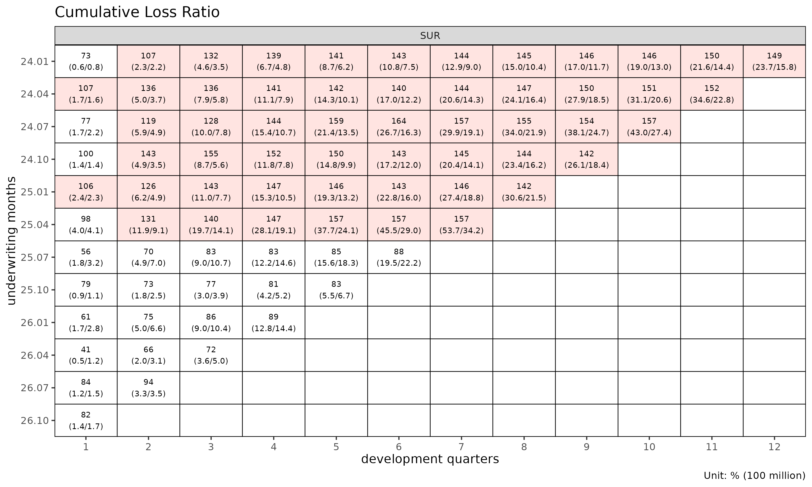
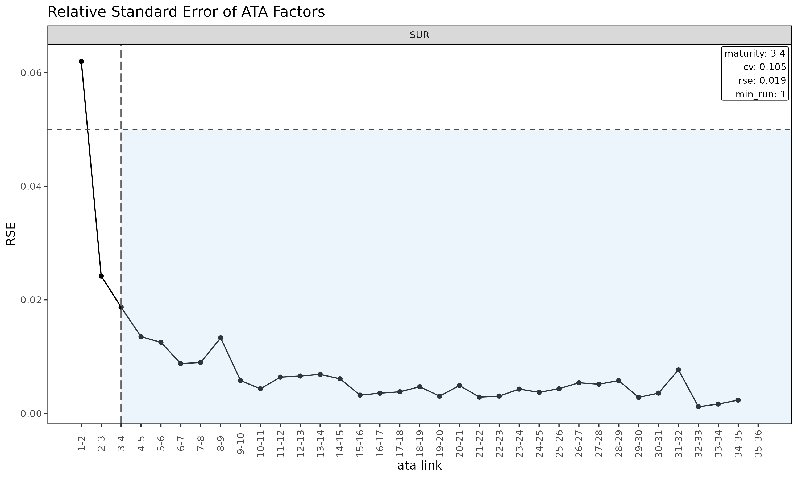
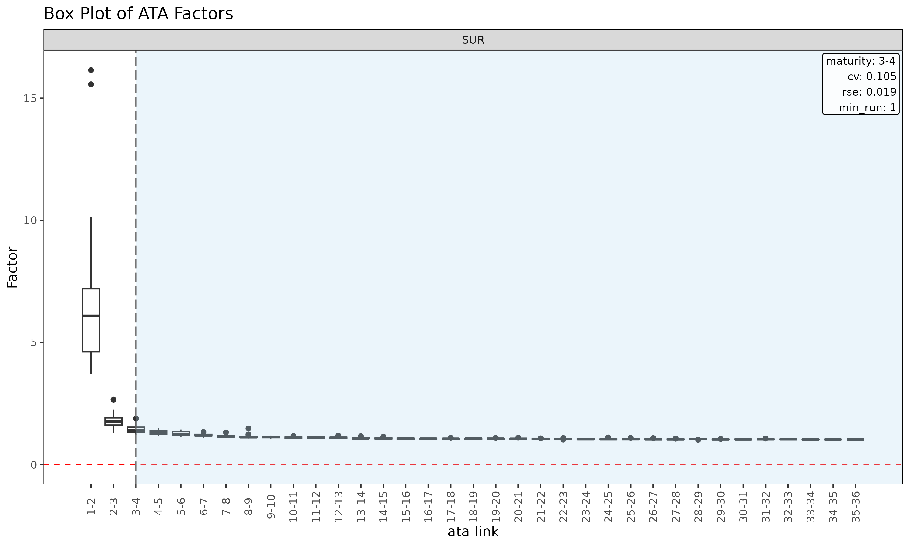
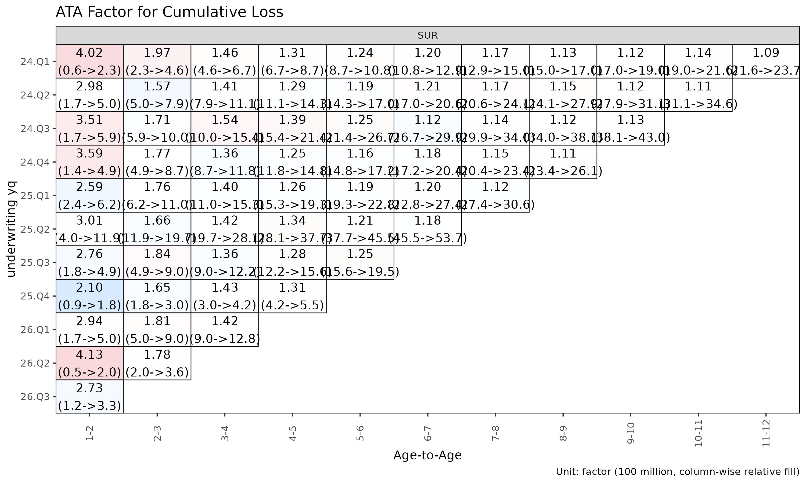
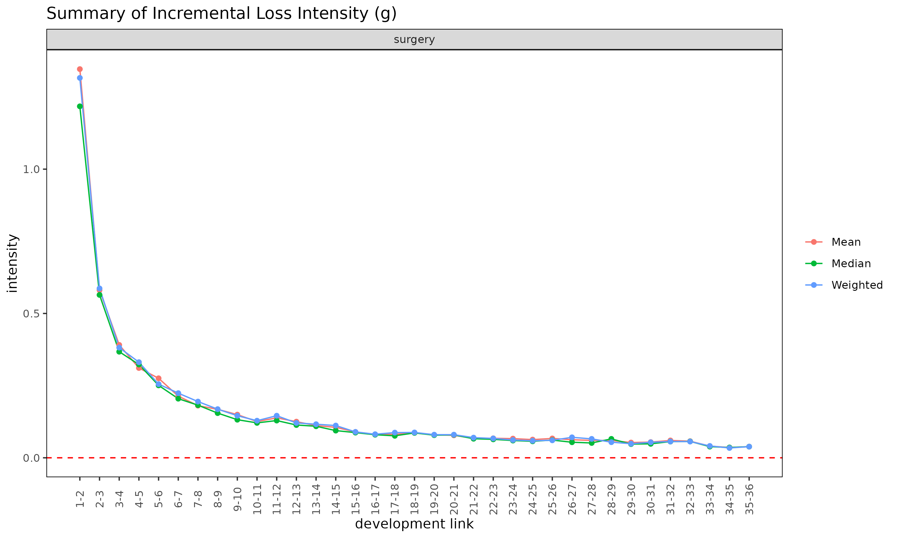

# Triangle, Link and Maturity: data structures and factor diagnostics

Before fitting a chain ladder or loss-ratio model, it pays to inspect
the underlying triangle and the per-link factor table derived from it.
This vignette covers the `Triangle` and `Link` data structures, their
diagnostic plots, and
[`detect_maturity()`](https://seokhoonj.github.io/lossratio/reference/detect_maturity.md)
— the dev-axis test that determines where the link table’s ATA factors
are stable enough to trust for chain-ladder projection.

## Triangle-level diagnostics

For brevity this vignette uses the `surgery` group only — every step
generalises to multi-group input.

``` r

library(lossratio)
data(experience)
exp <- experience[coverage == "surgery"]
tri <- as_triangle(
  exp,
  groups   = "coverage",
  cohort   = "uy_m",
  calendar = "cy_m",
  loss     = "incr_loss",
  prem     = "incr_prem"
)
```

### Cohort trajectories

``` r

plot(tri)                              # cumulative loss-ratio trajectories per cohort
```


``` r

plot(tri, metric = "incr_lr")       # incremental loss ratio instead of cumulative
```


``` r

plot(tri, summary = TRUE)              # raw + overlay (mean / median / weighted)
```


The `summary = TRUE` overlay computes mean, median, and weighted lr at
each dev and overlays them on the cohort lines. Useful for spotting
cohorts that deviate from the central tendency.

### Cell heatmap

``` r

plot_triangle(tri, metric = "lr")          # cumulative lr
```


``` r

plot_triangle(tri, metric = "incr_lr")     # incremental lr
```


``` r


# detail labels (ratio + loss/premium amounts) are 2-line — use quarterly cells
tri_q <- as_triangle(exp, groups = "coverage", cohort = "uy_m", calendar = "cy_m", loss = "incr_loss", prem = "incr_prem", grain = "Q")
plot_triangle(tri_q, label_style = "detail") # ratio + (loss / premium)
```



### Group statistics by dev

``` r

sm <- summary(tri)
head(sm)
#> Key: <coverage, dev>
#>    coverage   dev n_cohorts   lr_mean lr_median     lr_wt incr_lr_mean
#>      <char> <int>     <int>     <num>     <num>     <num>        <num>
#> 1:  surgery     1        36 0.2522898 0.2393582 0.2525932    0.2522898
#> 2:  surgery     2        35 0.8030639 0.7859128 0.7890646    1.3572087
#> 3:  surgery     3        34 0.9258662 0.8997912 0.9204360    1.1519240
#> 4:  surgery     4        33 0.9856772 0.9716558 0.9778502    1.1797269
#> 5:  surgery     5        32 1.0336648 1.0502252 1.0447602    1.2268717
#> 6:  surgery     6        31 1.0945723 1.1832332 1.0892484    1.3676102
#>    incr_lr_median incr_lr_wt
#>             <num>      <num>
#> 1:      0.2393582  0.2525932
#> 2:      1.2618216  1.3280769
#> 3:      1.1517980  1.1728982
#> 4:      1.1167740  1.1742272
#> 5:      1.2663383  1.3110155
#> 6:      1.2676379  1.2752751
```

Returns a `TriangleSummary` object with mean / median / weighted loss
ratios per (group, dev) cell.

## Link / factor diagnostics

The `Link` object is the link table (age-to-age factor table) built from
the triangle. In single-variable mode it carries the observed ATA
factors; with `exposure` it carries the ED-style intensities
$`g_k = \Delta C^L_k / C^P_k`$.

``` r

ata <- as_link(tri, target = "loss")
sm  <- summary(ata, model = "ata", alpha = 1)
head(sm)
#> Key: <coverage>
#>    coverage ata_from ata_to ata_link  mean median    wt    cv     f  f_se   rse
#>      <char>    <num>  <num>   <fctr> <num>  <num> <num> <num> <num> <num> <num>
#> 1:  surgery        1      2      1-2 6.595  6.089 6.163 0.427 6.163 0.382 0.062
#> 2:  surgery        2      3      2-3 1.765  1.768 1.739 0.157 1.739 0.042 0.024
#> 3:  surgery        3      4      3-4 1.435  1.400 1.418 0.105 1.418 0.027 0.019
#> 4:  surgery        4      5      4-5 1.324  1.331 1.339 0.068 1.339 0.018 0.014
#> 5:  surgery        5      6      5-6 1.267  1.246 1.243 0.070 1.243 0.016 0.013
#> 6:  surgery        6      7      6-7 1.204  1.194 1.205 0.048 1.205 0.011 0.009
#>       sigma n_cohorts n_valid n_inf n_nan valid_ratio
#>       <num>     <num>   <num> <num> <num>       <num>
#> 1: 6207.618        35      35     0     0           1
#> 2: 1689.250        34      34     0     0           1
#> 3: 1372.883        33      33     0     0           1
#> 4: 1105.053        32      32     0     0           1
#> 5: 1086.826        31      31     0     0           1
#> 6:  812.770        30      30     0     0           1
```

The [`summary()`](https://rdrr.io/r/base/summary.html) method on a
`Link` object (single-variable mode) computes per-link statistics that
drive maturity detection:

- `mean`, `median`, `wt` — descriptive averages of observed ata factors
  at each link (excluding cohorts where the link is not observed).
- `cv` — coefficient of variation of the observed factors (relative
  spread, alpha-independent).
- `f` — WLS-estimated factor (volume-weighted by `loss_from^alpha`).
- `f_se`, `rse` — WLS standard error and relative standard error.
- `sigma` — Mack residual sigma per link.
- `n_cohorts`, `n_valid`, `n_inf`, `n_nan`, `valid_ratio` — observation
  counts and the share of finite ATA factors per link.

### Diagnostic plots for the link table

``` r

plot(ata, type = "cv")            # CV vs ata link with maturity overlay
```


``` r

plot(ata, type = "rse")           # RSE vs ata link
```



``` r

plot(ata, type = "summary")       # mean / median / wt overlay per link
```


``` r

plot(ata, type = "box")           # boxplot of observed ata per link
```



``` r

plot(ata, type = "point")         # scatter of observed ata per link
```


### Triangle of ATA factors

``` r

plot_triangle(ata, label_size = 2.5)              # heatmap of observed factors
```


``` r

plot_triangle(ata, label_size = 2.5, show_maturity = TRUE)   # overlay maturity line
```


``` r


# detail labels are two lines and overlap on monthly cells — rebuild on
# the quarterly triangle so the two-line "factor (loss / premium)" text
# has room (label_size auto-shrinks to 2.2 in detail mode).
ata_q <- as_link(tri_q, target = "loss")
plot_triangle(ata_q, label_style = "detail")      # factor + (loss / premium)
```



The heatmap colours each cell by `log(ata / median(ata))` within its
link, so column-wise colour distinguishes cohorts that deviate from the
link’s median.

### ED diagnostics

``` r

ed <- as_link(tri, target = "loss", exposure = "prem")
sm <- summary(ed, model = "ed", alpha = 1)
head(sm)
#> Key: <coverage>
#>    coverage ata_from ata_to ata_link    mean  median      wt      cv       g
#>      <char>    <num>  <num>   <fctr>   <num>   <num>   <num>   <num>   <num>
#> 1:  surgery        1      2      1-2 1.34661 1.21766 1.31614 0.47327 1.31614
#> 2:  surgery        2      3      2-3 0.58109 0.56432 0.58674 0.37381 0.58674
#> 3:  surgery        3      4      3-4 0.39105 0.36751 0.38178 0.43535 0.38178
#> 4:  surgery        4      5      4-5 0.31110 0.32321 0.33127 0.35969 0.33127
#> 5:  surgery        5      6      5-6 0.27543 0.25088 0.25518 0.43531 0.25518
#> 6:  surgery        6      7      6-7 0.21364 0.20479 0.22393 0.31371 0.22393
#>       g_se     rse     sigma n_cohorts n_valid n_inf n_nan valid_ratio
#>      <num>   <num>     <num>     <num>   <num> <num> <num>       <num>
#> 1: 0.09107 0.06919 2930.7438        35      35     0     0           1
#> 2: 0.03508 0.05979 1580.2621        34      34     0     0           1
#> 3: 0.02931 0.07677 1587.1869        33      33     0     0           1
#> 4: 0.02135 0.06444 1319.1106        32      32     0     0           1
#> 5: 0.02087 0.08178 1421.4780        31      31     0     0           1
#> 6: 0.01273 0.05686  937.7864        30      30     0     0           1

plot(ed, type = "summary")
```



``` r

plot(ed, type = "box")
```


``` r

plot_triangle(ed)                                  # ED triangle (default size)
```


`summary(link, model = "ed")` is the ED-side analogue of the
single-variable [`summary()`](https://rdrr.io/r/base/summary.html),
computing per-link statistics for the intensity
$`g_k = \Delta C^L_k / C^P_k`$.

## Maturity detection

The maturity point is the development link beyond which age-to-age
factors are stable enough to trust for chain-ladder projection. Used
internally by `fit_lr(method = "sa")` to switch from ED to CL.

### Detecting maturity

[`detect_maturity()`](https://seokhoonj.github.io/lossratio/reference/detect_maturity.md)
takes a `Triangle` directly — the underlying single-variable `Link` and
its WLS summary are built internally:

``` r

mat <- detect_maturity(
  tri,
  target          = "loss",
  max_cv          = 0.15,    # CV must be below this
  max_rse         = 0.05,    # RSE must be below this
  min_valid_ratio = 0.5,     # at least 50% finite cohorts at the link
  min_n_valid     = 3L,      # at least 3 finite cohorts
  min_run         = 1L       # at least 1 consecutive mature link
)

print(mat)
#> Key: <coverage>
#>    coverage ata_from change ata_link     mean   median       wt        cv
#>      <char>    <num>  <num>   <char>    <num>    <num>    <num>     <num>
#> 1:  surgery        3      4      3-4 1.434507 1.400098 1.417706 0.1053282
#>           f       f_se        rse    sigma n_cohorts n_valid n_inf n_nan
#>       <num>      <num>      <num>    <num>     <num>   <num> <num> <num>
#> 1: 1.417706 0.02651852 0.01870522 1372.883        33      33     0     0
#>    valid_ratio
#>          <num>
#> 1:           1
```

A row per group with the first development link satisfying all
thresholds, carrying the link’s full statistics. The threshold arguments
are also stored as attributes on the returned `Maturity` object.

### Threshold semantics

- `max_cv` — coefficient of variation of the observed ATA factors at the
  link. Caps relative spread regardless of `alpha`.
- `max_rse` — relative standard error of the WLS-estimated factor `f`.
  Captures parameter uncertainty rather than residual spread.
- `min_valid_ratio` — minimum share of cohorts with a finite ATA at the
  link. Guards against links where most observations are zero / NA /
  Inf.
- `min_n_valid` — minimum count of finite cohorts at the link. Absolute
  floor for thin-data tails.
- `min_run` — minimum number of *consecutive* mature links. With
  `min_run = 1L` (default) the first qualifying link wins; setting it to
  `2L` or higher requires sustained stability.

Tune these to your portfolio’s volatility profile. Tight thresholds
(e.g. `max_cv = 0.05`) push maturity later; loose thresholds push it
earlier.

### Use in fitting

[`detect_maturity()`](https://seokhoonj.github.io/lossratio/reference/detect_maturity.md)
is also called internally by
[`fit_ata()`](https://seokhoonj.github.io/lossratio/reference/fit_ata.md)
and
[`fit_cl()`](https://seokhoonj.github.io/lossratio/reference/fit_cl.md)
via the `maturity` argument. Pass
[`maturity_spec()`](https://seokhoonj.github.io/lossratio/reference/maturity_spec.md)
to forward custom detection thresholds, or `"auto"` for defaults
(`fit_lr(method = "sa")` and
[`fit_loss()`](https://seokhoonj.github.io/lossratio/reference/fit_loss.md)
use `"auto"` by default):

``` r

fit_ata(tri, target = "loss",
        maturity = maturity_spec(max_cv = 0.08, min_run = 2L))

fit_cl(tri, target = "loss",
       maturity = maturity_spec(max_cv = 0.08))

fit_lr(tri, method = "sa",
       maturity = maturity_spec(max_cv = 0.08))
```

The `maturity` argument accepts four forms: `NULL` (no detection), a
pre-built `Maturity` object (e.g. from
[`detect_maturity()`](https://seokhoonj.github.io/lossratio/reference/detect_maturity.md)
or
[`maturity_at()`](https://seokhoonj.github.io/lossratio/reference/maturity_at.md)
for manual override), the string `"auto"` (internal
[`detect_maturity()`](https://seokhoonj.github.io/lossratio/reference/detect_maturity.md)
with defaults), or a function of one triangle argument returning a
`Maturity` (typically built with
[`maturity_spec()`](https://seokhoonj.github.io/lossratio/reference/maturity_spec.md)).

For `fit_lr(method = "sa")` the detected maturity point determines the
dev at which the projection switches from ED (early dev) to CL (later
dev).

### Group-wise output

For multi-group triangles
[`detect_maturity()`](https://seokhoonj.github.io/lossratio/reference/detect_maturity.md)
returns one row per group, each detected independently with the same
thresholds:

``` r

tri_all <- as_triangle(
  experience,
  groups   = "coverage",
  cohort   = "uy_m",
  calendar = "cy_m",
  loss     = "incr_loss",
  prem     = "incr_prem"
)
detect_maturity(tri_all, target = "loss")
#> Key: <coverage>
#>     coverage ata_from change ata_link     mean   median       wt         cv
#>       <char>    <num>  <num>   <char>    <num>    <num>    <num>      <num>
#> 1:    cancer        8      9      8-9 1.079323 1.060341 1.065354 0.07131509
#> 2:        ci       11     12    11-12 1.094403 1.070561 1.114066 0.07563394
#> 3: inpatient        6      7      6-7 1.244842 1.184287 1.205542 0.13563431
#> 4:   surgery        3      4      3-4 1.434507 1.400098 1.417706 0.10532824
#>           f       f_se        rse     sigma n_cohorts n_valid n_inf n_nan
#>       <num>      <num>      <num>     <num>     <num>   <num> <num> <num>
#> 1: 1.065354 0.01384183 0.01299271  637.2413        28      28     0     0
#> 2: 1.114066 0.01954799 0.01754653 1459.6221        25      25     0     0
#> 3: 1.205542 0.02746026 0.02277835  220.8771        30      30     0     0
#> 4: 1.417706 0.02651852 0.01870522 1372.8834        33      33     0     0
#>    valid_ratio
#>          <num>
#> 1:           1
#> 2:           1
#> 3:           1
#> 4:           1
```

The link diagnostic plot makes the result easier to read — each cv gets
its own panel and the vertical line marks the maturity point where CV
first drops below `max_cv`:

``` r

plot(as_link(tri_all, target = "loss"), type = "cv")
```


## Validation before building

If gaps in the development sequence are suspected, inspect them before
[`as_triangle()`](https://seokhoonj.github.io/lossratio/reference/as_triangle.md):

``` r

gaps <- validate_triangle(exp, groups = "coverage", cohort = "uy_m", dev = "dev_m")
head(gaps)
#> <TriangleValidation>
#> Cohort dev-sequence gaps : none
```

Returns a `TriangleValidation` object with one row per cohort that has
non-consecutive development periods. An empty result means the triangle
is clean.

If gaps exist, options:

- Fix the data source (preferred).
- Drop offending cohorts.
- Pass `fill_gaps = TRUE` to
  [`as_triangle()`](https://seokhoonj.github.io/lossratio/reference/as_triangle.md)
  to zero-fill missing cells (use with care — inflates `n_cohorts`).

## Recent-diagonal subset

When older cohorts are no longer representative (rate change, reserving
regime shift), restrict estimation to the recent calendar diagonals:

``` r

fit_ata(tri, target = "loss", alpha = 1, recent = 12)  # last 12 calendar diagonals
#> <ATAFit>
#> alpha       : 1 
#> sigma_method: locf 
#> recent      : 12 
#> regime      : none
#> use_maturity: FALSE 
#> groups      : coverage 
#> n_groups    : 1 
#> ata links   : 35
fit_cl(tri, target = "loss", recent = 12)
#> <CLFit>
#> method      : mack 
#> target      : loss 
#> weight      : none 
#> alpha       : 1 
#> sigma_method: locf 
#> recent      : 12 
#> regime      : none
#> use_maturity: FALSE 
#> tail_factor : 1 
#> groups      : coverage 
#> periods     : 36
fit_lr(tri, recent = 12)
#> <LRFit>
#> method            : sa 
#> loss_alpha        : 1 
#> prem_alpha        : 1 
#> se_method         : fixed 
#> conf_level        : 0.95 
#> ci_type           : bootstrap  (B = 999, seed = NULL) 
#> sigma_method      : locf 
#> recent            : 12 
#> loss_regime       : none
#> prem_regime       : none
#> maturity[surgery] : 4 
#> groups            : coverage 
#> periods           : 36
```

`recent = K` keeps only rows whose calendar position
(`rank(cohort) + dev - 1`) is among the latest `K` per group.

## Workflow checklist

Before fitting:

1.  [`validate_triangle()`](https://seokhoonj.github.io/lossratio/reference/validate_triangle.md)
    — schema and gap check.
2.  [`as_triangle()`](https://seokhoonj.github.io/lossratio/reference/as_triangle.md)
    — canonical shape with derived columns.
3.  `plot(tri)` / `plot_triangle(tri)` — visual inspection.
4.  `summary(tri)` — group-level central tendency.
5.  [`as_link()`](https://seokhoonj.github.io/lossratio/reference/as_link.md) +
    `plot(link, type = "cv")` — link stability.
6.  [`detect_maturity()`](https://seokhoonj.github.io/lossratio/reference/detect_maturity.md)
    — verify maturity detection produces a sensible point per group.
7.  [`detect_regime()`](https://seokhoonj.github.io/lossratio/reference/detect_regime.md)
    (optional) — structural change diagnosis.

Then fit
[`fit_lr()`](https://seokhoonj.github.io/lossratio/reference/fit_lr.md)
/
[`fit_cl()`](https://seokhoonj.github.io/lossratio/reference/fit_cl.md)
with confidence in the input data.

## See also

- [`vignette("getting-started")`](https://seokhoonj.github.io/lossratio/articles/getting-started.md)
  — full pipeline overview.
- [`vignette("regime")`](https://seokhoonj.github.io/lossratio/articles/regime.md)
  —
  [`detect_regime()`](https://seokhoonj.github.io/lossratio/reference/detect_regime.md)
  deep dive.
- [`vignette("projection")`](https://seokhoonj.github.io/lossratio/articles/projection.md)
  — projection method choice.
