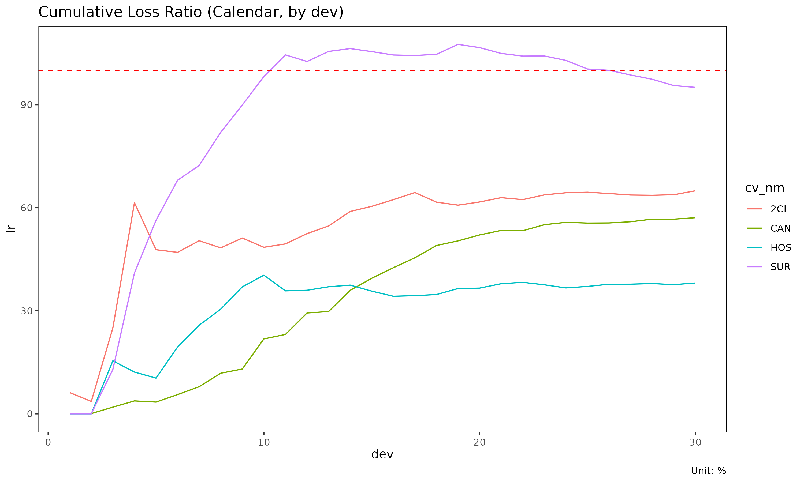

# Aggregation frameworks: Triangle, Calendar, Total

The same long-format experience data can be aggregated three ways
depending on the question being asked. `lossratio` exposes one builder
per framework. This vignette compares them.

## At a glance

| Builder | Output object | Dimension | When to use |
|----|----|----|----|
| [`build_triangle()`](https://seokhoonj.github.io/lossratio/ko/reference/build_triangle.md) | `Triangle` | cohort × dev (2D) | SA, ED, CL projection |
| [`build_calendar()`](https://seokhoonj.github.io/lossratio/ko/reference/build_calendar.md) | `Calendar` | calendar period (1D) | Calendar-year trend, diagonal effect |
| [`build_total()`](https://seokhoonj.github.io/lossratio/ko/reference/build_total.md) | `Total` | portfolio total (per group) | High-level loss-ratio comparison |

Conceptually:

- `Triangle` preserves both the cohort axis (when policies were
  underwritten) and the development axis (how loss accrues over
  development time). This is the canonical chain-ladder data structure.
- `Calendar` collapses cohorts onto the diagonal — each row is one
  calendar period across all underwriting cohorts. Equivalent to the
  diagonal sum of the triangle.
- `Total` collapses both dimensions to one value per group. Useful for
  portfolio-level comparison (which product had the worst loss ratio
  over the window?).

## Triangle (cohort × dev)

``` r

library(lossratio)
data(experience)
exp <- as_experience(experience)

tri <- build_triangle(exp, group_var = cv_nm)
head(tri)
#>     cv_nm n_obs     cohort   dev   loss loss_incr  premium premium_incr
#>    <char> <int>     <Date> <int>  <num>     <num>    <num>        <num>
#> 1:    SUR    30 2023-04-01     1      0         0 11191622     11191622
#> 2:    CAN    30 2023-04-01     1   6445      6445 12879191     12879191
#> 3:    2CI    30 2023-04-01     1 468845    468845  7567723      7567723
#> 4:    HOS    30 2023-04-01     1      0         0 15273272     15273272
#> 5:    SUR    29 2023-04-01     2      0         0 25217507     14025885
#> 6:    CAN    29 2023-04-01     2   6445         0 43700535     30821344
#>              lr      lr_incr   margin margin_incr profit profit_incr
#>           <num>        <num>    <num>       <num> <fctr>      <fctr>
#> 1: 0.0000000000 0.0000000000 11191622    11191622    pos         pos
#> 2: 0.0005004196 0.0005004196 12872746    12872746    pos         pos
#> 3: 0.0619532454 0.0619532454  7098878     7098878    pos         pos
#> 4: 0.0000000000 0.0000000000 15273272    15273272    pos         pos
#> 5: 0.0000000000 0.0000000000 25217507    14025885    pos         pos
#> 6: 0.0001474810 0.0000000000 43694090    30821344    pos         pos
#>      loss_prop loss_incr_prop premium_prop premium_incr_prop
#>          <num>          <num>        <num>             <num>
#> 1: 0.000000000     0.00000000    0.2385673         0.2385673
#> 2: 0.013560142     0.01356014    0.2745405         0.2745405
#> 3: 0.986439858     0.98643986    0.1613181         0.1613181
#> 4: 0.000000000     0.00000000    0.3255741         0.3255741
#> 5: 0.000000000     0.00000000    0.2082178         0.1890296
#> 6: 0.008953204     0.00000000    0.3608298         0.4153853
```

Each row is one (cohort, dev) cell with cumulative loss / risk premium.
Visualise as line plot or heatmap:

``` r

plot(tri)              # one trajectory per cohort, faceted by group
```


``` r


# With multiple group panels each panel's cells get too narrow to read,
# so use quarterly cohort and dev to bring each panel down to ~10 x 10
# cells. This fits the documentation's display size; in practice you
# can keep monthly resolution by enlarging the plot.
tri_q <- build_triangle(exp, group_var = cv_nm,
                        cohort_var = "uyq", dev_var = "elap_q")
plot_triangle(tri_q)   # cohort × dev heatmap of lr
```


Use `Triangle` as input to: -
[`build_link()`](https://seokhoonj.github.io/lossratio/ko/reference/build_link.md)
— development factors (ATA / ED via `loss_var` + optional
`premium_var`) -
[`fit_cl()`](https://seokhoonj.github.io/lossratio/ko/reference/fit_cl.md),
[`fit_lr()`](https://seokhoonj.github.io/lossratio/ko/reference/fit_lr.md)
— projection -
[`detect_regime()`](https://seokhoonj.github.io/lossratio/ko/reference/detect_regime.md)
— structural change detection

## Calendar (calendar period only)

``` r

cal <- build_calendar(exp, group_var = cv_nm, calendar_var = "cym")
head(cal)
#>     cv_nm   calendar   dev      loss loss_incr   premium premium_incr
#>    <char>     <Date> <int>     <num>     <num>     <num>        <num>
#> 1:    2CI 2023-04-01     1    468845    468845   7567723      7567723
#> 2:    2CI 2023-05-01     2   1256927    788082  34854411     27286688
#> 3:    2CI 2023-06-01     3  19379377  18122450  77519944     42665533
#> 4:    2CI 2023-07-01     4  89638610  70259233 145785581     68265637
#> 5:    2CI 2023-08-01     5 122378559  32739949 256136653    110351072
#> 6:    2CI 2023-09-01     6 183965719  61587160 391291388    135154735
#>            lr    lr_incr    margin margin_incr profit profit_incr loss_prop
#>         <num>      <num>     <num>       <num> <fctr>      <fctr>     <num>
#> 1: 0.06195325 0.06195325   7098878     7098878    pos         pos 0.9864399
#> 2: 0.03606221 0.02888156  33597484    26498606    pos         pos 0.9713591
#> 3: 0.24999214 0.42475621  58140567    24543083    pos         pos 0.3631717
#> 4: 0.61486609 1.02920351  56146971    -1993596    pos         neg 0.4224394
#> 5: 0.47778620 0.29668900 133758094    77611123    pos         pos 0.3373051
#> 6: 0.47015019 0.45567889 207325669    73567575    pos         pos 0.2781021
#>    loss_incr_prop premium_prop premium_incr_prop
#>             <num>        <num>             <num>
#> 1:      0.9864399    0.1613181         0.1613181
#> 2:      0.9626040    0.2071298         0.2248381
#> 3:      0.3480569    0.1841805         0.1688936
#> 4:      0.4423512    0.1938191         0.2060648
#> 5:      0.2173682    0.2050163         0.2219566
#> 6:      0.2061898    0.2071482         0.2113124
```

Each row is one calendar period (per group). The `dev` column here is a
sequential index (1, 2, 3, …) within group, not “development period
since cohort start”.

Calendar aggregation is mathematically the **diagonal sum** of the
triangle: cells with the same `cym` (regardless of `uym`/`elap_m`) are
combined.

Use cases: - Trend analysis (“loss ratio is rising over calendar
time”) - Calendar-year effect detection (e.g., regulatory shock, premium
on-leveling event) - Portfolio monitoring dashboards

``` r

plot(cal)                       # x axis: calendar
```


``` r

plot(cal, x_by = "dev")         # x axis: sequential index
```



## Total (portfolio summary)

``` r

tot <- build_total(
  exp,
  group_var = cv_nm,
  cohort_var = "uym",
  period_from = "2023-04-01",
  period_to   = "2024-03-01"
)
head(tot)
#>     cv_nm n_obs sales_start  sales_end        loss     premium        lr
#>    <char> <int>      <Date>     <Date>       <num>       <num>     <num>
#> 1:    SUR    30  2023-04-01 2024-03-01 26195800145 23817090339 1.0998741
#> 2:    CAN    30  2023-04-01 2024-03-01 15036650678 24008537158 0.6263043
#> 3:    2CI    30  2023-04-01 2024-03-01 12482828960 18720199627 0.6668107
#> 4:    HOS    30  2023-04-01 2024-03-01  9737095690 25111393787 0.3877561
#>    loss_prop premium_prop
#>        <num>        <num>
#> 1: 0.4128419    0.2598496
#> 2: 0.2369754    0.2619383
#> 3: 0.1967275    0.2042414
#> 4: 0.1534552    0.2739707
```

One row per group, summarising loss / risk premium / loss ratio over the
window. The `period_from` / `period_to` arguments restrict to a fixed
window so groups are comparable.

Use cases: - Compare overall loss ratio across coverages - Rank groups
by reserve / share of portfolio - Build executive summary tables

## Aggregation as data flow

                         experience (long, with demographics)
                                  │
             ┌────────────────────┼─────────────────────┐
             │                    │                     │
       build_triangle      build_calendar         build_total
       (cohort × dev)      (calendar series)     (portfolio total)
             │                    │                     │
             ▼                    ▼                     ▼
         Triangle             Calendar               Total
       (2D, projection)     (1D, trend)         (0D, comparison)

All three start from the same `experience` and aggregate demographic
dimensions away. Choose the framework based on the analytical question.

## Attribute schema

After aggregation, each object stores its source-column metadata as
attributes (used for plot labels and granularity-aware date formatting):

``` r

attr(tri, "cohort_var")     # "uym"
#> [1] "uym"
attr(tri, "cohort_type")    # "month"
#> [1] "month"
attr(tri, "dev_var")        # "elap_m"
#> [1] "elap_m"
attr(tri, "dev_type")       # "month"
#> [1] NA

attr(cal, "calendar_var")   # "cym"
#> [1] "cym"
attr(cal, "calendar_type")  # "month"
#> [1] "month"
```

The data columns themselves are standardised to `cohort` / `dev` /
`calendar`, so downstream code is granularity-agnostic.
