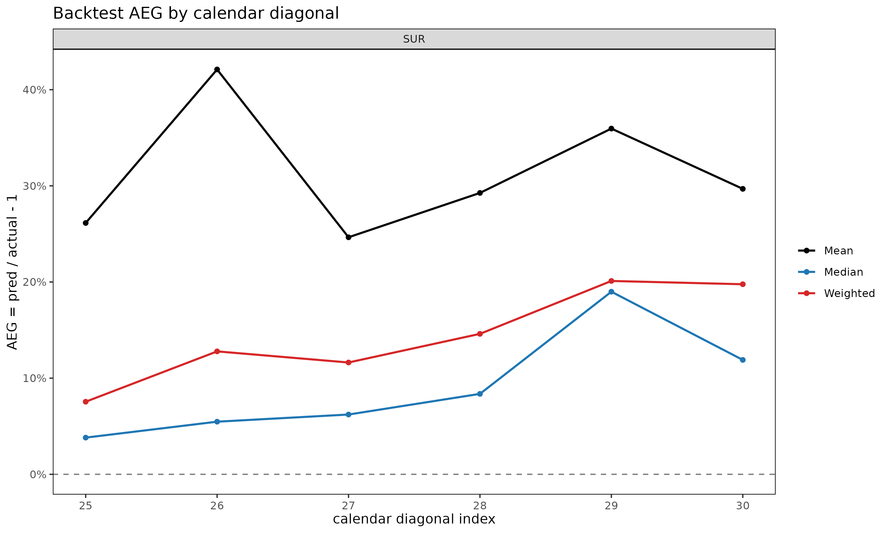

# Backtest: hold-out 대각선을 이용한 추정 검증

> 영어 원본 보기: [Backtesting projections against held-out
> diagonals](https://seokhoonj.github.io/lossratio/ko/backtest.md)

## 1. 동기

준비금 산출과 추정(projection) 방법은 관측된 자료에 적합되지만, 실무적
가치는 과거 valuation 시점(평가 시점)에서 그 방법이 어떻게 작동했을지에
달려 있다.
[`backtest()`](https://seokhoonj.github.io/lossratio/ko/reference/backtest.md)
는 triangle 에서 `holdout` 으로 지정한 만큼의 최근 대각선 (calendar
diagonal)을 마스킹한 뒤, 이전 부분에 모형을 재적합하고, 그 추정값을
마스킹된 셀의 실제값과 비교함으로써 이 질문에 답한다. 이는 경과 기간
단위 hold-out이 아니라 대각선 단위 hold-out인데, “*K* 개월 전 valuation
시점에서 모형은 무엇이라 말했을까?” 를 모사하기 때문이다. 셀 단위 지표는
A/E Error (`ae_err`) 이며, 표준 actuarial A/E 관용에 맞춰
$`\mathrm{ae\_err} = v_{\mathrm{actual}} / v_{\mathrm{pred}} - 1`$ 로
정의한다. 양수는 과소 추정 (실제가 기대보다 큼), 음수는 과대 추정을
의미한다.

## 2. 기본 사용법

``` r

library(lossratio)
data(experience)
tri_sur <- as_triangle(
  experience[coverage == "surgery"],
  groups   = "coverage",
  cohort   = "uy_m",
  calendar = "cy_m",
  loss     = "incr_loss",
  premium = "incr_premium"
)

bt <- backtest(tri_sur, holdout = 6L)
print(bt)
#> <Backtest>
#>   dispatcher: fit_ratio
#>   target    : ratio
#>   holdout   : 6 diagonals (159 cells)
#>   A/E Error : mean -9.38% / median -4.39%
```

기본 추정 대상은 누적 손해율 (`target = "ratio"`) 이며, 손해 측 method
는 단계 적응형(stage-adaptive, SA, `loss_method = "sa"`) 이다. 반환되는
객체는 `"Backtest"` 리스트이며, 주요 슬롯은 다음과 같다.

- `ae_err` — 셀 단위 `data.table` (cohort, dev, actual, pred, ae_err,
  cal_idx).
- `col_summary` — `dev` 별로 집계된 A/E Error.
- `diag_summary` — 대각선별로 집계된 A/E Error.
- `masked` — 적합에 사용된 triangle (최근 대각선이 제거됨).
- `fit` — 내부 적합 객체 (`RatioFit`, `LossFit`, 또는 `PremiumFit`,
  `target` 에 따라 결정).

`summary(bt)` 는 호출 메타데이터와 함께 두 요약 표를 출력한다.

## 3. 마스킹 후 검증 범위

`holdout` 만큼의 최근 대각선을 마스킹하면 Triangle 의 우하단이 짧아진다.
chain ladder 는 마스킹된 데이터에 남아 있는 가장 큰 dev 까지만 추정값을
만들 수 있으므로, 그 범위를 넘어가는 셀 — 가장 오래된 코호트의 후기 dev
셀들 — 은 비교할 추정값이 아예 생성되지 않는다. 이런 셀은 자동으로
제외되어, `bt$ae_err` 에는 실제값과 추정값이 모두 존재하는 셀만 남는다.

실무적 함의: `holdout` 이 커질수록 가장 오래된 코호트의 후기 dev 영역이
가장 먼저 검증에서 빠진다. 이 영역은 chain ladder 가 외삽 (관측 범위
너머로의 추정) 에 의존하는 부분으로, 본래 검증이 가장 필요한 곳인데
오히려 가장 빨리 사라진다.

## 4. 출력 해석

**`col_summary` — 경과 기간별 체계적 편향.** 특정 dev 에서 A/E Error 의
부호가 일관되게 나타나면, 그 성숙도에서 모형과 자료 사이에 구조적
불일치가 있음을 시사한다. 초기 dev 의 양의 값은 보통 부풀려진 link
factor 를 반영하고, 후기 dev 의 값은 꼬리 미보정(miscalibration) 을
시사한다.

``` r

head(bt$col_summary, 8)
#>    coverage   dev     n   aeg_mean    aeg_med ae_err_mean ae_err_med  ae_err_wt
#>      <char> <int> <int>      <num>      <num>       <num>      <num>      <num>
#> 1:  surgery     2     1 -0.2879721 -0.2879721  -0.3667493 -0.3667493 -0.3667493
#> 2:  surgery     3     2 -0.2108693 -0.2108693  -0.2609106 -0.2609106 -0.2668725
#> 3:  surgery     4     3 -0.1980716 -0.2262460  -0.2360836 -0.2278978 -0.2407573
#> 4:  surgery     5     4 -0.2070832 -0.1696142  -0.2373172 -0.2037644 -0.2364591
#> 5:  surgery     6     5 -0.2350791 -0.2220419  -0.2444979 -0.2435615 -0.2485779
#> 6:  surgery     7     6 -0.2261834 -0.2456246  -0.2251483 -0.2400164 -0.2303588
#> 7:  surgery     8     6 -0.2375787 -0.2195124  -0.2337115 -0.2298462 -0.2424551
#> 8:  surgery     9     6 -0.2210369 -0.1791352  -0.2188077 -0.1763073 -0.2257798
#>    incr_aeg_mean incr_aeg_med incr_ae_err_mean incr_ae_err_med incr_ae_err_wt
#>            <num>        <num>            <num>           <num>          <num>
#> 1:    -0.5749542   -0.5749542       -0.4291122      -0.4291122     -0.4291122
#> 2:    -0.3489404   -0.3489404       -0.2942675      -0.2942675     -0.2942675
#> 3:    -0.3738322   -0.3334336       -0.3060770      -0.2730004     -0.3060770
#> 4:    -0.4433586   -0.4866788       -0.3243281      -0.3560179     -0.3243281
#> 5:    -0.5667766   -0.5767098       -0.4089965      -0.4161644     -0.4089965
#> 6:    -0.4048255   -0.5050649       -0.2913899      -0.3635413     -0.2913899
#> 7:    -0.6238985   -0.6021573       -0.4242259      -0.4094427     -0.4242259
#> 8:    -0.7336689   -0.7388122       -0.4942706      -0.4977357     -0.4942706
```

`ae_err_mean` 은 셀 단위 A/E Error 의 평균, `ae_err_med` 는 중앙값,
`ae_err_wt = sum(actual - proj) / sum(proj)` 는 보험료 가중 pooled A/E
ratio 에서 1 을 뺀 값이다. 세 컬럼을 비교하면 소수의 큰 셀이 결과를
지배하는지 (`ae_err_wt` 가 `ae_err_med` 와 크게 다른 경우) 또는 편향이
균일한지 식별할 수 있다.

**`diag_summary` — 대각선 효과(calendar-year effect).** 그 외에는 편향이
없는 출력에서 단 하나의 대각선만 나쁘게 나타난다면, 정적 chain ladder 가
구조상 볼 수 없는 calendar 사건 (요율 변경, 보험금 처리 방식의 변화,
일회성 충격) 을 가리킨다.

``` r

bt$diag_summary
#>    coverage cal_idx     n    aeg_mean     aeg_med ae_err_mean  ae_err_med
#>      <char>   <int> <int>       <num>       <num>       <num>       <num>
#> 1:  surgery      31    29 -0.04575359 -0.03198719 -0.05658328 -0.02153108
#> 2:  surgery      32    28 -0.07040314 -0.05170431 -0.07561194 -0.03549370
#> 3:  surgery      33    27 -0.08297822 -0.05675816 -0.08611363 -0.03865162
#> 4:  surgery      34    26 -0.10380725 -0.06595414 -0.10216462 -0.04456169
#> 5:  surgery      35    25 -0.12608316 -0.08752566 -0.11863390 -0.05863248
#> 6:  surgery      36    24 -0.14828046 -0.14817761 -0.13376449 -0.12050537
#>      ae_err_wt incr_aeg_mean incr_aeg_med incr_ae_err_mean incr_ae_err_med
#>          <num>         <num>        <num>            <num>           <num>
#> 1: -0.03788261   -0.30136185   -0.4459253      -0.19728502      -0.3160730
#> 2: -0.05696273   -0.31278712   -0.3376753      -0.20366014      -0.2455593
#> 3: -0.06588038   -0.07618026   -0.2335583      -0.04127158      -0.1580403
#> 4: -0.08133780   -0.26063771   -0.4114195      -0.16056535      -0.2755793
#> 5: -0.09770892   -0.31819948   -0.3999726      -0.21990402      -0.2615089
#> 6: -0.11404379   -0.36981575   -0.3068424      -0.23186701      -0.1978691
#>    incr_ae_err_wt
#>             <num>
#> 1:     -0.2021198
#> 2:     -0.2090259
#> 3:     -0.0505205
#> 4:     -0.1715931
#> 5:     -0.2086546
#> 6:     -0.2415822
```

대각선을 가로지르는 단조로운 표류 (위 surgery 예시처럼 `25, ..., 30`
으로 가면서 A/E Error 가 점점 더 양수가 되는 패턴) 는 보통 가장 최근
대각선의 실적이 이전 코호트의 link factor 가 함의하는 수준보다 더 높게
진행되고 있음 — 즉 정적 모형이 흡수하지 못한 regime shift 가 발생했음을
시사한다.

**`ae_err` — 셀 단위 이상치.** 특정 cohort × dev 셀을 진단하려면
`bt$ae_err` 를 직접 살펴본다.

``` r

head(bt$ae_err, 5)
#>    coverage     cohort   dev   actual expected         aeg       ae_err
#>      <char>     <Date> <int>    <num>    <num>       <num>        <num>
#> 1:  surgery 2023-02-01    30 1.474656 1.485769 -0.01111280 -0.007479494
#> 2:  surgery 2023-03-01    29 1.441826 1.416462  0.02536395  0.017906553
#> 3:  surgery 2023-03-01    30 1.441234 1.424023  0.01721096  0.012086155
#> 4:  surgery 2023-04-01    28 1.513021 1.508373  0.00464845  0.003081765
#> 5:  surgery 2023-04-01    29 1.531922 1.502555  0.02936662  0.019544454
#>    incr_actual incr_expected   incr_aeg incr_ae_err cal_idx
#>          <num>         <num>      <num>       <num>   <int>
#> 1:    1.311699      1.635607 -0.3239081 -0.19803535      31
#> 2:    2.057141      1.335414  0.7217266  0.54045140      31
#> 3:    1.425549      1.635607 -0.2100580 -0.12842811      32
#> 4:    1.573801      1.449050  0.1247511  0.08609165      31
#> 5:    2.055572      1.335414  0.7201577  0.53927654      32
```

## 5. 플롯 데모

`"Backtest"` 에는 네 가지 플롯 뷰가 등록되어 있다.

``` r

plot(bt, type = "col")    # dev 별 A/E Error (점 + 0 기준 점선)
```


``` r

plot(bt, type = "diag")   # 대각선별 A/E Error
```



``` r

plot(bt, type = "cell")   # dev 위에 그려진 코호트별 A/E Error 궤적
```


``` r

plot_triangle(bt)         # hold-out 영역에 대한 발산형 팔레트 히트맵
```


`type = "col"` 은 경과 기간별 체계적 편향을 살피기에 적합하다.
`type = "diag"` 는 대각선 효과(calendar-year drift) 를 드러낸다.
`type = "cell"` 은 어느 코호트가 편향에 기여하는지를 노출한다.
[`plot_triangle()`](https://seokhoonj.github.io/lossratio/ko/reference/plot_triangle.md)
은 셀 단위 A/E Error 값을 기저 적합의
[`plot_triangle()`](https://seokhoonj.github.io/lossratio/ko/reference/plot_triangle.md)
과 동일한 삼각 배치 위에 올려놓으며, 빨간색이 과소 추정 (actual \> pred)
을 표시하는 빨강/파랑 발산형 팔레트를 사용한다.

## 6. hold-out 선택

`holdout` 은 다음 두 가지 상충 효과의 균형을 잡도록 선택한다.

- 너무 큰 경우: 마스킹된 triangle 이 가장 최근 경험을 잃게 되어, 가장
  오래된 코호트들은 후기 경과 기간에서 도달 가능 셀이 거의 또는 전혀
  없게 된다. 검증 집합이 불균등하게 줄어들며 초기 dev 쪽으로 편향된다.
- 너무 작은 경우: hold-out 영역이 얇은 평행사변형 밴드에 불과해, 체계적
  패턴을 드러내기에 충분한 셀을 포함하지 못할 수 있다.

월별 triangle 에서는 `holdout = 6L` (반년) 이 일반적이며, 24~30 개의
대각선 이력이 있는 triangle 에서는 더 강한 검증을 위해 `holdout = 12L`
(1년) 을 사용한다.

## 7. 추정 대상 선택

기본값인 `target = "ratio"` (`loss_method = "sa"`) 은 손해율 관점의
진단을 직접 제공한다. `target` 과 method 인자를 바꾸면 다양한 변형을
백테스트할 수 있다.

> **`target` 에 대한 참고.** `target` 은 **스코어 컬럼(score column)**
> 으로, 셀 단위로 실제값과 추정값을 비교하는 대상 컬럼을 가리킨다.
> [`backtest()`](https://seokhoonj.github.io/lossratio/ko/reference/backtest.md)
> 는 `target` 값에 따라 내부적으로 적절한 역할별 적합 함수 를 호출하고,
> 해당 적합 객체의 `$full` 에서 대응되는 추정 컬럼을 비교 대상으로
> 사용한다.

| `target` | 내부 적합 함수 | method 인자 | 비교 컬럼 |
|----|----|----|----|
| `"ratio"` | [`fit_ratio()`](https://seokhoonj.github.io/lossratio/ko/reference/fit_ratio.md) | `loss_method` | `ratio_proj` |
| `"loss"` | [`fit_loss()`](https://seokhoonj.github.io/lossratio/ko/reference/fit_loss.md) | `loss_method` | `loss_proj` |
| `"premium"` | [`fit_premium()`](https://seokhoonj.github.io/lossratio/ko/reference/fit_premium.md) | `premium_method` | `premium_proj` |

``` r

bt_ed_ratio   <- backtest(tri_sur, holdout = 6L)                       # default (loss_method = "ed")
bt_cl_loss    <- backtest(tri_sur, holdout = 6L,
                          target = "loss", loss_method = "cl")
bt_cl_ratio   <- backtest(tri_sur, holdout = 6L, loss_method = "cl")
bt_sa_ratio   <- backtest(tri_sur, holdout = 6L, loss_method = "sa")

print(bt_ed_ratio)
#> <Backtest>
#>   dispatcher: fit_ratio
#>   target    : ratio
#>   holdout   : 6 diagonals (159 cells)
#>   A/E Error : mean -9.38% / median -4.39%
```

`ratio` 을 백테스팅하는 것이 보통 더 유익한 진단이 된다. 손해율은 단위가
없고 차원이 없어 규모가 크게 다른 코호트 간에도 일관되게 비교
가능하므로, `ae_err_mean` 과 `ae_err_med` 가 triangle 전체에서 일관된
의미를 가진다. 반면 `loss` 를 백테스팅하면 결과가 hold-out 대각선에서
가장 큰 코호트 쪽으로 가중된다.

보험료 백테스트는 `target = "premium"` 으로 직접 수행한다.

## 8. 함께 보기

- [`vignette("chain-ladder-reserving")`](https://seokhoonj.github.io/lossratio/ko/articles/chain-ladder-reserving.md)
  —
  [`fit_cl()`](https://seokhoonj.github.io/lossratio/ko/reference/fit_cl.md)
  참고.
- [`vignette("projection")`](https://seokhoonj.github.io/lossratio/ko/articles/projection.md)
  —
  [`fit_ratio()`](https://seokhoonj.github.io/lossratio/ko/reference/fit_ratio.md)
  및 `"sa"`, `"ed"`, `"cl"` 방법.
- [`?backtest`](https://seokhoonj.github.io/lossratio/ko/reference/backtest.md),
  [`?plot.Backtest`](https://seokhoonj.github.io/lossratio/ko/reference/plot.Backtest.md),
  [`?plot_triangle.Backtest`](https://seokhoonj.github.io/lossratio/ko/reference/plot_triangle.Backtest.md).
