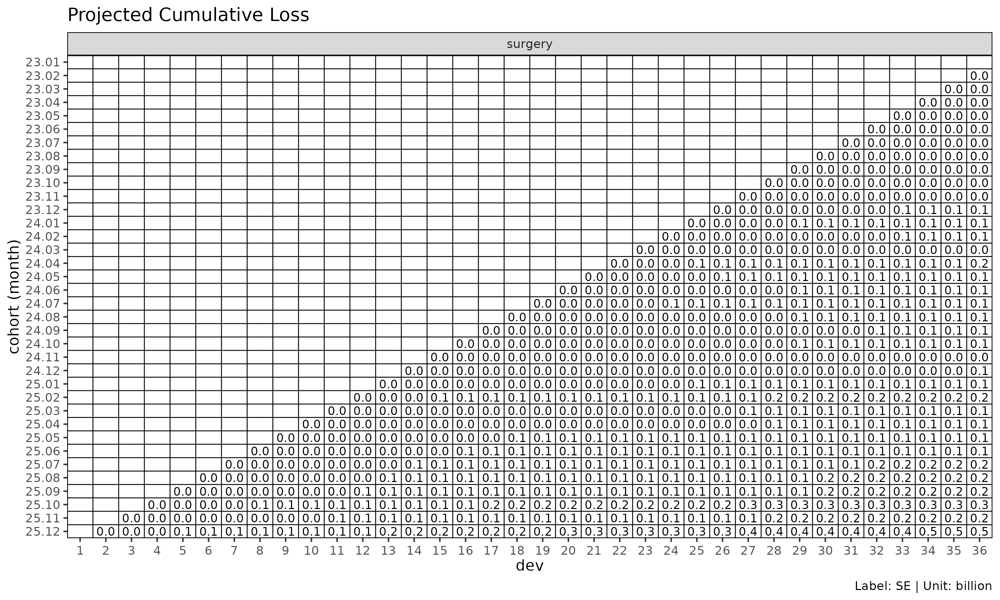

# (참고) Chain ladder reserving: 손해보험 준비금 산출

> **참고: 손해보험 (P&C) 준비금 맥락의 글.** 이 글은 *chain ladder
> 준비금 산출* — 보고기간 미종료 사고연도의 ultimate 지급/발생 손해 추정
> — 을 다룬다. 이는 손해보험(P&C, Property & Casualty) 의 전형적 use
> case 이다. lossratio 패키지의 메인 초점은 *장기 건강 보험* 손해율 추정
> (`fit_lr`) 이며, 준비금 framing 은 거기서는 직접 적용되지 않는다. 이
> 글은 P&C 배경에서 오는 사용자가 `fit_cl` 을 익숙한 Mack chain ladder
> workflow 와 매핑해 볼 수 있도록 하는 참고 자료로 둔다.
>
> 영어 원본: [Chain ladder reserving with
> fit_cl](https://seokhoonj.github.io/lossratio/ko/chain-ladder-reserving.md)

[`fit_cl()`](https://seokhoonj.github.io/lossratio/ko/reference/fit_cl.md)
은 단일 값 컬럼에 대한 전용 chain ladder 적합 함수이다. 손해와
익스포저를 동시에 추정해 손해율을 산출하는
[`fit_lr()`](https://seokhoonj.github.io/lossratio/ko/reference/fit_lr.md)
과 달리,
[`fit_cl()`](https://seokhoonj.github.io/lossratio/ko/reference/fit_cl.md)
은 하나의 누적 지표를 전방으로 추정하고 코호트별 Mack 방식 표준오차를
함께 계산한다.

## 1. 기본 사용법

이 문서는 간결성을 위해 `surgery` 그룹만 사용한다 — 모든 절차는 다중
그룹 입력에도 그대로 일반화된다.

``` r

library(lossratio)
data(experience)
tri <- as_triangle(
  experience[coverage == "surgery"],
  groups   = "coverage",
  cohort   = "uy_m",
  calendar = "cy_m",
  loss     = "incr_loss",
  premium  = "incr_prem"
)

cl <- fit_cl(tri, target = "loss", method = "mack")
print(cl)
#> <CLFit>
#> method      : mack 
#> target      : loss 
#> weight      : none 
#> alpha       : 1 
#> sigma_method: locf 
#> recent      : all 
#> regime      : none
#> use_maturity: FALSE 
#> tail_factor : 1 
#> groups      : coverage 
#> periods     : 36
```

`target` 은 추정 대상 누적 컬럼을 선택한다 — 준비금 산출에는 보통
`"loss"` (누적 손해), 익스포저 추정에는 `"premium"` (누적 위험보험료) 를
쓴다.

## 2. Mack chain ladder

[`fit_cl()`](https://seokhoonj.github.io/lossratio/ko/reference/fit_cl.md)
은 Mack (1993) chain ladder 를 구현한다. 인접 dev 의 누적 손해 비
$`f_k = C^L_{k+1} / C^L_k`$ — **ATA 인자**(age-to-age factor) — 를
링크별로 선택한 뒤 이를 누적 곱으로 연결해 각 코호트의 ultimate 까지
추정한다. 점 추정에 더해 Mack 공식은 추정 분산을 프로세스 분산과 모수
분산으로 분해하여, 셀별 표준오차와 신뢰 구간을 제공한다.

``` r

cl_mack <- fit_cl(tri, target = "loss", method = "mack")

# $full 과 $summary 는 추정값과 분산 추정값을 함께 담는다
head(cl_mack$summary)
#>    coverage     cohort     latest   loss_ult   reserve target_proc_se
#>      <char>     <Date>      <num>      <num>     <num>          <num>
#> 1:  surgery 2023-01-01  410248522  410248522         0              0
#> 2:  surgery 2023-02-01  976330445 1001441303  25110858        2751819
#> 3:  surgery 2023-03-01  978486045 1026151243  47665198        3967869
#> 4:  surgery 2023-04-01 2029909919 2186771221 156861302        6942937
#> 5:  surgery 2023-05-01  624219436  697669301  73449865        4455636
#> 6:  surgery 2023-06-01  802880717  931393934 128513217       17869565
#>    target_param_se target_total_se target_total_cv
#>              <num>           <num>           <num>
#> 1:               0               0     0.000000000
#> 2:         4299412         5104650     0.005097304
#> 3:         5021196         6399718     0.006236623
#> 4:        11297887        13260717     0.006064062
#> 5:         3696918         5789637     0.008298541
#> 6:         8694892        19872657     0.021336469
```

추정 플롯의 신뢰 구간 (`show_interval = TRUE`) 은 이 분산 추정값을
사용한다.

``` r

plot(cl_mack, type = "projection", show_interval = TRUE)
```


## 3. Tail 인자

마지막 관측 경과 기간에서도 손해가 여전히 발달 중인 triangle 의 경우,
외삽한 tail 인자(tail factor) 로 ultimate 를 추정한다.

``` r

# 선택된 ATA 인자로부터 로그 선형 외삽
cl_tail <- fit_cl(tri, target = "loss", method = "mack", tail = TRUE)

# 또는 명시적인 tail 인자 값 지정
cl_tail <- fit_cl(tri, target = "loss", method = "mack", tail = 1.025)
```

외삽은 추정된 ATA 인자에 대해 $`\log(f_k - 1) \sim k`$ 회귀를 적합한 뒤,
외삽된 $`f_k`$ 의 누적 곱만큼 추정 범위를 연장한다. 기본값은 비활성
(`tail = FALSE`) 이다.

## 4. Maturity 필터링

선택된 ATA 인자가 변동성이 크다면, 추정을 성숙(mature) 영역으로 제한할
수 있다.

``` r

cl_mat <- fit_cl(
  tri,
  target   = "loss",
  method   = "mack",
  maturity = maturity_spec(max_cv = 0.10, max_rse = 0.05)
)

cl_mat$maturity
#> Key: <coverage>
#>    coverage ata_from change ata_link     mean  median       wt         cv
#>      <char>    <num>  <num>   <char>    <num>   <num>    <num>      <num>
#> 1:  surgery        4      5      4-5 1.324091 1.33133 1.338896 0.06783671
#>           f       f_se        rse    sigma n_cohorts n_valid n_inf n_nan
#>       <num>      <num>      <num>    <num>     <num>   <num> <num> <num>
#> 1: 1.338896 0.01808821 0.01350979 1105.053        32      32     0     0
#>    valid_ratio
#>          <num>
#> 1:           1
```

`maturity_spec(...)` 은
[`detect_maturity()`](https://seokhoonj.github.io/lossratio/ko/reference/detect_maturity.md)
에 넘길 사용자 임계값을 캡처하고, 내부에서 (필요시 마스킹된) triangle
위에 호출된다. `maturity = "auto"` 는 default 임계값, 이미 산출된
`Maturity` 객체는 고정 override, `maturity_at(...)` 는 그룹별 $`k^*`$
수동 지정 용도다.

## 5. 분산 성분 (Mack)

`fit_cl(method = "mack")` 은 추정 분산을 다음과 같이 분해한다.

- `target_proc_se` — 프로세스 분산. $`\sigma^2_k`$ (경과 기간별 잔차
  링크 분산) 으로부터 도출.
- `target_param_se` — 모수 분산. 선택된 ATA 인자 $`\hat{f}_k`$ 의
  불확실성으로부터 도출.
- `target_total_se` — 총 표준오차,
  $`\sqrt{\mathrm{target\_proc\_se}^2 + \mathrm{target\_param\_se}^2}`$.
- `target_total_cv` — 변동계수, `target_total_se / target_proj`.

``` r

summary(cl_mack)
#>     coverage     cohort     latest   loss_ult    reserve target_proc_se
#>       <char>     <Date>      <num>      <num>      <num>          <num>
#>  1:  surgery 2023-01-01  410248522  410248522          0              0
#>  2:  surgery 2023-02-01  976330445 1001441303   25110858        2751819
#>  3:  surgery 2023-03-01  978486045 1026151243   47665198        3967869
#>  4:  surgery 2023-04-01 2029909919 2186771221  156861302        6942937
#>  5:  surgery 2023-05-01  624219436  697669301   73449865        4455636
#>  6:  surgery 2023-06-01  802880717  931393934  128513217       17869565
#>  7:  surgery 2023-07-01 2539141549 3050990158  511848609       35918003
#>  8:  surgery 2023-08-01  393678329  488218204   94539875       15583801
#>  9:  surgery 2023-09-01 1364052542 1751869308  387816766       38001618
#> 10:  surgery 2023-10-01  979266043 1311793843  332527800       38496097
#> 11:  surgery 2023-11-01  604685679  848103123  243417444       35719579
#> 12:  surgery 2023-12-01 1026345366 1497869029  471523663       51405333
#> 13:  surgery 2024-01-01 1912177598 2901492851  989315253       75674312
#> 14:  surgery 2024-02-01  733902485 1160045952  426143467       51719398
#> 15:  surgery 2024-03-01  415459873  686574148  271114275       41313266
#> 16:  surgery 2024-04-01 3286053526 5687484014 2401430488      122770258
#> 17:  surgery 2024-05-01 1451731153 2645801838 1194070685       93024106
#> 18:  surgery 2024-06-01  629668308 1209024555  579356247       65346187
#> 19:  surgery 2024-07-01 1250954693 2542927190 1291972497      103136528
#> 20:  surgery 2024-08-01  425346694  918120582  492773888       65317866
#> 21:  surgery 2024-09-01  278156543  635470028  357313485       56737053
#> 22:  surgery 2024-10-01  352070323  856446521  504376198       68091257
#> 23:  surgery 2024-11-01   99050501  260916096  161865595       41787166
#> 24:  surgery 2024-12-01  103194013  295637296  192443283       49617195
#> 25:  surgery 2025-01-01  227089025  710560093  483471068       83635489
#> 26:  surgery 2025-02-01  939163074 3276849152 2337686078      192418633
#> 27:  surgery 2025-03-01  112828845  434950057  322121212       72345359
#> 28:  surgery 2025-04-01   82472453  356301148  273828695       68974257
#> 29:  surgery 2025-05-01  141214851  697290587  556075736      119238986
#> 30:  surgery 2025-06-01  136406102  789468799  653062697      136628652
#> 31:  surgery 2025-07-01  149144024 1040451732  891307708      167039609
#> 32:  surgery 2025-08-01  116327076 1008356733  892029657      183653360
#> 33:  surgery 2025-09-01   67465470  783000257  715534787      179947037
#> 34:  surgery 2025-10-01  121626173 2001214863 1879588690      337103186
#> 35:  surgery 2025-11-01   15716444  449653406  433936962      194100658
#> 36:  surgery 2025-12-01    4825085  850839118  846014033      472741759
#>     coverage     cohort     latest   loss_ult    reserve target_proc_se
#>       <char>     <Date>      <num>      <num>      <num>          <num>
#>     target_param_se target_total_se target_total_cv
#>               <num>           <num>           <num>
#>  1:               0               0     0.000000000
#>  2:         4299412         5104650     0.005097304
#>  3:         5021196         6399718     0.006236623
#>  4:        11297887        13260717     0.006064062
#>  5:         3696918         5789637     0.008298541
#>  6:         8694892        19872657     0.021336469
#>  7:        30501066        47121311     0.015444596
#>  8:         5072721        16388635     0.033568259
#>  9:        20827314        43334744     0.024736288
#> 10:        16992221        42079509     0.032077837
#> 11:        11901733        37650227     0.044393454
#> 12:        22008504        55918535     0.037332059
#> 13:        43971810        87522121     0.030164514
#> 14:        18269127        54851227     0.047283667
#> 15:        11014493        42756344     0.062274911
#> 16:        92689755       153830838     0.027047256
#> 17:        45040851       103354548     0.039063601
#> 18:        20907249        68609309     0.056747655
#> 19:        45568404       112754702     0.044340515
#> 20:        16819267        67448584     0.073463753
#> 21:        11859688        57963310     0.091213288
#> 22:        16219631        69996398     0.081728860
#> 23:         5190764        42108328     0.161386470
#> 24:         6221683        50005754     0.169145620
#> 25:        15668260        85090478     0.119751276
#> 26:        75222224       206599403     0.063048188
#> 27:        10161412        73055495     0.167962950
#> 28:         8575343        69505285     0.195074548
#> 29:        19174475       120770842     0.173200161
#> 30:        22834478       138523651     0.175464377
#> 31:        31445935       169973756     0.163365345
#> 32:        32987225       186592373     0.185045993
#> 33:        27713231       182068556     0.232526816
#> 34:        80113491       346492034     0.173140846
#> 35:        21034520       195237078     0.434194593
#> 36:        66075497       477337136     0.561019265
#>     target_param_se target_total_se target_total_cv
#>               <num>           <num>           <num>
```

## 6. 준비금 플롯

`type = "reserve"` 는 코호트별 준비금을 (Mack 일 경우 선택적 오차 막대와
함께) 표시한다.

``` r

plot(cl_mack, type = "reserve", conf_level = 0.95)
```


## 7. Triangle 시각화

[`plot_triangle()`](https://seokhoonj.github.io/lossratio/ko/reference/plot_triangle.md)
은 코호트 × dev 셀을 히트맵으로 표시하며, 관측된 셀과 추정된 셀을
구분한다.

``` r

plot_triangle(cl_mack, region = "full")    # 관측 + 추정
```


``` r

plot_triangle(cl_mack, region = "proj")    # 추정만
```


``` r

plot_triangle(cl_mack, region = "data")    # 관측만
```


`label_style = "cv"` 모드는 셀별 변동계수를 표시하며, 신뢰성이 낮은 셀을
식별하는 데 유용하다.

``` r

plot_triangle(cl_mack, label_style = "cv")
```


``` r

plot_triangle(cl_mack, label_style = "se")
```



``` r

plot_triangle(cl_mack, label_style = "ci")
```


## 8. Sigma 외삽 방법

Mack 분산은 모든 발달 링크에서 $`\sigma_k`$ 가 필요한데, 마지막
링크에서는 직접 추정이 불가능하다. `sigma_method` 가 외삽 방식을
결정한다.

| `sigma_method` | 동작                                                |
|----------------|-----------------------------------------------------|
| `"locf"`       | (default) 마지막 관측값 carried forward             |
| `"min_last2"`  | 추정 가능한 마지막 두 $`\sigma`$ 의 최솟값 — 보수적 |
| `"loglinear"`  | 관측된 $`\sigma_k`$ 시퀀스에 대한 로그 선형 외삽    |

``` r

fit_cl(tri, target = "loss", method = "mack", sigma_method = "loglinear")
#> <CLFit>
#> method      : mack 
#> target      : loss 
#> weight      : none 
#> alpha       : 1 
#> sigma_method: loglinear 
#> recent      : all 
#> regime      : none
#> use_maturity: FALSE 
#> tail_factor : 1 
#> groups      : coverage 
#> periods     : 36
```

## 9. 함께 보기

- [`vignette("projection")`](https://seokhoonj.github.io/lossratio/ko/articles/projection.md)
  —
  [`fit_lr()`](https://seokhoonj.github.io/lossratio/ko/reference/fit_lr.md)
  을 사용해야 할 때.
- [`vignette("triangle-link-and-maturity")`](https://seokhoonj.github.io/lossratio/ko/articles/triangle-link-and-maturity.md)
  — [`summary()`](https://rdrr.io/r/base/summary.html),
  [`detect_maturity()`](https://seokhoonj.github.io/lossratio/ko/reference/detect_maturity.md),
  ata 진단 플롯.
- [`?fit_cl`](https://seokhoonj.github.io/lossratio/ko/reference/fit_cl.md),
  [`?detect_maturity`](https://seokhoonj.github.io/lossratio/ko/reference/detect_maturity.md),
  [`?fit_ata`](https://seokhoonj.github.io/lossratio/ko/reference/fit_ata.md).
