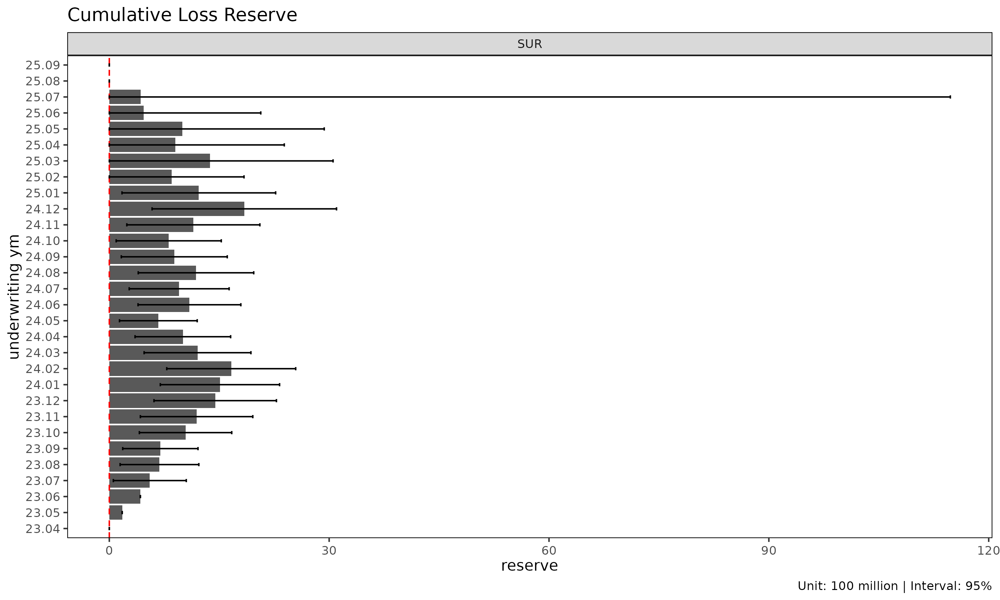
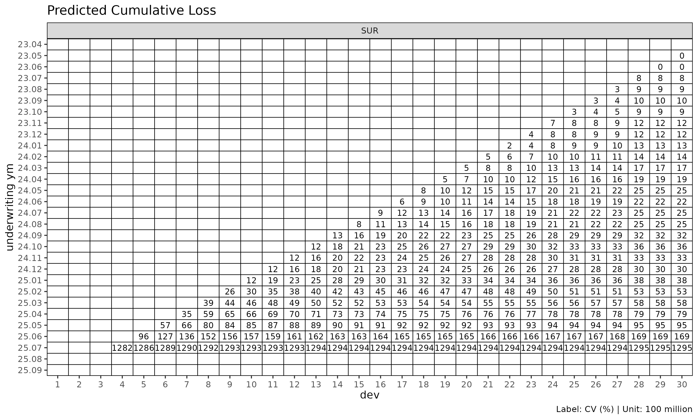

# (Reference) Chain ladder reserving

> **Reference: P&C reserving context.** This article covers chain ladder
> *reserving* — projecting ultimate paid / incurred loss for an open
> accident year — which is a Property & Casualty (P&C, 손해보험) use
> case. The lossratio package’s primary focus is long-term health
> insurance loss ratio projection (`fit_lr`), where the reserving
> framing applies only loosely. We include this article so practitioners
> coming from a P&C background see how `fit_cl` maps to the classical
> Mack chain ladder workflow they’re already familiar with.

[`fit_cl()`](https://seokhoonj.github.io/lossratio/ko/reference/fit_cl.md)
is the dedicated chain ladder fit for a single value column. Unlike
[`fit_lr()`](https://seokhoonj.github.io/lossratio/ko/reference/fit_lr.md)
(which projects loss / exposure jointly to get loss ratio),
[`fit_cl()`](https://seokhoonj.github.io/lossratio/ko/reference/fit_cl.md)
projects one cumulative metric forward and computes Mack-style standard
errors per cohort.

## Basic usage

For brevity this vignette uses the `SUR` group only — every step
generalises to multi-group input.

``` r

library(lossratio)
data(experience)
tri <- as_triangle(
  experience[coverage == "SUR"],
  groups   = "coverage",
  cohort   = "uy_m",
  calendar = "cy_m",
  loss     = "loss_incr",
  premium  = "premium_incr"
)

cl <- fit_cl(tri, target = "loss", method = "mack")
print(cl)
#> <CLFit>
#> method      : mack 
#> target      : loss 
#> weight      : none 
#> alpha       : 1 
#> sigma_method: locf 
#> recent      : all 
#> regime      : none
#> use_maturity: FALSE 
#> tail_factor : 1 
#> groups      : coverage 
#> periods     : 36
```

`target` selects the cumulative column to project — typically `"loss"`
(cumulative loss) for reserving, or `"premium"` (cumulative risk
premium) for exposure projection.

## Mack chain ladder

[`fit_cl()`](https://seokhoonj.github.io/lossratio/ko/reference/fit_cl.md)
implements the Mack (1993) chain ladder. Adjacent development links are
summarised by age-to-age factors $`f_k = C^L_{k+1} / C^L_k`$ — selected
per link and then chained to project each cohort forward to ultimate. On
top of the point projection, Mack’s formulae decompose the prediction
variance into process and parameter components, yielding per-cell
standard errors and confidence intervals.

``` r

cl_mack <- fit_cl(tri, target = "loss", method = "mack")

# $full and $summary carry both the projection and its variance
head(cl_mack$summary)
#>    coverage     cohort     latest   loss_ult   reserve target_proc_se
#>      <char>     <Date>      <num>      <num>     <num>          <num>
#> 1:      SUR 2023-01-01  410248522  410248522         0              0
#> 2:      SUR 2023-02-01  976330445 1001441303  25110858        2751819
#> 3:      SUR 2023-03-01  978486045 1026151243  47665198        3967869
#> 4:      SUR 2023-04-01 2029909919 2186771221 156861302        6942937
#> 5:      SUR 2023-05-01  624219436  697669301  73449865        4455636
#> 6:      SUR 2023-06-01  802880717  931393934 128513217       17869565
#>    target_param_se target_total_se target_total_cv
#>              <num>           <num>           <num>
#> 1:               0               0     0.000000000
#> 2:         4299412         5104650     0.005097304
#> 3:         5021196         6399718     0.006236623
#> 4:        11297887        13260717     0.006064062
#> 5:         3696918         5789637     0.008298541
#> 6:         8694892        19872657     0.021336469
```

The projection plot’s confidence bands (`show_interval = TRUE`) use
those variance estimates:

``` r

plot(cl_mack, type = "projection", show_interval = TRUE)
```


## Tail factor

For triangles where the latest observed development period is still
developing, an extrapolated tail factor estimates ultimate:

``` r

# Log-linear extrapolation from the selected ATA factors
cl_tail <- fit_cl(tri, target = "loss", method = "mack", tail = TRUE)

# Or supply a literal tail factor
cl_tail <- fit_cl(tri, target = "loss", method = "mack", tail = 1.025)
```

The extrapolation fits $`\log(f_k - 1) \sim k`$ to projected factors and
extends the projection by the cumulative product of extrapolated $`f_k`$
values. Disabled by default (`tail = FALSE`).

## Maturity filtering

If selected ATA factors are volatile, restrict projection to the mature
region only:

``` r

cl_mat <- fit_cl(
  tri,
  target   = "loss",
  method   = "mack",
  maturity = maturity_spec(max_cv = 0.10, max_rse = 0.05)
)

cl_mat$maturity
#> Key: <coverage>
#>    coverage ata_from change ata_link     mean  median       wt         cv
#>      <char>    <num>  <num>   <char>    <num>   <num>    <num>      <num>
#> 1:      SUR        4      5      4-5 1.324091 1.33133 1.338896 0.06783671
#>           f       f_se        rse    sigma n_cohorts n_valid n_inf n_nan
#>       <num>      <num>      <num>    <num>     <num>   <num> <num> <num>
#> 1: 1.338896 0.01808821 0.01350979 1105.053        32      32     0     0
#>    valid_ratio
#>          <num>
#> 1:           1
```

`maturity_spec(...)` captures custom
[`detect_maturity()`](https://seokhoonj.github.io/lossratio/ko/reference/detect_maturity.md)
thresholds and is invoked internally on the (possibly masked) triangle.
Pass `maturity = "auto"` for default thresholds, a pre-built `Maturity`
object for a fixed override, or `maturity_at(...)` for a manual
per-group $`k^*`$.

## Variance components (Mack)

`fit_cl(method = "mack")` decomposes the projection variance into:

- `target_proc_se` — process variance, from $`\sigma^2_k`$ (residual
  link variance per development period).
- `target_param_se` — parameter variance, from the uncertainty of the
  selected age-to-age factors $`\hat{f}_k`$.
- `target_total_se` — total standard error,
  $`\sqrt{\mathrm{target\_proc\_se}^2 + \mathrm{target\_param\_se}^2}`$.
- `target_total_cv` — coefficient of variation,
  `target_total_se / target_proj`.

``` r

summary(cl_mack)
#>     coverage     cohort     latest   loss_ult    reserve target_proc_se
#>       <char>     <Date>      <num>      <num>      <num>          <num>
#>  1:      SUR 2023-01-01  410248522  410248522          0              0
#>  2:      SUR 2023-02-01  976330445 1001441303   25110858        2751819
#>  3:      SUR 2023-03-01  978486045 1026151243   47665198        3967869
#>  4:      SUR 2023-04-01 2029909919 2186771221  156861302        6942937
#>  5:      SUR 2023-05-01  624219436  697669301   73449865        4455636
#>  6:      SUR 2023-06-01  802880717  931393934  128513217       17869565
#>  7:      SUR 2023-07-01 2539141549 3050990158  511848609       35918003
#>  8:      SUR 2023-08-01  393678329  488218204   94539875       15583801
#>  9:      SUR 2023-09-01 1364052542 1751869308  387816766       38001618
#> 10:      SUR 2023-10-01  979266043 1311793843  332527800       38496097
#> 11:      SUR 2023-11-01  604685679  848103123  243417444       35719579
#> 12:      SUR 2023-12-01 1026345366 1497869029  471523663       51405333
#> 13:      SUR 2024-01-01 1912177598 2901492851  989315253       75674312
#> 14:      SUR 2024-02-01  733902485 1160045952  426143467       51719398
#> 15:      SUR 2024-03-01  415459873  686574148  271114275       41313266
#> 16:      SUR 2024-04-01 3286053526 5687484014 2401430488      122770258
#> 17:      SUR 2024-05-01 1451731153 2645801838 1194070685       93024106
#> 18:      SUR 2024-06-01  629668308 1209024555  579356247       65346187
#> 19:      SUR 2024-07-01 1250954693 2542927190 1291972497      103136528
#> 20:      SUR 2024-08-01  425346694  918120582  492773888       65317866
#> 21:      SUR 2024-09-01  278156543  635470028  357313485       56737053
#> 22:      SUR 2024-10-01  352070323  856446521  504376198       68091257
#> 23:      SUR 2024-11-01   99050501  260916096  161865595       41787166
#> 24:      SUR 2024-12-01  103194013  295637296  192443283       49617195
#> 25:      SUR 2025-01-01  227089025  710560093  483471068       83635489
#> 26:      SUR 2025-02-01  939163074 3276849152 2337686078      192418633
#> 27:      SUR 2025-03-01  112828845  434950057  322121212       72345359
#> 28:      SUR 2025-04-01   82472453  356301148  273828695       68974257
#> 29:      SUR 2025-05-01  141214851  697290587  556075736      119238986
#> 30:      SUR 2025-06-01  136406102  789468799  653062697      136628652
#> 31:      SUR 2025-07-01  149144024 1040451732  891307708      167039609
#> 32:      SUR 2025-08-01  116327076 1008356733  892029657      183653360
#> 33:      SUR 2025-09-01   67465470  783000257  715534787      179947037
#> 34:      SUR 2025-10-01  121626173 2001214863 1879588690      337103186
#> 35:      SUR 2025-11-01   15716444  449653406  433936962      194100658
#> 36:      SUR 2025-12-01    4825085  850839118  846014033      472741759
#>     coverage     cohort     latest   loss_ult    reserve target_proc_se
#>       <char>     <Date>      <num>      <num>      <num>          <num>
#>     target_param_se target_total_se target_total_cv
#>               <num>           <num>           <num>
#>  1:               0               0     0.000000000
#>  2:         4299412         5104650     0.005097304
#>  3:         5021196         6399718     0.006236623
#>  4:        11297887        13260717     0.006064062
#>  5:         3696918         5789637     0.008298541
#>  6:         8694892        19872657     0.021336469
#>  7:        30501066        47121311     0.015444596
#>  8:         5072721        16388635     0.033568259
#>  9:        20827314        43334744     0.024736288
#> 10:        16992221        42079509     0.032077837
#> 11:        11901733        37650227     0.044393454
#> 12:        22008504        55918535     0.037332059
#> 13:        43971810        87522121     0.030164514
#> 14:        18269127        54851227     0.047283667
#> 15:        11014493        42756344     0.062274911
#> 16:        92689755       153830838     0.027047256
#> 17:        45040851       103354548     0.039063601
#> 18:        20907249        68609309     0.056747655
#> 19:        45568404       112754702     0.044340515
#> 20:        16819267        67448584     0.073463753
#> 21:        11859688        57963310     0.091213288
#> 22:        16219631        69996398     0.081728860
#> 23:         5190764        42108328     0.161386470
#> 24:         6221683        50005754     0.169145620
#> 25:        15668260        85090478     0.119751276
#> 26:        75222224       206599403     0.063048188
#> 27:        10161412        73055495     0.167962950
#> 28:         8575343        69505285     0.195074548
#> 29:        19174475       120770842     0.173200161
#> 30:        22834478       138523651     0.175464377
#> 31:        31445935       169973756     0.163365345
#> 32:        32987225       186592373     0.185045993
#> 33:        27713231       182068556     0.232526816
#> 34:        80113491       346492034     0.173140846
#> 35:        21034520       195237078     0.434194593
#> 36:        66075497       477337136     0.561019265
#>     target_param_se target_total_se target_total_cv
#>               <num>           <num>           <num>
```

## Reserve plot

`type = "reserve"` shows reserve per cohort with optional error bars
(Mack only):

``` r

plot(cl_mack, type = "reserve", conf_level = 0.95)
```



## Triangle visualisation

[`plot_triangle()`](https://seokhoonj.github.io/lossratio/ko/reference/plot_triangle.md)
displays the cohort × dev cells as a heatmap, distinguishing observed
cells from projected:

``` r

plot_triangle(cl_mack, region = "full")    # observed + projected
```


``` r

plot_triangle(cl_mack, region = "proj")    # projected only
```


``` r

plot_triangle(cl_mack, region = "data")    # observed only
```


The `label_style = "cv"` mode shows coefficient of variation per cell,
useful for spotting unreliable cells:

``` r

plot_triangle(cl_mack, label_style = "cv")
```



``` r

plot_triangle(cl_mack, label_style = "se")
```


``` r

plot_triangle(cl_mack, label_style = "ci")
```


## Sigma extrapolation methods

Mack variance requires $`\sigma_k`$ at all development links, including
the last where it cannot be estimated directly. `sigma_method` controls
the extrapolation:

| `sigma_method` | Behaviour |
|----|----|
| `"locf"` | (default) last observation carried forward |
| `"min_last2"` | min of the last two estimable $`\sigma`$ values — conservative |
| `"loglinear"` | Log-linear extrapolation from the observed $`\sigma_k`$ sequence |

``` r

fit_cl(tri, target = "loss", method = "mack", sigma_method = "loglinear")
#> <CLFit>
#> method      : mack 
#> target      : loss 
#> weight      : none 
#> alpha       : 1 
#> sigma_method: loglinear 
#> recent      : all 
#> regime      : none
#> use_maturity: FALSE 
#> tail_factor : 1 
#> groups      : coverage 
#> periods     : 36
```

## See also

- [`vignette("projection")`](https://seokhoonj.github.io/lossratio/ko/articles/projection.md)
  — when to use
  [`fit_lr()`](https://seokhoonj.github.io/lossratio/ko/reference/fit_lr.md)
  instead.
- [`vignette("triangle-link-and-maturity")`](https://seokhoonj.github.io/lossratio/ko/articles/triangle-link-and-maturity.md)
  — [`summary()`](https://rdrr.io/r/base/summary.html),
  [`detect_maturity()`](https://seokhoonj.github.io/lossratio/ko/reference/detect_maturity.md),
  ata diagnostic plots.
- [`?fit_cl`](https://seokhoonj.github.io/lossratio/ko/reference/fit_cl.md),
  [`?detect_maturity`](https://seokhoonj.github.io/lossratio/ko/reference/detect_maturity.md),
  [`?fit_ata`](https://seokhoonj.github.io/lossratio/ko/reference/fit_ata.md).
