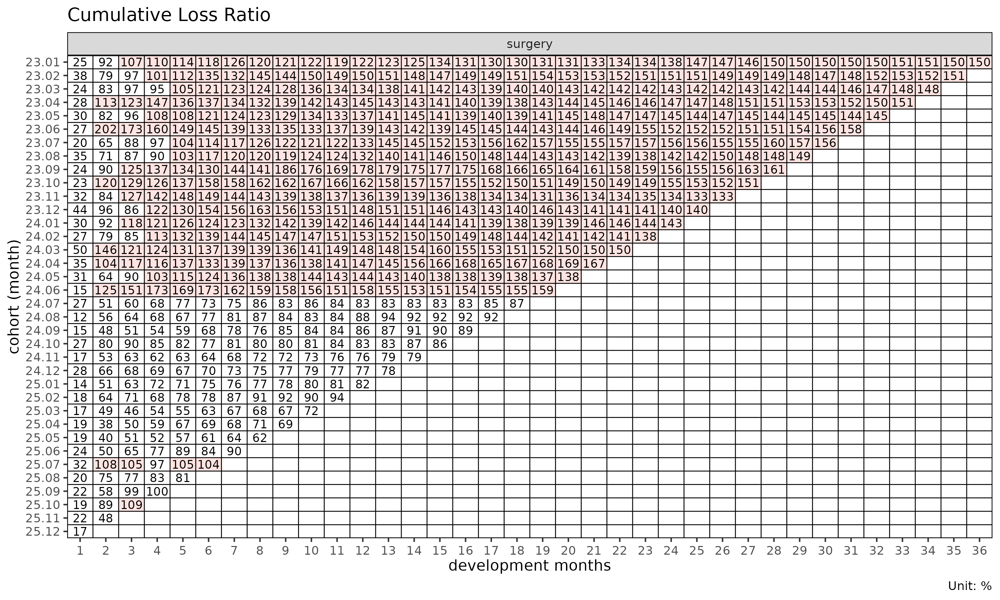
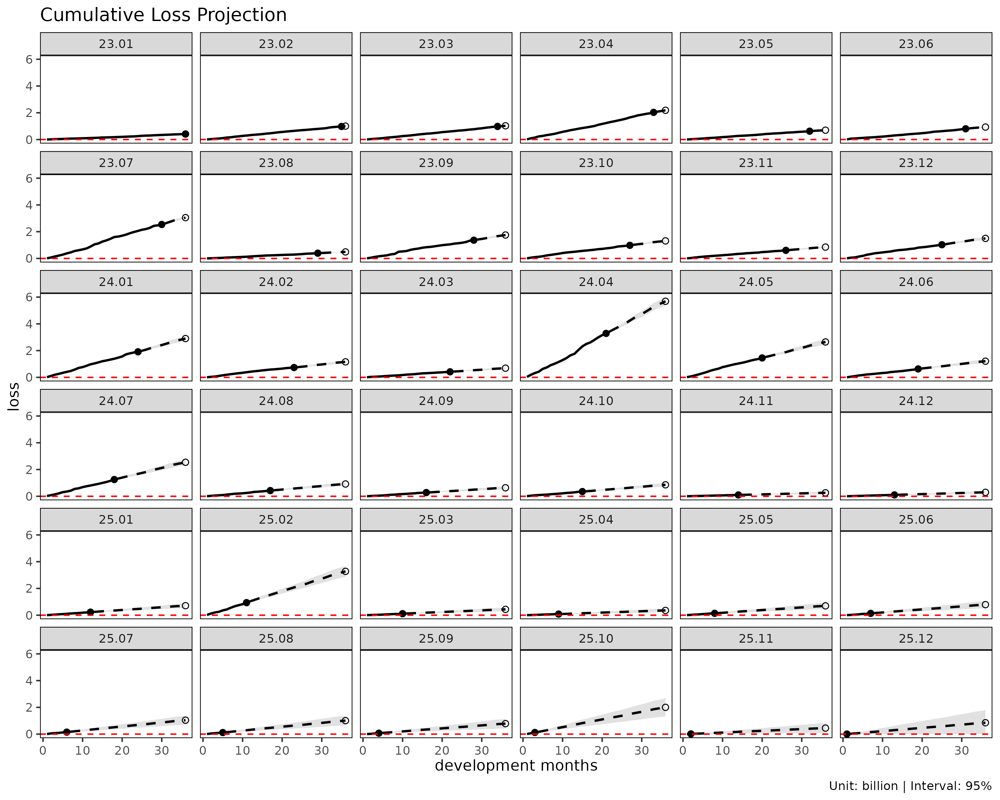
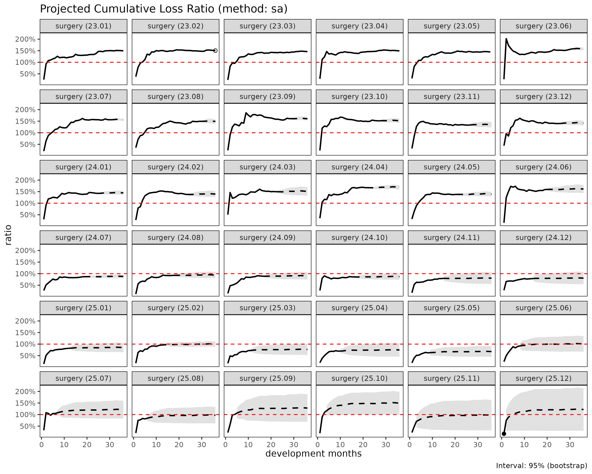
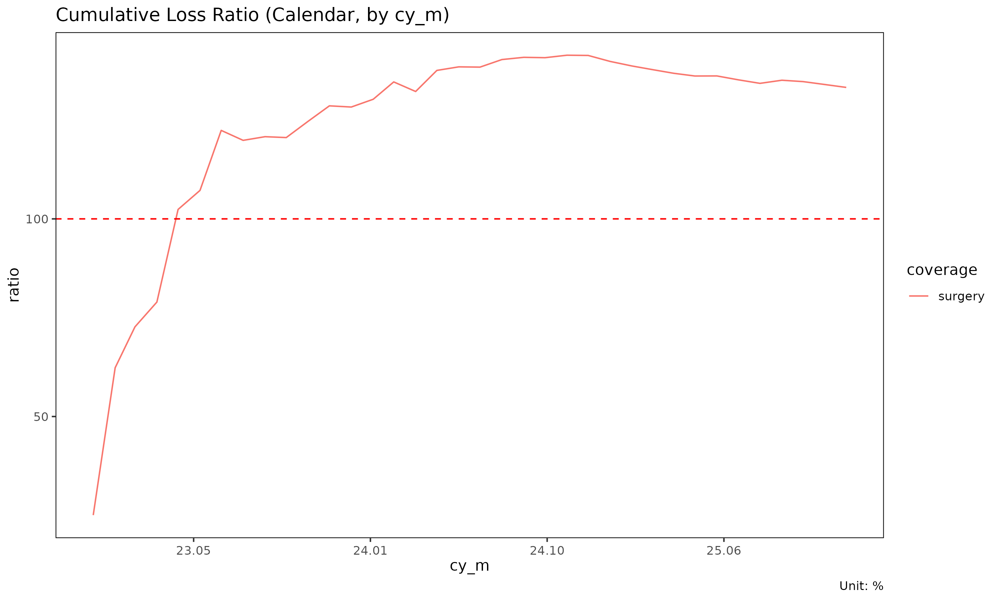
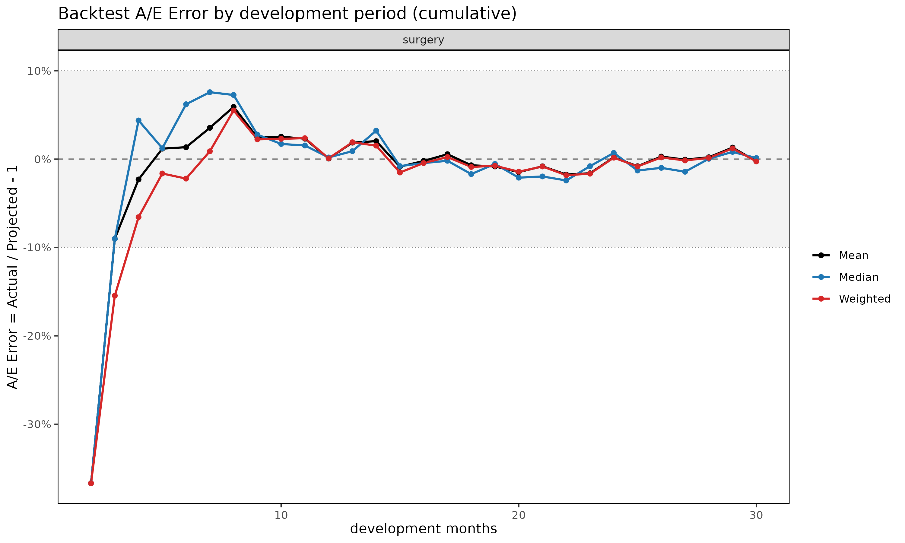
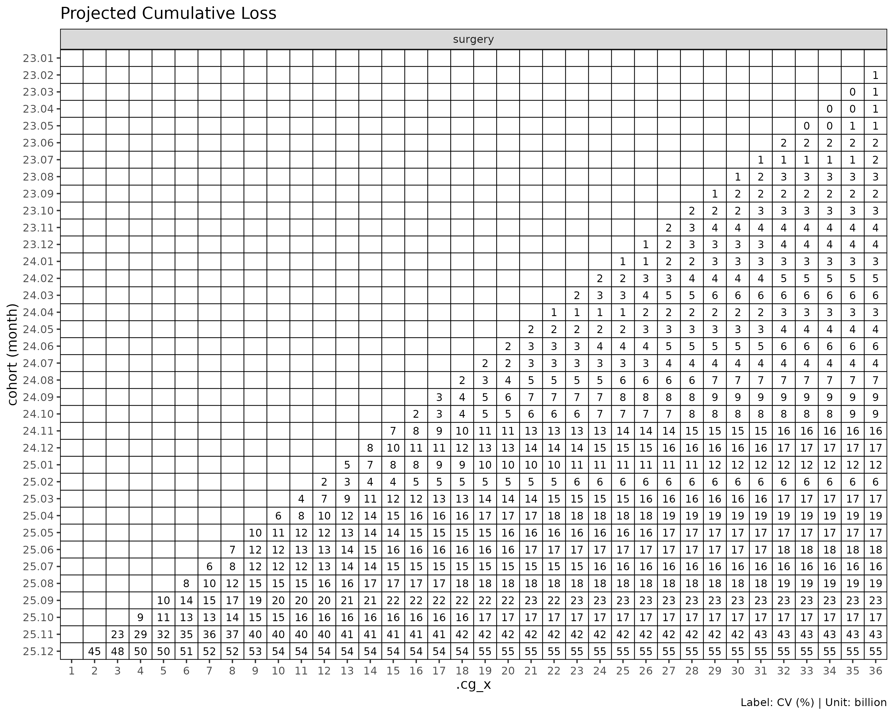

# Getting started with lossratio

This vignette walks the core functions of the lossratio package end to
end, in the order **prepare the data -\> fit -\> diagnose -\> validate
-\> visualise**. At each step it explains *what* is being called, *why*
it behaves the way it does, and *how* to read the result. Reading this
one document is enough to grasp the full workflow.

## The problem this package solves

In long-term health insurance a policy, once underwritten, stays in
force for decades. The central task is therefore to look ahead and see
how a group of contracts written at a given point in time (a cohort)
accumulates its loss ratio as the years pass.

lossratio frames this problem on a **cohort x development-period (cohort
x dev)** grid.

- **cohort** – the time a contract was underwritten (e.g. January 2023
  business).
- **development period (dev)** – the time elapsed since underwriting.

Each cell holds a cumulative loss (`loss`) and a cumulative premium
(`premium`), and the loss ratio is defined as `ratio = loss / premium`.
Estimating the cells of future development periods that have not yet
been observed is the act of projection, and the various `fit_*`
functions in this package perform that estimate in different ways.

## The data: `experience`

The package ships with a synthetic experience dataset. The term
experience is the domain standard, referring to the cell-level records
of an actuarial experience study.

``` r

data(experience)
str(experience)
#> Classes 'data.table' and 'data.frame':   2664 obs. of  15 variables:
#>  $ coverage    : chr  "ci" "ci" "ci" "ci" ...
#>  $ uy          : Date, format: "2023-01-01" "2023-01-01" ...
#>  $ uy_h        : Date, format: "2023-01-01" "2023-01-01" ...
#>  $ uy_q        : Date, format: "2023-01-01" "2023-01-01" ...
#>  $ uy_m        : Date, format: "2023-01-01" "2023-01-01" ...
#>  $ cy          : Date, format: "2023-01-01" "2023-01-01" ...
#>  $ cy_h        : Date, format: "2023-01-01" "2023-01-01" ...
#>  $ cy_q        : Date, format: "2023-01-01" "2023-01-01" ...
#>  $ cy_m        : Date, format: "2023-01-01" "2023-02-01" ...
#>  $ dev_y       : int  1 1 1 1 1 1 1 1 1 1 ...
#>  $ dev_h       : int  1 1 1 1 1 1 2 2 2 2 ...
#>  $ dev_q       : int  1 1 1 2 2 2 3 3 3 4 ...
#>  $ dev_m       : int  1 2 3 4 5 6 7 8 9 10 ...
#>  $ incr_loss   : num  1262380 11255763 11281309 33602387 7152622 ...
#>  $ incr_premium: num  27993106 29183931 29401966 26570540 27471886 ...
#>  - attr(*, ".internal.selfref")=<pointer: (nil)>
head(experience)
#>    coverage         uy       uy_h       uy_q       uy_m         cy       cy_h
#>      <char>     <Date>     <Date>     <Date>     <Date>     <Date>     <Date>
#> 1:       ci 2023-01-01 2023-01-01 2023-01-01 2023-01-01 2023-01-01 2023-01-01
#> 2:       ci 2023-01-01 2023-01-01 2023-01-01 2023-01-01 2023-01-01 2023-01-01
#> 3:       ci 2023-01-01 2023-01-01 2023-01-01 2023-01-01 2023-01-01 2023-01-01
#> 4:       ci 2023-01-01 2023-01-01 2023-01-01 2023-01-01 2023-01-01 2023-01-01
#> 5:       ci 2023-01-01 2023-01-01 2023-01-01 2023-01-01 2023-01-01 2023-01-01
#> 6:       ci 2023-01-01 2023-01-01 2023-01-01 2023-01-01 2023-01-01 2023-01-01
#>          cy_q       cy_m dev_y dev_h dev_q dev_m incr_loss incr_premium
#>        <Date>     <Date> <int> <int> <int> <int>     <num>        <num>
#> 1: 2023-01-01 2023-01-01     1     1     1     1   1262380     27993106
#> 2: 2023-01-01 2023-02-01     1     1     1     2  11255763     29183931
#> 3: 2023-01-01 2023-03-01     1     1     1     3  11281309     29401966
#> 4: 2023-04-01 2023-04-01     1     1     2     4  33602387     26570540
#> 5: 2023-04-01 2023-05-01     1     1     2     5   7152622     27471886
#> 6: 2023-04-01 2023-06-01     1     1     2     6  10110525     26769360
```

The key columns are:

- `coverage` – the line of business (group). Four products: surgery, ci,
  cancer, death.
- `uy_m` – underwriting month. The source column for the cohort axis.
- `cy_m` – calendar month.
- `dev_m` – development month.
- `incr_loss`, `incr_premium` – **incremental (per-period)** loss and
  premium.

Note that the input is incremental: raw experience is usually
accumulated in the form “how much was incurred / earned this month”. The
cumulative values are constructed inside the package.

## Building a Triangle – `as_triangle()`

[`as_triangle()`](https://seokhoonj.github.io/lossratio/ko/reference/as_triangle.md)
turns raw experience into a standard **Triangle** object. It performs
validation, coordinate standardisation, and aggregation in one call.

``` r

tri <- as_triangle(
  experience,
  groups   = "coverage",
  cohort   = "uy_m",
  calendar = "cy_m",
  loss     = "incr_loss",
  premium  = "incr_premium"
)
tri
#> shape: (2_664, 18)
#> ┌──────────┬───────────┬────────────┬───┬───────────────┬────────────────┐
#> │ coverage ┆ n_cohorts ┆ cohort     ┆ … ┆ premium_share ┆ incr_premium_… │
#> │ <chr>    ┆ <int>     ┆ <date>     ┆ … ┆ <dbl>         ┆ <dbl>          │
#> ├──────────┼───────────┼────────────┼───┼───────────────┼────────────────┤
#> │ ci       ┆ 36        ┆ 2023-01-01 ┆ … ┆ 0.381171      ┆ 0.381171       │
#> │ ci       ┆ 35        ┆ 2023-01-01 ┆ … ┆ 0.380346      ┆ 0.379558       │
#> │ ci       ┆ 34        ┆ 2023-01-01 ┆ … ┆ 0.387352      ┆ 0.401744       │
#> │ ci       ┆ 33        ┆ 2023-01-01 ┆ … ┆ 0.379535      ┆ 0.356118       │
#> │ ci       ┆ 32        ┆ 2023-01-01 ┆ … ┆ 0.377646      ┆ 0.370060       │
#> │ …        ┆ …         ┆ …          ┆ … ┆ …             ┆ …              │
#> │ surgery  ┆ 35        ┆ 2025-10-01 ┆ … ┆ 0.872357      ┆ 0.874228       │
#> │ surgery  ┆ 34        ┆ 2025-10-01 ┆ … ┆ 0.874537      ┆ 0.878680       │
#> │ surgery  ┆ 36        ┆ 2025-11-01 ┆ … ┆ 0.667521      ┆ 0.667521       │
#> │ surgery  ┆ 35        ┆ 2025-11-01 ┆ … ┆ 0.669140      ┆ 0.670648       │
#> │ surgery  ┆ 36        ┆ 2025-12-01 ┆ … ┆ 0.544008      ┆ 0.544008       │
#> └──────────┴───────────┴────────────┴───┴───────────────┴────────────────┘
#> 13 more variables: dev <int>, loss <dbl>, incr_loss <dbl>, premium <dbl>,
#>                    incr_premium <dbl>, ratio <dbl>, incr_ratio <dbl>,
#>                    margin <dbl>, incr_margin <dbl>, profit <fct>,
#>                    incr_profit <fct>, loss_share <dbl>, incr_loss_share <dbl>
```

It takes the original column names (`uy_m`, `incr_loss`, …) and renames
them to standard names (`cohort`, `dev`, `loss`, `premium`, …),
preserving the originals as attributes. The output columns are
**cumulative by default**, with incremental columns carrying the `incr_`
prefix – `loss`/`incr_loss`, `premium`/`incr_premium`,
`ratio`/`incr_ratio`.

If you already hold a cumulative triangle, pass
`cell_type = "cumulative"`.
[`as_triangle()`](https://seokhoonj.github.io/lossratio/ko/reference/as_triangle.md)
then differences within each cohort to recover the increments
automatically.

``` r

# when loss / premium are already cumulative
as_triangle(df_cumulative,
            groups = "coverage", cohort = "uy_m", calendar = "cy_m",
            loss = "loss", premium = "premium",
            cell_type = "cumulative")
```

The rest of the walkthrough uses a single product so the output stays
compact.

``` r

tri1 <- as_triangle(
  experience[coverage == "surgery"],
  groups   = "coverage",
  cohort   = "uy_m",
  calendar = "cy_m",
  loss     = "incr_loss",
  premium  = "incr_premium"
)
```

The triangle itself can be viewed as a heatmap.

``` r

plot_triangle(tri1, metric = "ratio")
```



Only the upper-left region (the observed area) is filled; the empty
lower-right cells are the future cells still to be projected.

## Two views of loss development

To project future cells, the way “loss grows over development time” must
be expressed as a model. lossratio uses two basic views.

- **Multiplicative – chain ladder (CL)**. The cumulative loss at the
  next development period is a multiple of the current one:
  `C_{k+1} = f_k * C_k`. Here `f_k` is the age-to-age factor, estimated
  as the ratio of cumulative loss between two adjacent development
  periods.
- **Additive – exposure-driven (ED)**. The loss *increment* of the next
  period is made proportional to premium: `Δloss = g_k * premium`. `g_k`
  is the loss intensity per unit of premium.

The two are complementary. Early in development the cumulative loss is
small, so the age-to-age factor swings widely; anchoring on premium
makes the exposure-driven view more stable. As development matures the
age-to-age factor settles, and chain ladder preserves the cohort’s own
observed level well.

## `fit_cl()` – chain ladder

[`fit_cl()`](https://seokhoonj.github.io/lossratio/ko/reference/fit_cl.md)
performs a Mack (1993) chain ladder fit on the cumulative `loss`.

``` r

cl <- fit_cl(tri1)
summary(cl)
#>     coverage     cohort     latest   loss_ult    reserve loss_proc_se
#>       <char>     <Date>      <num>      <num>      <num>        <num>
#>  1:  surgery 2023-01-01  410248522  410248522          0            0
#>  2:  surgery 2023-02-01  976330445 1001441303   25110858      2751819
#>  3:  surgery 2023-03-01  978486045 1026151243   47665198      3967869
#>  4:  surgery 2023-04-01 2029909919 2186771221  156861302      6942937
#>  5:  surgery 2023-05-01  624219436  697669301   73449865      4455636
#>  6:  surgery 2023-06-01  802880717  931393934  128513217     17869565
#>  7:  surgery 2023-07-01 2539141549 3050990158  511848609     35918003
#>  8:  surgery 2023-08-01  393678329  488218204   94539875     15583801
#>  9:  surgery 2023-09-01 1364052542 1751869308  387816766     38001618
#> 10:  surgery 2023-10-01  979266043 1311793843  332527800     38496097
#> 11:  surgery 2023-11-01  604685679  848103123  243417444     35719579
#> 12:  surgery 2023-12-01 1026345366 1497869029  471523663     51405333
#> 13:  surgery 2024-01-01 1912177598 2901492851  989315253     75674312
#> 14:  surgery 2024-02-01  733902485 1160045952  426143467     51719398
#> 15:  surgery 2024-03-01  415459873  686574148  271114275     41313266
#> 16:  surgery 2024-04-01 3286053526 5687484014 2401430488    122770258
#> 17:  surgery 2024-05-01 1451731153 2645801838 1194070685     93024106
#> 18:  surgery 2024-06-01  629668308 1209024555  579356247     65346187
#> 19:  surgery 2024-07-01 1250954693 2542927190 1291972497    103136528
#> 20:  surgery 2024-08-01  425346694  918120582  492773888     65317866
#> 21:  surgery 2024-09-01  278156543  635470028  357313485     56737053
#> 22:  surgery 2024-10-01  352070323  856446521  504376198     68091257
#> 23:  surgery 2024-11-01   99050501  260916096  161865595     41787166
#> 24:  surgery 2024-12-01  103194013  295637296  192443283     49617195
#> 25:  surgery 2025-01-01  227089025  710560093  483471068     83635489
#> 26:  surgery 2025-02-01  939163074 3276849152 2337686078    192418633
#> 27:  surgery 2025-03-01  112828845  434950057  322121212     72345359
#> 28:  surgery 2025-04-01   82472453  356301148  273828695     68974257
#> 29:  surgery 2025-05-01  141214851  697290587  556075736    119238986
#> 30:  surgery 2025-06-01  136406102  789468799  653062697    136628652
#> 31:  surgery 2025-07-01  149144024 1040451732  891307708    167039609
#> 32:  surgery 2025-08-01  116327076 1008356733  892029657    183653360
#> 33:  surgery 2025-09-01   67465470  783000257  715534787    179947037
#> 34:  surgery 2025-10-01  121626173 2001214863 1879588690    337103186
#> 35:  surgery 2025-11-01   15716444  449653406  433936962    194100658
#> 36:  surgery 2025-12-01    4825085  850839118  846014033    472741759
#>     coverage     cohort     latest   loss_ult    reserve loss_proc_se
#>       <char>     <Date>      <num>      <num>      <num>        <num>
#>     loss_param_se loss_total_se loss_total_cv
#>             <num>         <num>         <num>
#>  1:             0             0   0.000000000
#>  2:       4299412       5104650   0.005097304
#>  3:       5021196       6399718   0.006236623
#>  4:      11297887      13260717   0.006064062
#>  5:       3696918       5789637   0.008298541
#>  6:       8694892      19872657   0.021336469
#>  7:      30501066      47121311   0.015444596
#>  8:       5072721      16388635   0.033568259
#>  9:      20827314      43334744   0.024736288
#> 10:      16992221      42079509   0.032077837
#> 11:      11901733      37650227   0.044393454
#> 12:      22008504      55918535   0.037332059
#> 13:      43971810      87522121   0.030164514
#> 14:      18269127      54851227   0.047283667
#> 15:      11014493      42756344   0.062274911
#> 16:      92689755     153830838   0.027047256
#> 17:      45040851     103354548   0.039063601
#> 18:      20907249      68609309   0.056747655
#> 19:      45568404     112754702   0.044340515
#> 20:      16819267      67448584   0.073463753
#> 21:      11859688      57963310   0.091213288
#> 22:      16219631      69996398   0.081728860
#> 23:       5190764      42108328   0.161386470
#> 24:       6221683      50005754   0.169145620
#> 25:      15668260      85090478   0.119751276
#> 26:      75222224     206599403   0.063048188
#> 27:      10161412      73055495   0.167962950
#> 28:       8575343      69505285   0.195074548
#> 29:      19174475     120770842   0.173200161
#> 30:      22834478     138523651   0.175464377
#> 31:      31445935     169973756   0.163365345
#> 32:      32987225     186592373   0.185045993
#> 33:      27713231     182068556   0.232526816
#> 34:      80113491     346492034   0.173140846
#> 35:      21034520     195237078   0.434194593
#> 36:      66075497     477337136   0.561019265
#>     loss_param_se loss_total_se loss_total_cv
#>             <num>         <num>         <num>
```

[`summary()`](https://rdrr.io/r/base/summary.html) reports the ultimate
loss per cohort with its standard error (`loss_total_se`) and
coefficient of variation (`loss_total_cv`). The standard error follows
Mack’s variance decomposition, computed as the sum of *process error*
and *parameter error*.

The `$full` slot holds the cell-level result over both the observed and
projected regions.

``` r

head(cl$full[, c("cohort", "dev", "loss_obs", "loss_proj",
                 "loss_total_se", "is_observed")])
#>        cohort   dev loss_obs loss_proj loss_total_se is_observed
#>        <Date> <int>    <num>     <num>         <num>      <lgcl>
#> 1: 2023-01-01     1  1886123   1886123             0        TRUE
#> 2: 2023-01-01     2 14030514  14030514             0        TRUE
#> 3: 2023-01-01     3 24427715  24427715             0        TRUE
#> 4: 2023-01-01     4 34672477  34672477             0        TRUE
#> 5: 2023-01-01     5 44990229  44990229             0        TRUE
#> 6: 2023-01-01     6 55621697  55621697             0        TRUE
```

The projection curves connect each cohort’s observed values (solid) with
its projection (dashed).

``` r

plot(cl)
```



## `fit_ed()` – exposure-driven

[`fit_ed()`](https://seokhoonj.github.io/lossratio/ko/reference/fit_ed.md)
fits the same triangle with the additive exposure-driven model.

``` r

ed <- fit_ed(tri1)
summary(ed)
#> Key: <coverage>
#>     coverage ata_from ata_to ata_link    mean  median      wt      cv       g
#>       <char>    <num>  <num>   <fctr>   <num>   <num>   <num>   <num>   <num>
#>  1:  surgery        1      2      1-2 1.34661 1.21766 1.31614 0.47327 1.31614
#>  2:  surgery        2      3      2-3 0.58109 0.56432 0.58674 0.37381 0.58674
#>  3:  surgery        3      4      3-4 0.39105 0.36751 0.38178 0.43535 0.38178
#>  4:  surgery        4      5      4-5 0.31110 0.32321 0.33127 0.35969 0.33127
#>  5:  surgery        5      6      5-6 0.27543 0.25088 0.25518 0.43531 0.25518
#>  6:  surgery        6      7      6-7 0.21364 0.20479 0.22393 0.31371 0.22393
#>  7:  surgery        7      8      7-8 0.18072 0.18227 0.19476 0.36392 0.19476
#>  8:  surgery        8      9      8-9 0.16798 0.15484 0.16849 0.67814 0.16849
#>  9:  surgery        9     10     9-10 0.14955 0.13195 0.14572 0.33906 0.14572
#> 10:  surgery       10     11    10-11 0.12550 0.12095 0.12851 0.31241 0.12851
#> 11:  surgery       11     12    11-12 0.13833 0.12898 0.14581 0.39551 0.14581
#> 12:  surgery       12     13    12-13 0.12519 0.11356 0.12075 0.34186 0.12075
#> 13:  surgery       13     14    13-14 0.11144 0.10927 0.11631 0.35239 0.11631
#> 14:  surgery       14     15    14-15 0.10561 0.09421 0.11169 0.43662 0.11169
#> 15:  surgery       15     16    15-16 0.08954 0.08726 0.08964 0.34359 0.08964
#> 16:  surgery       16     17    16-17 0.08079 0.07993 0.08162 0.24700 0.08162
#> 17:  surgery       17     18    17-18 0.08109 0.07612 0.08725 0.28780 0.08725
#> 18:  surgery       18     19    18-19 0.08636 0.08620 0.08772 0.34300 0.08772
#> 19:  surgery       19     20    19-20 0.07944 0.07838 0.08008 0.25109 0.08008
#> 20:  surgery       20     21    20-21 0.07789 0.07935 0.08007 0.32197 0.08007
#> 21:  surgery       21     22    21-22 0.06746 0.06606 0.06982 0.26290 0.06982
#> 22:  surgery       22     23    22-23 0.06748 0.06394 0.06703 0.32299 0.06703
#> 23:  surgery       23     24    23-24 0.06644 0.05971 0.06165 0.39463 0.06165
#> 24:  surgery       24     25    24-25 0.06303 0.05711 0.05902 0.45911 0.05902
#> 25:  surgery       25     26    25-26 0.06696 0.06136 0.06056 0.39347 0.06056
#> 26:  surgery       26     27    26-27 0.06265 0.05387 0.07093 0.44081 0.07093
#> 27:  surgery       27     28    27-28 0.06010 0.05136 0.06550 0.36862 0.06550
#> 28:  surgery       28     29    28-29 0.06012 0.06544 0.05404 0.31348 0.05404
#> 29:  surgery       29     30    29-30 0.05275 0.04745 0.04877 0.23587 0.04877
#> 30:  surgery       30     31    30-31 0.05437 0.04834 0.05359 0.25583 0.05359
#> 31:  surgery       31     32    31-32 0.06003 0.05618 0.05643 0.41162 0.05643
#> 32:  surgery       32     33    32-33 0.05749 0.05671 0.05622 0.07265 0.05622
#> 33:  surgery       33     34    33-34 0.04049 0.03873 0.04100 0.08481 0.04100
#> 34:  surgery       34     35    34-35 0.03562 0.03562 0.03403 0.15183 0.03403
#> 35:  surgery       35     36    35-36 0.03864 0.03864 0.03864      NA 0.03864
#>     coverage ata_from ata_to ata_link    mean  median      wt      cv       g
#>       <char>    <num>  <num>   <fctr>   <num>   <num>   <num>   <num>   <num>
#>        g_se     rse      sigma n_cohorts n_valid n_inf n_nan valid_ratio
#>       <num>   <num>      <num>     <num>   <num> <num> <num>       <num>
#>  1: 0.09107 0.06919 2930.74379        35      35     0     0           1
#>  2: 0.03508 0.05979 1580.26206        34      34     0     0           1
#>  3: 0.02931 0.07677 1587.18687        33      33     0     0           1
#>  4: 0.02135 0.06444 1319.11056        32      32     0     0           1
#>  5: 0.02087 0.08178 1421.47805        31      31     0     0           1
#>  6: 0.01273 0.05686  937.78642        30      30     0     0           1
#>  7: 0.01141 0.05860  897.25756        29      29     0     0           1
#>  8: 0.02169 0.12870 1792.82291        28      28     0     0           1
#>  9: 0.00943 0.06471  819.85457        27      27     0     0           1
#> 10: 0.00676 0.05263  614.41506        26      26     0     0           1
#> 11: 0.01185 0.08130 1065.55644        25      25     0     0           1
#> 12: 0.00987 0.08170  911.69544        24      24     0     0           1
#> 13: 0.01111 0.09556 1061.51299        23      23     0     0           1
#> 14: 0.01140 0.10209 1123.12989        22      22     0     0           1
#> 15: 0.00630 0.07031  629.63157        21      21     0     0           1
#> 16: 0.00475 0.05825  483.04483        20      20     0     0           1
#> 17: 0.00628 0.07198  644.16296        19      19     0     0           1
#> 18: 0.00745 0.08497  734.39263        18      18     0     0           1
#> 19: 0.00438 0.05473  434.93473        17      17     0     0           1
#> 20: 0.00692 0.08645  667.93909        16      16     0     0           1
#> 21: 0.00444 0.06361  392.59516        15      15     0     0           1
#> 22: 0.00501 0.07472  445.50689        14      14     0     0           1
#> 23: 0.00644 0.10443  566.66986        13      13     0     0           1
#> 24: 0.00532 0.09006  436.45244        12      12     0     0           1
#> 25: 0.00638 0.10534  505.82971        11      11     0     0           1
#> 26: 0.00878 0.12380  684.49354        10      10     0     0           1
#> 27: 0.00834 0.12727  627.18471         9       9     0     0           1
#> 28: 0.00853 0.15779  604.48158         8       8     0     0           1
#> 29: 0.00428 0.08784  300.99607         7       7     0     0           1
#> 30: 0.00553 0.10315  325.88934         6       6     0     0           1
#> 31: 0.01155 0.20459  641.18962         5       5     0     0           1
#> 32: 0.00153 0.02721   80.36415         4       4     0     0           1
#> 33: 0.00211 0.05148   81.83368         3       3     0     0           1
#> 34: 0.00348 0.10217  103.52601         2       2     0     0           1
#> 35:      NA      NA         NA         1       1     0     0           1
#>        g_se     rse      sigma n_cohorts n_valid n_inf n_nan valid_ratio
#>       <num>   <num>      <num>     <num>   <num> <num> <num>       <num>
```

The point projection (`loss_proj`) is nearly identical between chain
ladder and exposure-driven – both explain the same data. The difference
lies in *how the variance accumulates*. Chain ladder amplifies variance
through the square of the multiplier `f`, while the exposure-driven
model adds premium-proportional increments. As a result the
exposure-driven standard error is calmer in the early development
periods.

## `fit_sa()` – stage-adaptive

[`fit_sa()`](https://seokhoonj.github.io/lossratio/ko/reference/fit_sa.md)
blends the two views in a stage-adaptive (SA) way: the development
periods before the maturity point are fit with the exposure-driven
model, and the periods after it with chain ladder.

``` r

sa <- fit_sa(tri1)
summary(sa)
#>     coverage     cohort   loss_ult loss_total_se loss_total_cv
#>       <char>     <Date>      <num>         <num>         <num>
#>  1:  surgery 2023-01-01  410248522             0   0.000000000
#>  2:  surgery 2023-02-01 1001441303       5213830   0.005206903
#>  3:  surgery 2023-03-01 1026151243       6516765   0.006351412
#>  4:  surgery 2023-04-01 2186771221      13328275   0.006095671
#>  5:  surgery 2023-05-01  697669301       5934623   0.008507146
#>  6:  surgery 2023-06-01  931393934      19748953   0.021210955
#>  7:  surgery 2023-07-01 3050990158      47562095   0.015597747
#>  8:  surgery 2023-08-01  488218204      16944542   0.034721030
#>  9:  surgery 2023-09-01 1751869308      42574746   0.024314556
#> 10:  surgery 2023-10-01 1311793843      41329107   0.031518532
#> 11:  surgery 2023-11-01  848103123      37157863   0.043825274
#> 12:  surgery 2023-12-01 1497869029      57599154   0.038467355
#> 13:  surgery 2024-01-01 2901492851      88235644   0.030420598
#> 14:  surgery 2024-02-01 1160045952      54795036   0.047259587
#> 15:  surgery 2024-03-01  686574148      43001505   0.062669337
#> 16:  surgery 2024-04-01 5687484014     153573839   0.027023203
#> 17:  surgery 2024-05-01 2645801838      99819176   0.037767381
#> 18:  surgery 2024-06-01 1209024555      70198966   0.058126448
#> 19:  surgery 2024-07-01 2542927190     113847340   0.044828055
#> 20:  surgery 2024-08-01  918120582      65147845   0.071058089
#> 21:  surgery 2024-09-01  635470028      57830189   0.091140754
#> 22:  surgery 2024-10-01  856446521      72983751   0.085349352
#> 23:  surgery 2024-11-01  260916096      41722607   0.160138402
#> 24:  surgery 2024-12-01  295637296      49055982   0.166160578
#> 25:  surgery 2025-01-01  710560093      84025806   0.118458337
#> 26:  surgery 2025-02-01 3276849152     207578746   0.063455505
#> 27:  surgery 2025-03-01  434950057      72002829   0.165840618
#> 28:  surgery 2025-04-01  356301148      69341707   0.194927969
#> 29:  surgery 2025-05-01  697290587     118074803   0.169587982
#> 30:  surgery 2025-06-01  789468799     138920305   0.176211772
#> 31:  surgery 2025-07-01 1040451732     169134660   0.162761021
#> 32:  surgery 2025-08-01 1008356733     187372862   0.185979990
#> 33:  surgery 2025-09-01  783000257     182485783   0.233248980
#> 34:  surgery 2025-10-01 2001214863     340964049   0.170558023
#> 35:  surgery 2025-11-01  576954661     191871774   0.427367699
#> 36:  surgery 2025-12-01 1246569307     468598419   0.551014826
#>     coverage     cohort   loss_ult loss_total_se loss_total_cv
#>       <char>     <Date>      <num>         <num>         <num>
```

The maturity point is the development period where the age-to-age factor
has settled sufficiently, detected automatically inside the fit
(two-pass). The intuition is simple: the early region, where the
age-to-age factor still swings, anchors on premium (ED); the settled
region thereafter follows the cohort’s own development (CL). Stage
adaptation is the package’s default workhorse for long-term loss-ratio
projection.

``` r

plot(sa)
```


## `fit_bf()` – Bornhuetter-Ferguson

[`fit_bf()`](https://seokhoonj.github.io/lossratio/ko/reference/fit_bf.md)
brings in an **external prior loss ratio**. The portion of loss that has
not yet emerged is filled not by the data but by the prior.

``` math
\hat L^{ult}_i = L^{obs}_i + (1 - q_i)\cdot \mathrm{ELR}_i \cdot E^{ult}_i
```

`q_i` is the emergence ratio of cohort i (`L^{obs} / L^{ult, CL}`). In
other words Bornhuetter-Ferguson is a credibility blend that fills the
*already-emerged part with data* and the *not-yet-emerged part with the
prior*. The `prior` argument is required.

``` r

bf <- fit_bf(tri1, prior = 0.70)
summary(bf)
#>     coverage     cohort     latest   loss_ult    reserve   elr           q
#>       <char>     <Date>      <num>      <num>      <num> <num>       <num>
#>  1:  surgery 2023-01-01  410248522  410248522          0   0.7 1.000000000
#>  2:  surgery 2023-02-01  976330445  988014446   11684001   0.7 0.974925282
#>  3:  surgery 2023-03-01  978486045 1001313340   22827295   0.7 0.953549540
#>  4:  surgery 2023-04-01 2029909919 2103440848   73530929   0.7 0.928268078
#>  5:  surgery 2023-05-01  624219436  659825088   35605652   0.7 0.894721088
#>  6:  surgery 2023-06-01  802880717  860017751   57137034   0.7 0.862020556
#>  7:  surgery 2023-07-01 2539141549 2769110891  229969342   0.7 0.832235247
#>  8:  surgery 2023-08-01  393678329  438075731   44397402   0.7 0.806357333
#>  9:  surgery 2023-09-01 1364052542 1533228915  169176373   0.7 0.778626885
#> 10:  surgery 2023-10-01  979266043 1132613702  153347659   0.7 0.746509101
#> 11:  surgery 2023-11-01  604685679  731321345  126635666   0.7 0.712986030
#> 12:  surgery 2023-12-01 1026345366 1259276578  232931212   0.7 0.685203677
#> 13:  surgery 2024-01-01 1912177598 2391691252  479513654   0.7 0.659032331
#> 14:  surgery 2024-02-01  733902485  947906510  214004025   0.7 0.632649494
#> 15:  surgery 2024-03-01  415459873  541048315  125588442   0.7 0.605120181
#> 16:  surgery 2024-04-01 3286053526 4282833085  996779559   0.7 0.577769277
#> 17:  surgery 2024-05-01 1451731153 2051922702  600191549   0.7 0.548692322
#> 18:  surgery 2024-06-01  629668308  881286702  251618394   0.7 0.520806882
#> 19:  surgery 2024-07-01 1250954693 2279320912 1028366219   0.7 0.491934924
#> 20:  surgery 2024-08-01  425346694  792385329  367038635   0.7 0.463279772
#> 21:  surgery 2024-09-01  278156543  555212439  277055896   0.7 0.437717801
#> 22:  surgery 2024-10-01  352070323  758060195  405989872   0.7 0.411082670
#> 23:  surgery 2024-11-01   99050501  239786684  140736183   0.7 0.379625874
#> 24:  surgery 2024-12-01  103194013  270168423  166974410   0.7 0.349056139
#> 25:  surgery 2025-01-01  227089025  624183994  397094969   0.7 0.319591583
#> 26:  surgery 2025-02-01  939163074 2580188625 1641025551   0.7 0.286605526
#> 27:  surgery 2025-03-01  112828845  406416040  293587195   0.7 0.259406438
#> 28:  surgery 2025-04-01   82472453  338988233  256515780   0.7 0.231468390
#> 29:  surgery 2025-05-01  141214851  714552172  573337321   0.7 0.202519371
#> 30:  surgery 2025-06-01  136406102  589825915  453419813   0.7 0.172782132
#> 31:  surgery 2025-07-01  149144024  664688641  515544617   0.7 0.143345452
#> 32:  surgery 2025-08-01  116327076  758604071  642276995   0.7 0.115363018
#> 33:  surgery 2025-09-01   67465470  458478144  391012674   0.7 0.086162769
#> 34:  surgery 2025-10-01  121626173 1001607436  879981263   0.7 0.060776169
#> 35:  surgery 2025-11-01   15716444  416407427  400690983   0.7 0.034952352
#> 36:  surgery 2025-12-01    4825085  716557798  711732713   0.7 0.005670972
#>     coverage     cohort     latest   loss_ult    reserve   elr           q
#>       <char>     <Date>      <num>      <num>      <num> <num>       <num>
#>     loss_total_se loss_total_cv loss_ci_lo loss_ci_hi
#>             <num>         <num>      <num>      <num>
#>  1:             0   0.000000000  410248522  410248522
#>  2:       2706900   0.002739737  982709020  993319872
#>  3:       3577408   0.003572716  994301749 1008324932
#>  4:       6838847   0.003251267 2090036953 2116844742
#>  5:       3492508   0.005293082  652979898  666670278
#>  6:      12372795   0.014386674  835767517  884267984
#>  7:      26644265   0.009621956 2716889092 2821332690
#>  8:      10853531   0.024775468  416803200  459348261
#>  9:      26083909   0.017012404 1482105392 1584352438
#> 10:      26797039   0.023659469 1080092472 1185134933
#> 11:      26147262   0.035753452  680073652  782569037
#> 12:      36904052   0.029305756 1186945964 1331607192
#> 13:      54554640   0.022810068 2284766123 2498616381
#> 14:      37132355   0.039173014  875128432 1020684589
#> 15:      28309725   0.052323840  485562273  596534358
#> 16:      82259622   0.019206824 4121607187 4444058982
#> 17:      67184067   0.032742007 1920244351 2183601052
#> 18:      43376322   0.049219309  796270672  966302731
#> 19:      93872014   0.041184202 2095335146 2463306678
#> 20:      56754159   0.071624444  681149222  903621437
#> 21:      50204160   0.090423334  456814094  653610784
#> 22:      61451372   0.081063974  637617720  878502671
#> 23:      39077740   0.162968764  163195722  316377647
#> 24:      46347332   0.171549773  179329323  361007524
#> 25:      76064334   0.121862039  475100639  773267350
#> 26:     162339147   0.062917550 2262009743 2898367507
#> 27:      69290105   0.170490578  270609928  542222151
#> 28:      66987095   0.197608910  207695939  470280527
#> 29:     121492740   0.170026409  476430778  952673567
#> 30:     114220772   0.193651668  365957315  813694515
#> 31:     127500326   0.191819625  414792595  914584687
#> 32:     156435540   0.206215002  451996047 1065212095
#> 33:     133546948   0.291283127  196730936  720225351
#> 34:     231723393   0.231351511  547437930 1455776941
#> 35:     187300253   0.449800461   49305677  783509176
#> 36:     434845529   0.606853390 -135723778 1568839373
#>     loss_total_se loss_total_cv loss_ci_lo loss_ci_hi
#>             <num>         <num>      <num>      <num>
```

The prior can vary by cohort (a data frame) or be a distributional prior
(with an `elr_se` column). The younger a cohort – the less data it has –
the more its result is pulled toward the prior; that is precisely the
reason to use Bornhuetter-Ferguson.

## `fit_cc()` – Cape Cod

[`fit_cc()`](https://seokhoonj.github.io/lossratio/ko/reference/fit_cc.md)
has the same structure as Bornhuetter-Ferguson, except the prior loss
ratio is not supplied externally – it is **estimated by pooling the
data**.

``` math
\widehat{\mathrm{ELR}} =
  \frac{\sum_i L^{obs}_i}{\sum_i E^{ult}_i \cdot q_i}
```

``` r

cc <- fit_cc(tri1)
summary(cc)
#>     coverage     cohort     latest   loss_ult    reserve      elr           q
#>       <char>     <Date>      <num>      <num>      <num>    <num>       <num>
#>  1:  surgery 2023-01-01  410248522  410248522          0 1.355821 1.000000000
#>  2:  surgery 2023-02-01  976330445  998961036   22630591 1.355821 0.974925282
#>  3:  surgery 2023-03-01  978486045 1022699937   44213892 1.355821 0.953549540
#>  4:  surgery 2023-04-01 2029909919 2172331022  142421103 1.355821 0.928268078
#>  5:  surgery 2023-05-01  624219436  693183562   68964126 1.355821 0.894721088
#>  6:  surgery 2023-06-01  802880717  913548697  110667980 1.355821 0.862020556
#>  7:  surgery 2023-07-01 2539141549 2984566188  445424639 1.355821 0.832235247
#>  8:  surgery 2023-08-01  393678329  479671081   85992752 1.355821 0.806357333
#>  9:  surgery 2023-09-01 1364052542 1691728066  327675524 1.355821 0.778626885
#> 10:  surgery 2023-10-01  979266043 1276283138  297017095 1.355821 0.746509101
#> 11:  surgery 2023-11-01  604685679  849964659  245278980 1.355821 0.712986030
#> 12:  surgery 2023-12-01 1026345366 1477506812  451161446 1.355821 0.685203677
#> 13:  surgery 2024-01-01 1912177598 2840941382  928763784 1.355821 0.659032331
#> 14:  surgery 2024-02-01  733902485 1148404108  414501623 1.355821 0.632649494
#> 15:  surgery 2024-03-01  415459873  658710499  243250626 1.355821 0.605120181
#> 16:  surgery 2024-04-01 3286053526 5216702938 1930649412 1.355821 0.577769277
#> 17:  surgery 2024-05-01 1451731153 2614234387 1162503234 1.355821 0.548692322
#> 18:  surgery 2024-06-01  629668308 1117024715  487356407 1.355821 0.520806882
#> 19:  surgery 2024-07-01 1250954693 3242783898 1991829205 1.355821 0.491934924
#> 20:  surgery 2024-08-01  425346694 1136259071  710912377 1.355821 0.463279772
#> 21:  surgery 2024-09-01  278156543  814782518  536625975 1.355821 0.437717801
#> 22:  surgery 2024-10-01  352070323 1138426847  786356524 1.355821 0.411082670
#> 23:  surgery 2024-11-01   99050501  371640591  272590090 1.355821 0.379625874
#> 24:  surgery 2024-12-01  103194013  426604585  323410572 1.355821 0.349056139
#> 25:  surgery 2025-01-01  227089025  996217126  769128101 1.355821 0.319591583
#> 26:  surgery 2025-02-01  939163074 4117644201 3178481127 1.355821 0.286605526
#> 27:  surgery 2025-03-01  112828845  681474078  568645233 1.355821 0.259406438
#> 28:  surgery 2025-04-01   82472453  579314544  496842091 1.355821 0.231468390
#> 29:  surgery 2025-05-01  141214851 1251704480 1110489629 1.355821 0.202519371
#> 30:  surgery 2025-06-01  136406102 1014629063  878222961 1.355821 0.172782132
#> 31:  surgery 2025-07-01  149144024 1147695713  998551689 1.355821 0.143345452
#> 32:  surgery 2025-08-01  116327076 1360345066 1244017990 1.355821 0.115363018
#> 33:  surgery 2025-09-01   67465470  824812852  757347382 1.355821 0.086162769
#> 34:  surgery 2025-10-01  121626173 1826050478 1704424305 1.355821 0.060776169
#> 35:  surgery 2025-11-01   15716444  791809616  776093172 1.355821 0.034952352
#> 36:  surgery 2025-12-01    4825085 1383370954 1378545869 1.355821 0.005670972
#>     coverage     cohort     latest   loss_ult    reserve      elr           q
#>       <char>     <Date>      <num>      <num>      <num>    <num>       <num>
#>     loss_total_se loss_total_cv loss_ci_lo loss_ci_hi   elr_cc_se   elr_cc_cv
#>             <num>         <num>      <num>      <num>       <num>       <num>
#>  1:             0   0.000000000  410248522  410248522 0.004723362 0.003483765
#>  2:       4593602   0.004598379  989957742 1007964329 0.004723362 0.003483765
#>  3:       5861160   0.005731065 1011212275 1034187600 0.004723362 0.003483765
#>  4:      11606085   0.005342687 2149583513 2195078531 0.004723362 0.003483765
#>  5:       5324825   0.007681696  682747097  703620028 0.004723362 0.003483765
#>  6:      17799733   0.019484165  878661861  948435533 0.004723362 0.003483765
#>  7:      40172904   0.013460215 2905828743 3063303632 0.004723362 0.003483765
#>  8:      15331659   0.031962858  449621582  509720580 0.004723362 0.003483765
#>  9:      37557573   0.022200715 1618116576 1765339557 0.004723362 0.003483765
#> 10:      38142195   0.029885371 1201525810 1351040465 0.004723362 0.003483765
#> 11:      36892692   0.043404972  777656311  922273007 0.004723362 0.003483765
#> 12:      52372680   0.035446659 1374858246 1580155378 0.004723362 0.003483765
#> 13:      78351886   0.027579550 2687374507 2994508257 0.004723362 0.003483765
#> 14:      52317595   0.045556781 1045863507 1250944710 0.004723362 0.003483765
#> 15:      39656345   0.060202995  580985491  736435508 0.004723362 0.003483765
#> 16:     118649233   0.022744104 4984154715 5449251161 0.004723362 0.003483765
#> 17:      95166627   0.036403250 2427711225 2800757549 0.004723362 0.003483765
#> 18:      60795329   0.054426127  997868060 1236181369 0.004723362 0.003483765
#> 19:     133200048   0.041075832 2981716601 3503851194 0.004723362 0.003483765
#> 20:      79519501   0.069983601  980403712 1292114430 0.004723362 0.003483765
#> 21:      70211447   0.086172009  677170611  952394425 0.004723362 0.003483765
#> 22:      86035035   0.075573618  969801276 1307052417 0.004723362 0.003483765
#> 23:      54540884   0.146757070  264742423  478538760 0.004723362 0.003483765
#> 24:      64681286   0.151618825  299831594  553377576 0.004723362 0.003483765
#> 25:     106241396   0.106644820  787987815 1204446437 0.004723362 0.003483765
#> 26:     227653283   0.055287264 3671451966 4563836436 0.004723362 0.003483765
#> 27:      96742990   0.141961364  491861302  871086855 0.004723362 0.003483765
#> 28:      93540835   0.161468129  395977876  762651212 0.004723362 0.003483765
#> 29:     169670289   0.135551395  919156825 1584252135 0.004723362 0.003483765
#> 30:     159480991   0.157181572  702052063 1327206062 0.004723362 0.003483765
#> 31:     178077636   0.155161019  798669960 1496721466 0.004723362 0.003483765
#> 32:     218535228   0.160646908  932023889 1788666243 0.004723362 0.003483765
#> 33:     186560125   0.226184794  459161726 1190463978 0.004723362 0.003483765
#> 34:     323931990   0.177394871 1191155445 2460945512 0.004723362 0.003483765
#> 35:     261700792   0.330509742  278885490 1304733743 0.004723362 0.003483765
#> 36:     606816525   0.438650619  194032420 2572709489 0.004723362 0.003483765
#>     loss_total_se loss_total_cv loss_ci_lo loss_ci_hi   elr_cc_se   elr_cc_cv
#>             <num>         <num>      <num>      <num>       <num>       <num>
#>     elr_cc_ci_lo elr_cc_ci_hi
#>            <num>        <num>
#>  1:     1.346563     1.365079
#>  2:     1.346563     1.365079
#>  3:     1.346563     1.365079
#>  4:     1.346563     1.365079
#>  5:     1.346563     1.365079
#>  6:     1.346563     1.365079
#>  7:     1.346563     1.365079
#>  8:     1.346563     1.365079
#>  9:     1.346563     1.365079
#> 10:     1.346563     1.365079
#> 11:     1.346563     1.365079
#> 12:     1.346563     1.365079
#> 13:     1.346563     1.365079
#> 14:     1.346563     1.365079
#> 15:     1.346563     1.365079
#> 16:     1.346563     1.365079
#> 17:     1.346563     1.365079
#> 18:     1.346563     1.365079
#> 19:     1.346563     1.365079
#> 20:     1.346563     1.365079
#> 21:     1.346563     1.365079
#> 22:     1.346563     1.365079
#> 23:     1.346563     1.365079
#> 24:     1.346563     1.365079
#> 25:     1.346563     1.365079
#> 26:     1.346563     1.365079
#> 27:     1.346563     1.365079
#> 28:     1.346563     1.365079
#> 29:     1.346563     1.365079
#> 30:     1.346563     1.365079
#> 31:     1.346563     1.365079
#> 32:     1.346563     1.365079
#> 33:     1.346563     1.365079
#> 34:     1.346563     1.365079
#> 35:     1.346563     1.365079
#> 36:     1.346563     1.365079
#>     elr_cc_ci_lo elr_cc_ci_hi
#>            <num>        <num>
```

Apart from the absence of a `prior` argument, the call and the output
match Bornhuetter-Ferguson. It is the method to use when there is no
external basis for a prior and you let the portfolio speak its own ELR.

## `fit_loss()` / `fit_premium()` – the unified dispatchers

Rather than calling a different function for each method,
[`fit_loss()`](https://seokhoonj.github.io/lossratio/ko/reference/fit_loss.md)
lets you switch the method with a single `method` argument.

``` r

fl <- fit_loss(tri1, method = "sa")
class(fl)
#> [1] "LossFit" "SAFit"   "list"
```

`method` is one of `"ed"` (default), `"cl"`, `"sa"`, `"bf"`, `"cc"`. For
`"bf"` / `"cc"` extra arguments such as `prior` are forwarded through
`...`.
[`fit_premium()`](https://seokhoonj.github.io/lossratio/ko/reference/fit_premium.md)
is the companion function that fits the premium side separately.

``` r

fe <- fit_premium(tri1)
summary(fe)
#>     coverage     cohort premium_ult premium_total_se premium_total_cv
#>       <char>     <Date>       <num>            <num>            <num>
#>  1:  surgery 2023-01-01   274192564               NA               NA
#>  2:  surgery 2023-02-01   665667720         203317.9     0.0003054339
#>  3:  surgery 2023-03-01   702047332         262601.1     0.0003740529
#>  4:  surgery 2023-04-01  1464399410        1367093.2     0.0009335767
#>  5:  surgery 2023-05-01   483147255         703451.6     0.0014560085
#>  6:  surgery 2023-06-01   591568799        1058731.8     0.0017897177
#>  7:  surgery 2023-07-01  1958263736        3910208.1     0.0019968584
#>  8:  surgery 2023-08-01   327535560        1828256.1     0.0055820892
#>  9:  surgery 2023-09-01  1091733892        3952483.5     0.0036204828
#> 10:  surgery 2023-10-01   864204933        3794976.2     0.0043913554
#> 11:  surgery 2023-11-01   630311110        3272175.4     0.0051914680
#> 12:  surgery 2023-12-01  1057060867        4484495.4     0.0042424185
#> 13:  surgery 2024-01-01  2009045340        7688434.5     0.0038268640
#> 14:  surgery 2024-02-01   832229795        4949366.6     0.0059470920
#> 15:  surgery 2024-03-01   454345985        4045484.1     0.0089042245
#> 16:  surgery 2024-04-01  3372494516       13992783.5     0.0041491213
#> 17:  surgery 2024-05-01  1899849125       10075728.1     0.0053035580
#> 18:  surgery 2024-06-01   750125230        6364391.3     0.0084844581
#> 19:  surgery 2024-07-01  2891548085       14716651.1     0.0050896560
#> 20:  surgery 2024-08-01   976935246        8364192.9     0.0085619202
#> 21:  surgery 2024-09-01   703906575        7175630.7     0.0101943622
#> 22:  surgery 2024-10-01   984833529        9313644.4     0.0094572623
#> 23:  surgery 2024-11-01   324081360        5678519.9     0.0175216881
#> 24:  surgery 2024-12-01   366444614        6236672.5     0.0170197403
#> 25:  surgery 2025-01-01   833732378       10465225.2     0.0125525791
#> 26:  surgery 2025-02-01  3286151352       23703310.8     0.0072131978
#> 27:  surgery 2025-03-01   566316398        9534760.8     0.0168363975
#> 28:  surgery 2025-04-01   476819833       10109619.3     0.0212023387
#> 29:  surgery 2025-05-01  1027051048       16264024.8     0.0158367196
#> 30:  surgery 2025-06-01   783037474       14618828.5     0.0186703135
#> 31:  surgery 2025-07-01   859730812       17196880.8     0.0200032954
#> 32:  surgery 2025-08-01  1037192185       21996644.0     0.0212094340
#> 33:  surgery 2025-09-01   611257142       18778118.6     0.0307201006
#> 34:  surgery 2025-10-01  1338462726       33336201.9     0.0249073599
#> 35:  surgery 2025-11-01   593147593       24282233.8     0.0409388868
#> 36:  surgery 2025-12-01  1022559927       47680639.5     0.0466199619
#>     coverage     cohort premium_ult premium_total_se premium_total_cv
#>       <char>     <Date>       <num>            <num>            <num>
```

## `fit_ratio()` – composing the loss ratio

[`fit_ratio()`](https://seokhoonj.github.io/lossratio/ko/reference/fit_ratio.md)
is the composition layer: it fits the loss side and the premium side
separately, then combines them to produce the **loss ratio**.

``` r

lr <- fit_ratio(tri1, method = "sa")
summary(lr)
#>     coverage     cohort     latest   loss_ult    reserve premium_ult
#>       <char>     <Date>      <num>      <num>      <num>       <num>
#>  1:  surgery 2023-01-01  410248522  410248522          0   274192564
#>  2:  surgery 2023-02-01  976330445 1001441303   25110858   665667720
#>  3:  surgery 2023-03-01  978486045 1026151243   47665198   702047332
#>  4:  surgery 2023-04-01 2029909919 2186771221  156861302  1464399410
#>  5:  surgery 2023-05-01  624219436  697669301   73449865   483147255
#>  6:  surgery 2023-06-01  802880717  931393934  128513217   591568799
#>  7:  surgery 2023-07-01 2539141549 3050990158  511848609  1958263736
#>  8:  surgery 2023-08-01  393678329  488218204   94539875   327535560
#>  9:  surgery 2023-09-01 1364052542 1751869308  387816766  1091733892
#> 10:  surgery 2023-10-01  979266043 1311793843  332527800   864204933
#> 11:  surgery 2023-11-01  604685679  848103123  243417444   630311110
#> 12:  surgery 2023-12-01 1026345366 1497869029  471523663  1057060867
#> 13:  surgery 2024-01-01 1912177598 2901492851  989315253  2009045340
#> 14:  surgery 2024-02-01  733902485 1160045952  426143467   832229795
#> 15:  surgery 2024-03-01  415459873  686574148  271114275   454345985
#> 16:  surgery 2024-04-01 3286053526 5687484014 2401430488  3372494516
#> 17:  surgery 2024-05-01 1451731153 2645801838 1194070685  1899849125
#> 18:  surgery 2024-06-01  629668308 1209024555  579356247   750125230
#> 19:  surgery 2024-07-01 1250954693 2542927190 1291972497  2891548085
#> 20:  surgery 2024-08-01  425346694  918120582  492773888   976935246
#> 21:  surgery 2024-09-01  278156543  635470028  357313485   703906575
#> 22:  surgery 2024-10-01  352070323  856446521  504376198   984833529
#> 23:  surgery 2024-11-01   99050501  260916096  161865595   324081360
#> 24:  surgery 2024-12-01  103194013  295637296  192443283   366444614
#> 25:  surgery 2025-01-01  227089025  710560093  483471068   833732378
#> 26:  surgery 2025-02-01  939163074 3276849152 2337686078  3286151352
#> 27:  surgery 2025-03-01  112828845  434950057  322121212   566316398
#> 28:  surgery 2025-04-01   82472453  356301148  273828695   476819833
#> 29:  surgery 2025-05-01  141214851  697290587  556075736  1027051048
#> 30:  surgery 2025-06-01  136406102  789468799  653062697   783037474
#> 31:  surgery 2025-07-01  149144024 1040451732  891307708   859730812
#> 32:  surgery 2025-08-01  116327076 1008356733  892029657  1037192185
#> 33:  surgery 2025-09-01   67465470  783000257  715534787   611257142
#> 34:  surgery 2025-10-01  121626173 2001214863 1879588690  1338462726
#> 35:  surgery 2025-11-01   15716444  576954661  561238217   593147593
#> 36:  surgery 2025-12-01    4825085 1246569307 1241744222  1022559927
#>     coverage     cohort     latest   loss_ult    reserve premium_ult
#>       <char>     <Date>      <num>      <num>      <num>       <num>
#>     ratio_latest ratio_ult maturity_from loss_proc_se loss_param_se
#>            <num>     <num>         <num>        <num>         <num>
#>  1:    1.4962059 1.4962059             3            0             0
#>  2:    1.5107824 1.5044162             3      2974816       4362011
#>  3:    1.4771448 1.4616554             3      4270032       5160023
#>  4:    1.5139132 1.4932888             3      7041128      11598550
#>  5:    1.4543748 1.4440097             3      4511892       3807155
#>  6:    1.5796369 1.5744474             3     17444256       9252798
#>  7:    1.5597190 1.5580078             3     35085745      32956647
#>  8:    1.4945957 1.4905808             3     15581189       5527584
#>  9:    1.6079808 1.6046670             3     37754499      22337518
#> 10:    1.5129472 1.5179199             3     36292444      18145424
#> 11:    1.3298743 1.3455310             3     36448974      12573545
#> 12:    1.3981081 1.4170130             3     50088510      23067166
#> 13:    1.4274951 1.4442147             3     77086126      45322232
#> 14:    1.3793745 1.3939010             3     52024922      19053928
#> 15:    1.4969280 1.5111263             3     41835349      11430104
#> 16:    1.6712898 1.6864324             3    128329943      96356457
#> 17:    1.3770835 1.3926379             3     88940013      45748540
#> 18:    1.5918247 1.6117636             3     64461772      21226463
#> 19:    0.8658750 0.8794345             3    102590260      46504658
#> 20:    0.9236050 0.9397968             3     64598903      17104018
#> 21:    0.8920448 0.9027761             3     55690523      12099317
#> 22:    0.8596968 0.8696358             3     66391237      16462136
#> 23:    0.7871749 0.8050944             3     41431955       5297452
#> 24:    0.7813438 0.8067721             3     49894835       6370067
#> 25:    0.8188282 0.8522640             3     85025980      15999454
#> 26:    0.9377837 0.9971693             3    182877119      76356271
#> 27:    0.7193486 0.7680337             3     69632308      10311279
#> 28:    0.6947510 0.7472448             3     70309787       8715699
#> 29:    0.6203897 0.6789250             3    118636641      19479723
#> 30:    0.8981587 1.0082133             3    132736664      23023332
#> 31:    1.0440457 1.2102064             3    165733132      31664923
#> 32:    0.8100543 0.9721985             3    185534229      32540766
#> 33:    0.9985960 1.2809670             3    184367813      27287599
#> 34:    1.0894657 1.4951592             3    330089483      80102400
#> 35:    0.4765917 0.9727000             3    197962944      20848833
#> 36:    0.1689836 1.2190672             3    476510733      64518340
#>     ratio_latest ratio_ult maturity_from loss_proc_se loss_param_se
#>            <num>     <num>         <num>        <num>         <num>
#>     loss_total_se loss_total_cv    ratio_se    ratio_cv ratio_ci_lo ratio_ci_hi
#>             <num>         <num>       <num>       <num>       <num>       <num>
#>  1:             0   0.000000000 0.000000000 0.000000000   1.4962059   1.4962059
#>  2:       5279836   0.005272237 0.007931639 0.005272237   1.4888705   1.5199619
#>  3:       6697687   0.006526998 0.009540221 0.006526998   1.4429569   1.4803538
#>  4:      13568488   0.006204804 0.009265565 0.006204804   1.4751286   1.5114490
#>  5:       5903524   0.008461780 0.012218892 0.008461780   1.4200611   1.4679582
#>  6:      19746299   0.021200803 0.033379548 0.021200803   1.5090246   1.6398701
#>  7:      48136785   0.015777430 0.024581360 0.015777430   1.5098292   1.6061864
#>  8:      16532623   0.033863185 0.050475812 0.033863185   1.3916500   1.5895115
#>  9:      43867607   0.025040456 0.040181593 0.025040456   1.5259125   1.6834214
#> 10:      40575829   0.030931560 0.046951629 0.030931560   1.4258964   1.6099434
#> 11:      38556734   0.045462318 0.061170958 0.045462318   1.2256381   1.4654238
#> 12:      55144837   0.036815526 0.052168081 0.036815526   1.3147655   1.5192606
#> 13:      89422455   0.030819464 0.044509924 0.030819464   1.3569769   1.5314526
#> 14:      55404374   0.047760500 0.066573409 0.047760500   1.2634195   1.5243825
#> 15:      43368695   0.063166805 0.095453018 0.063166805   1.3240418   1.6982107
#> 16:     160477852   0.028215965 0.047584318 0.028215965   1.5931688   1.7796959
#> 17:     100016273   0.037801876 0.052644324 0.037801876   1.2894569   1.4958188
#> 18:      67866655   0.056133397 0.090473767 0.056133397   1.4344383   1.7890889
#> 19:     112638558   0.044294842 0.038954413 0.044294842   0.8030853   0.9557838
#> 20:      66824889   0.072784436 0.068402577 0.072784436   0.8057302   1.0738634
#> 21:      56989717   0.089681204 0.080962047 0.089681204   0.7440934   1.0614588
#> 22:      68401742   0.079866916 0.069455131 0.079866916   0.7335063   1.0057654
#> 23:      41769245   0.160086887 0.128885060 0.160086887   0.5524843   1.0577045
#> 24:      50299824   0.170140320 0.137264466 0.170140320   0.5377387   1.0758055
#> 25:      86518205   0.121760574 0.103772154 0.121760574   0.6488743   1.0556537
#> 26:     198177499   0.060478066 0.060306869 0.060478066   0.8789700   1.1153686
#> 27:      70391625   0.161838408 0.124297345 0.161838408   0.5244153   1.0116520
#> 28:      70847933   0.198842842 0.148584283 0.198842842   0.4560250   1.0384647
#> 29:     120225256   0.172417723 0.117058695 0.172417723   0.4494941   0.9083558
#> 30:     134718580   0.170644590 0.172046146 0.170644590   0.6710091   1.3454176
#> 31:     168730965   0.162170872 0.196260228 0.162170872   0.8255434   1.5948694
#> 32:     188366269   0.186805188 0.181611732 0.186805188   0.6162461   1.3281510
#> 33:     186376242   0.238028328 0.304906445 0.238028328   0.6833614   1.8785727
#> 34:     339669635   0.169731717 0.253775939 0.169731717   0.9977675   1.9925509
#> 35:     199057783   0.345014602 0.335595702 0.345014602   0.3149445   1.6304555
#> 36:     480858705   0.385745664 0.470249902 0.385745664   0.2973944   2.1407401
#>     loss_total_se loss_total_cv    ratio_se    ratio_cv ratio_ci_lo ratio_ci_hi
#>             <num>         <num>       <num>       <num>       <num>       <num>
```

`$full` holds `loss_proj` / `premium_proj` / `ratio_proj` together with
the loss-ratio standard error (`ratio_se`) and confidence interval
(`ratio_ci_lo` / `ratio_ci_hi`).

``` r

head(lr$full[, c("cohort", "dev", "loss_proj", "premium_proj",
                 "ratio_proj", "ratio_se")])
#>        cohort   dev loss_proj premium_proj ratio_proj ratio_se
#>        <Date> <int>     <num>        <num>      <num>    <num>
#> 1: 2023-01-01     1   1886123      7527562  0.2505623        0
#> 2: 2023-01-01     2  14030514     15168591  0.9249715        0
#> 3: 2023-01-01     3  24427715     22794364  1.0716559        0
#> 4: 2023-01-01     4  34672477     31558907  1.0986590        0
#> 5: 2023-01-01     5  44990229     39336754  1.1437199        0
#> 6: 2023-01-01     6  55621697     47008228  1.1832332        0
```

The loss-ratio standard error is governed by `se_method`: `"fixed"`
(default) treats premium as a known value, while `"delta"` carries the
uncertainty of premium and the loss-premium correlation through the
delta method.

``` r

plot(lr)
```



## Calendar and Total – the other aggregation frameworks

The same long-format experience can be aggregated three ways depending
on the question.
[`as_triangle()`](https://seokhoonj.github.io/lossratio/ko/reference/as_triangle.md)
keeps both axes (cohort x dev) for projection; two siblings collapse one
or both axes.

[`as_calendar()`](https://seokhoonj.github.io/lossratio/ko/reference/as_calendar.md)
collapses cohorts onto the diagonal, giving one row per calendar period
– the diagonal sum of the triangle. Use it for calendar-time trend and
diagonal-effect analysis.

``` r

cal <- as_calendar(tri1)
head(cal)
#> shape: (6, 18)
#> ┌──────────┬────────────┬─────────┬───┬───────────────┬────────────────┐
#> │ coverage ┆ calendar   ┆ cal_idx ┆ … ┆ premium_share ┆ incr_premium_… │
#> │ <chr>    ┆ <date>     ┆ <int>   ┆ … ┆ <dbl>         ┆ <dbl>          │
#> ├──────────┼────────────┼─────────┼───┼───────────────┼────────────────┤
#> │ surgery  ┆ 2023-01-01 ┆ 1       ┆ … ┆ 1             ┆ 1              │
#> │ surgery  ┆ 2023-02-01 ┆ 2       ┆ … ┆ 1             ┆ 1              │
#> │ surgery  ┆ 2023-03-01 ┆ 3       ┆ … ┆ 1             ┆ 1              │
#> │ surgery  ┆ 2023-04-01 ┆ 4       ┆ … ┆ 1             ┆ 1              │
#> │ surgery  ┆ 2023-05-01 ┆ 5       ┆ … ┆ 1             ┆ 1              │
#> │ surgery  ┆ 2023-06-01 ┆ 6       ┆ … ┆ 1             ┆ 1              │
#> └──────────┴────────────┴─────────┴───┴───────────────┴────────────────┘
#> 13 more variables: n_cohorts <int>, loss <dbl>, incr_loss <dbl>, premium <dbl>,
#>                    incr_premium <dbl>, ratio <dbl>, incr_ratio <dbl>,
#>                    margin <dbl>, incr_margin <dbl>, profit <fct>,
#>                    incr_profit <fct>, loss_share <dbl>, incr_loss_share <dbl>
plot(cal)              # x axis: calendar (Date)
```



The `t` column is a sequential index within group (1, 2, 3, …), a
time-series convention. It is *not* a development period.

[`as_total()`](https://seokhoonj.github.io/lossratio/ko/reference/as_total.md)
collapses both axes to one value per group, useful for portfolio-level
comparison. The `period_from` / `period_to` arguments bound a fixed
window so groups stay comparable.

``` r

tot <- as_total(
  as_triangle(
    experience[uy_m >= as.Date("2023-04-01") &
               uy_m <= as.Date("2024-03-01")],
    groups = "coverage", cohort = "uy_m", dev = "dev_m",
    loss = "incr_loss", premium = "incr_premium"
  )
)
head(tot)
#> shape: (4, 9)
#> ┌───────────┬───────────┬─────────────┬───┬────────────┬───────────────┐
#> │ coverage  ┆ n_cohorts ┆ sales_start ┆ … ┆ loss_share ┆ premium_share │
#> │ <chr>     ┆ <int>     ┆ <date>      ┆ … ┆ <dbl>      ┆ <dbl>         │
#> ├───────────┼───────────┼─────────────┼───┼────────────┼───────────────┤
#> │ ci        ┆ 12        ┆ 2023-04-01  ┆ … ┆ 0.33461100 ┆ 0.427133      │
#> │ cancer    ┆ 12        ┆ 2023-04-01  ┆ … ┆ 0.11375800 ┆ 0.162389      │
#> │ inpatient ┆ 12        ┆ 2023-04-01  ┆ … ┆ 0.00644687 ┆ 0.016502      │
#> │ surgery   ┆ 12        ┆ 2023-04-01  ┆ … ┆ 0.54518400 ┆ 0.393976      │
#> └───────────┴───────────┴─────────────┴───┴────────────┴───────────────┘
#> 4 more variables: sales_end <date>, loss <dbl>, premium <dbl>, ratio <dbl>
```

## The Link object – factor-level diagnostics

Between a Triangle and a fit sits the **Link** object, the per-link
factor table built by
[`as_link()`](https://seokhoonj.github.io/lossratio/ko/reference/as_link.md).
It is the intermediate object that feeds both chain ladder and the
exposure-driven model.

``` r

# single-variable mode -> observed age-to-age factors
ata <- as_link(tri1, loss = "loss")
summary(ata, model = "ata")
#> Key: <coverage>
#>     coverage ata_from ata_to ata_link  mean median    wt    cv     f  f_se
#>       <char>    <num>  <num>   <fctr> <num>  <num> <num> <num> <num> <num>
#>  1:  surgery        1      2      1-2 6.595  6.089 6.163 0.427 6.163 0.382
#>  2:  surgery        2      3      2-3 1.765  1.768 1.739 0.157 1.739 0.042
#>  3:  surgery        3      4      3-4 1.435  1.400 1.418 0.105 1.418 0.027
#>  4:  surgery        4      5      4-5 1.324  1.331 1.339 0.068 1.339 0.018
#>  5:  surgery        5      6      5-6 1.267  1.246 1.243 0.070 1.243 0.016
#>  6:  surgery        6      7      6-7 1.204  1.194 1.205 0.048 1.205 0.011
#>  7:  surgery        7      8      7-8 1.163  1.158 1.172 0.045 1.172 0.011
#>  8:  surgery        8      9      8-9 1.141  1.124 1.143 0.066 1.143 0.015
#>  9:  surgery        9     10     9-10 1.127  1.131 1.121 0.030 1.121 0.006
#> 10:  surgery       10     11    10-11 1.104  1.098 1.105 0.025 1.105 0.005
#> 11:  surgery       11     12    11-12 1.110  1.108 1.115 0.029 1.115 0.007
#> 12:  surgery       12     13    12-13 1.099  1.094 1.092 0.028 1.092 0.007
#> 13:  surgery       13     14    13-14 1.085  1.078 1.088 0.026 1.088 0.007
#> 14:  surgery       14     15    14-15 1.077  1.070 1.083 0.026 1.083 0.007
#> 15:  surgery       15     16    15-16 1.064  1.063 1.065 0.018 1.065 0.003
#> 16:  surgery       16     17    16-17 1.058  1.057 1.058 0.015 1.058 0.004
#> 17:  surgery       17     18    17-18 1.057  1.055 1.062 0.015 1.062 0.004
#> 18:  surgery       18     19    18-19 1.059  1.060 1.059 0.019 1.059 0.005
#> 19:  surgery       19     20    19-20 1.055  1.057 1.054 0.015 1.054 0.003
#> 20:  surgery       20     21    20-21 1.053  1.053 1.053 0.018 1.053 0.005
#> 21:  surgery       21     22    21-22 1.046  1.046 1.047 0.012 1.047 0.003
#> 22:  surgery       22     23    22-23 1.046  1.044 1.045 0.013 1.045 0.003
#> 23:  surgery       23     24    23-24 1.046  1.040 1.042 0.018 1.042 0.004
#> 24:  surgery       24     25    24-25 1.043  1.040 1.040 0.021 1.040 0.004
#> 25:  surgery       25     26    25-26 1.046  1.042 1.041 0.018 1.041 0.005
#> 26:  surgery       26     27    26-27 1.042  1.036 1.047 0.017 1.047 0.006
#> 27:  surgery       27     28    27-28 1.040  1.034 1.043 0.014 1.043 0.005
#> 28:  surgery       28     29    28-29 1.041  1.045 1.036 0.013 1.036 0.006
#> 29:  surgery       29     30    29-30 1.035  1.033 1.032 0.008 1.032 0.003
#> 30:  surgery       30     31    30-31 1.036  1.032 1.036 0.009 1.036 0.004
#> 31:  surgery       31     32    31-32 1.041  1.038 1.038 0.016 1.038 0.008
#> 32:  surgery       32     33    32-33 1.038  1.038 1.037 0.003 1.037 0.001
#> 33:  surgery       33     34    33-34 1.027  1.026 1.027 0.003 1.027 0.002
#> 34:  surgery       34     35    34-35 1.024  1.024 1.022 0.004 1.022 0.002
#> 35:  surgery       35     36    35-36 1.026  1.026 1.026    NA 1.026    NA
#>     coverage ata_from ata_to ata_link  mean median    wt    cv     f  f_se
#>       <char>    <num>  <num>   <fctr> <num>  <num> <num> <num> <num> <num>
#>       rse    sigma n_cohorts n_valid n_inf n_nan valid_ratio
#>     <num>    <num>     <num>   <num> <num> <num>       <num>
#>  1: 0.062 6207.618        35      35     0     0           1
#>  2: 0.024 1689.250        34      34     0     0           1
#>  3: 0.019 1372.883        33      33     0     0           1
#>  4: 0.014 1105.053        32      32     0     0           1
#>  5: 0.013 1086.826        31      31     0     0           1
#>  6: 0.009  812.770        30      30     0     0           1
#>  7: 0.009  879.041        29      29     0     0           1
#>  8: 0.013 1364.524        28      28     0     0           1
#>  9: 0.006  619.261        27      27     0     0           1
#> 10: 0.004  482.198        26      26     0     0           1
#> 11: 0.006  720.023        25      25     0     0           1
#> 12: 0.007  760.455        24      24     0     0           1
#> 13: 0.007  821.580        23      23     0     0           1
#> 14: 0.006  754.516        22      22     0     0           1
#> 15: 0.003  402.657        21      21     0     0           1
#> 16: 0.004  453.146        20      20     0     0           1
#> 17: 0.004  492.253        19      19     0     0           1
#> 18: 0.005  599.191        18      18     0     0           1
#> 19: 0.003  388.598        17      17     0     0           1
#> 20: 0.005  614.425        16      16     0     0           1
#> 21: 0.003  322.569        15      15     0     0           1
#> 22: 0.003  345.135        14      14     0     0           1
#> 23: 0.004  477.542        13      13     0     0           1
#> 24: 0.004  386.326        12      12     0     0           1
#> 25: 0.004  439.006        11      11     0     0           1
#> 26: 0.005  541.166        10      10     0     0           1
#> 27: 0.005  498.003         9       9     0     0           1
#> 28: 0.006  522.482         8       8     0     0           1
#> 29: 0.003  253.107         7       7     0     0           1
#> 30: 0.004  267.272         6       6     0     0           1
#> 31: 0.008  540.332         5       5     0     0           1
#> 32: 0.001   78.583         4       4     0     0           1
#> 33: 0.002   81.016         3       3     0     0           1
#> 34: 0.002   88.069         2       2     0     0           1
#> 35:    NA       NA         1       1     0     0           1
#>       rse    sigma n_cohorts n_valid n_inf n_nan valid_ratio
#>     <num>    <num>     <num>   <num> <num> <num>       <num>

# dual-variable mode -> exposure-driven intensities g_k
ed_link <- as_link(tri1, loss = "loss", exposure = "premium")
summary(ed_link, model = "ed")
#> Key: <coverage>
#>     coverage ata_from ata_to ata_link    mean  median      wt      cv       g
#>       <char>    <num>  <num>   <fctr>   <num>   <num>   <num>   <num>   <num>
#>  1:  surgery        1      2      1-2 1.34661 1.21766 1.31614 0.47327 1.31614
#>  2:  surgery        2      3      2-3 0.58109 0.56432 0.58674 0.37381 0.58674
#>  3:  surgery        3      4      3-4 0.39105 0.36751 0.38178 0.43535 0.38178
#>  4:  surgery        4      5      4-5 0.31110 0.32321 0.33127 0.35969 0.33127
#>  5:  surgery        5      6      5-6 0.27543 0.25088 0.25518 0.43531 0.25518
#>  6:  surgery        6      7      6-7 0.21364 0.20479 0.22393 0.31371 0.22393
#>  7:  surgery        7      8      7-8 0.18072 0.18227 0.19476 0.36392 0.19476
#>  8:  surgery        8      9      8-9 0.16798 0.15484 0.16849 0.67814 0.16849
#>  9:  surgery        9     10     9-10 0.14955 0.13195 0.14572 0.33906 0.14572
#> 10:  surgery       10     11    10-11 0.12550 0.12095 0.12851 0.31241 0.12851
#> 11:  surgery       11     12    11-12 0.13833 0.12898 0.14581 0.39551 0.14581
#> 12:  surgery       12     13    12-13 0.12519 0.11356 0.12075 0.34186 0.12075
#> 13:  surgery       13     14    13-14 0.11144 0.10927 0.11631 0.35239 0.11631
#> 14:  surgery       14     15    14-15 0.10561 0.09421 0.11169 0.43662 0.11169
#> 15:  surgery       15     16    15-16 0.08954 0.08726 0.08964 0.34359 0.08964
#> 16:  surgery       16     17    16-17 0.08079 0.07993 0.08162 0.24700 0.08162
#> 17:  surgery       17     18    17-18 0.08109 0.07612 0.08725 0.28780 0.08725
#> 18:  surgery       18     19    18-19 0.08636 0.08620 0.08772 0.34300 0.08772
#> 19:  surgery       19     20    19-20 0.07944 0.07838 0.08008 0.25109 0.08008
#> 20:  surgery       20     21    20-21 0.07789 0.07935 0.08007 0.32197 0.08007
#> 21:  surgery       21     22    21-22 0.06746 0.06606 0.06982 0.26290 0.06982
#> 22:  surgery       22     23    22-23 0.06748 0.06394 0.06703 0.32299 0.06703
#> 23:  surgery       23     24    23-24 0.06644 0.05971 0.06165 0.39463 0.06165
#> 24:  surgery       24     25    24-25 0.06303 0.05711 0.05902 0.45911 0.05902
#> 25:  surgery       25     26    25-26 0.06696 0.06136 0.06056 0.39347 0.06056
#> 26:  surgery       26     27    26-27 0.06265 0.05387 0.07093 0.44081 0.07093
#> 27:  surgery       27     28    27-28 0.06010 0.05136 0.06550 0.36862 0.06550
#> 28:  surgery       28     29    28-29 0.06012 0.06544 0.05404 0.31348 0.05404
#> 29:  surgery       29     30    29-30 0.05275 0.04745 0.04877 0.23587 0.04877
#> 30:  surgery       30     31    30-31 0.05437 0.04834 0.05359 0.25583 0.05359
#> 31:  surgery       31     32    31-32 0.06003 0.05618 0.05643 0.41162 0.05643
#> 32:  surgery       32     33    32-33 0.05749 0.05671 0.05622 0.07265 0.05622
#> 33:  surgery       33     34    33-34 0.04049 0.03873 0.04100 0.08481 0.04100
#> 34:  surgery       34     35    34-35 0.03562 0.03562 0.03403 0.15183 0.03403
#> 35:  surgery       35     36    35-36 0.03864 0.03864 0.03864      NA 0.03864
#>     coverage ata_from ata_to ata_link    mean  median      wt      cv       g
#>       <char>    <num>  <num>   <fctr>   <num>   <num>   <num>   <num>   <num>
#>        g_se     rse      sigma n_cohorts n_valid n_inf n_nan valid_ratio
#>       <num>   <num>      <num>     <num>   <num> <num> <num>       <num>
#>  1: 0.09107 0.06919 2930.74379        35      35     0     0           1
#>  2: 0.03508 0.05979 1580.26206        34      34     0     0           1
#>  3: 0.02931 0.07677 1587.18687        33      33     0     0           1
#>  4: 0.02135 0.06444 1319.11056        32      32     0     0           1
#>  5: 0.02087 0.08178 1421.47805        31      31     0     0           1
#>  6: 0.01273 0.05686  937.78642        30      30     0     0           1
#>  7: 0.01141 0.05860  897.25756        29      29     0     0           1
#>  8: 0.02169 0.12870 1792.82291        28      28     0     0           1
#>  9: 0.00943 0.06471  819.85457        27      27     0     0           1
#> 10: 0.00676 0.05263  614.41506        26      26     0     0           1
#> 11: 0.01185 0.08130 1065.55644        25      25     0     0           1
#> 12: 0.00987 0.08170  911.69544        24      24     0     0           1
#> 13: 0.01111 0.09556 1061.51299        23      23     0     0           1
#> 14: 0.01140 0.10209 1123.12989        22      22     0     0           1
#> 15: 0.00630 0.07031  629.63157        21      21     0     0           1
#> 16: 0.00475 0.05825  483.04483        20      20     0     0           1
#> 17: 0.00628 0.07198  644.16296        19      19     0     0           1
#> 18: 0.00745 0.08497  734.39263        18      18     0     0           1
#> 19: 0.00438 0.05473  434.93473        17      17     0     0           1
#> 20: 0.00692 0.08645  667.93909        16      16     0     0           1
#> 21: 0.00444 0.06361  392.59516        15      15     0     0           1
#> 22: 0.00501 0.07472  445.50689        14      14     0     0           1
#> 23: 0.00644 0.10443  566.66986        13      13     0     0           1
#> 24: 0.00532 0.09006  436.45244        12      12     0     0           1
#> 25: 0.00638 0.10534  505.82971        11      11     0     0           1
#> 26: 0.00878 0.12380  684.49354        10      10     0     0           1
#> 27: 0.00834 0.12727  627.18471         9       9     0     0           1
#> 28: 0.00853 0.15779  604.48158         8       8     0     0           1
#> 29: 0.00428 0.08784  300.99607         7       7     0     0           1
#> 30: 0.00553 0.10315  325.88934         6       6     0     0           1
#> 31: 0.01155 0.20459  641.18962         5       5     0     0           1
#> 32: 0.00153 0.02721   80.36415         4       4     0     0           1
#> 33: 0.00211 0.05148   81.83368         3       3     0     0           1
#> 34: 0.00348 0.10217  103.52601         2       2     0     0           1
#> 35:      NA      NA         NA         1       1     0     0           1
#>        g_se     rse      sigma n_cohorts n_valid n_inf n_nan valid_ratio
#>       <num>   <num>      <num>     <num>   <num> <num> <num>       <num>
```

In single-variable mode (`loss` only) the Link carries the observed
age-to-age factors. Supplying `exposure` adds the exposure-driven
intensity `intensity = loss_delta / premium_from`. The
[`summary()`](https://rdrr.io/r/base/summary.html) method computes the
per-link statistics – mean / median / weighted factor, coefficient of
variation, WLS standard error – that drive maturity detection. The
factor-level helpers
[`fit_ata()`](https://seokhoonj.github.io/lossratio/ko/reference/fit_ata.md)
and
[`fit_intensity()`](https://seokhoonj.github.io/lossratio/ko/reference/fit_intensity.md)
wrap this same machinery and return per-link estimates only (no `$full`
projection).

## Diagnostics – maturity, convergence, regime

There are diagnostic functions for inspecting the triangle’s structure
before and after fitting.

**Maturity point** – the development period where the age-to-age factor
settles. It is also the stage-switch point of the stage-adaptive method.

``` r

detect_maturity(tri1)
#> Key: <coverage>
#>    coverage ata_from change ata_link     mean   median       wt        cv
#>      <char>    <num>  <num>   <char>    <num>    <num>    <num>     <num>
#> 1:  surgery        3      4      3-4 1.434507 1.400098 1.417706 0.1053282
#>           f       f_se        rse    sigma n_cohorts n_valid n_inf n_nan
#>       <num>      <num>      <num>    <num>     <num>   <num> <num> <num>
#> 1: 1.417706 0.02651852 0.01870522 1372.883        33      33     0     0
#>    valid_ratio
#>          <num>
#> 1:           1
```

**Convergence point** – the development period beyond which the
projected loss ratio no longer moves meaningfully. As the denominator of
the cumulative loss ratio grows it dampens the signal – an inertia
effect – which a dual criterion is used to filter through.

``` r

detect_convergence(tri1)
#> <Convergence>
#>   method     : tail
#>   conv_k     : NA
#>   mat_k      : 4
#>   dev_max    : 36
#>   candidates : 31
#>   passes :
#>     window :  0/31 (drift_window < 0.01  & dispersion < 0.15)
#>     tail   :  0/31 (drift_tail   < 0.01  & dispersion < 0.15)  <- method
#>     slope  :  1/31 (|slope|      < 0.001 & dispersion < 0.15)
#>     all    :  0/31 (window AND tail AND slope)
```

**Regime** – a structural change between underwriting cohorts. It
detects whether a premium, policy-wording, or underwriting-guideline
change altered the loss behaviour of cohorts after a certain point.

``` r

reg <- detect_regime(tri)
reg$changes
#>    coverage     change regime_id pre_value post_value magnitude
#>      <char>     <Date>     <int>     <num>      <num>     <num>
#> 1:  surgery 2024-07-01         2 0.9065895  0.5479919 0.3585976
```

The surgery product in `experience` has a synthetic regime change
planted during 2024, so the result above picks up that change point.

## `backtest()` – validation

[`backtest()`](https://seokhoonj.github.io/lossratio/ko/reference/backtest.md)
hides the latest few calendar diagonals, refits the model, and compares
the withheld actuals against the projection to measure the model’s
accuracy.

``` r

bt <- backtest(tri1, holdout = 6L, target = "ratio", loss_method = "sa")
summary(bt)
#> Backtest summary
#>   dispatcher: fit_ratio
#>   target    : ratio
#>   holdout   : 6 diagonals (159 cells)
#> 
#> By dev:
#>     coverage   dev     n      aeg_mean       aeg_med   ae_err_mean
#>       <char> <int> <int>         <num>         <num>         <num>
#>  1:  surgery     2     1 -0.2879720892 -0.2879720892 -0.3667493406
#>  2:  surgery     3     2 -0.1058236209 -0.1058236209 -0.0901195589
#>  3:  surgery     4     3 -0.0438970022  0.0217666029 -0.0230071083
#>  4:  surgery     5     4 -0.0110558266  0.0054351372  0.0118645748
#>  5:  surgery     6     5 -0.0160114000  0.0370902061  0.0134987613
#>  6:  surgery     7     6  0.0066390570  0.0520519271  0.0354091701
#>  7:  surgery     8     6  0.0387556832  0.0468493428  0.0591624141
#>  8:  surgery     9     6  0.0165983758  0.0181339640  0.0244533252
#>  9:  surgery    10     6  0.0177699119  0.0134168699  0.0253607766
#> 10:  surgery    11     6  0.0191431289  0.0114886577  0.0231290386
#> 11:  surgery    12     6  0.0007211923  0.0015017408  0.0006387361
#> 12:  surgery    13     6  0.0157220903  0.0076137593  0.0186533032
#> 13:  surgery    14     6  0.0146558512  0.0269373691  0.0203566313
#> 14:  surgery    15     6 -0.0164147403 -0.0078793254 -0.0085724729
#> 15:  surgery    16     6 -0.0053773998 -0.0036509669 -0.0020439585
#> 16:  surgery    17     6  0.0030866922 -0.0028402355  0.0055714790
#> 17:  surgery    18     6 -0.0125129664 -0.0247929775 -0.0069398934
#> 18:  surgery    19     6 -0.0113103120 -0.0086054969 -0.0082932779
#> 19:  surgery    20     6 -0.0211209295 -0.0300370470 -0.0146794960
#> 20:  surgery    21     6 -0.0123320969 -0.0288302132 -0.0081315596
#> 21:  surgery    22     6 -0.0265367863 -0.0357010146 -0.0174246731
#> 22:  surgery    23     6 -0.0241615696 -0.0113727688 -0.0160124793
#> 23:  surgery    24     6  0.0023608518  0.0086349370  0.0019991795
#> 24:  surgery    25     6 -0.0122696331 -0.0177060339 -0.0080061801
#> 25:  surgery    26     6  0.0028673644 -0.0154389229  0.0029017289
#> 26:  surgery    27     6 -0.0022551943 -0.0219579321 -0.0005984627
#> 27:  surgery    28     6  0.0021536077  0.0005528274  0.0021335463
#> 28:  surgery    29     6  0.0179714842  0.0123131943  0.0130930298
#> 29:  surgery    30     6 -0.0039272898  0.0020727095 -0.0024107193
#>     coverage   dev     n      aeg_mean       aeg_med   ae_err_mean
#>       <char> <int> <int>         <num>         <num>         <num>
#>        ae_err_med     ae_err_wt incr_aeg_mean incr_aeg_med incr_ae_err_mean
#>             <num>         <num>         <num>        <num>            <num>
#>  1: -0.3667493406 -0.3667493406   -0.57495418 -0.574954175      -0.42911219
#>  2: -0.0901195589 -0.1544635152   -0.03295105 -0.032951048       0.03104206
#>  3:  0.0437848471 -0.0656622116    0.03896663 -0.060404427       0.07170889
#>  4:  0.0123517418 -0.0162647786    0.07049188  0.081146126       0.09271533
#>  5:  0.0621128725 -0.0220352052   -0.04049602  0.091444980       0.04486252
#>  6:  0.0757446843  0.0088632803    0.12761981  0.080299453       0.16250805
#>  7:  0.0725907702  0.0550856653    0.02069969  0.007197477       0.01564729
#>  8:  0.0277518849  0.0223891429   -0.10613396 -0.136121764      -0.13147267
#>  9:  0.0171529396  0.0229537555    0.11236174  0.105535088       0.15605437
#> 10:  0.0154512077  0.0237389543    0.15969892  0.189675674       0.19686096
#> 11:  0.0018922252  0.0008808334   -0.08257465 -0.094057006      -0.08660181
#> 12:  0.0090087054  0.0190934981    0.17134975  0.064672398       0.19168084
#> 13:  0.0321857613  0.0152643056   -0.02644494 -0.114754500       0.01007152
#> 14: -0.0079107504 -0.0151493835   -0.41106393 -0.321970213      -0.28852360
#> 15: -0.0044851592 -0.0044371719    0.19818694  0.117799240       0.15063258
#> 16: -0.0018539369  0.0023518033    0.15672998  0.256737634       0.16971640
#> 17: -0.0169311833 -0.0088467233   -0.13589998 -0.185237736      -0.06313735
#> 18: -0.0054623225 -0.0075105462    0.06448340  0.048368896       0.03305654
#> 19: -0.0209835277 -0.0141893838   -0.17389925 -0.113722964      -0.11085823
#> 20: -0.0195936468 -0.0083339178    0.04888552 -0.116631342       0.04109121
#> 21: -0.0241489266 -0.0181905096   -0.22822576 -0.207832035      -0.14657964
#> 22: -0.0079804501 -0.0164674504   -0.14845744 -0.096634453      -0.09654333
#> 23:  0.0070443849  0.0016326821    0.16627897 -0.261922846       0.12001108
#> 24: -0.0128789134 -0.0083069614   -0.21608907 -0.189756124      -0.13659900
#> 25: -0.0098650416  0.0019209162    0.07312011 -0.164382561       0.05824859
#> 26: -0.0142767203 -0.0014781843   -0.32083035 -0.625762580      -0.17477888
#> 27:  0.0004018279  0.0014147005    0.06914757 -0.017229197       0.04186226
#> 28:  0.0081992616  0.0120992517    0.44252486  0.663837977       0.34283700
#> 29:  0.0012135586 -0.0026098433   -0.14700411 -0.270271875      -0.09019624
#>        ae_err_med     ae_err_wt incr_aeg_mean incr_aeg_med incr_ae_err_mean
#>             <num>         <num>         <num>        <num>            <num>
#>     incr_ae_err_med incr_ae_err_wt
#>               <num>          <num>
#>  1:    -0.429112189    -0.42911219
#>  2:     0.031042058    -0.03788330
#>  3:    -0.051312889     0.04819216
#>  4:     0.101566115     0.08262484
#>  5:     0.130130156    -0.04711615
#>  6:     0.136743653     0.14894131
#>  7:     0.008088929     0.02505782
#>  8:    -0.163940480    -0.12387084
#>  9:     0.125264952     0.13525827
#> 10:     0.236016698     0.19825482
#> 11:    -0.093881374    -0.08139958
#> 12:     0.070449982     0.19355031
#> 13:    -0.124397482    -0.02436243
#> 14:    -0.299928631    -0.30564120
#> 15:     0.148772947     0.17845143
#> 16:     0.285614433     0.13524568
#> 17:    -0.124958477    -0.09463269
#> 18:     0.033222595     0.04168906
#> 19:    -0.074261725    -0.11230739
#> 20:    -0.069418132     0.03288272
#> 21:    -0.133308413    -0.14878192
#> 22:    -0.064872712    -0.09810761
#> 23:    -0.190149810     0.11735901
#> 24:    -0.131504726    -0.14062139
#> 25:    -0.103229976     0.04391763
#> 26:    -0.317754317    -0.16402220
#> 27:    -0.009548040     0.04577902
#> 28:     0.509453512     0.33144073
#> 29:    -0.165797630    -0.08977373
#>     incr_ae_err_med incr_ae_err_wt
#>               <num>          <num>
#> 
#> By calendar diagonal:
#>    coverage cal_idx     n      aeg_mean       aeg_med  ae_err_mean   ae_err_med
#>      <char>   <int> <int>         <num>         <num>        <num>        <num>
#> 1:  surgery      31    29 -0.0125686252 -0.0056732350 -0.011309410 -0.003699313
#> 2:  surgery      32    28 -0.0104717812 -0.0114871218 -0.002794292 -0.009588959
#> 3:  surgery      33    27  0.0004718616  0.0050471735  0.007666312  0.006154835
#> 4:  surgery      34    26  0.0012851467 -0.0002953897  0.008094503  0.000421251
#> 5:  surgery      35    25 -0.0006986581  0.0145835308  0.007408947  0.009455704
#> 6:  surgery      36    24 -0.0027175011  0.0105940082  0.005874139  0.009450279
#>        ae_err_wt incr_aeg_mean incr_aeg_med incr_ae_err_mean incr_ae_err_med
#>            <num>         <num>        <num>            <num>           <num>
#> 1: -0.0107004533   -0.08350070  -0.07460811     -0.036347452     -0.06750071
#> 2: -0.0089044278   -0.07573837  -0.07440057     -0.003857981     -0.07262916
#> 3:  0.0004012161    0.18105966   0.09849605      0.147072061      0.12954698
#> 4:  0.0010973317    0.01407124  -0.02312661      0.017058138     -0.02473897
#> 5: -0.0005997009   -0.03104560  -0.09210258     -0.008476082     -0.07819464
#> 6: -0.0023535415   -0.06224227  -0.09299902     -0.016968983     -0.09358995
#>    incr_ae_err_wt
#>             <num>
#> 1:    -0.06558617
#> 2:    -0.06014060
#> 3:     0.14477037
#> 4:     0.01130928
#> 5:    -0.02508022
#> 6:    -0.05088339
```

`target` is one of `"ratio"` / `"loss"` / `"premium"`, calling
`fit_ratio` / `fit_loss` / `fit_premium` internally. The resulting A/E
error tables show which development periods and which diagonals the
model missed.

``` r

plot(bt)
```



## Visualisation – `plot()` / `plot_triangle()`

Every major object supports two families of plots.

- `plot(x)` – trajectory / diagnostic charts (per-cohort development
  curves, regime PCA, and so on).
- `plot_triangle(x)` – triangular heatmaps (cell values or cell status).

``` r

plot_triangle(sa, label_style = "cv")
```



The `label_style` argument of
[`plot_triangle()`](https://seokhoonj.github.io/lossratio/ko/reference/plot_triangle.md)
switches the cell labels between value (`"value"`), coefficient of
variation (`"cv"`), standard error (`"se"`), and confidence interval
(`"ci"`). For the detailed arguments of
[`plot()`](https://rdrr.io/r/graphics/plot.default.html) – `type`,
`region`, and so on – see each class’s help page
([`?plot.CLFit`](https://seokhoonj.github.io/lossratio/ko/reference/plot.CLFit.md)
and friends).

The CL / ED / SA / BF / CC / premium fit results all support
[`plot()`](https://rdrr.io/r/graphics/plot.default.html) and
[`plot_triangle()`](https://seokhoonj.github.io/lossratio/ko/reference/plot_triangle.md)
the same way, so the visualisation interface is identical regardless of
method.

## See also

This tutorial follows the core workflow in one pass. For the
methodological background and detailed options of each topic, see:

- [`?as_triangle`](https://seokhoonj.github.io/lossratio/ko/reference/as_triangle.md),
  [`?fit_cl`](https://seokhoonj.github.io/lossratio/ko/reference/fit_cl.md),
  [`?fit_sa`](https://seokhoonj.github.io/lossratio/ko/reference/fit_sa.md),
  [`?fit_ratio`](https://seokhoonj.github.io/lossratio/ko/reference/fit_ratio.md)
  and other per-function help pages.
- [`vignette("projection")`](https://seokhoonj.github.io/lossratio/ko/articles/projection.md)
  – projection methods in depth.
- [`vignette("diagnostics")`](https://seokhoonj.github.io/lossratio/ko/articles/diagnostics.md)
  – maturity, convergence, and regime detection.
- [`vignette("backtest")`](https://seokhoonj.github.io/lossratio/ko/articles/backtest.md)
  – the validation procedure.
- [`vignette("bootstrap-se-decomposition")`](https://seokhoonj.github.io/lossratio/ko/articles/bootstrap-se-decomposition.md)
  – bootstrap standard errors and variance decomposition.
