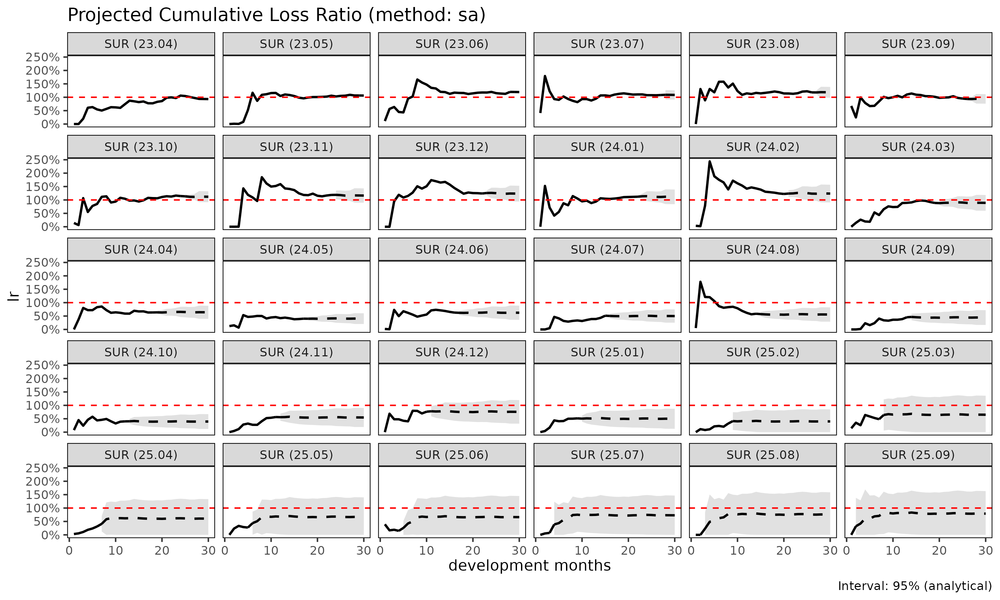
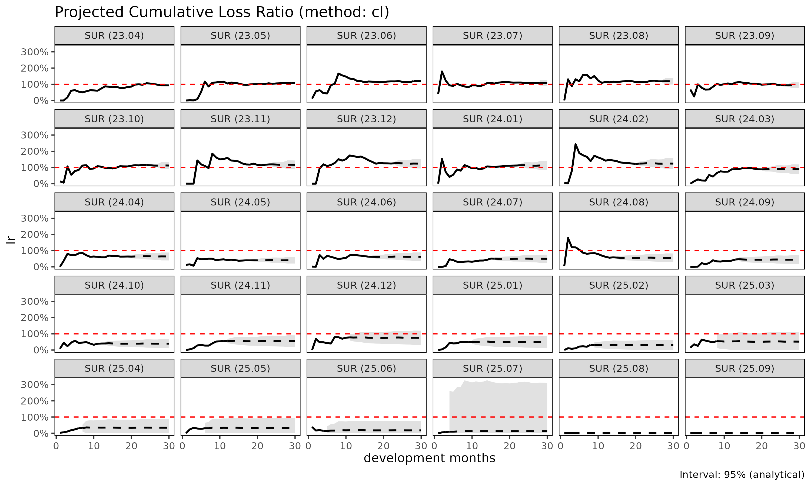

# 손해율 추정 방법론: SA, ED, CL

> 영어 원본 보기: [Loss-ratio projection methods: SA, ED,
> CL](https://seokhoonj.github.io/lossratio/ko/loss-ratio-methods.md)

[`fit_lr()`](https://seokhoonj.github.io/lossratio/ko/reference/fit_lr.md)
은 `Triangle` 객체로부터 코호트별 누적 손해율을 추정한다. 세 가지 방법이
제공되며, 본 vignette 은 각 방법의 trade-off 를 설명한다.

## 표기

코호트 $`i`$, dev $`k`$ 에 대하여:

- $`C^L_{i,k}`$ — 누적 손해액
- $`C^P_{i,k}`$ — 누적 위험보험료 (익스포저)
- $`f_k = C^L_{k+1} / C^L_k`$ — 연속 발달비(age-to-age, chain ladder)
  계수
- $`g_k = \Delta C^L_k / C^P_k`$ — 노출 기반(exposure-driven, ED)
  intensity
- 성숙점(maturity point) $`m_g`$ — 그룹 $`g`$ 에서 $`f_k`$ 가 안정화되는
  dev (CV / RSE 임계값으로 탐지)

## 방법 1: 단계 적응적(stage-adaptive, SA) (`"sa"`, 기본값)

기본 방법은 $`f_k`$ 가 초반에는 변동성이 크고 후반에는 안정적이라는
사실, 그리고 $`g_k`$ 는 그 반대로 움직인다는 사실을 활용한다. SA 는
성숙점에서 추정량을 전환한다:

``` math
\hat{C}^L_{i,k+1} \;=\;
\begin{cases}
\hat{C}^L_{i,k} + g_k \cdot C^P_{i,k} & k < m_g \quad \text{(성숙 이전: ED)} \\
f_k \cdot \hat{C}^L_{i,k}              & k \ge m_g \quad \text{(성숙 이후: CL)}
\end{cases}
```

특성:

- **성숙 이전**: 손해 추정치를 보험료 규모에 anchor 한다. 초기 $`f_k`$
  가 노이즈가 있을 때 고전적 CL 이 겪는 변동적 link 폭발을 회피한다.
- **성숙 이후**: 코호트 자체의 관측 수준을 보존한다. pure ED 가 꼬리에서
  모든 코호트를 평균으로 끌어당기는 문제를 회피한다.

사용 시점:

- 발달이 여러 해에 걸치는 long-tail 상품.
- 최근 코호트(미성숙 데이터)와 오래된 코호트(성숙)가 혼재하는 경우.
- 성숙 이전·이후의 구조적 차이가 있는 건강보험 코호트 (예: 면책기간
  전환).

``` r

library(lossratio)
data(experience)
exp <- as_experience(experience)
tri <- build_triangle(exp[cv_nm == "SUR"], group_var = cv_nm)

lr_sa <- fit_lr(tri, method = "sa")        # 기본값
plot(lr_sa, type = "lr")
```



``` r

summary(lr_sa)
#>      cv_nm     cohort     latest   ultimate    reserve exposure_ult  lr_latest
#>     <char>     <Date>      <num>      <num>      <num>        <num>      <num>
#>  1:    SUR 2023-04-01 2442597048 2442597048          0   2621263715 0.93183949
#>  2:    SUR 2023-05-01 2423543638 2600462324  176918686   2447179856 1.06560740
#>  3:    SUR 2023-06-01 3211045460 3634951626  423906166   3045660787 1.19909110
#>  4:    SUR 2023-07-01 2552396709 3106052713  553656004   2859002910 1.08237572
#>  5:    SUR 2023-08-01 2472997706 3159902325  686904619   2669412392 1.18159391
#>  6:    SUR 2023-09-01 2014222417 2712676349  698453932   2893769135 0.95080886
#>  7:    SUR 2023-10-01 2422172254 3464336723 1042164469   3094707504 1.14505029
#>  8:    SUR 2023-11-01 2157147612 3350616805 1193469193   2879458974 1.18696133
#>  9:    SUR 2023-12-01 2062030017 3510350121 1448320104   2843155654 1.24103978
#> 10:    SUR 2024-01-01 1803809914 3316423447 1512613533   2974323108 1.11558443
#> 11:    SUR 2024-02-01 1627213157 3293904272 1666691115   2661467254 1.22363541
#> 12:    SUR 2024-03-01 1006624213 2212909862 1206285649   2483209943 0.88837590
#> 13:    SUR 2024-04-01  707083237 1712964993 1005881756   2676093339 0.63405399
#> 14:    SUR 2024-05-01  398857325 1069653556  670796231   2650183003 0.40197017
#> 15:    SUR 2024-06-01  558855276 1654603718 1095748442   2653104690 0.62898298
#> 16:    SUR 2024-07-01  423131371 1378042306  954910935   2758730502 0.51295338
#> 17:    SUR 2024-08-01  457705980 1642689597 1184983617   2949332087 0.58596112
#> 18:    SUR 2024-09-01  278007651 1166380310  888372659   2628969714 0.45517867
#> 19:    SUR 2024-10-01  214811381 1027414214  812602833   2600171974 0.40289870
#> 20:    SUR 2024-11-01  251273971 1400108561 1148834590   2558267999 0.56379157
#> 21:    SUR 2024-12-01  322678179 2168358632 1845680453   2865484259 0.76337614
#> 22:    SUR 2025-01-01  179253475 1403314539 1224061064   2811568885 0.51475151
#> 23:    SUR 2025-02-01  100816665 1246593088 1145776423   3116396285 0.32204866
#> 24:    SUR 2025-03-01  111279087 1859420120 1748141033   2859035735 0.48317257
#> 25:    SUR 2025-04-01   55914454 1706798346 1650883892   2820900062 0.31249884
#> 26:    SUR 2025-05-01   41578391 2113613662 2072035271   3170694661 0.27248380
#> 27:    SUR 2025-06-01   14997314 1815491007 1800493693   2746665555 0.14942419
#> 28:    SUR 2025-07-01    6232031 2701876633 2695644602   3705336068 0.07318336
#> 29:    SUR 2025-08-01          0 2250325450 2250325450   2969197182 0.00000000
#> 30:    SUR 2025-09-01          0 2371913171 2371913171   2995415555 0.00000000
#>      cv_nm     cohort     latest   ultimate    reserve exposure_ult  lr_latest
#>     <char>     <Date>      <num>      <num>      <num>        <num>      <num>
#>        lr_ult maturity_from      proc_se    param_se           se           cv
#>         <num>         <num>        <num>       <num>        <num>        <num>
#>  1: 0.9318395             9          0.0         0.0          0.0 0.0000000000
#>  2: 1.0626364             9     270023.8    278555.7     387951.2 0.0001491855
#>  3: 1.1934854             9     461673.6    481436.4     667025.8 0.0001835034
#>  4: 1.0864112             9  217960839.6 130390124.6  253985259.7 0.0817710719
#>  5: 1.1837445             9  235800277.9 139803599.9  274129198.7 0.0867524279
#>  6: 0.9374198             9  230925350.1 124174149.3  262194082.1 0.0966551289
#>  7: 1.1194391             9  276909538.1 163800531.1  321728932.9 0.0928688400
#>  8: 1.1636272             9  347646646.1 180286627.2  391613915.1 0.1168781564
#>  9: 1.2346669             9  379204803.4 195291838.6  426538609.2 0.1215088508
#> 10: 1.1150179             9  371903391.7 185291186.8  415505663.8 0.1252872772
#> 11: 1.2376272             9  406210629.2 191768888.6  449201938.9 0.1363737078
#> 12: 0.8911489             9  348109439.7 131371151.5  372073328.0 0.1681375886
#> 13: 0.6400991             9  316686848.8 103164315.5  333066714.3 0.1944387163
#> 14: 0.4036150             9  262671178.8  65778222.8  270782057.7 0.2531493082
#> 15: 0.6236481             9  342800640.3 103939643.9  358211848.8 0.2164940432
#> 16: 0.4995205             9  336548946.6  89486750.7  348242834.9 0.2527083771
#> 17: 0.5569700             9  387322897.0 109347246.8  402462230.4 0.2450019962
#> 18: 0.4436644             9  360265104.1  81491440.0  369366755.4 0.3166778043
#> 19: 0.3951332             9  358796880.9  74015042.1  366351509.1 0.3565762514
#> 20: 0.5472877             9  451728990.6 105050619.0  463783045.7 0.3312479179
#> 21: 0.7567163             9  619598522.3 171876903.1  642996110.9 0.2965358689
#> 22: 0.4991215             9  523388251.8 114399770.9  535744873.7 0.3817710561
#> 23: 0.4000111             9  701160983.1 151966055.9  717440176.1 0.5755207396
#> 24: 0.6503662             9 1008915827.7 229980336.9 1034795681.6 0.5565152653
#> 25: 0.6050545             9 1022367650.8 226433230.3 1047142598.3 0.6135127800
#> 26: 0.6666090             9 1151829299.7 274237738.8 1184025790.7 0.5601902618
#> 27: 0.6609800             9 1079112766.9 238225282.2 1105095312.1 0.6087032698
#> 28: 0.7291853             9 1349660358.1 349060403.8 1394068236.4 0.5159629494
#> 29: 0.7578902             9 1225790727.8 285878838.0 1258685671.0 0.5593349490
#> 30: 0.7918478             9 1250626904.3 295553950.3 1285075792.0 0.5417887162
#>        lr_ult maturity_from      proc_se    param_se           se           cv
#>         <num>         <num>        <num>       <num>        <num>        <num>
#>            se_lr        cv_lr  ci_lower  ci_upper
#>            <num>        <num>     <num>     <num>
#>  1: 0.0000000000 0.0000000000 0.9318395 0.9318395
#>  2: 0.0001585299 0.0001491855 1.0623257 1.0629471
#>  3: 0.0002190086 0.0001835034 1.1930561 1.1939146
#>  4: 0.0888370064 0.0817710719 0.9122938 1.2605285
#>  5: 0.1026927123 0.0867524279 0.9824705 1.3850186
#>  6: 0.0906064271 0.0966551289 0.7598344 1.1150051
#>  7: 0.1039610149 0.0928688400 0.9156793 1.3231990
#>  8: 0.1360026028 0.1168781564 0.8970670 1.4301874
#>  9: 0.1500229537 0.1215088508 0.9406273 1.5287065
#> 10: 0.1396975543 0.1252872772 0.8412157 1.3888201
#> 11: 0.1687798105 0.1363737078 0.9068249 1.5684296
#> 12: 0.1498356307 0.1681375886 0.5974765 1.1848214
#> 13: 0.1244600513 0.1944387163 0.3961619 0.8840363
#> 14: 0.1021748526 0.2531493082 0.2033559 0.6038740
#> 15: 0.1350161002 0.2164940432 0.3590214 0.8882748
#> 16: 0.1262330027 0.2527083771 0.2521083 0.7469326
#> 17: 0.1364587705 0.2450019962 0.2895158 0.8244243
#> 18: 0.1404986727 0.3166778043 0.1682921 0.7190368
#> 19: 0.1408951072 0.3565762514 0.1189838 0.6712825
#> 20: 0.1812879049 0.3312479179 0.1919699 0.9026054
#> 21: 0.2243935241 0.2965358689 0.3169131 1.1965195
#> 22: 0.1905501503 0.3817710561 0.1256501 0.8725930
#> 23: 0.2302146808 0.5755207396 0.0000000 0.8512236
#> 24: 0.3619387016 0.5565152653 0.0000000 1.3597530
#> 25: 0.3712086835 0.6135127800 0.0000000 1.3326102
#> 26: 0.3734278817 0.5601902618 0.0000000 1.3985142
#> 27: 0.4023406891 0.6087032698 0.0000000 1.4495533
#> 28: 0.3762326036 0.5159629494 0.0000000 1.4665877
#> 29: 0.4239144772 0.5593349490 0.0000000 1.5887473
#> 30: 0.4290141947 0.5417887162 0.0000000 1.6327002
#>            se_lr        cv_lr  ci_lower  ci_upper
#>            <num>        <num>     <num>     <num>
```

## 방법 2: 노출 기반(exposure-driven, ED) (`"ed"`)

모든 미래 증분에 ED 를 적용한다:

``` math
\hat{C}^L_{i,k+1} = \hat{C}^L_{i,k} + g_k \cdot C^P_{i,k}
```

특성:

- 보험료 규모가 전체 발달 구간에 걸쳐 정보를 가질 때 안정적이다.
- 코호트 고유의 수준 신호를 잃는다 — 관측 손해가 더 높은 코호트도 그룹
  단위 $`g_k`$ 로 수렴한다.

사용 시점:

- chain ladder 가 이점을 주지 않는 short-tail 상품.
- 모든 link 에서 age-to-age 계수가 신뢰할 수 없는 희소 데이터.
- SA / CL 과 비교하여 sanity check 용도.

``` r

lr_ed <- fit_lr(tri, method = "ed")
plot(lr_ed, type = "lr")
```


## 방법 3: 고전적 chain ladder (`"cl"`)

고전적 Mack 모형:

``` math
\hat{C}^L_{i,k+1} = f_k \cdot \hat{C}^L_{i,k}
```

특성:

- 표준적인 적립 실무. 손해 예측에 한해서는
  `fit_cl(tri, value_var = "closs")` 과 동등하지만,
  [`fit_lr()`](https://seokhoonj.github.io/lossratio/ko/reference/fit_lr.md)
  은 추가로 `crp` 에 대한 CL 로 익스포저를 전방 추정하고 delta method 로
  손해율 불확실성을 계산한다.
- 초기 $`f_k`$ 가 노이즈가 있을 때 변동적이다 — 작은 분모가 link 오차를
  증폭한다.

사용 시점:

- age-to-age 계수가 전체 발달 구간에서 안정적인 성숙·안정 포트폴리오.
- 규제 당국이 문서화 목적으로 고전적 Mack 형식을 요구하는 적립 작업.

``` r

lr_cl <- fit_lr(tri, method = "cl")
plot(lr_cl, type = "lr")
```



## 비교

``` r

lrs <- list(
  sa = fit_lr(tri, method = "sa"),
  ed = fit_lr(tri, method = "ed"),
  cl = fit_lr(tri, method = "cl")
)

# 코호트 단위 요약
summary(lrs$sa)$ultimate
#>  [1] 2442597048 2600462324 3634951626 3106052713 3159902325 2712676349
#>  [7] 3464336723 3350616805 3510350121 3316423447 3293904272 2212909862
#> [13] 1712964993 1069653556 1654603718 1378042306 1642689597 1166380310
#> [19] 1027414214 1400108561 2168358632 1403314539 1246593088 1859420120
#> [25] 1706798346 2113613662 1815491007 2701876633 2250325450 2371913171
summary(lrs$ed)$ultimate
#>  [1] 2442597048 2577879721 3551186951 3059824767 3058099572 2775733411
#>  [7] 3380150639 3219527669 3285011777 3226229783 3046667388 2439253173
#> [13] 2374720719 2163237459 2420419526 2443351731 2698334323 2374632179
#> [19] 2357924851 2427205865 2836437900 2696982544 2949933197 2797749588
#> [25] 2744104251 3109306345 2691512006 3663214084 2946330551 2985339919
summary(lrs$cl)$ultimate
#>  [1] 2442597048 2600462324 3634951626 3106052713 3159902325 2712676349
#>  [7] 3464336723 3350616805 3510350121 3316423447 3293904272 2212909862
#> [13] 1712964993 1069653556 1654603718 1378042306 1642689597 1166380310
#> [19] 1027414214 1400108561 2168358632 1403314539  954214626 1488227953
#> [25]  958667529 1041506115  484991215  436725855          0          0
```

## 분산과 신뢰구간

[`fit_lr()`](https://seokhoonj.github.io/lossratio/ko/reference/fit_lr.md)
은 delta method 로 해석적 표준오차를 산출한다. delta method 변형은 두
가지이다:

- `delta_method = "simple"` (기본값) — 익스포저를 고정으로 취급,
  $`\mathrm{SE}(L/E) \approx \mathrm{SE}(L)/E`$.
- `delta_method = "full"` — 익스포저 불확실성과 손해-익스포저 상관계수
  `rho` 를 반영한다:

``` math
\mathrm{Var}(L/E) \approx \frac{\mathrm{Var}(L)}{E^2}
  + \frac{L^2 \mathrm{Var}(E)}{E^4}
  - \frac{2 \rho L \mathrm{SE}(L) \mathrm{SE}(E)}{E^3}
```

부트스트랩 구간도 사용 가능하다:

``` r

lr_boot <- fit_lr(tri, method = "sa", bootstrap = TRUE, B = 1000, seed = 1)
summary(lr_boot)
#>      cv_nm     cohort     latest   ultimate    reserve exposure_ult  lr_latest
#>     <char>     <Date>      <num>      <num>      <num>        <num>      <num>
#>  1:    SUR 2023-04-01 2442597048 2442597048          0   2621263715 0.93183949
#>  2:    SUR 2023-05-01 2423543638 2600462324  176918686   2447179856 1.06560740
#>  3:    SUR 2023-06-01 3211045460 3634951626  423906166   3045660787 1.19909110
#>  4:    SUR 2023-07-01 2552396709 3106052713  553656004   2859002910 1.08237572
#>  5:    SUR 2023-08-01 2472997706 3159902325  686904619   2669412392 1.18159391
#>  6:    SUR 2023-09-01 2014222417 2712676349  698453932   2893769135 0.95080886
#>  7:    SUR 2023-10-01 2422172254 3464336723 1042164469   3094707504 1.14505029
#>  8:    SUR 2023-11-01 2157147612 3350616805 1193469193   2879458974 1.18696133
#>  9:    SUR 2023-12-01 2062030017 3510350121 1448320104   2843155654 1.24103978
#> 10:    SUR 2024-01-01 1803809914 3316423447 1512613533   2974323108 1.11558443
#> 11:    SUR 2024-02-01 1627213157 3293904272 1666691115   2661467254 1.22363541
#> 12:    SUR 2024-03-01 1006624213 2212909862 1206285649   2483209943 0.88837590
#> 13:    SUR 2024-04-01  707083237 1712964993 1005881756   2676093339 0.63405399
#> 14:    SUR 2024-05-01  398857325 1069653556  670796231   2650183003 0.40197017
#> 15:    SUR 2024-06-01  558855276 1654603718 1095748442   2653104690 0.62898298
#> 16:    SUR 2024-07-01  423131371 1378042306  954910935   2758730502 0.51295338
#> 17:    SUR 2024-08-01  457705980 1642689597 1184983617   2949332087 0.58596112
#> 18:    SUR 2024-09-01  278007651 1166380310  888372659   2628969714 0.45517867
#> 19:    SUR 2024-10-01  214811381 1027414214  812602833   2600171974 0.40289870
#> 20:    SUR 2024-11-01  251273971 1400108561 1148834590   2558267999 0.56379157
#> 21:    SUR 2024-12-01  322678179 2168358632 1845680453   2865484259 0.76337614
#> 22:    SUR 2025-01-01  179253475 1403314539 1224061064   2811568885 0.51475151
#> 23:    SUR 2025-02-01  100816665 1246593088 1145776423   3116396285 0.32204866
#> 24:    SUR 2025-03-01  111279087 1859420120 1748141033   2859035735 0.48317257
#> 25:    SUR 2025-04-01   55914454 1706798346 1650883892   2820900062 0.31249884
#> 26:    SUR 2025-05-01   41578391 2113613662 2072035271   3170694661 0.27248380
#> 27:    SUR 2025-06-01   14997314 1815491007 1800493693   2746665555 0.14942419
#> 28:    SUR 2025-07-01    6232031 2701876633 2695644602   3705336068 0.07318336
#> 29:    SUR 2025-08-01          0 2250325450 2250325450   2969197182 0.00000000
#> 30:    SUR 2025-09-01          0 2371913171 2371913171   2995415555 0.00000000
#>      cv_nm     cohort     latest   ultimate    reserve exposure_ult  lr_latest
#>     <char>     <Date>      <num>      <num>      <num>        <num>      <num>
#>        lr_ult maturity_from      proc_se    param_se           se           cv
#>         <num>         <num>        <num>       <num>        <num>        <num>
#>  1: 0.9318395             9          0.0         0.0          0.0 0.0000000000
#>  2: 1.0626364             9     270023.8    278555.7     387951.2 0.0001491855
#>  3: 1.1934854             9     461673.6    481436.4     667025.8 0.0001835034
#>  4: 1.0864112             9  217960839.6 130390124.6  253985259.7 0.0817710719
#>  5: 1.1837445             9  235800277.9 139803599.9  274129198.7 0.0867524279
#>  6: 0.9374198             9  230925350.1 124174149.3  262194082.1 0.0966551289
#>  7: 1.1194391             9  276909538.1 163800531.1  321728932.9 0.0928688400
#>  8: 1.1636272             9  347646646.1 180286627.2  391613915.1 0.1168781564
#>  9: 1.2346669             9  379204803.4 195291838.6  426538609.2 0.1215088508
#> 10: 1.1150179             9  371903391.7 185291186.8  415505663.8 0.1252872772
#> 11: 1.2376272             9  406210629.2 191768888.6  449201938.9 0.1363737078
#> 12: 0.8911489             9  348109439.7 131371151.5  372073328.0 0.1681375886
#> 13: 0.6400991             9  316686848.8 103164315.5  333066714.3 0.1944387163
#> 14: 0.4036150             9  262671178.8  65778222.8  270782057.7 0.2531493082
#> 15: 0.6236481             9  342800640.3 103939643.9  358211848.8 0.2164940432
#> 16: 0.4995205             9  336548946.6  89486750.7  348242834.9 0.2527083771
#> 17: 0.5569700             9  387322897.0 109347246.8  402462230.4 0.2450019962
#> 18: 0.4436644             9  360265104.1  81491440.0  369366755.4 0.3166778043
#> 19: 0.3951332             9  358796880.9  74015042.1  366351509.1 0.3565762514
#> 20: 0.5472877             9  451728990.6 105050619.0  463783045.7 0.3312479179
#> 21: 0.7567163             9  619598522.3 171876903.1  642996110.9 0.2965358689
#> 22: 0.4991215             9  523388251.8 114399770.9  535744873.7 0.3817710561
#> 23: 0.4000111             9  701160983.1 151966055.9  717440176.1 0.5755207396
#> 24: 0.6503662             9 1008915827.7 229980336.9 1034795681.6 0.5565152653
#> 25: 0.6050545             9 1022367650.8 226433230.3 1047142598.3 0.6135127800
#> 26: 0.6666090             9 1151829299.7 274237738.8 1184025790.7 0.5601902618
#> 27: 0.6609800             9 1079112766.9 238225282.2 1105095312.1 0.6087032698
#> 28: 0.7291853             9 1349660358.1 349060403.8 1394068236.4 0.5159629494
#> 29: 0.7578902             9 1225790727.8 285878838.0 1258685671.0 0.5593349490
#> 30: 0.7918478             9 1250626904.3 295553950.3 1285075792.0 0.5417887162
#>        lr_ult maturity_from      proc_se    param_se           se           cv
#>         <num>         <num>        <num>       <num>        <num>        <num>
#>            se_lr        cv_lr   ci_lower  ci_upper
#>            <num>        <num>      <num>     <num>
#>  1: 0.0000000000 0.0000000000 0.93183949 0.9318395
#>  2: 0.0001585299 0.0001491855 1.06231740 1.0629663
#>  3: 0.0002190086 0.0001835034 1.19309074 1.1938960
#>  4: 0.0888370064 0.0817710719 0.89969393 1.2541737
#>  5: 0.1026927123 0.0867524279 0.97818455 1.3879857
#>  6: 0.0906064271 0.0966551289 0.76626286 1.1267473
#>  7: 0.1039610149 0.0928688400 0.91331875 1.3156194
#>  8: 0.1360026028 0.1168781564 0.90714734 1.4490470
#>  9: 0.1500229537 0.1215088508 0.98027936 1.5409842
#> 10: 0.1396975543 0.1252872772 0.84691340 1.4123250
#> 11: 0.1687798105 0.1363737078 0.92601861 1.5489912
#> 12: 0.1498356307 0.1681375886 0.61752968 1.2146931
#> 13: 0.1244600513 0.1944387163 0.41821930 0.8831612
#> 14: 0.1021748526 0.2531493082 0.21972719 0.6248022
#> 15: 0.1350161002 0.2164940432 0.37829007 0.8920031
#> 16: 0.1262330027 0.2527083771 0.28234007 0.7789597
#> 17: 0.1364587705 0.2450019962 0.29847464 0.8534440
#> 18: 0.1404986727 0.3166778043 0.19779539 0.7336469
#> 19: 0.1408951072 0.3565762514 0.13578428 0.6987881
#> 20: 0.1812879049 0.3312479179 0.24172873 0.9484988
#> 21: 0.2243935241 0.2965358689 0.38776384 1.2553205
#> 22: 0.1905501503 0.3817710561 0.17446276 0.8839768
#> 23: 0.2302146808 0.5755207396 0.03859163 0.9079461
#> 24: 0.3619387016 0.5565152653 0.03530500 1.4511574
#> 25: 0.3712086835 0.6135127800 0.00000000 1.4196067
#> 26: 0.3734278817 0.5601902618 0.02557286 1.5128473
#> 27: 0.4023406891 0.6087032698 0.00000000 1.5760689
#> 28: 0.3762326036 0.5159629494 0.11075059 1.5787469
#> 29: 0.4239144772 0.5593349490 0.00000000 1.6643254
#> 30: 0.4290141947 0.5417887162 0.05281718 1.7271721
#>            se_lr        cv_lr   ci_lower  ci_upper
#>            <num>        <num>      <num>     <num>
```

## 방법 선택

SA 는 성숙점 이전엔 ED, 이후엔 CL 로 자연 전환하는 결합이다. 따라서
일반적으로 `"sa"` 가 기본값이고, `"cl"` 과 `"ed"` 는 SA 의 한쪽 영역이
무의미해지는 특수 케이스일 때만 선택한다.

    기본은 "sa" — 성숙점 이전엔 ED, 이후엔 CL 로 자연 전환.

    특수 케이스로만 "cl" 또는 "ed":
      ├── 모든 코호트가 이미 성숙점 이후
      │     → "cl"  (ED 영역이 비어있어 SA = CL)
      └── 손해 전개가 전 기간 불안정하고 익스포저(rp) 가 더 신뢰할 만한 신호
            → "ed"  (CL 영역도 노출 기반이 적절)

실무: **`"sa"` 로 시작하라** (기본값). 이후 민감도 점검을 위해 `"cl"` 과
`"ed"` 를 함께 실행한다. 셋이 모두 일치하면 추정은 견고하다. 결과가
갈라지면 성숙점 탐지와 기저 ata 계수를 점검한다.
