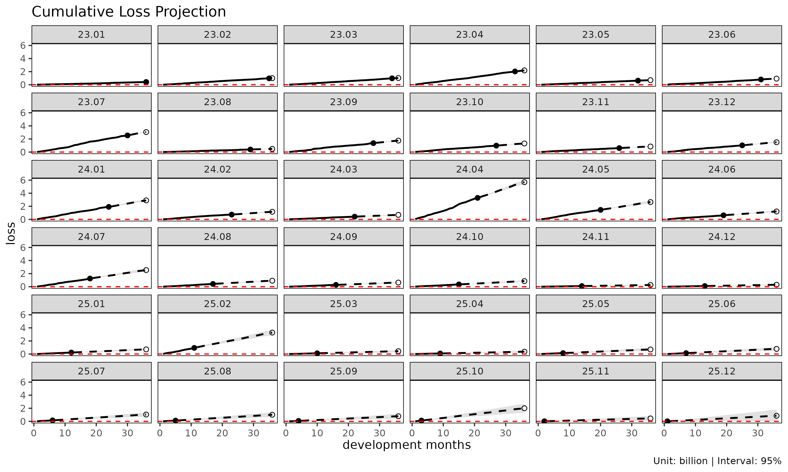
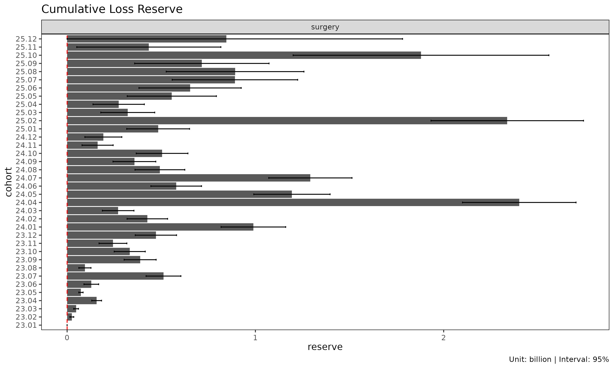

# 예측 방법론

> 영어 원본 보기: [Projection
> methods](https://seokhoonj.github.io/lossratio/ko/projection.md)

이 문서는 lossratio 의 다섯 가지 예측 방법 — 노출 기반(exposure-driven,
ED), 체인 래더(chain ladder, CL), 단계 적응형(stage-adaptive, SA),
Bornhuetter-Ferguson(BF), Cape Cod(CC) — 을 깊이 있게 다룬다. 빠른 시작
튜토리얼이 각 적합 함수를 *어떻게* 호출하는지 보여 준다면, 본 문서는 각
방법이 *왜* 존재하며 *어떤 가정* 위에 서 있고 *언제* 한 방법이 다른
방법보다 나은지를 설명한다. 대상 독자는 장기 건강보험 손해율을 다루는
실무자다.

## 1. 왜 전용 예측 도구가 필요한가

장기건강보험 손해율은 매일 다루는 task 다 — 코호트별 손해율 패턴 분석,
미래 손해율 ult 예측, 실적이 예상과 얼마나 일치하는지 모니터링. 그러나
기존 reserving 도구의 방법론적 기반은 대부분 손해보험(P&C) 영역에서
발전했고, 장기건강보험의 다음과 같은 고유 특성은 직접 반영되지 않는다.

- **분모효과(denominator effect)와 관성(inertia)** — 누적 손해율 자체가
  경과 기간이 누적될수록 분모가 자동으로 자라면서 신호가 감쇠된다.
- **다회성 보험금** — 입원·수술·통원 등은 한 피보험자가 여러 차례
  보험금을 받는다. 한 코호트의 ultimate frequency 가 1 을 초과할 수
  있다.
- **위험보험료 분리** — 한국의 장기보험료는 위험보험료 + 저축보험료 +
  부가보험료의 합이다. 손해율의 진짜 분모는 위험보험료만이다.
- **평탄화 보험료** — 비갱신형 상품은 가입 시 평균값으로 산출된 level
  premium 을 전 기간 동일 부과한다. 따라서 charged premium 자체는
  premium 가 아니다. 실제 period risk premium 은 위험률(t) x 가입금액 x
  유지율(t) 로 외부 산출 후 입력해야 한다.
- **체제 변화(regime change)** — 약관 개정·요율 조정·채널 mix 변화·인수
  기준 변경 등이 코호트 단위로 손해율 양상을 바꾼다.

lossratio 는 P&C 영역에서 발전한 reserving 방법론 — Mack 1993 chain
ladder, Bornhuetter-Ferguson 1972, Cape Cod (Stanard 1985),
Bühlmann-Straub 1970 credibility, Sherman 1984 의 tail 외삽 — 을 위
도메인 issue 에 맞춰 재구성한 framework 다. 학술적 lineage 를 존중하되,
장기건강보험 실무에서 바로 쓸 수 있는 도구가 목적이다.

## 2. 방법론의 lineage

장기 손해율 추정의 방법론적 뿌리는 다음의 P&C reserving 흐름이다.

    1967  Bühlmann credibility           -- experience rating 의 수학적 형식화
    1970  Bühlmann-Straub                -- premium-varying credibility
                                           (volume-weighted estimator)
    1972  Bornhuetter-Ferguson           -- prior + observed loss 결합
    1984  Sherman                        -- chain ladder tail factor 외삽
    1985  Stanard (Cape Cod)             -- Bühlmann-Straub 의 reserving 응용
    1993  Mack                           -- chain ladder 의 distribution-free MSE

이후 모든 내용을 끌고 가는 핵심 idea 두 가지:

- **Chain ladder (Mack 1993)** — 누적 손해 $`C_k`$ 의 Markov 곱셈
  recursion: $`C_{k+1} = f_k \cdot C_k`$ where
  $`f_k = \sum_i C_{i,k+1} / \sum_i C_{i,k}`$.
- **Cape Cod / Bühlmann-Straub** — 손해를 premium(= volume)으로
  anchoring. $`\widehat{ELR} = \sum_i L_i / \sum_i \pi_i`$ 의 single
  ratio 로 ult 산출.

장기건강보험에 적용 시 둘 다 부분적으로 작동하지만, 모두 cracks 가 있다.

| 도메인 issue | Chain ladder | Cape Cod |
|----|----|----|
| 분모효과 / 관성 | 초기 dev 의 $`f_k`$ 가 과대 변동 ($`C_k`$ 작아서) | ELR 의 cohort 별 변동 무시 |
| 평탄화 보험료 | 손해만 사용해 우회 가능 (발생률 변화엔 약함) | $`\pi`$ 가 flat 이면 진짜 premium 의 dev 변화 흡수 |
| 다회성 보험금 | 사용 가능 (frequency x severity 무관) | 사용 가능 (volume measure 만 필요) |
| 발전하는 위험보험료 | 무관 | single $`\pi`$ 가정 — triangle 형태 premium 미지원 |
| 코호트 단위 체제 변화 | Mack 가정 (no calendar-year effect) 위반 | cohort heterogeneity 무시 |

chain ladder 는 초기 dev 에 약하고, Cape Cod 는 premium 의 발전 양상을
처리하지 못한다. 둘 다 각자 한 paradigm 의 한계를 갖는다 — 패키지가
하나가 아니라 다섯 가지 방법을 제공하는 이유가 바로 이것이다.

## 3. 핵심 framework: loss / premium / ratio

lossratio 의 모든 추정은 다음 세 양 위에서 이루어진다.

| 양 | 의미 | 컬럼 이름 (Triangle) |
|----|----|----|
| **loss** | 발생 손해의 누적량 | `loss`, `incr_loss` |
| **premium** | 위험보험료 (장기 health 는 누적 위험보험료) | `premium`, `incr_premium` |
| **ratio** | 손해율 (cumulative loss / cumulative premium) | `ratio`, `incr_ratio` |

세 양 모두 cohort x dev grid 위에서 발전하는 관측치(stochastic
observable)다. premium 는 고정된 underwriting volume 이 아니라 위험률 x
가입금액 x 유지율의 dev 따라 변동하는 양이다 — Mack 1993 의 volume
measure, Bühlmann-Straub 1970 의 natural weight 와 같은 의미다.

코호트 $`i`$, dev $`k`$ 에 대하여 예측 방법들이 쓰는 표기는 다음과 같다.

- $`C^L_{i,k}`$ — 누적 손해액
- $`C^P_{i,k}`$ — 누적 위험보험료
- $`f_k = C^L_{k+1} / C^L_k`$ — ATA 인자(age-to-age factor)
- $`g_k = \Delta C^L_k / C^P_k`$ — 노출 기반(exposure-driven, ED) 강도
- 성숙점(maturity point) $`k^*`$ — 그룹에서 $`f_k`$ 가 안정화되는 dev
  (CV / RSE 임계값으로 탐지)

이하 모든 예시는 간결성을 위해 `surgery` 그룹만 사용한다 — 모든 절차는
다중 그룹 입력에도 그대로 일반화된다.

``` r

library(lossratio)
data(experience)
tri <- as_triangle(
  experience[coverage == "surgery"],
  groups   = "coverage",
  cohort   = "uy_m",
  calendar = "cy_m",
  loss     = "incr_loss",
  premium  = "incr_premium"
)
```

## 4. 직접 추정: ED, CL, SA

직접 추정 세 method 는 데이터로부터 인자를 추정해 전방으로 연결한다.
순서 `ed` -\> `cl` -\> `sa` 가 방법론적 진화를 그대로 표현한다 —
primitive(ED) -\> classical(CL) -\> composition(SA).

| Method | 점추정 식 | 분산 helper | 도메인 특성 |
|----|----|----|----|
| `"ed"` (default) | $`\Delta L_{k+1} = g_k \cdot P_k`$ (additive) | `.ed_g_var` (B-S 1970) | 초기 dev 의 ATA 변동성에 robust |
| `"cl"` | $`L_{k+1} = f_k \cdot L_k`$ (multiplicative) | `.mack_f_var` (Mack 1993) | 후기 dev factor 안정화 후 자연 |
| `"sa"` | 성숙점 $`k^*`$ 이전 ED, 이후 CL | 두 helper 의 합성 | ED 와 CL 의 stage-adaptive 합성 |

### 4.1 노출 기반 (`"ed"`, default)

ED 는 모든 미래 증분을 premium(위험보험료)을 분모로 하여 예측한다.

``` math
\hat{C}^L_{i,k+1} = \hat{C}^L_{i,k} + g_k \cdot C^P_{i,k}
```

ED 가 기본값인 이유는 unconditional safe baseline 이기 때문이다 —
성숙점이나 regime 검출에 의존하지 않으며, 초기 dev 의 ATA 인자 변동에도
강건하다. 초기 dev 의 작은 $`C_k`$ 가 분모에 들어가지 않으므로, 초기
$`f_k`$ 가 일으키는 추정량 과대 변동에 영향받지 않는다.

대가는 코호트 동질성 가정이다. pooled intensity $`g_k`$ 는 코호트들이
단위 보험료당 손해 수준에서 대체로 동질적이라 가정한다. 코호트-레벨
drift 가 있으면 추정이 pooled 평균으로 편향되어 post-change 코호트를
over-project 할 수 있다 — 명시적 필터는 `regime` 인자다.

**언제 사용:** 코호트 동질성이 그럴듯한 baseline 으로; chain ladder 가
이점이 없는 short-tail 상품; ATA 인자가 전 link 에서 신뢰할 수 없는
sparse 데이터.

``` r

ratio_ed <- fit_ratio(tri, method = "ed")        # default
plot(ratio_ed, metric = "ratio")
```


``` r

summary(ratio_ed)
#>     coverage     cohort     latest   loss_ult    reserve premium_ult
#>       <char>     <Date>      <num>      <num>      <num>       <num>
#>  1:  surgery 2023-01-01  410248522  410248522          0   274192564
#>  2:  surgery 2023-02-01  976330445 1001304261   24973816   665667720
#>  3:  surgery 2023-03-01  978486045 1027365215   48879170   702047332
#>  4:  surgery 2023-04-01 2029909919 2186835972  156926053  1464399410
#>  5:  surgery 2023-05-01  624219436  700124202   75904766   483147255
#>  6:  surgery 2023-06-01  802880717  924502357  121621640   591568799
#>  7:  surgery 2023-07-01 2539141549 3028986426  489844877  1958263736
#>  8:  surgery 2023-08-01  393678329  488454953   94776624   327535560
#>  9:  surgery 2023-09-01 1364052542 1725804921  361752379  1091733892
#> 10:  surgery 2023-10-01  979266043 1308019740  328753697   864204933
#> 11:  surgery 2023-11-01  604685679  876716310  272030631   630311110
#> 12:  surgery 2023-12-01 1026345366 1527010394  500665028  1057060867
#> 13:  surgery 2024-01-01 1912177598 2942802614 1030625016  2009045340
#> 14:  surgery 2024-02-01  733902485 1193629493  459727008   832229795
#> 15:  surgery 2024-03-01  415459873  685046660  269586787   454345985
#> 16:  surgery 2024-04-01 3286053526 5424401591 2138348065  3372494516
#> 17:  surgery 2024-05-01 1451731153 2740753232 1289022079  1899849125
#> 18:  surgery 2024-06-01  629668308 1170293302  540624994   750125230
#> 19:  surgery 2024-07-01 1250954693 3461664518 2210709825  2891548085
#> 20:  surgery 2024-08-01  425346694 1212435170  787088476   976935246
#> 21:  surgery 2024-09-01  278156543  870725770  592569227   703906575
#> 22:  surgery 2024-10-01  352070323 1217843289  865772966   984833529
#> 23:  surgery 2024-11-01   99050501  398006955  298956454   324081360
#> 24:  surgery 2024-12-01  103194013  456590846  353396833   366444614
#> 25:  surgery 2025-01-01  227089025 1064623873  837534848   833732378
#> 26:  surgery 2025-02-01  939163074 4386331021 3447167947  3286151352
#> 27:  surgery 2025-03-01  112828845  727050149  614221304   566316398
#> 28:  surgery 2025-04-01   82472453  616924302  534451849   476819833
#> 29:  surgery 2025-05-01  141214851 1330756277 1189541426  1027051048
#> 30:  surgery 2025-06-01  136406102 1072907077  936500975   783037474
#> 31:  surgery 2025-07-01  149144024 1209357471 1060213447   859730812
#> 32:  surgery 2025-08-01  116327076 1432029264 1315702188  1037192185
#> 33:  surgery 2025-09-01   67465470  865239645  797774175   611257142
#> 34:  surgery 2025-10-01  121626173 1911124852 1789498679  1338462726
#> 35:  surgery 2025-11-01   15716444  828091909  812375465   593147593
#> 36:  surgery 2025-12-01    4825085 1442904476 1438079391  1022559927
#>     coverage     cohort     latest   loss_ult    reserve premium_ult
#>       <char>     <Date>      <num>      <num>      <num>       <num>
#>     ratio_latest ratio_ult maturity_from loss_proc_se loss_param_se
#>            <num>     <num>         <num>        <num>         <num>
#>  1:    1.4962059  1.496206            NA            0             0
#>  2:    1.5107824  1.504210            NA      2934231       4309793
#>  3:    1.4771448  1.463385            NA      3982661       5158162
#>  4:    1.5139132  1.493333            NA      6546789      11609585
#>  5:    1.4543748  1.449091            NA      4547580       3813039
#>  6:    1.5796369  1.562798            NA     17628088       8903464
#>  7:    1.5597190  1.546771            NA     35686361      31442590
#>  8:    1.4945957  1.491304            NA     16152143       5121110
#>  9:    1.6079808  1.580793            NA     37357117      20421919
#> 10:    1.5129472  1.513553            NA     37573001      17215247
#> 11:    1.3298743  1.390926            NA     35161608      12015326
#> 12:    1.3981081  1.444581            NA     53162531      22167720
#> 13:    1.4274951  1.464777            NA     76259904      44384184
#> 14:    1.3793745  1.434255            NA     51529679      18632983
#> 15:    1.4969280  1.507764            NA     41482939      11326747
#> 16:    1.6712898  1.608424            NA    120195326      95592928
#> 17:    1.3770835  1.442616            NA     88447102      46270702
#> 18:    1.5918247  1.560131            NA     66834389      21472291
#> 19:    0.8658750  1.197167            NA    104028932      46251465
#> 20:    0.9236050  1.241060            NA     62896850      16977280
#> 21:    0.8920448  1.236991            NA     56583751      11941938
#> 22:    0.8596968  1.236598            NA     71133708      16328611
#> 23:    0.7871749  1.228108            NA     41388948       5266012
#> 24:    0.7813438  1.246002            NA     48660596       6215769
#> 25:    0.8188282  1.276937            NA     82549103      15683804
#> 26:    0.9377837  1.334793            NA    193613125      74852479
#> 27:    0.7193486  1.283823            NA     71295313      10069046
#> 28:    0.6947510  1.293831            NA     68826316       8438639
#> 29:    0.6203897  1.295706            NA    116537796      18989499
#> 30:    0.8981587  1.370186            NA    137078933      22543675
#> 31:    1.0440457  1.406670            NA    166193829      31402939
#> 32:    0.8100543  1.380679            NA    184425493      33103273
#> 33:    0.9985960  1.415508            NA    180452022      27168526
#> 34:    1.0894657  1.427851            NA    331672128      79057462
#> 35:    0.4765917  1.396098            NA    190733674      20867271
#> 36:    0.1689836  1.411071            NA    464027946      65288155
#>     ratio_latest ratio_ult maturity_from loss_proc_se loss_param_se
#>            <num>     <num>         <num>        <num>         <num>
#>     loss_total_se loss_total_cv    ratio_se    ratio_cv ratio_ci_lo ratio_ci_hi
#>             <num>         <num>       <num>       <num>       <num>       <num>
#>  1:             0   0.000000000 0.000000000 0.000000000   1.4962059    1.496206
#>  2:       5213830   0.005207039 0.007832482 0.005207039   1.4888589    1.519562
#>  3:       6516765   0.006343182 0.009282515 0.006343182   1.4451911    1.481578
#>  4:      13328275   0.006094776 0.009101530 0.006094776   1.4754943    1.511172
#>  5:       5934623   0.008476529 0.012283260 0.008476529   1.4250160    1.473165
#>  6:      19748953   0.021361712 0.033384034 0.021361712   1.4973662    1.628229
#>  7:      47562095   0.015702314 0.024287890 0.015702314   1.4991681    1.594375
#>  8:      16944542   0.034690081 0.051733442 0.034690081   1.3899079    1.592699
#>  9:      42574746   0.024669501 0.038997366 0.024669501   1.5043592    1.657226
#> 10:      41329107   0.031596700 0.047823272 0.031596700   1.4198208    1.607285
#> 11:      37157863   0.042382995 0.058951622 0.042382995   1.2753833    1.506469
#> 12:      57599154   0.037720211 0.054489912 0.037720211   1.3377831    1.551380
#> 13:      88235644   0.029983541 0.043919190 0.029983541   1.3786966    1.550857
#> 14:      54795036   0.045906235 0.065841233 0.045906235   1.3052083    1.563301
#> 15:      43001505   0.062771643 0.094644843 0.062771643   1.3222638    1.693265
#> 16:     153573839   0.028311665 0.045537165 0.028311665   1.5191729    1.697675
#> 17:      99819176   0.036420344 0.052540580 0.036420344   1.3396386    1.545594
#> 18:      70198966   0.059984079 0.093582996 0.059984079   1.3767113    1.743550
#> 19:     113847340   0.032888034 0.039372453 0.032888034   1.1199979    1.274335
#> 20:      65147845   0.053733055 0.066685940 0.053733055   1.1103579    1.371762
#> 21:      57830189   0.066416077 0.082156058 0.066416077   1.0759676    1.398013
#> 22:      72983751   0.059928689 0.074107704 0.059928689   1.0913497    1.381847
#> 23:      41722607   0.104828839 0.128741150 0.104828839   0.9757801    1.480436
#> 24:      49055982   0.107439697 0.133870114 0.107439697   0.9836217    1.508383
#> 25:      84025806   0.078925344 0.100782707 0.078925344   1.0794067    1.474468
#> 26:     207578746   0.047324004 0.063167737 0.047324004   1.2109863    1.458599
#> 27:      72002829   0.099034199 0.127142405 0.099034199   1.0346287    1.533018
#> 28:      69341707   0.112399053 0.145425384 0.112399053   1.0088025    1.578860
#> 29:     118074803   0.088727594 0.114964882 0.088727594   1.0703790    1.521033
#> 30:     138920305   0.129480276 0.177412077 0.129480276   1.0224648    1.717907
#> 31:     169134660   0.139854976 0.196729788 0.139854976   1.0210866    1.792253
#> 32:     187372862   0.130844297 0.180653947 0.130844297   1.0266036    1.734754
#> 33:     182485783   0.210907792 0.298541761 0.210907792   0.8303773    2.000640
#> 34:     340964049   0.178410138 0.254743029 0.178410138   0.9285635    1.927138
#> 35:     191871774   0.231703476 0.323480658 0.231703476   0.7620871    2.030108
#> 36:     468598419   0.324760527 0.458260104 0.324760527   0.5128975    2.309244
#>     loss_total_se loss_total_cv    ratio_se    ratio_cv ratio_ci_lo ratio_ci_hi
#>             <num>         <num>       <num>       <num>       <num>       <num>
```

### 4.2 체인 래더 (`"cl"`)

CL 은 고전적 Mack (1993) 모형이다.

``` math
\hat{C}^L_{i,k+1} = f_k \cdot \hat{C}^L_{i,k}
```

코호트 자기 누적 손해가 anchor 역할을 하므로 코호트-레벨 drift 가 명시적
regime 검출 없이 자연스럽게 propagation 된다. 대가는 ED 의 거울상이다 —
초기 $`f_k`$ 에 노이즈가 있을 때 변동성이 크다. 작은 분모가 link 오차를
증폭하기 때문이다.

[`fit_ratio()`](https://seokhoonj.github.io/lossratio/ko/reference/fit_ratio.md)
안에서 CL method 는 손해와 보험료를 모두 — 각자 자기 컬럼에 대한 chain
ladder 로 — 전방 추정하고 delta method 로 손해율 불확실성을 계산한다.
손해 lane 단독은 `fit_cl(tri)` 과 동등하다.

**언제 사용:** ATA 인자가 안정된 후; 코호트의 관측 경로가 추정의 anchor
가 되어야 하는 코호트-레벨 drift 시나리오; 규제 당국이 문서화 목적으로
고전적 Mack 형식을 요구하는 적립 작업.

``` r

ratio_cl <- fit_ratio(tri, method = "cl")
plot(ratio_cl, metric = "ratio")
```


### 4.3 단계 적응형 (`"sa"`)

SA 는 성숙점 이전을 ED 로, 이후를 CL 로 합성한다. $`f_k`$ 가 초반에는
변동성이 크고 후반에는 안정적이며, $`g_k`$ 는 그 반대로 움직인다는
사실을 활용한다.

``` math
\hat{C}^L_{i,k+1} \;=\;
\begin{cases}
\hat{C}^L_{i,k} + g_k \cdot C^P_{i,k} & k < k^* \quad \text{(성숙점 이전: ED)} \\
f_k \cdot \hat{C}^L_{i,k}              & k \ge k^* \quad \text{(성숙점 이후: CL)}
\end{cases}
```

- **성숙점 이전** SA 는 손해 추정치를 보험료 volume 에 anchor 하여, 초기
  $`f_k`$ 가 노이즈로 폭주하는 고전 CL 의 문제를 회피한다.
- **성숙점 이후** SA 는 코호트 자체의 관측 수준을 보존하여, 순수 ED 가
  꼬리에서 모든 코호트를 평균으로 끌어당기는 문제를 회피한다.

**언제 사용:** 초기 dev 의 변동성(ED phase)과 후기 dev 의 코호트-레벨
drift(CL phase)를 둘 다 처리해야 하는 장기-tail 포트폴리오; 최근
코호트(미성숙 데이터)와 오래된 코호트(성숙 데이터)가 혼재하는 경우;
성숙점 이전·이후의 구조적 차이가 있는 건강보험 코호트(예: 면책기간
전환).

``` r

ratio_sa <- fit_ratio(tri, method = "sa")
plot(ratio_sa, metric = "ratio")
```


``` r

summary(ratio_sa)
#>     coverage     cohort     latest   loss_ult    reserve premium_ult
#>       <char>     <Date>      <num>      <num>      <num>       <num>
#>  1:  surgery 2023-01-01  410248522  410248522          0   274192564
#>  2:  surgery 2023-02-01  976330445 1001441303   25110858   665667720
#>  3:  surgery 2023-03-01  978486045 1026151243   47665198   702047332
#>  4:  surgery 2023-04-01 2029909919 2186771221  156861302  1464399410
#>  5:  surgery 2023-05-01  624219436  697669301   73449865   483147255
#>  6:  surgery 2023-06-01  802880717  931393934  128513217   591568799
#>  7:  surgery 2023-07-01 2539141549 3050990158  511848609  1958263736
#>  8:  surgery 2023-08-01  393678329  488218204   94539875   327535560
#>  9:  surgery 2023-09-01 1364052542 1751869308  387816766  1091733892
#> 10:  surgery 2023-10-01  979266043 1311793843  332527800   864204933
#> 11:  surgery 2023-11-01  604685679  848103123  243417444   630311110
#> 12:  surgery 2023-12-01 1026345366 1497869029  471523663  1057060867
#> 13:  surgery 2024-01-01 1912177598 2901492851  989315253  2009045340
#> 14:  surgery 2024-02-01  733902485 1160045952  426143467   832229795
#> 15:  surgery 2024-03-01  415459873  686574148  271114275   454345985
#> 16:  surgery 2024-04-01 3286053526 5687484014 2401430488  3372494516
#> 17:  surgery 2024-05-01 1451731153 2645801838 1194070685  1899849125
#> 18:  surgery 2024-06-01  629668308 1209024555  579356247   750125230
#> 19:  surgery 2024-07-01 1250954693 2542927190 1291972497  2891548085
#> 20:  surgery 2024-08-01  425346694  918120582  492773888   976935246
#> 21:  surgery 2024-09-01  278156543  635470028  357313485   703906575
#> 22:  surgery 2024-10-01  352070323  856446521  504376198   984833529
#> 23:  surgery 2024-11-01   99050501  260916096  161865595   324081360
#> 24:  surgery 2024-12-01  103194013  295637296  192443283   366444614
#> 25:  surgery 2025-01-01  227089025  710560093  483471068   833732378
#> 26:  surgery 2025-02-01  939163074 3276849152 2337686078  3286151352
#> 27:  surgery 2025-03-01  112828845  434950057  322121212   566316398
#> 28:  surgery 2025-04-01   82472453  356301148  273828695   476819833
#> 29:  surgery 2025-05-01  141214851  697290587  556075736  1027051048
#> 30:  surgery 2025-06-01  136406102  789468799  653062697   783037474
#> 31:  surgery 2025-07-01  149144024 1040451732  891307708   859730812
#> 32:  surgery 2025-08-01  116327076 1008356733  892029657  1037192185
#> 33:  surgery 2025-09-01   67465470  783000257  715534787   611257142
#> 34:  surgery 2025-10-01  121626173 2001214863 1879588690  1338462726
#> 35:  surgery 2025-11-01   15716444  576954661  561238217   593147593
#> 36:  surgery 2025-12-01    4825085 1246569307 1241744222  1022559927
#>     coverage     cohort     latest   loss_ult    reserve premium_ult
#>       <char>     <Date>      <num>      <num>      <num>       <num>
#>     ratio_latest ratio_ult maturity_from loss_proc_se loss_param_se
#>            <num>     <num>         <num>        <num>         <num>
#>  1:    1.4962059 1.4962059             4            0             0
#>  2:    1.5107824 1.5044162             4      2838052       4263874
#>  3:    1.4771448 1.4616554             4      3880367       4840717
#>  4:    1.5139132 1.4932888             4      7135821      10972855
#>  5:    1.4543748 1.4440097             4      4646457       3580792
#>  6:    1.5796369 1.5744474             4     17348955       8670204
#>  7:    1.5597190 1.5580078             4     38013946      29987964
#>  8:    1.4945957 1.4905808             4     16303418       4959278
#>  9:    1.6079808 1.6046670             4     37742856      20054538
#> 10:    1.5129472 1.5179199             4     39387794      16559819
#> 11:    1.3298743 1.3455310             4     34650050      11722778
#> 12:    1.3981081 1.4170130             4     51946833      22082843
#> 13:    1.4274951 1.4442147             4     73730102      44277226
#> 14:    1.3793745 1.3939010             4     51235927      18527296
#> 15:    1.4969280 1.5111263             4     41831046      11113922
#> 16:    1.6712898 1.6864324             4    118856877      94000634
#> 17:    1.3770835 1.3926379             4     90510561      45996854
#> 18:    1.5918247 1.6117636             4     66688102      21223812
#> 19:    0.8658750 0.8794345             4    104142855      46376952
#> 20:    0.9236050 0.9397968             4     62641056      17014220
#> 21:    0.8920448 0.9027761             4     56889317      11861881
#> 22:    0.8596968 0.8696358             4     67281634      16371282
#> 23:    0.7871749 0.8050944             4     43610819       5306326
#> 24:    0.7813438 0.8067721             4     49362868       6380942
#> 25:    0.8188282 0.8522640             4     81647027      16077360
#> 26:    0.9377837 0.9971693             4    184888599      76955907
#> 27:    0.7193486 0.7680337             4     73183198      10391123
#> 28:    0.6947510 0.7472448             4     68965019       8663440
#> 29:    0.6203897 0.6789250             4    117297078      19478869
#> 30:    0.8981587 1.0082133             4    134689808      23300101
#> 31:    1.0440457 1.2102064             4    164702068      31947996
#> 32:    0.8100543 0.9721985             4    174053848      34060502
#> 33:    0.9985960 1.2809670             4    180505913      28824273
#> 34:    1.0894657 1.4951592             4    341752123      82043614
#> 35:    0.4765917 0.9727000             4    198381074      21884900
#> 36:    0.1689836 1.2190672             4    480416590      66092613
#>     ratio_latest ratio_ult maturity_from loss_proc_se loss_param_se
#>            <num>     <num>         <num>        <num>         <num>
#>     loss_total_se loss_total_cv    ratio_se    ratio_cv ratio_ci_lo ratio_ci_hi
#>             <num>         <num>       <num>       <num>       <num>       <num>
#>  1:             0   0.000000000 0.000000000 0.000000000   1.4962059   1.4962059
#>  2:       5122027   0.005114655 0.007694570 0.005114655   1.4893351   1.5194973
#>  3:       6204014   0.006045906 0.008837031 0.006045906   1.4443351   1.4789756
#>  4:      13089060   0.005985564 0.008938176 0.005985564   1.4757703   1.5108073
#>  5:       5866144   0.008408201 0.012141523 0.008408201   1.4202127   1.4678066
#>  6:      19394810   0.020823424 0.032785384 0.020823424   1.5101892   1.6387055
#>  7:      48418365   0.015869722 0.024725150 0.015869722   1.5095474   1.6064682
#>  8:      17041006   0.034904487 0.052027956 0.034904487   1.3886078   1.5925537
#>  9:      42740001   0.024396798 0.039148735 0.024396798   1.5279369   1.6813971
#> 10:      42727344   0.032571691 0.049441217 0.032571691   1.4210169   1.6148229
#> 11:      36579359   0.043130792 0.058033816 0.043130792   1.2317868   1.4592752
#> 12:      56445774   0.037684052 0.053398793 0.037684052   1.3123533   1.5216727
#> 13:      86003492   0.029641118 0.042808139 0.029641118   1.3603123   1.5281171
#> 14:      54482850   0.046966114 0.065466113 0.046966114   1.2655898   1.5222122
#> 15:      43282278   0.063040938 0.095262817 0.063040938   1.3244146   1.6978379
#> 16:     151535726   0.026643719 0.044932831 0.026643719   1.5983657   1.7744991
#> 17:     101527692   0.038373128 0.053439871 0.038373128   1.2878976   1.4973781
#> 18:      69983949   0.057884638 0.093296354 0.057884638   1.4289061   1.7946211
#> 19:     114002439   0.044831185 0.039426091 0.044831185   0.8021608   0.9567082
#> 20:      64910597   0.070699425 0.066443091 0.070699425   0.8095707   1.0700228
#> 21:      58112809   0.091448544 0.082557560 0.091448544   0.7409662   1.0645859
#> 22:      69244762   0.080851239 0.070311134 0.080851239   0.7318285   1.0074431
#> 23:      43932455   0.168377712 0.135559957 0.168377712   0.5394018   1.0707871
#> 24:      49773579   0.168360283 0.135828381 0.168360283   0.5405534   1.0729908
#> 25:      83214894   0.117111691 0.099810079 0.117111691   0.6566398   1.0478882
#> 26:     200264839   0.061115062 0.060942062 0.061115062   0.8777250   1.1166135
#> 27:      73917223   0.169944163 0.130522838 0.169944163   0.5122136   1.0238537
#> 28:      69507043   0.195079480 0.145772130 0.195079480   0.4615367   1.0329529
#> 29:     118903452   0.170522095 0.115771706 0.170522095   0.4520166   0.9058333
#> 30:     136690304   0.173142123 0.174564192 0.173142123   0.6660738   1.3503528
#> 31:     167772005   0.161249196 0.195144809 0.161249196   0.8277296   1.5926832
#> 32:     177355179   0.175885353 0.170995484 0.175885353   0.6370536   1.3073435
#> 33:     182792843   0.233451830 0.299044102 0.233451830   0.6948514   1.8670827
#> 34:     351462186   0.175624413 0.262586457 0.175624413   0.9804992   2.0098192
#> 35:     199584567   0.345927644 0.336483818 0.345927644   0.3132038   1.6321962
#> 36:     484941577   0.389020951 0.474242696 0.389020951   0.2895686   2.1485658
#>     loss_total_se loss_total_cv    ratio_se    ratio_cv ratio_ci_lo ratio_ci_hi
#>             <num>         <num>       <num>       <num>       <num>       <num>
```

### 4.4 ED, CL, SA 비교

``` r

ratios <- list(
  ed = fit_ratio(tri, method = "ed"),
  cl = fit_ratio(tri, method = "cl"),
  sa = fit_ratio(tri, method = "sa")
)

# 코호트 단위 ultimate 손해 요약
summary(ratios$ed)$loss_ult
#>  [1]  410248522 1001304261 1027365215 2186835972  700124202  924502357
#>  [7] 3028986426  488454953 1725804921 1308019740  876716310 1527010394
#> [13] 2942802614 1193629493  685046660 5424401591 2740753232 1170293302
#> [19] 3461664518 1212435170  870725770 1217843289  398006955  456590846
#> [25] 1064623873 4386331021  727050149  616924302 1330756277 1072907077
#> [31] 1209357471 1432029264  865239645 1911124852  828091909 1442904476
summary(ratios$cl)$loss_ult
#>  [1]  410248522 1001441303 1026151243 2186771221  697669301  931393934
#>  [7] 3050990158  488218204 1751869308 1311793843  848103123 1497869029
#> [13] 2901492851 1160045952  686574148 5687484014 2645801838 1209024555
#> [19] 2542927190  918120582  635470028  856446521  260916096  295637296
#> [25]  710560093 3276849152  434950057  356301148  697290587  789468799
#> [31] 1040451732 1008356733  783000257 2001214863         NA         NA
summary(ratios$sa)$loss_ult
#>  [1]  410248522 1001441303 1026151243 2186771221  697669301  931393934
#>  [7] 3050990158  488218204 1751869308 1311793843  848103123 1497869029
#> [13] 2901492851 1160045952  686574148 5687484014 2645801838 1209024555
#> [19] 2542927190  918120582  635470028  856446521  260916096  295637296
#> [25]  710560093 3276849152  434950057  356301148  697290587  789468799
#> [31] 1040451732 1008356733  783000257 2001214863  576954661 1246569307
```

| 방법 | mechanism | 언제 사용 |
|----|----|----|
| ED (default) | pooled $`g_k`$ x 코호트 보험료 | baseline; 코호트 동질성 가정 |
| CL | pooled $`f_k`$ x 코호트 cum_loss | 코호트 drift; 코호트-anchored |
| SA | ED 초기 + CL 후기 | 초기 변동 + 후기 drift 둘 다 |

## 5. Prior-anchored 추정: BF, CC

ED, CL, SA 는 모두 인자를 데이터로부터 추정한다. 관측 triangle 이 빈약할
때 — 미성숙 코호트, 또는 요율 변경 직후 코호트 — 그 추정은 불안정할 수
있다. prior-anchored family 는 기대 손해율(ELR)을 이미 발현된 손해와
결합한다.

``` math
\text{Ult} = L_{\text{latest}}
  + \left(1 - \tfrac{1}{\text{LDF}}\right) \cdot \pi \cdot \text{ELR}
```

두 method 는 ELR 이 *어디서 오는가* 에서만 다르다.

| Method | ELR source | 도메인 use case |
|----|----|----|
| `"bf"` | 외부 입력 (`prior` 로 사용자 지정) | 미성숙 + 요율 변경 직후 코호트 — observed 데이터 빈약 시 외부 prior 로 anchor (Bornhuetter-Ferguson 1972) |
| `"cc"` | 데이터 추정 (payout-weighted $`\sum L / \sum \pi \cdot \text{payout}`$) | cohort 응집 추정 — pricing/industry 의 natural ELR target 가 있을 때 (Stanard 1985, Cape Cod) |

### 5.1 Bornhuetter-Ferguson (`"bf"`)

BF 는 ELR 을 외부 입력으로 받는다. 이미 발현된 손해
$`L_{\text{latest}}`$ 는 그대로 두고, 미발현 부분 $`(1 - 1/\text{LDF})`$
만 prior 로 채운다. 코호트가 성숙할수록 데이터 항이 우세해지고 prior 는
사라진다 — BF 는 chain ladder 의 답으로 매끄럽게 수렴한다.

``` r

fit_bf(tri, prior = 0.7)
#> <BFFit>
#> method        : bf 
#> loss          : loss 
#> premium       : premium 
#> alpha         : 1 
#> sigma_method  : locf 
#> recent        : all 
#> regime        : none
#> groups        : coverage 
#> cohorts (n)   : 36 
#> prior         : scalar elr = 0.7 
#> ci_type       : analytical
```

`prior` 인자는 그룹별 `data.frame` 도 받으며, `elr_se` 컬럼을 함께
넘기면 prior 를 고정점이 아닌 분포(distribution prior)로 다룬다.

### 5.2 Cape Cod (`"cc"`)

CC 는 BF 와 같은 결합 형태를 갖지만 ELR 을 데이터 자체에서 추정한다 —
코호트 전반의 payout-weighted pooled ratio. pricing 또는 industry 맥락이
일관된 단일 ELR target 을 시사하고 외부 prior 가 없을 때 자연 스러운
선택이다.

``` r

fit_cc(tri)
#> <CCFit>
#> method        : cc 
#> loss          : loss 
#> premium       : premium 
#> alpha         : 1 
#> sigma_method  : locf 
#> recent        : all 
#> regime        : none
#> groups        : coverage 
#> cohorts (n)   : 36 
#> pooled ELR    :
#>   surgery : 1.3558
#> ci_type       : analytical
```

### 5.3 세 가지 aggregation 축

ED, CC, BF 는 단위 보험료당 손해 신호를 집계하는 방식이 다르다.

- **ED** — link 별 $`g_k`$: dev-granular, link 별 cohort-uniform.
- **CC** — 코호트 단위 single ELR: cohort-uniform, dev-aggregated.
- **BF** — 외부 prior: 데이터 추정 자체를 회피.

다섯 method 가 함께 P&C reserving trinity 를 장기건강보험에 맞춰
재구성하며, 세 aggregation 축이 각자 고유한 use case 를 갖는다.

## 6. reserving worker 로서의 chain ladder

[`fit_cl()`](https://seokhoonj.github.io/lossratio/ko/reference/fit_cl.md)
은 단일 값 컬럼에 대한 전용 chain ladder 적합 함수다. 손해와 보험료를
동시에 추정해 손해율을 산출하는
[`fit_ratio()`](https://seokhoonj.github.io/lossratio/ko/reference/fit_ratio.md)
과 달리,
[`fit_cl()`](https://seokhoonj.github.io/lossratio/ko/reference/fit_cl.md)
은 하나의 누적 지표를 전방으로 추정하고 코호트별 Mack 방식 표준오차를
함께 계산한다. 이는 고전적 P&C reserving use case 다 — 보고기간 미종료
사고연도의 ultimate 지급/발생 손해 추정. P&C 배경 실무자는 익숙한 Mack
workflow 를 그대로 알아볼 수 있다.

``` r

cl <- fit_cl(tri)
print(cl)
#> <CLFit>
#> method      : mack 
#> loss        : loss 
#> weight      : none 
#> alpha       : 1 
#> sigma_method: locf 
#> recent      : all 
#> regime      : none
#> use_maturity: FALSE 
#> tail_factor : 1 
#> groups      : coverage 
#> periods     : 36
```

[`fit_cl()`](https://seokhoonj.github.io/lossratio/ko/reference/fit_cl.md)
은 인접 dev 의 누적 손해 비 $`f_k = C^L_{k+1} / C^L_k`$ — ATA 인자 — 를
link 별로 선택한 뒤 누적 곱으로 연결해 각 코호트의 ultimate 까지
추정한다. 점 추정에 더해 Mack 공식은 추정 분산을 프로세스 분산과 모수
분산으로 분해한다.

- `loss_proc_se` — 프로세스 분산. $`\sigma^2_k`$ (경과 기간별 잔차 링크
  분산) 으로부터 도출.
- `loss_param_se` — 모수 분산. 선택된 ATA 인자 $`\hat{f}_k`$ 의
  불확실성으로부터 도출.
- `loss_total_se` — 총 표준오차,
  $`\sqrt{\mathrm{loss\_proc\_se}^2 + \mathrm{loss\_param\_se}^2}`$.
- `loss_total_cv` — 변동계수, `loss_total_se / loss_proj`.

``` r

summary(cl)
#>     coverage     cohort     latest   loss_ult    reserve loss_proc_se
#>       <char>     <Date>      <num>      <num>      <num>        <num>
#>  1:  surgery 2023-01-01  410248522  410248522          0            0
#>  2:  surgery 2023-02-01  976330445 1001441303   25110858      2751819
#>  3:  surgery 2023-03-01  978486045 1026151243   47665198      3967869
#>  4:  surgery 2023-04-01 2029909919 2186771221  156861302      6942937
#>  5:  surgery 2023-05-01  624219436  697669301   73449865      4455636
#>  6:  surgery 2023-06-01  802880717  931393934  128513217     17869565
#>  7:  surgery 2023-07-01 2539141549 3050990158  511848609     35918003
#>  8:  surgery 2023-08-01  393678329  488218204   94539875     15583801
#>  9:  surgery 2023-09-01 1364052542 1751869308  387816766     38001618
#> 10:  surgery 2023-10-01  979266043 1311793843  332527800     38496097
#> 11:  surgery 2023-11-01  604685679  848103123  243417444     35719579
#> 12:  surgery 2023-12-01 1026345366 1497869029  471523663     51405333
#> 13:  surgery 2024-01-01 1912177598 2901492851  989315253     75674312
#> 14:  surgery 2024-02-01  733902485 1160045952  426143467     51719398
#> 15:  surgery 2024-03-01  415459873  686574148  271114275     41313266
#> 16:  surgery 2024-04-01 3286053526 5687484014 2401430488    122770258
#> 17:  surgery 2024-05-01 1451731153 2645801838 1194070685     93024106
#> 18:  surgery 2024-06-01  629668308 1209024555  579356247     65346187
#> 19:  surgery 2024-07-01 1250954693 2542927190 1291972497    103136528
#> 20:  surgery 2024-08-01  425346694  918120582  492773888     65317866
#> 21:  surgery 2024-09-01  278156543  635470028  357313485     56737053
#> 22:  surgery 2024-10-01  352070323  856446521  504376198     68091257
#> 23:  surgery 2024-11-01   99050501  260916096  161865595     41787166
#> 24:  surgery 2024-12-01  103194013  295637296  192443283     49617195
#> 25:  surgery 2025-01-01  227089025  710560093  483471068     83635489
#> 26:  surgery 2025-02-01  939163074 3276849152 2337686078    192418633
#> 27:  surgery 2025-03-01  112828845  434950057  322121212     72345359
#> 28:  surgery 2025-04-01   82472453  356301148  273828695     68974257
#> 29:  surgery 2025-05-01  141214851  697290587  556075736    119238986
#> 30:  surgery 2025-06-01  136406102  789468799  653062697    136628652
#> 31:  surgery 2025-07-01  149144024 1040451732  891307708    167039609
#> 32:  surgery 2025-08-01  116327076 1008356733  892029657    183653360
#> 33:  surgery 2025-09-01   67465470  783000257  715534787    179947037
#> 34:  surgery 2025-10-01  121626173 2001214863 1879588690    337103186
#> 35:  surgery 2025-11-01   15716444  449653406  433936962    194100658
#> 36:  surgery 2025-12-01    4825085  850839118  846014033    472741759
#>     coverage     cohort     latest   loss_ult    reserve loss_proc_se
#>       <char>     <Date>      <num>      <num>      <num>        <num>
#>     loss_param_se loss_total_se loss_total_cv
#>             <num>         <num>         <num>
#>  1:             0             0   0.000000000
#>  2:       4299412       5104650   0.005097304
#>  3:       5021196       6399718   0.006236623
#>  4:      11297887      13260717   0.006064062
#>  5:       3696918       5789637   0.008298541
#>  6:       8694892      19872657   0.021336469
#>  7:      30501066      47121311   0.015444596
#>  8:       5072721      16388635   0.033568259
#>  9:      20827314      43334744   0.024736288
#> 10:      16992221      42079509   0.032077837
#> 11:      11901733      37650227   0.044393454
#> 12:      22008504      55918535   0.037332059
#> 13:      43971810      87522121   0.030164514
#> 14:      18269127      54851227   0.047283667
#> 15:      11014493      42756344   0.062274911
#> 16:      92689755     153830838   0.027047256
#> 17:      45040851     103354548   0.039063601
#> 18:      20907249      68609309   0.056747655
#> 19:      45568404     112754702   0.044340515
#> 20:      16819267      67448584   0.073463753
#> 21:      11859688      57963310   0.091213288
#> 22:      16219631      69996398   0.081728860
#> 23:       5190764      42108328   0.161386470
#> 24:       6221683      50005754   0.169145620
#> 25:      15668260      85090478   0.119751276
#> 26:      75222224     206599403   0.063048188
#> 27:      10161412      73055495   0.167962950
#> 28:       8575343      69505285   0.195074548
#> 29:      19174475     120770842   0.173200161
#> 30:      22834478     138523651   0.175464377
#> 31:      31445935     169973756   0.163365345
#> 32:      32987225     186592373   0.185045993
#> 33:      27713231     182068556   0.232526816
#> 34:      80113491     346492034   0.173140846
#> 35:      21034520     195237078   0.434194593
#> 36:      66075497     477337136   0.561019265
#>     loss_param_se loss_total_se loss_total_cv
#>             <num>         <num>         <num>
plot(cl, type = "projection", show_interval = TRUE)
```



``` r

plot(cl, type = "reserve", conf_level = 0.95)
```



[`plot_triangle()`](https://seokhoonj.github.io/lossratio/ko/reference/plot_triangle.md)
은 코호트 x dev 셀을 히트맵으로 표시하며, 관측된 셀과 추정된 셀을
구분하고 `label_style` 로 셀별 CV / SE / CI 를 표시한다.

``` r

plot_triangle(cl, region = "full")        # 관측 + 추정
```


``` r

plot_triangle(cl, label_style = "cv")     # 셀별 변동계수
```


### 6.1 Tail 인자

마지막 관측 경과 기간에서도 손해가 여전히 발달 중인 triangle 의 경우,
외삽한 tail 인자(tail factor)로 ultimate 를 추정한다. 외삽은 선택된 ATA
인자에 대해 $`\log(f_k - 1) \sim k`$ 회귀 — Sherman (1984) log-linear
tail — 를 적합한 뒤, 외삽된 $`f_k`$ 의 누적 곱만큼 추정 범위를 연장한다.
기본값은 비활성(`tail = FALSE`)이다.

``` r

fit_cl(tri, tail = TRUE)         # 로그 선형 외삽
#> <CLFit>
#> method      : mack 
#> loss        : loss 
#> weight      : none 
#> alpha       : 1 
#> sigma_method: locf 
#> recent      : all 
#> regime      : none
#> use_maturity: FALSE 
#> tail_factor : 1.188138 
#> groups      : coverage 
#> periods     : 36
fit_cl(tri, tail = 1.025)        # 또는 명시적 tail 인자 값
#> <CLFit>
#> method      : mack 
#> loss        : loss 
#> weight      : none 
#> alpha       : 1 
#> sigma_method: locf 
#> recent      : all 
#> regime      : none
#> use_maturity: FALSE 
#> tail_factor : 1.025 
#> groups      : coverage 
#> periods     : 36
```

### 6.2 Sigma 외삽 방법

Mack 분산은 모든 발달 링크에서 $`\sigma_k`$ 가 필요한데, 마지막
링크에서는 직접 추정이 불가능하다. `sigma_method` 가 외삽 방식을
결정한다.

| `sigma_method` | 동작 |
|----|----|
| `"locf"` | (default) 마지막 valid $`\sigma`$ 를 그대로 carry forward |
| `"min_last2"` | 마지막 2 개 valid $`\sigma`$ 의 최솟값 — 보수적 |
| `"loglinear"` | $`\log(\sigma) \sim k`$ 선형회귀로 외삽 |
| `"mack"` | Mack (1993) Appendix B tail estimator — 마지막 link 1 개만 close-form, 그 외는 LOCF + warning |
| `"none"` | 외삽 안 함; $`\sigma`$ 는 NA 유지 (variance 자동 0 처리) |

장기 건강보험 권장: `"locf"` (default) 또는 `"mack"` (학술 보고).

``` r

fit_cl(tri, sigma_method = "loglinear")
#> <CLFit>
#> method      : mack 
#> loss        : loss 
#> weight      : none 
#> alpha       : 1 
#> sigma_method: loglinear 
#> recent      : all 
#> regime      : none
#> use_maturity: FALSE 
#> tail_factor : 1 
#> groups      : coverage 
#> periods     : 36
```

## 7. 분산과 신뢰구간

[`fit_ratio()`](https://seokhoonj.github.io/lossratio/ko/reference/fit_ratio.md)
은 `L/P` 의 표준오차를 두 가지 방식으로 산출한다. premium 불확실성이
어떻게 들어가는지가 차이다.

- `se_method = "fixed"` (default) — premium 을 고정(비확률)으로 취급,
  $`\mathrm{SE}(L/P) \approx \mathrm{SE}(L)/P`$. 엄밀히는 `Var(P) = 0`,
  `Cov(L,P) = 0` 을 가정한 delta method 의 degenerate case.
- `se_method = "delta"` — premium 불확실성과 손해-premium 상관계수 `rho`
  를 반영한 full delta method:

``` math
\mathrm{Var}(L/P) \approx \frac{\mathrm{Var}(L)}{P^2}
  + \frac{L^2 \mathrm{Var}(P)}{P^4}
  - \frac{2 \rho L \mathrm{SE}(L) \mathrm{SE}(P)}{P^3}
```

표준오차 추정에는 상호 보완적인 두 path 가 있다.

- **Analytical** —
  [`.mack_f_var()`](https://seokhoonj.github.io/lossratio/ko/reference/dot-mack_f_var.md)
  (Mack 1993) +
  [`.ed_g_var()`](https://seokhoonj.github.io/lossratio/ko/reference/dot-ed_g_var.md)
  (B-S
  1970. 로 closed-form 표준오차. 빠르고 분포 가정 free.
- **Bootstrap** — 잔차 paradigm (`cell` / `link` / `parametric`) 별
  forward simulation 으로 분포 형태까지 추정. residual 종류가 process
  variance scale 과 forward sim 모델을 함께 결정 (paradigm matching).

두 path 의 SE 가 현저히 다를 경우 모델 misspecification 신호다. 평소
sanity check 으로 둘 다 산출해 비교하는 것이 권장된다.

``` r

ratio_boot <- fit_ratio(tri, method = "ed", bootstrap = TRUE,
                        B = 1000, seed = 1)
summary(ratio_boot)
#>     coverage     cohort     latest   loss_ult    reserve premium_ult
#>       <char>     <Date>      <num>      <num>      <num>       <num>
#>  1:  surgery 2023-01-01  410248522  410248522          0   274192564
#>  2:  surgery 2023-02-01  976330445 1001304261   24973816   665667720
#>  3:  surgery 2023-03-01  978486045 1027365215   48879170   702047332
#>  4:  surgery 2023-04-01 2029909919 2186835972  156926053  1464399410
#>  5:  surgery 2023-05-01  624219436  700124202   75904766   483147255
#>  6:  surgery 2023-06-01  802880717  924502357  121621640   591568799
#>  7:  surgery 2023-07-01 2539141549 3028986426  489844877  1958263736
#>  8:  surgery 2023-08-01  393678329  488454953   94776624   327535560
#>  9:  surgery 2023-09-01 1364052542 1725804921  361752379  1091733892
#> 10:  surgery 2023-10-01  979266043 1308019740  328753697   864204933
#> 11:  surgery 2023-11-01  604685679  876716310  272030631   630311110
#> 12:  surgery 2023-12-01 1026345366 1527010394  500665028  1057060867
#> 13:  surgery 2024-01-01 1912177598 2942802614 1030625016  2009045340
#> 14:  surgery 2024-02-01  733902485 1193629493  459727008   832229795
#> 15:  surgery 2024-03-01  415459873  685046660  269586787   454345985
#> 16:  surgery 2024-04-01 3286053526 5424401591 2138348065  3372494516
#> 17:  surgery 2024-05-01 1451731153 2740753232 1289022079  1899849125
#> 18:  surgery 2024-06-01  629668308 1170293302  540624994   750125230
#> 19:  surgery 2024-07-01 1250954693 3461664518 2210709825  2891548085
#> 20:  surgery 2024-08-01  425346694 1212435170  787088476   976935246
#> 21:  surgery 2024-09-01  278156543  870725770  592569227   703906575
#> 22:  surgery 2024-10-01  352070323 1217843289  865772966   984833529
#> 23:  surgery 2024-11-01   99050501  398006955  298956454   324081360
#> 24:  surgery 2024-12-01  103194013  456590846  353396833   366444614
#> 25:  surgery 2025-01-01  227089025 1064623873  837534848   833732378
#> 26:  surgery 2025-02-01  939163074 4386331021 3447167947  3286151352
#> 27:  surgery 2025-03-01  112828845  727050149  614221304   566316398
#> 28:  surgery 2025-04-01   82472453  616924302  534451849   476819833
#> 29:  surgery 2025-05-01  141214851 1330756277 1189541426  1027051048
#> 30:  surgery 2025-06-01  136406102 1072907077  936500975   783037474
#> 31:  surgery 2025-07-01  149144024 1209357471 1060213447   859730812
#> 32:  surgery 2025-08-01  116327076 1432029264 1315702188  1037192185
#> 33:  surgery 2025-09-01   67465470  865239645  797774175   611257142
#> 34:  surgery 2025-10-01  121626173 1911124852 1789498679  1338462726
#> 35:  surgery 2025-11-01   15716444  828091909  812375465   593147593
#> 36:  surgery 2025-12-01    4825085 1442904476 1438079391  1022559927
#>     coverage     cohort     latest   loss_ult    reserve premium_ult
#>       <char>     <Date>      <num>      <num>      <num>       <num>
#>     ratio_latest ratio_ult maturity_from loss_proc_se loss_param_se
#>            <num>     <num>         <num>        <num>         <num>
#>  1:    1.4962059  1.496206            NA            0             0
#>  2:    1.5107824  1.504210            NA      2727872       4252490
#>  3:    1.4771448  1.463385            NA      3857656       4937453
#>  4:    1.5139132  1.493333            NA      6464023      11046456
#>  5:    1.4543748  1.449091            NA      4414172       3642331
#>  6:    1.5796369  1.562798            NA     18256950       8719253
#>  7:    1.5597190  1.546771            NA     36356039      30599176
#>  8:    1.4945957  1.491304            NA     15446049       5099721
#>  9:    1.6079808  1.580793            NA     37907786      20976255
#> 10:    1.5129472  1.513553            NA     39296776      17261695
#> 11:    1.3298743  1.390926            NA     35909652      12014126
#> 12:    1.3981081  1.444581            NA     51167052      22190005
#> 13:    1.4274951  1.464777            NA     73031711      44428929
#> 14:    1.3793745  1.434255            NA     52947591      18568184
#> 15:    1.4969280  1.507764            NA     41658227      11179304
#> 16:    1.6712898  1.608424            NA    125695833      92684211
#> 17:    1.3770835  1.442616            NA     97706383      44982439
#> 18:    1.5918247  1.560131            NA     65035795      20970332
#> 19:    0.8658750  1.197167            NA    106858449      45060454
#> 20:    0.9236050  1.241060            NA     66935131      16625328
#> 21:    0.8920448  1.236991            NA     55505776      11742732
#> 22:    0.8596968  1.236598            NA     67082777      15817555
#> 23:    0.7871749  1.228108            NA     39061897       5053759
#> 24:    0.7813438  1.246002            NA     49219392       6010050
#> 25:    0.8188282  1.276937            NA     84168707      15344194
#> 26:    0.9377837  1.334793            NA    180111087      73529151
#> 27:    0.7193486  1.283823            NA     72550954       9888792
#> 28:    0.6947510  1.293831            NA     66584376       8314150
#> 29:    0.6203897  1.295706            NA    117591452      18442708
#> 30:    0.8981587  1.370186            NA    137403273      22106226
#> 31:    1.0440457  1.406670            NA    171955351      30424127
#> 32:    0.8100543  1.380679            NA    193891884      31690043
#> 33:    0.9985960  1.415508            NA    184974432      26734919
#> 34:    1.0894657  1.427851            NA    322907580      79529875
#> 35:    0.4765917  1.396098            NA    189748454      20768911
#> 36:    0.1689836  1.411071            NA    457843613      67190912
#>     ratio_latest ratio_ult maturity_from loss_proc_se loss_param_se
#>            <num>     <num>         <num>        <num>         <num>
#>     loss_total_se loss_total_cv    ratio_se    ratio_cv ratio_ci_lo ratio_ci_hi
#>             <num>         <num>       <num>       <num>       <num>       <num>
#>  1:             0   0.000000000 0.000000000 0.000000000   1.4962059    1.496206
#>  2:       5052223   0.005045642 0.007589706 0.005045642   1.4893348    1.519086
#>  3:       6265776   0.006098879 0.008925005 0.006098879   1.4458919    1.480877
#>  4:      12798742   0.005852630 0.008739925 0.005852630   1.4762031    1.510463
#>  5:       5722892   0.008174109 0.011845026 0.008174109   1.4258749    1.472307
#>  6:      20232192   0.021884414 0.034200911 0.021884414   1.4957651    1.629830
#>  7:      47519166   0.015688141 0.024265968 0.015688141   1.4992110    1.594332
#>  8:      16266148   0.033301224 0.049662235 0.033301224   1.3939674    1.588640
#>  9:      43324399   0.025103880 0.039684029 0.025103880   1.5030134    1.658572
#> 10:      42920889   0.032813640 0.049665174 0.032813640   1.4162108    1.610895
#> 11:      37866111   0.043190836 0.060075271 0.043190836   1.2731809    1.508672
#> 12:      55771530   0.036523346 0.052760944 0.036523346   1.3411718    1.547991
#> 13:      85484271   0.029048591 0.042549697 0.029048591   1.3813807    1.548172
#> 14:      56109044   0.047007086 0.067420134 0.047007086   1.3021137    1.566396
#> 15:      43132177   0.062962393 0.094932449 0.062962393   1.3217001    1.693828
#> 16:     156172357   0.028790707 0.046307668 0.028790707   1.5176628    1.699186
#> 17:     107563735   0.039246049 0.056616988 0.039246049   1.3316490    1.553584
#> 18:      68333077   0.058389702 0.091095559 0.058389702   1.3815866    1.738675
#> 19:     115970568   0.033501389 0.040106740 0.033501389   1.1185587    1.275774
#> 20:      68968930   0.056884633 0.070597238 0.056884633   1.1026919    1.379428
#> 21:      56734319   0.065157506 0.080599218 0.065157506   1.0790190    1.394962
#> 22:      68922376   0.056593797 0.069983783 0.056593797   1.0994324    1.373764
#> 23:      39387464   0.098961748 0.121535728 0.098961748   0.9899025    1.466314
#> 24:      49584970   0.108598257 0.135313682 0.108598257   0.9807924    1.511212
#> 25:      85555920   0.080362579 0.102617966 0.080362579   1.0758097    1.478065
#> 26:     194541871   0.044351844 0.059200521 0.044351844   1.2187619    1.450824
#> 27:      73221781   0.100710771 0.129294827 0.100710771   1.0304100    1.537236
#> 28:      67101447   0.108767716 0.140727047 0.108767716   1.0180111    1.569651
#> 29:     119028917   0.089444566 0.115893867 0.089444566   1.0685583    1.522854
#> 30:     139170200   0.129713191 0.177731213 0.129713191   1.0218393    1.718533
#> 31:     174626087   0.144395756 0.203117167 0.144395756   1.0085676    1.804772
#> 32:     196464555   0.137193115 0.189419626 0.137193115   1.0094232    1.751934
#> 33:     186896485   0.216005457 0.305757549 0.216005457   0.8162347    2.014782
#> 34:     332557223   0.174011249 0.248462072 0.174011249   0.9408739    1.914827
#> 35:     190881700   0.230507868 0.321811473 0.230507868   0.7653587    2.026836
#> 36:     462747656   0.320705676 0.452538422 0.320705676   0.5241118    2.298030
#>     loss_total_se loss_total_cv    ratio_se    ratio_cv ratio_ci_lo ratio_ci_hi
#>             <num>         <num>       <num>       <num>       <num>       <num>
```

## 8. SA 의 성숙점 입력 방식

`method = "sa"` 에서는 성숙점 $`k^*`$ 가 ED -\> CL 전환 지점이 된다.
[`fit_ratio()`](https://seokhoonj.github.io/lossratio/ko/reference/fit_ratio.md)
/
[`fit_loss()`](https://seokhoonj.github.io/lossratio/ko/reference/fit_loss.md)
의 default 는 `maturity = "auto"` 로,
[`detect_maturity()`](https://seokhoonj.github.io/lossratio/ko/reference/detect_maturity.md)
를 default 임계값으로 내부 호출한다. 그 외 형태:

- `maturity = NULL` — 탐지 비활성 (SA 가 아닌 method 나
  [`fit_ata()`](https://seokhoonj.github.io/lossratio/ko/reference/fit_ata.md)
  단독 호출에서만 의미).
- `maturity = maturity_spec(max_cv = 0.05, min_run = 2L)` — 사용자
  임계값을 캡처한 지연 spec. fit 시점에
  [`detect_maturity()`](https://seokhoonj.github.io/lossratio/ko/reference/detect_maturity.md)
  가 실행됨
  ([`backtest()`](https://seokhoonj.github.io/lossratio/ko/reference/backtest.md)
  에서 leakage-safe).
- `maturity = detect_maturity(tri, ...)` — 미리 산출된 `Maturity` 객체.
  다중 refit 에서 고정.
- `maturity = maturity_at(coverage = "surgery", change = 4)` — 그룹별
  $`k^*`$ 수동 지정 (예: 회사 표준값).

같은 지연-spec / 사전-산출 / 수동 지정 패턴이
[`fit_cl()`](https://seokhoonj.github.io/lossratio/ko/reference/fit_cl.md)
에도 적용되며, 거기서는 선택된 ATA 인자가 변동성이 클 때 추정을 성숙
영역으로 제한하는 데 쓰인다.

## 9. 방법 선택

ED 가 기본값인 이유는 unconditional safe baseline 이기 때문이다 —
성숙점이나 regime 검출 없이도 동작하며 초기 dev 변동에도 보수적이다.
다른 방법들은 ED 의 동질성 가정이 비현실적이거나, 빈약한 triangle 에서
추정한 인자보다 외부 anchor 가 나을 때 정당화된다.

    기본은 "ed" — pooled g_k x 코호트 보험료. 성숙점 / regime 의존 없음.

    ED 의 가정이 한계에 부딪힐 때 다른 방법으로 전환:
      ├── 코호트-레벨 drift (체제 변화, 인수 / 보장 변경)
      │     → "cl"  (코호트 자기 cum_loss 가 drift 를 anchor)
      ├── 초기 dev 변동 + 후기 코호트 drift 둘 다인 long-tail
      │     → "sa"  (성숙점 이전 ED, 이후 CL)
      ├── 모든 코호트가 이미 성숙, 초기 dev 변동 없음
      │     → "cl"  (ED 영역 불필요)
      ├── 미성숙 / 요율 변경 직후 코호트, 외부 ELR 보유
      │     → "bf"  (외부 prior 를 발현 손해와 결합)
      └── 일관된 단일 ELR target, 외부 prior 없음
            → "cc"  (데이터 pooled ELR, BF 와 같은 결합 형태)

실무: **`"ed"` 로 시작한다** (default). 이후 민감도 점검을 위해 `"cl"`
과 `"sa"` 를 함께 실행한다. 셋이 모두 일치하면 추정은 견고 하다. 결과가
갈라지면 성숙점 탐지, regime 필터, 기저 ATA 인자를 점검한다. 코호트가
너무 미성숙해 데이터 기반 방법을 신뢰하기 어려운 경우 `"bf"` / `"cc"` 를
고려한다.

## 10. 학술 reference

- Bornhuetter, R. L. and Ferguson, R. E. (1972). The actuary and IBNR.
  *Proceedings of the Casualty Actuarial Society*, 59, 181-195.
- Bühlmann, H. (1967). Experience rating and credibility. *ASTIN
  Bulletin*, 4(3), 199-207.
- Bühlmann, H. and Straub, E. (1970). Glaubwürdigkeit für Schadensätze.
  *Bulletin of the Swiss Association of Actuaries*, 70, 111-133.
- Clark, D. R. (2003). LDF curve-fitting and stochastic reserving: A
  maximum likelihood approach. *CAS Forum*, Fall 2003.
- Mack, T. (1993). Distribution-free calculation of the standard error
  of chain ladder reserve estimates. *ASTIN Bulletin*, 23(2), 213-225.
- Sherman, R. E. (1984). Extrapolating, smoothing, and interpolating
  development factors. *Proceedings of the Casualty Actuarial Society*,
  71, 122-155.
- Stanard, J. N. (1985). A simulation test of prediction errors of loss
  reserve estimation techniques. *Proceedings of the Casualty Actuarial
  Society*, 72, 124-153.

## 11. 함께 보기

- [`vignette("getting-started")`](https://seokhoonj.github.io/lossratio/ko/articles/getting-started.md)
  — 패키지 시작 가이드 (데이터 -\> Triangle/Link -\> 적합).
- [`vignette("diagnostics")`](https://seokhoonj.github.io/lossratio/ko/articles/diagnostics.md)
  — 성숙점·수렴점·regime 검출과 필터링.
- [`vignette("backtest")`](https://seokhoonj.github.io/lossratio/ko/articles/backtest.md)
  — 대각선 hold-out 으로 모델 검증.
- [`vignette("bootstrap-se-decomposition")`](https://seokhoonj.github.io/lossratio/ko/articles/bootstrap-se-decomposition.md)
  — 부트스트랩 기반 SE 분해.
