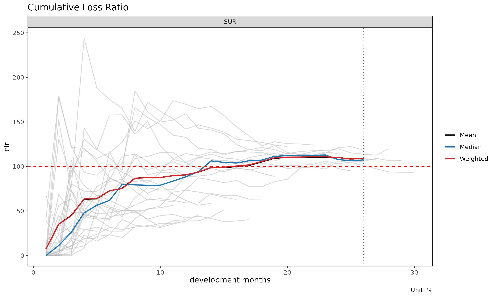
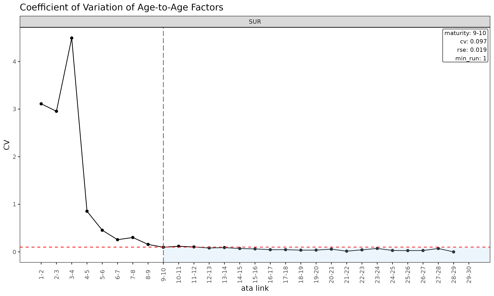
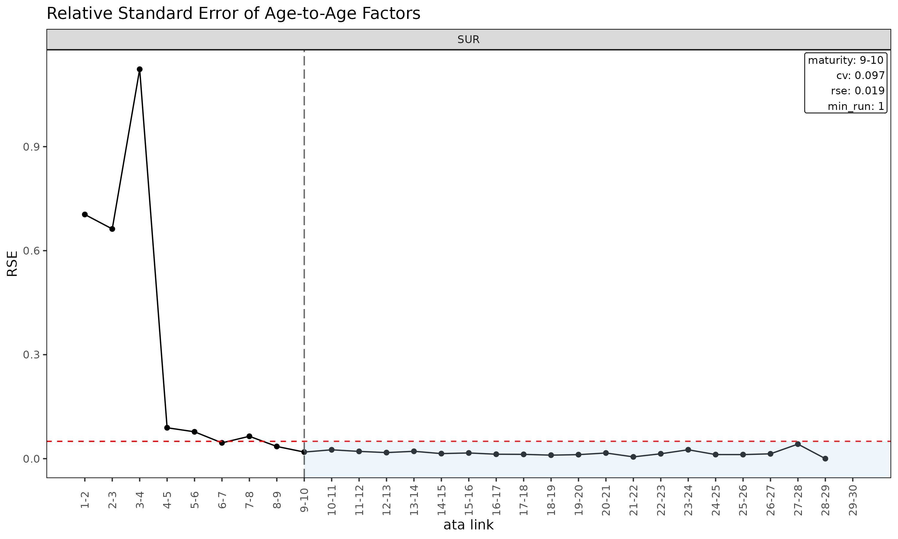
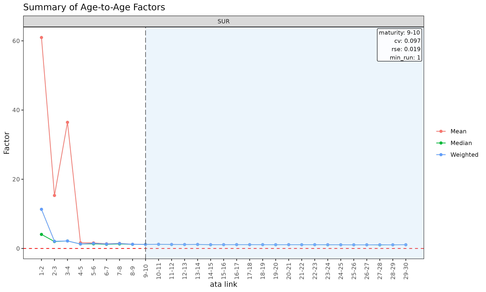
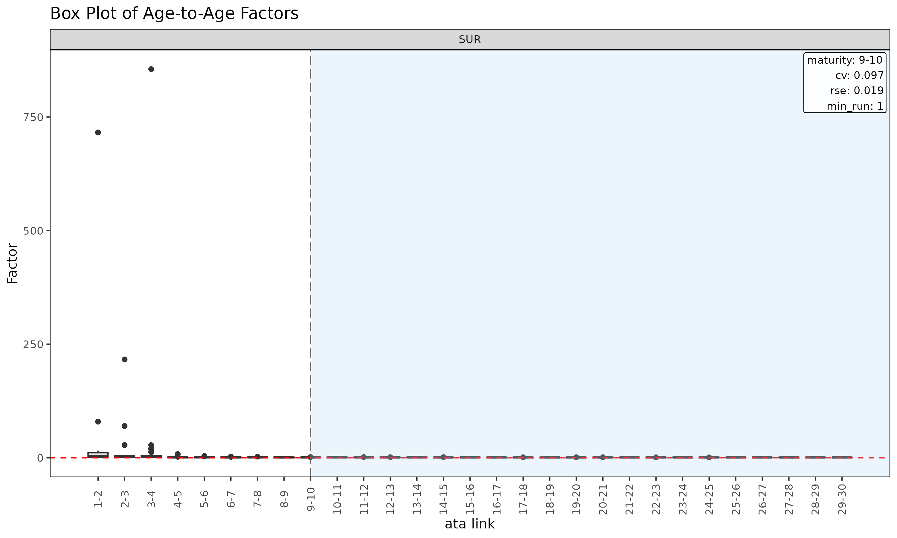
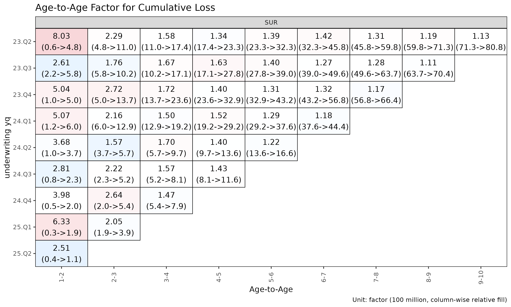
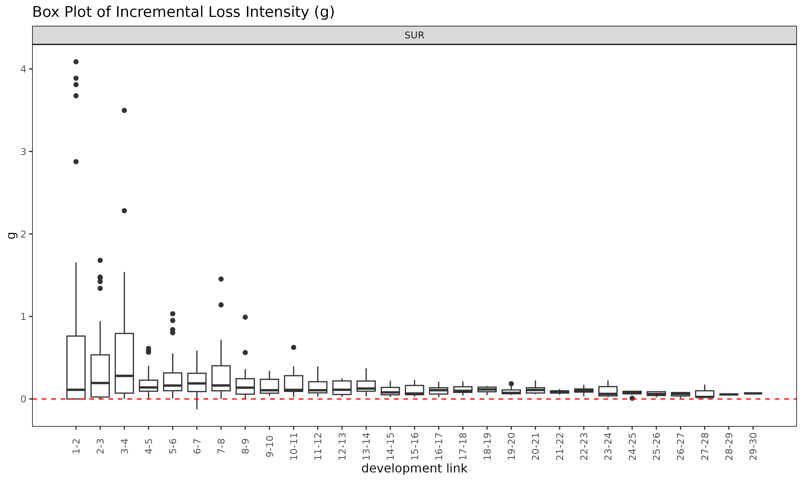

# Triangle 와 Link: 데이터 구조와 인자 진단

> 영어 원본 보기: [Triangle and Link: data structures and factor
> diagnostics](https://seokhoonj.github.io/lossratio/ko/triangle-and-link.md)

chain ladder 또는 손해율 모형을 적합하기 전에 기반이 되는 triangle 과
그로부터 파생된 단계 연결 테이블(link table) 을 살펴보는 것이
효율적이다. 이 문서는 `Triangle` 과 `Link` 데이터 구조 및 진단 플롯을
다룬다. 성숙점(maturity point) 탐지는
[`vignette("maturity")`](https://seokhoonj.github.io/lossratio/ko/articles/maturity.md)
를 참고한다.

## 1. Triangle 진단

이 문서는 간결성을 위해 `SUR` 그룹만 사용한다 — 모든 절차는 다중 그룹
입력에도 그대로 일반화된다.

``` r

library(lossratio)
data(experience)
exp <- as_experience(experience)[cv_nm == "SUR"]
tri <- build_triangle(exp, group_var = cv_nm)
```

### 코호트 궤적

``` r

plot(tri)                              # 코호트별 누적 손해율 궤적
```


``` r

plot(tri, value_var = "lr")            # 누적 대신 증분 손해율
```


``` r

plot(tri, summary = TRUE)              # 코호트 선 + overlay (평균 / 중앙값 / 가중)
```



`summary = TRUE` overlay 는 각 dev 에서 평균, 중앙값, 가중 clr 을 계산해
코호트 선 위에 겹쳐 그린다. 중심 경향에서 벗어나는 코호트를 포착하는 데
유용하다.

### 셀 히트맵

``` r

plot_triangle(tri)                            # 각 셀의 clr
```


``` r

plot_triangle(tri, value_var = "lr")          # 증분 loss ratio
```


``` r


# detail 라벨은 2 줄이라 monthly 셀에서는 겹침 — quarterly 로 다시 빌드
tri_q <- build_triangle(exp, group_var = cv_nm,
                        cohort_var = "uyq", dev_var = "elap_q")
plot_triangle(tri_q, label_style = "detail")  # 비율 + (loss / rp) 금액
```


### dev 별 그룹 통계

``` r

sm <- summary(tri)
head(sm)
#> Key: <cv_nm, dev>
#>     cv_nm   dev n_obs   lr_mean lr_median      lr_wt  clr_mean clr_median
#>    <char> <int> <int>     <num>     <num>      <num>     <num>      <num>
#> 1:    SUR     1    30 0.0738546 0.0000000 0.07343113 0.0738546  0.0000000
#> 2:    SUR     2    29 0.5365888 0.0992849 0.54126362 0.3512535  0.1120447
#> 3:    SUR     3    28 0.6201189 0.2472070 0.56590118 0.4521326  0.2618096
#> 4:    SUR     4    27 0.8852657 0.6387164 0.92060611 0.6327242  0.4798531
#> 5:    SUR     5    26 0.5767556 0.4828899 0.59880663 0.6369307  0.5641166
#> 6:    SUR     6    25 0.9314593 0.5431397 0.95085711 0.7264308  0.6191132
#>        clr_wt
#>         <num>
#> 1: 0.07343113
#> 2: 0.35150128
#> 3: 0.44744109
#> 4: 0.63467048
#> 5: 0.63999290
#> 6: 0.72781355
```

(group, dev) 셀별 평균 / 중앙값 / 가중 손해율을 담은 `TriangleSummary`
객체를 반환한다.

## 2. Link / 인자 진단

`Link` 객체는 triangle 으로부터 빌드된 단계 연결 테이블(link table)
이다. 단일 변수 모드에서는 관측된 **ATA 인자**(age-to-age factor) 를
담고, `exposure_var` 를 지정하면 ED 강도 $`g_k = \Delta C^L_k / C^P_k`$
를 담는다.

``` r

ata <- build_link(tri, value_var = "closs")
sm  <- summary(ata, model = "ata", alpha = 1)
head(sm)
#> Key: <cv_nm>
#>     cv_nm ata_from ata_to ata_link   mean median     wt    cv     f  f_se   rse
#>    <char>    <num>  <num>   <fctr>  <num>  <num>  <num> <num> <num> <num> <num>
#> 1:    SUR        1      2      1-2 60.965  4.062 11.320 3.111 6.768 4.767 0.704
#> 2:    SUR        2      3      2-3 15.316  2.005  2.083 2.955 1.939 1.284 0.663
#> 3:    SUR        3      4      3-4 36.458  2.167  2.167 4.493 2.167 2.434 1.123
#> 4:    SUR        4      5      4-5  1.641  1.282  1.291 0.854 1.291 0.115 0.089
#> 5:    SUR        5      6      5-6  1.607  1.334  1.461 0.455 1.461 0.113 0.078
#> 6:    SUR        6      7      6-7  1.348  1.208  1.282 0.256 1.282 0.058 0.046
#>        sigma n_obs n_valid n_inf n_nan valid_ratio
#>        <num> <num>   <num> <num> <num>       <num>
#> 1: 27972.257    29      14     0     0       0.483
#> 2: 25358.337    28      24     0     0       0.857
#> 3: 69089.724    27      27     0     0       1.000
#> 4:  4787.739    26      26     0     0       1.000
#> 5:  5301.574    25      25     0     0       1.000
#> 6:  3279.239    24      24     0     0       1.000
```

`Link` 객체 (단일 변수 모드) 의
[`summary()`](https://rdrr.io/r/base/summary.html) 메소드는 성숙점
탐지를 구동하는 링크별 통계를 계산한다.

- `mean`, `median`, `wt` — 각 링크에서 관측된 ATA 인자의 기술 평균 (해당
  링크가 관측되지 않은 코호트는 제외).
- `cv` — 관측 인자의 변동계수 (상대 산포, alpha 와 무관).
- `f` — WLS 로 추정된 인자 (`value_from^alpha` 로 볼륨 가중).
- `f_se`, `rse` — WLS 표준오차 및 상대 표준오차.
- `sigma` — 링크별 Mack 잔차 sigma.
- `n_obs`, `n_valid`, `n_inf`, `n_nan`, `valid_ratio` — 관측 수와 링크별
  유한 ATA 인자의 비율.

### Link 진단 플롯

``` r

plot(ata, type = "cv")            # ata 링크별 CV (성숙점 overlay 포함)
```



``` r

plot(ata, type = "rse")           # ata 링크별 RSE
```



``` r

plot(ata, type = "summary")       # 링크별 mean / median / wt overlay
```



``` r

plot(ata, type = "box")           # 링크별 관측 ata 의 boxplot
```



``` r

plot(ata, type = "point")         # 링크별 관측 ata 의 산점도
```


### ATA 인자의 Triangle

``` r

la <- list(size = 2.5)                            # 라벨 크기 줄임
plot_triangle(ata, label_args = la)               # 관측 인자 히트맵
```


``` r

plot_triangle(ata, label_args = la, show_maturity = TRUE)  # 성숙점 라인 overlay
```


``` r


# detail 라벨은 2 줄이라 monthly 셀에서는 겹침 — quarterly Link 로 다시 빌드
ata_q <- build_link(tri_q, value_var = "closs")
plot_triangle(ata_q, label_style = "detail")      # 인자 + (loss / rp) 금액
```



이 히트맵은 각 셀을 자기 링크 내에서 `log(ata / median(ata))` 로
색칠하므로, 열 방향 색상은 해당 링크의 중앙값에서 벗어나는 코호트를
구분해 준다.

### ED 진단

``` r

ed <- build_link(tri, value_var = "closs", exposure_var = "crp")
sm <- summary(ed, model = "ed", alpha = 1)
head(sm)
#> Key: <cv_nm>
#>     cv_nm ata_from ata_to ata_link    mean  median      wt      cv       g
#>    <char>    <num>  <num>   <fctr>   <num>   <num>   <num>   <num>   <num>
#> 1:    SUR        1      2      1-2 0.83638 0.11124 0.78549 1.64664 0.78549
#> 2:    SUR        2      3      2-3 0.42921 0.19355 0.39517 1.28530 0.39517
#> 3:    SUR        3      4      3-4 0.57740 0.28022 0.54349 1.36754 0.54349
#> 4:    SUR        4      5      4-5 0.18873 0.13962 0.18976 0.90510 0.18976
#> 5:    SUR        5      6      5-6 0.29944 0.16294 0.30277 1.01004 0.30277
#> 6:    SUR        6      7      6-7 0.21583 0.18880 0.20988 0.85987 0.20988
#>       g_se     rse    sigma n_obs n_valid n_inf n_nan valid_ratio
#>      <num>   <num>    <num> <num>   <num> <num> <num>       <num>
#> 1: 0.24877 0.31671 5291.085    29      29     0     0           1
#> 2: 0.09984 0.25264 3263.751    28      28     0     0           1
#> 3: 0.14933 0.27477 6210.872    27      27     0     0           1
#> 4: 0.03343 0.17615 1720.934    26      26     0     0           1
#> 5: 0.06037 0.19939 3487.836    25      25     0     0           1
#> 6: 0.03771 0.17970 2450.547    24      24     0     0           1

plot(ed, type = "summary")
```


``` r

plot(ed, type = "box")
```



``` r

plot_triangle(ed, label_args = la)
```


`summary(link, model = "ed")` 는 단일 변수
[`summary()`](https://rdrr.io/r/base/summary.html) 에 대응하는 ED 측
분석으로, 강도 $`g_k = \Delta C^L_k / C^P_k`$ 에 대해 링크별 통계를
계산한다.

## 3. 빌드 전 검증

경과 기간 시퀀스에 결손이 의심되면
[`build_triangle()`](https://seokhoonj.github.io/lossratio/ko/reference/build_triangle.md)
호출 전에 점검한다.

``` r

gaps <- validate_triangle(exp, group_var = cv_nm,
                          cohort_var = "uym", dev_var = "elap_m")
head(gaps)
#> <TriangleValidation>
#> Cohort dev-sequence gaps : none
```

경과 기간이 비연속인 코호트마다 한 행씩을 담은 `TriangleValidation`
객체를 반환한다. 결과가 비어 있다면 triangle 이 깨끗하다는 뜻이다.

결손이 있는 경우의 선택지는 다음과 같다.

- 데이터 원본을 수정한다 (권장).
- 문제가 있는 코호트를 제외한다.
- [`build_triangle()`](https://seokhoonj.github.io/lossratio/ko/reference/build_triangle.md)
  에 `fill_gaps = TRUE` 를 넘겨 누락 셀을 0 으로 채운다 (단, `n_obs` 가
  부풀어 오르므로 신중히 사용).

## 4. 최근 대각선 부분집합

오래된 코호트가 더 이상 대표성이 없을 때 (요율 변경, 적립 regime 변경
등) 추정을 최근 대각선으로 제한한다.

``` r

fit_ata(tri, value_var = "closs", alpha = 1, recent = 12)  # 최근 12개 대각선
#> <ATAFit>
#> alpha       : 1 
#> sigma_method: min_last2 
#> recent      : 12 
#> regime_break: none 
#> use_maturity: FALSE 
#> groups      : cv_nm 
#> n_groups    : 1 
#> ata links   : 29
fit_cl(tri, value_var = "closs", recent = 12)
#> <CLFit>
#> method      : basic 
#> value_var   : closs 
#> weight_var  : none 
#> alpha       : 1 
#> recent      : 12 
#> use_maturity: FALSE 
#> tail_factor : 1 
#> groups      : cv_nm 
#> periods     : 30
fit_lr(tri, recent = 12)
#> <LRFit>
#> method        : sa 
#> loss_var      : closs 
#> exposure_var  : crp 
#> loss_alpha    : 1 
#> exposure_alpha: 1 
#> delta_method  : simple 
#> conf_level    : 0.95 
#> ci_type       : analytical  
#> sigma_method  : min_last2 
#> recent        : 12 
#> regime_break  : none 
#> maturity[SUR] : 18
#> groups        : cv_nm 
#> periods       : 30
```

`recent = K` 는 calendar 위치 (`rank(cohort) + dev - 1`) 가 그룹 내 최근
`K` 개에 속하는 행만 남긴다.

## 5. 워크플로 체크리스트

적합 전에 확인할 사항은 다음과 같다.

1.  [`validate_triangle()`](https://seokhoonj.github.io/lossratio/ko/reference/validate_triangle.md)
    — 스키마와 결손 점검.
2.  [`build_triangle()`](https://seokhoonj.github.io/lossratio/ko/reference/build_triangle.md)
    — 파생 컬럼이 포함된 표준 형태 구축.
3.  `plot(tri)` / `plot_triangle(tri)` — 시각적 점검.
4.  `summary(tri)` — 그룹 수준 중심 경향 확인.
5.  [`build_link()`](https://seokhoonj.github.io/lossratio/ko/reference/build_link.md) +
    `plot(link, type = "cv")` — 링크 안정성 확인.
6.  [`detect_maturity()`](https://seokhoonj.github.io/lossratio/ko/reference/detect_maturity.md)
    — 그룹별로 합리적 성숙점이 잡히는지 확인
    ([`vignette("maturity")`](https://seokhoonj.github.io/lossratio/ko/articles/maturity.md)
    참고).
7.  [`detect_regime()`](https://seokhoonj.github.io/lossratio/ko/reference/detect_regime.md)
    (선택) — 구조적 변화 진단.

이후 신뢰할 수 있는 입력 데이터로
[`fit_lr()`](https://seokhoonj.github.io/lossratio/ko/reference/fit_lr.md)
/
[`fit_cl()`](https://seokhoonj.github.io/lossratio/ko/reference/fit_cl.md)
을 적합한다.

## 6. 함께 보기

- [`vignette("getting-started")`](https://seokhoonj.github.io/lossratio/ko/articles/getting-started.md)
  — 전체 파이프라인 개요.
- [`vignette("maturity")`](https://seokhoonj.github.io/lossratio/ko/articles/maturity.md)
  — link table 기반 성숙점 탐지.
- [`vignette("regime")`](https://seokhoonj.github.io/lossratio/ko/articles/regime.md)
  —
  [`detect_regime()`](https://seokhoonj.github.io/lossratio/ko/reference/detect_regime.md)
  심화.
- [`vignette("projection")`](https://seokhoonj.github.io/lossratio/ko/articles/projection.md)
  — 추정 방법 선택.
