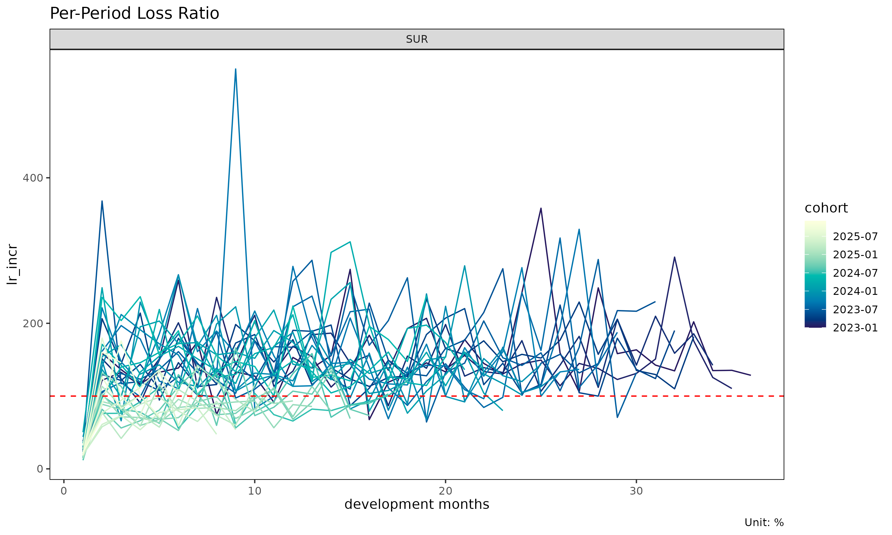
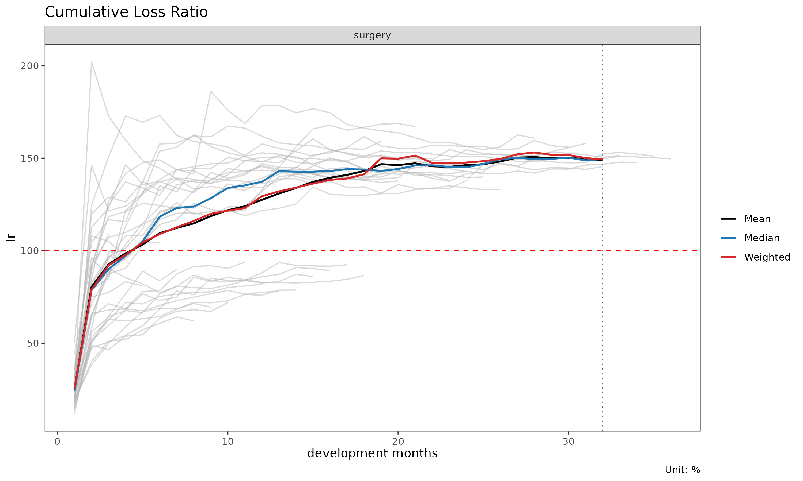
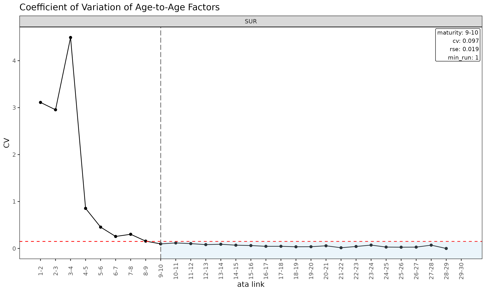
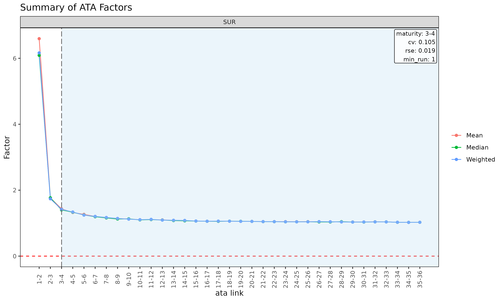
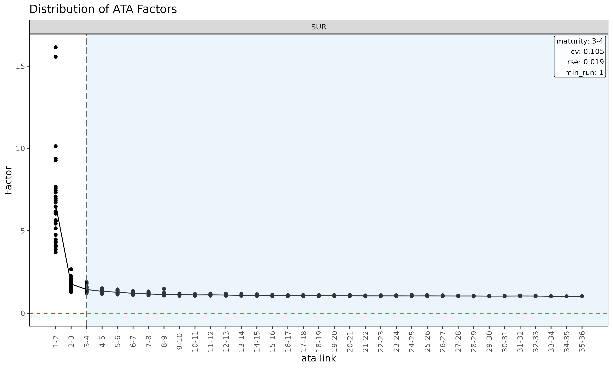

# Triangle, Link and Maturity: data structures and factor diagnostics

Before fitting a chain ladder or loss-ratio model, it pays to inspect
the underlying triangle and the per-link factor table derived from it.
This vignette covers the `Triangle` and `Link` data structures, their
diagnostic plots, and
[`detect_maturity()`](https://seokhoonj.github.io/lossratio/ko/reference/detect_maturity.md)
— the dev-axis test that determines where the link table’s ATA factors
are stable enough to trust for chain-ladder projection.

## Triangle-level diagnostics

For brevity this vignette uses the `SUR` group only — every step
generalises to multi-group input.

``` r

library(lossratio)
data(experience)
exp <- as_experience(experience)[cv_nm == "SUR"]
tri <- build_triangle(exp, group_var = cv_nm)
```

### Cohort trajectories

``` r

plot(tri)                              # cumulative loss-ratio trajectories per cohort
```


``` r

plot(tri, value_var = "lr")            # incremental loss ratio instead of lr
```



``` r

plot(tri, summary = TRUE)              # raw + overlay (mean / median / weighted)
```



The `summary = TRUE` overlay computes mean, median, and weighted lr at
each dev and overlays them on the cohort lines. Useful for spotting
cohorts that deviate from the central tendency.

### Cell heatmap

``` r

plot_triangle(tri)                            # lr in each cell
```


``` r

plot_triangle(tri, value_var = "lr")          # incremental loss ratio
```


``` r


# detail labels (ratio + loss/rp amounts) are 2-line — use quarterly cells
tri_q <- build_triangle(exp, group_var = cv_nm,
                        cohort_var = "uyq", dev_var = "elap_q")
plot_triangle(tri_q, label_style = "detail")  # ratio + (loss / rp) amounts
```


### Group statistics by dev

``` r

sm <- summary(tri)
head(sm)
#> Key: <cv_nm, dev>
#>     cv_nm   dev n_obs   lr_mean lr_median      lr_wt lr_incr_mean
#>    <char> <int> <int>     <num>     <num>      <num>        <num>
#> 1:    SUR     1    30 0.0738546 0.0000000 0.07343113    0.0738546
#> 2:    SUR     2    29 0.3512535 0.1120447 0.35150128    0.5365888
#> 3:    SUR     3    28 0.4521326 0.2618096 0.44744109    0.6201189
#> 4:    SUR     4    27 0.6327242 0.4798531 0.63467048    0.8852657
#> 5:    SUR     5    26 0.6369307 0.5641166 0.63999290    0.5767556
#> 6:    SUR     6    25 0.7264308 0.6191132 0.72781355    0.9314593
#>    lr_incr_median lr_incr_wt
#>             <num>      <num>
#> 1:      0.0000000 0.07343113
#> 2:      0.0992849 0.54126362
#> 3:      0.2472070 0.56590118
#> 4:      0.6387164 0.92060611
#> 5:      0.4828899 0.59880663
#> 6:      0.5431397 0.95085711
```

Returns a `TriangleSummary` object with mean / median / weighted loss
ratios per (group, dev) cell.

## Link / factor diagnostics

The `Link` object is the link table (age-to-age factor table) built from
the triangle. In single-variable mode it carries the observed ATA
factors; with `premium_var` it carries the ED-style intensities
$`g_k = \Delta C^L_k / C^P_k`$.

``` r

ata <- build_link(tri, loss_var = "loss")
sm  <- summary(ata, model = "ata", alpha = 1)
head(sm)
#> Key: <cv_nm>
#>     cv_nm ata_from ata_to ata_link   mean median     wt    cv     f  f_se   rse
#>    <char>    <num>  <num>   <fctr>  <num>  <num>  <num> <num> <num> <num> <num>
#> 1:    SUR        1      2      1-2 60.965  4.062 11.320 3.111 6.768 4.767 0.704
#> 2:    SUR        2      3      2-3 15.316  2.005  2.083 2.955 1.939 1.284 0.663
#> 3:    SUR        3      4      3-4 36.458  2.167  2.167 4.493 2.167 2.434 1.123
#> 4:    SUR        4      5      4-5  1.641  1.282  1.291 0.854 1.291 0.115 0.089
#> 5:    SUR        5      6      5-6  1.607  1.334  1.461 0.455 1.461 0.113 0.078
#> 6:    SUR        6      7      6-7  1.348  1.208  1.282 0.256 1.282 0.058 0.046
#>        sigma n_obs n_valid n_inf n_nan valid_ratio
#>        <num> <num>   <num> <num> <num>       <num>
#> 1: 27972.257    29      14     0     0       0.483
#> 2: 25358.337    28      24     0     0       0.857
#> 3: 69089.724    27      27     0     0       1.000
#> 4:  4787.739    26      26     0     0       1.000
#> 5:  5301.574    25      25     0     0       1.000
#> 6:  3279.239    24      24     0     0       1.000
```

The [`summary()`](https://rdrr.io/r/base/summary.html) method on a
`Link` object (single-variable mode) computes per-link statistics that
drive maturity detection:

- `mean`, `median`, `wt` — descriptive averages of observed ata factors
  at each link (excluding cohorts where the link is not observed).
- `cv` — coefficient of variation of the observed factors (relative
  spread, alpha-independent).
- `f` — WLS-estimated factor (volume-weighted by `value_from^alpha`).
- `f_se`, `rse` — WLS standard error and relative standard error.
- `sigma` — Mack residual sigma per link.
- `n_obs`, `n_valid`, `n_inf`, `n_nan`, `valid_ratio` — observation
  counts and the share of finite ATA factors per link.

### Diagnostic plots for the link table

``` r

plot(ata, type = "cv")            # CV vs ata link with maturity overlay
```



``` r

plot(ata, type = "rse")           # RSE vs ata link
```


``` r

plot(ata, type = "summary")       # mean / median / wt overlay per link
```



``` r

plot(ata, type = "box")           # boxplot of observed ata per link
```


``` r

plot(ata, type = "point")         # scatter of observed ata per link
```



### Triangle of ATA factors

``` r

la <- list(size = 2.5)                            # shrink labels
plot_triangle(ata, label_args = la)               # heatmap of observed factors
```


``` r

plot_triangle(ata, label_args = la, show_maturity = TRUE)    # overlay maturity line
```


``` r


# detail labels are two lines and overlap on monthly cells — rebuild on the
# quarterly triangle so the labels fit
ata_q <- build_link(tri_q, loss_var = "loss")
plot_triangle(ata_q, label_style = "detail")      # factor + (loss / rp) amounts
```


The heatmap colours each cell by `log(ata / median(ata))` within its
link, so column-wise colour distinguishes cohorts that deviate from the
link’s median.

### ED diagnostics

``` r

ed <- build_link(tri, loss_var = "loss", premium_var = "premium")
sm <- summary(ed, model = "ed", alpha = 1)
head(sm)
#> Key: <cv_nm>
#>     cv_nm ata_from ata_to ata_link    mean  median      wt      cv       g
#>    <char>    <num>  <num>   <fctr>   <num>   <num>   <num>   <num>   <num>
#> 1:    SUR        1      2      1-2 0.83638 0.11124 0.78549 1.64664 0.78549
#> 2:    SUR        2      3      2-3 0.42921 0.19355 0.39517 1.28530 0.39517
#> 3:    SUR        3      4      3-4 0.57740 0.28022 0.54349 1.36754 0.54349
#> 4:    SUR        4      5      4-5 0.18873 0.13962 0.18976 0.90510 0.18976
#> 5:    SUR        5      6      5-6 0.29944 0.16294 0.30277 1.01004 0.30277
#> 6:    SUR        6      7      6-7 0.21583 0.18880 0.20988 0.85987 0.20988
#>       g_se     rse    sigma n_obs n_valid n_inf n_nan valid_ratio
#>      <num>   <num>    <num> <num>   <num> <num> <num>       <num>
#> 1: 0.24877 0.31671 5291.085    29      29     0     0           1
#> 2: 0.09984 0.25264 3263.751    28      28     0     0           1
#> 3: 0.14933 0.27477 6210.872    27      27     0     0           1
#> 4: 0.03343 0.17615 1720.934    26      26     0     0           1
#> 5: 0.06037 0.19939 3487.836    25      25     0     0           1
#> 6: 0.03771 0.17970 2450.547    24      24     0     0           1

plot(ed, type = "summary")
```


``` r

plot(ed, type = "box")
```


``` r

plot_triangle(ed, label_args = la)
```


`summary(link, model = "ed")` is the ED-side analogue of the
single-variable [`summary()`](https://rdrr.io/r/base/summary.html),
computing per-link statistics for the intensity
$`g_k = \Delta C^L_k / C^P_k`$.

## Maturity detection

The maturity point is the development link beyond which age-to-age
factors are stable enough to trust for chain-ladder projection. Used
internally by `fit_lr(method = "sa")` to switch from ED to CL.

### Detecting maturity

[`detect_maturity()`](https://seokhoonj.github.io/lossratio/ko/reference/detect_maturity.md)
takes a `Triangle` directly — the underlying single-variable `Link` and
its WLS summary are built internally:

``` r

mat <- detect_maturity(
  tri,
  loss_var       = "loss",
  cv_threshold    = 0.15,    # CV must be below this
  rse_threshold   = 0.05,    # RSE must be below this
  min_valid_ratio = 0.5,     # at least 50% finite cohorts at the link
  min_n_valid     = 3L,      # at least 3 finite cohorts
  min_run         = 1L       # at least 1 consecutive mature link
)

print(mat)
#> Key: <cv_nm>
#>     cv_nm ata_from ata_to ata_link     mean   median       wt         cv
#>    <char>    <int>  <int>   <char>    <num>    <num>    <num>      <num>
#> 1:    SUR        9     10     9-10 1.187815 1.172305 1.164727 0.09743995
#>           f       f_se        rse    sigma n_obs n_valid n_inf n_nan
#>       <num>      <num>      <num>    <num> <int>   <int> <int> <int>
#> 1: 1.164727 0.02218428 0.01904677 1774.278    21      21     0     0
#>    valid_ratio
#>          <num>
#> 1:           1
```

A row per group with the first development link satisfying all
thresholds, carrying the link’s full statistics. The threshold arguments
are also stored as attributes on the returned `Maturity` object.

### Threshold semantics

- `cv_threshold` — coefficient of variation of the observed ATA factors
  at the link. Caps relative spread regardless of `alpha`.
- `rse_threshold` — relative standard error of the WLS-estimated factor
  `f`. Captures parameter uncertainty rather than residual spread.
- `min_valid_ratio` — minimum share of cohorts with a finite ATA at the
  link. Guards against links where most observations are zero / NA /
  Inf.
- `min_n_valid` — minimum count of finite cohorts at the link. Absolute
  floor for thin-data tails.
- `min_run` — minimum number of *consecutive* mature links. With
  `min_run = 1L` (default) the first qualifying link wins; setting it to
  `2L` or higher requires sustained stability.

Tune these to your portfolio’s volatility profile. Tight thresholds
(e.g. `cv_threshold = 0.05`) push maturity later; loose thresholds push
it earlier.

### Use in fitting

[`detect_maturity()`](https://seokhoonj.github.io/lossratio/ko/reference/detect_maturity.md)
is also called internally by
[`fit_ata()`](https://seokhoonj.github.io/lossratio/ko/reference/fit_ata.md)
and
[`fit_cl()`](https://seokhoonj.github.io/lossratio/ko/reference/fit_cl.md)
when `maturity_args` is supplied (the `alpha` of the internal
[`summary()`](https://rdrr.io/r/base/summary.html) step is taken from
those callers):

``` r

fit_ata(tri, loss_var = "loss",
        maturity_args = list(cv_threshold = 0.08, min_run = 2L))

fit_cl(tri, loss_var = "loss",
       maturity_args = list(cv_threshold = 0.08))

fit_lr(tri, method = "sa",
       maturity_args = list(cv_threshold = 0.08))
```

For `fit_lr(method = "sa")` the detected maturity point determines the
dev at which the projection switches from ED (early dev) to CL (later
dev).

### Group-wise output

For multi-group triangles
[`detect_maturity()`](https://seokhoonj.github.io/lossratio/ko/reference/detect_maturity.md)
returns one row per group, each detected independently with the same
thresholds:

``` r

tri_all <- build_triangle(as_experience(experience), group_var = cv_nm)
detect_maturity(tri_all, loss_var = "loss")
#> Key: <cv_nm>
#>     cv_nm ata_from ata_to ata_link     mean   median       wt         cv
#>    <char>    <int>  <int>   <char>    <num>    <num>    <num>      <num>
#> 1:    2CI        9     10     9-10 1.200664 1.165168 1.191871 0.11890294
#> 2:    CAN       12     13    12-13 1.168357 1.127671 1.154423 0.09720467
#> 3:    HOS       10     11    10-11 1.193928 1.157247 1.184079 0.11339122
#> 4:    SUR        9     10     9-10 1.187815 1.172305 1.164727 0.09743995
#>           f       f_se        rse    sigma n_obs n_valid n_inf n_nan
#>       <num>      <num>      <num>    <num> <int>   <int> <int> <int>
#> 1: 1.191871 0.03125736 0.02622544 1807.059    21      21     0     0
#> 2: 1.154423 0.02502945 0.02168134 1751.230    18      18     0     0
#> 3: 1.184079 0.03028008 0.02557268 1612.839    20      20     0     0
#> 4: 1.164727 0.02218428 0.01904677 1774.278    21      21     0     0
#>    valid_ratio
#>          <num>
#> 1:           1
#> 2:           1
#> 3:           1
#> 4:           1
```

The link diagnostic plot makes the result easier to read — each cv gets
its own panel and the vertical line marks the maturity point where CV
first drops below `cv_threshold`:

``` r

plot(build_link(tri_all, loss_var = "loss"), type = "cv")
```


## Validation before building

If gaps in the development sequence are suspected, inspect them before
[`build_triangle()`](https://seokhoonj.github.io/lossratio/ko/reference/build_triangle.md):

``` r

gaps <- validate_triangle(exp, group_var = cv_nm,
                          cohort_var = "uym", dev_var = "elap_m")
head(gaps)
#> <TriangleValidation>
#> Cohort dev-sequence gaps : none
```

Returns a `TriangleValidation` object with one row per cohort that has
non-consecutive development periods. An empty result means the triangle
is clean.

If gaps exist, options:

- Fix the data source (preferred).
- Drop offending cohorts.
- Pass `fill_gaps = TRUE` to
  [`build_triangle()`](https://seokhoonj.github.io/lossratio/ko/reference/build_triangle.md)
  to zero-fill missing cells (use with care — inflates `n_obs`).

## Recent-diagonal subset

When older cohorts are no longer representative (rate change, reserving
regime shift), restrict estimation to the recent calendar diagonals:

``` r

fit_ata(tri, loss_var = "loss", alpha = 1, recent = 12)  # last 12 calendar diagonals
#> <ATAFit>
#> alpha       : 1 
#> sigma_method: min_last2 
#> recent      : 12 
#> regime_break: none 
#> use_maturity: FALSE 
#> groups      : cv_nm 
#> n_groups    : 1 
#> ata links   : 29
fit_cl(tri, loss_var = "loss", recent = 12)
#> <CLFit>
#> method      : basic 
#> loss_var   : loss 
#> weight_var  : none 
#> alpha       : 1 
#> recent      : 12 
#> use_maturity: FALSE 
#> tail_factor : 1 
#> groups      : cv_nm 
#> periods     : 30
fit_lr(tri, recent = 12)
#> <LRFit>
#> method        : sa 
#> loss_var      : loss 
#> premium_var  : premium 
#> loss_alpha    : 1 
#> premium_alpha: 1 
#> delta_method  : simple 
#> conf_level    : 0.95 
#> ci_type       : analytical  
#> sigma_method  : min_last2 
#> recent        : 12 
#> regime_break  : none 
#> maturity[SUR] : 18
#> groups        : cv_nm 
#> periods       : 30
```

`recent = K` keeps only rows whose calendar position
(`rank(cohort) + dev - 1`) is among the latest `K` per group.

## Workflow checklist

Before fitting:

1.  [`validate_triangle()`](https://seokhoonj.github.io/lossratio/ko/reference/validate_triangle.md)
    — schema and gap check.
2.  [`build_triangle()`](https://seokhoonj.github.io/lossratio/ko/reference/build_triangle.md)
    — canonical shape with derived columns.
3.  `plot(tri)` / `plot_triangle(tri)` — visual inspection.
4.  `summary(tri)` — group-level central tendency.
5.  [`build_link()`](https://seokhoonj.github.io/lossratio/ko/reference/build_link.md) +
    `plot(link, type = "cv")` — link stability.
6.  [`detect_maturity()`](https://seokhoonj.github.io/lossratio/ko/reference/detect_maturity.md)
    — verify maturity detection produces a sensible point per group.
7.  [`detect_regime()`](https://seokhoonj.github.io/lossratio/ko/reference/detect_regime.md)
    (optional) — structural change diagnosis.

Then fit
[`fit_lr()`](https://seokhoonj.github.io/lossratio/ko/reference/fit_lr.md)
/
[`fit_cl()`](https://seokhoonj.github.io/lossratio/ko/reference/fit_cl.md)
with confidence in the input data.

## See also

- [`vignette("getting-started")`](https://seokhoonj.github.io/lossratio/ko/articles/getting-started.md)
  — full pipeline overview.
- [`vignette("regime")`](https://seokhoonj.github.io/lossratio/ko/articles/regime.md)
  —
  [`detect_regime()`](https://seokhoonj.github.io/lossratio/ko/reference/detect_regime.md)
  deep dive.
- [`vignette("projection")`](https://seokhoonj.github.io/lossratio/ko/articles/projection.md)
  — projection method choice.
